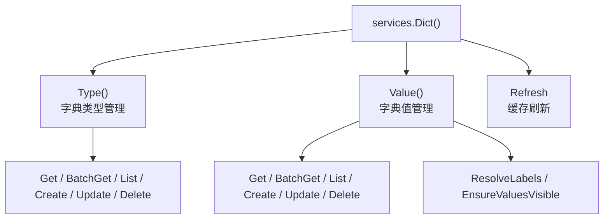

## 基本介绍

源码插件通过`services.Dict()`访问字典能力，动态插件通过`plugin.yaml`声明`service: dict`后使用`pluginbridge.Default().Dict()`客户端访问。`Dict`能力采用子服务模式，聚合`Type()`（字典类型管理）、`Value()`（字典值管理）和`Refresh`（缓存刷新）。

**能力阶段**：运行期

**类型支持**：源码插件、动态插件

## 能力设计

### 子服务体系

`Dict`能力采用子服务模式，分别处理字典类型管理、字典值管理和缓存刷新：



### 标签视图模型

`Dict`能力将宿主字典值解析为稳定的标签视图，支持运行时翻译键和当前语言标签：

| 字段 | 说明 |
|------|------|
| `Type` | 字典类型 |
| `Value` | 字典值 |
| `LabelKey` | 稳定运行时翻译键 |
| `Label` | 可选的当前语言解析标签 |

`ResolveInput.IncludeLabel`控制是否解析`Label`。当只需要稳定键或后续自行本地化时，可以不请求标签文本。

### 使用边界

- **字典类型和值支持完整生命周期管理。** `Type()`和`Value()`子服务提供`Create`、`Update`、`Delete`等写入方法，经过可见性、租户边界和审计校验后执行。
- **缓存刷新经过治理校验。** `Refresh`可能影响宿主缓存和多插件展示结果，经过范围、审计来源和幂等缓存修订校验。
- **字典不是配置。** 字典值用于业务枚举展示；插件运行参数应使用配置管理能力。
- **字典不是国际化目录。** `LabelKey`可以交给运行时翻译能力解析，但字典能力本身不负责维护语言包。

## 接口定义

### 源码插件接口

**`Dict()`根方法：**

| 方法 | 说明 |
|------|------|
| `Type()` | 返回字典类型子服务 |
| `Value()` | 返回字典值子服务 |
| `Refresh` | 刷新指定字典类型的视图或缓存，经过范围、审计来源和幂等缓存修订校验 |

**`Dict().Type()`子服务：**

| 方法 | 说明 |
|------|------|
| `Get` | 读取单个可见字典类型 |
| `BatchGet` | 批量读取可见字典类型，返回`BatchResult` |
| `List` | 按关键词搜索可见字典类型候选 |
| `EnsureVisible` | 校验目标字典类型`ID`集合可见 |
| `EnsureKeysVisible` | 校验目标字典类型键集合可见 |
| `Create` | 创建字典类型，经过类型键唯一性和租户边界校验 |
| `Update` | 更新可见字典类型，经过目标可见性和租户边界校验 |
| `Delete` | 删除可见字典类型，经过目标可见性和租户边界校验 |

**`Dict().Value()`子服务：**

| 方法 | 说明 |
|------|------|
| `Get` | 读取单个可见字典值 |
| `BatchGet` | 按类型和值批量读取可见字典值，返回`BatchResult` |
| `List` | 按类型和分页条件搜索可见字典值候选 |
| `ResolveLabels` | 批量解析一个字典类型下的多个值，返回标签视图和不透露具体原因的缺失集合 |
| `EnsureVisible` | 校验目标字典值`ID`集合可见 |
| `EnsureValuesVisible` | 校验指定字典值在当前调用上下文中可见 |
| `Create` | 创建字典值，经过类型存在性和租户边界校验 |
| `Update` | 更新可见字典值，经过目标可见性和租户边界校验 |
| `Delete` | 删除可见字典值，经过目标可见性和租户边界校验 |
| `DeleteByType` | 删除指定类型下的所有可见字典值 |

### 动态插件接口

动态插件通过`hostServices.dict`声明授权的方法：

| 动态方法 | 说明 |
|----------|------|
| `labels.resolve` | 批量解析一个字典类型下的多个值，返回标签视图 |
| `labels.list` | 返回指定字典类型下的分页候选值列表 |
| `labels.visible.ensure` | 校验指定字典值在当前调用上下文中可见 |

## 能力使用

### 源码插件使用

源码插件通过`services.Dict()`解析字典值：

```go
// 批量解析字典值标签
result, err := services.Dict().Value().ResolveLabels(ctx, dictcap.ResolveInput{
    Type:         "order_status",
    Values:       []dictcap.Value{"pending", "processing", "completed"},
    IncludeLabel: true,
})

// 获取分页字典值候选
page, err := services.Dict().Value().List(ctx, dictcap.ListValuesInput{
    Type:         "order_status",
    IncludeLabel: true,
    Page:         pageRequest,
})

// 校验字典值可见性
err := services.Dict().Value().EnsureValuesVisible(ctx, dictcap.ResolveInput{
    Type:   "order_status",
    Values: []dictcap.Value{"pending", "processing"},
})

// 创建字典类型
typeID, err := services.Dict().Type().Create(ctx, dictcap.CreateTypeInput{
    Type:   "order_status",
    Name:   "订单状态",
    Status: statusflag.EnabledTrue,
})

// 创建字典值
valueID, err := services.Dict().Value().Create(ctx, dictcap.CreateValueInput{
    Type:   "order_status",
    Value:  "pending",
    Label:  "待处理",
    Sort:   1,
    Status: statusflag.EnabledTrue,
})

// 刷新字典缓存
err := services.Dict().Refresh(ctx, "order_status")
```

### 动态插件使用

动态插件在`plugin.yaml`中声明`dict`服务：

```yaml
hostServices:
  - service: dict
    methods:
      - labels.resolve
      - labels.list
      - labels.visible.ensure
```

动态插件通过`pluginbridge.Default().Dict()`客户端调用：

```go
dictSvc := pluginbridge.Default().Dict()

// 批量解析字典值标签
result, err := dictSvc.Value().ResolveLabels(ctx, dictcap.ResolveInput{
    Type:         "order_status",
    Values:       []dictcap.Value{"pending", "processing", "completed"},
    IncludeLabel: true,
})

// 获取分页字典值候选
page, err := dictSvc.Value().List(ctx, dictcap.ListValuesInput{
    Type:         "order_status",
    IncludeLabel: true,
    Page:         pageRequest,
})
```

## 设计约束

- **不暴露字典表结构。** 插件只能看到`Type`、`Value`和标签视图。
- **缺失结果不透露具体原因。** 返回缺失值时不区分不存在、不可见或被拒绝。
- **刷新经过治理校验。** `Refresh`经过范围、审计来源和幂等缓存修订校验后执行。
- **写入方法经过治理校验。** `Create`、`Update`、`Delete`等写入方法经过可见性、租户边界和审计校验后执行。

## 相关服务

- [国际化能力](/docs/domain-capability-i18n)
- [配置管理能力](/docs/domain-capability-hostconfig)
- [插件可用领域能力概览](/docs/domain-capabilities)
