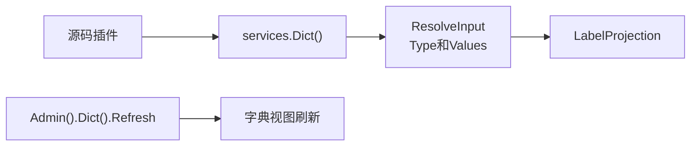

## 基本介绍

源码插件通过`services.Dict()`解析宿主字典值，动态插件通过`plugin.yaml`声明`service: dict`后使用`pluginbridge.Default().Dict()`客户端访问。它适合把业务状态、类型编码和枚举值展示为当前语言下的标签，避免插件直接依赖宿主字典表或缓存实现。

**能力阶段**：运行期

**类型支持**：源码插件、动态插件

## 能力设计

### 标签视图模型

`Dict`能力将宿主字典值解析为稳定的标签视图，支持运行时翻译键和当前语言标签：

| 字段 | 说明 |
|------|------|
| `Type` | 字典类型 |
| `Value` | 字典值 |
| `LabelKey` | 稳定运行时翻译键 |
| `Label` | 可选的当前语言解析标签 |

`ResolveInput.IncludeLabel`控制是否解析`Label`。当只需要稳定键或后续自行本地化时，可以不请求标签文本。

### 解析流程



### 使用边界

- **只解析一个字典类型。** 一次`ResolveInput`围绕一个`Type`解析多个`Value`。
- **刷新是管理命令。** 字典刷新可能影响宿主缓存和多插件展示结果，只通过`Admin().Dict()`暴露。
- **字典不是配置。** 字典值用于业务枚举展示；插件运行参数应使用配置管理能力。
- **字典不是国际化目录。** `LabelKey`可以交给运行时翻译能力解析，但字典能力本身不负责维护语言包。

## 接口定义

### 源码插件接口

| 入口 | 方法 | 说明 |
|------|------|------|
| `Dict()` | `ResolveLabels` | 批量解析一个字典类型下的多个值，返回标签视图和不透露具体原因的缺失集合 |
| `Dict()` | `ListValues` | 返回指定字典类型下的分页候选值列表 |
| `Dict()` | `EnsureValuesVisible` | 校验指定字典值在当前调用上下文中可见 |
| `Admin().Dict()` | `Refresh` | 刷新指定字典类型的视图或缓存 |

### 动态插件接口

动态插件通过`hostServices.dict`声明授权的方法：

| 动态方法 | 说明 |
|----------|------|
| `labels.resolve` | 批量解析一个字典类型下的多个值，返回标签视图 |
| `labels.list` | 返回指定字典类型下的分页候选值列表 |
| `labels.visible.ensure` | 校验指定字典值在当前调用上下文中可见 |

## 能力使用

### 源码插件使用

源码插件通过`services.Dict()`解析字典值：

```go
// 批量解析字典值标签
result, err := services.Dict().ResolveLabels(ctx, capabilityCtx, dictcap.ResolveInput{
    Type:         "order_status",
    Values:       []dictcap.Value{"pending", "processing", "completed"},
    IncludeLabel: true,
})

// 使用标签视图
for _, proj := range result.Projections {
    fmt.Printf("%s -> %s\n", proj.Value, proj.Label)
}

// 获取分页字典值候选
page, err := services.Dict().ListValues(ctx, capabilityCtx, dictcap.ListValuesInput{
    Type:         "order_status",
    IncludeLabel: true,
    Page:         pageRequest,
})

// 校验字典值可见性
err := services.Dict().EnsureValuesVisible(ctx, capabilityCtx, dictcap.ResolveInput{
    Type:   "order_status",
    Values: []dictcap.Value{"pending", "processing"},
})
```

可信源码插件刷新字典视图：

```go
err := services.Admin().Dict().Refresh(ctx, capabilityCtx, "order_status")
```

### 动态插件使用

动态插件在`plugin.yaml`中声明`dict`服务：

```yaml
hostServices:
  - service: dict
    methods:
      - labels.resolve
      - labels.list
      - labels.visible.ensure
```

动态插件通过`pluginbridge.Default().Dict()`客户端调用：

```go
dictSvc := pluginbridge.Default().Dict()

// 批量解析字典值标签
result, err := dictSvc.ResolveLabels(ctx, capabilityCtx, dictcap.ResolveInput{
    Type:         "order_status",
    Values:       []dictcap.Value{"pending", "processing", "completed"},
    IncludeLabel: true,
})

// 获取分页字典值候选
page, err := dictSvc.ListValues(ctx, capabilityCtx, dictcap.ListValuesInput{
    Type:         "order_status",
    IncludeLabel: true,
    Page:         pageRequest,
})
```

## 设计约束

- **不暴露字典表结构。** 插件只能看到`Type`、`Value`和标签视图。
- **缺失结果不透露具体原因。** 返回缺失值时不区分不存在、不可见或被拒绝。
- **刷新需要审计上下文。** 可信源码插件调用刷新命令时应提供调用来源、操作者、租户和原因。
- **动态插件只读。** 动态插件通过`hostServices.dict`声明`labels.resolve`方法，只读取标签视图，不涉及字典刷新。

## 相关服务

- [国际化能力](/docs/domain-capability-i18n)
- [配置管理能力](/docs/domain-capability-hostconfig)
- [插件可用领域能力概览](/docs/domain-capabilities)
