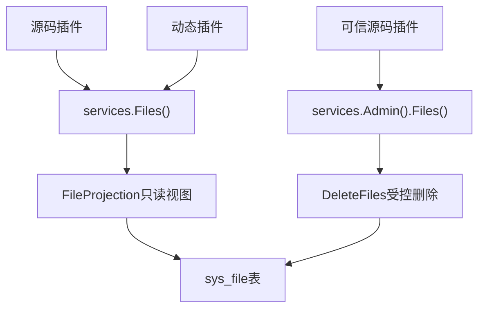

## 基本介绍

源码插件通过`services.Files()`读取宿主管理文件的可见视图。动态插件通过`plugin.yaml`声明`service: files`后使用`BatchGetFiles`和`EnsureFilesVisible`。可信源码插件需要删除宿主文件时，使用`services.Admin().Files().DeleteFiles`。

Files能力面向宿主文件管理系统的只读访问。插件不能通过此能力上传文件或修改文件元数据。

**能力阶段**：运行期

**类型支持**：源码插件、动态插件

## 能力设计

### 宿主文件管理模型

宿主文件管理以`sys_file`表为核心，管理用户上传文件的完整生命周期：

| 字段 | 说明 |
|------|------|
| `id` | 文件主键 |
| `tenant_id` | 租户归属 |
| `name` | 存储文件名 |
| `original` | 原始文件名 |
| `suffix` | 文件扩展名 |
| `scene` | 业务场景标识 |
| `size` | 文件大小 |
| `hash` | SHA-256哈希值，用于去重 |
| `url` | 访问路径 |
| `path` | 物理存储路径 |
| `engine` | 存储引擎标识 |
| `created_by` | 上传者 |

上传流程自动计算SHA-256哈希，在同一租户内实现文件去重：相同哈希的文件复用物理存储，仅创建新的元数据记录。

### 插件可见视图

插件通过`FileProjection`访问文件信息，不暴露物理存储路径、哈希值或底层存储后端：

| 字段 | 说明 |
|------|------|
| `ID` | 文件标识 |
| `Name` | 展示文件名 |
| `MimeType` | 媒体类型 |
| `SizeBytes` | 文件大小 |
| `BusinessScene` | 业务场景 |



### 与其他资源能力的关系

| 能力 | 用途 |
|------|------|
| `Files()` | 读取宿主文件管理视图，例如用户上传文件、业务附件 |
| `Storage()` | 插件自己的对象读写，例如导出结果、临时产物 |
| `Manifest()` | 读取插件随产物发布的只读`manifest/`资源 |
| `AI AssetRef` | 在`AI`能力中引用受保护的输入或输出资产 |

## 接口定义

### 源码插件接口

| 入口 | 方法 | 说明 |
|------|------|------|
| `Files()` | `BatchGet` | 批量读取可见文件视图 |
| `Files()` | `Search` | 按业务场景、关键词和媒体类型搜索可见文件候选 |
| `Files()` | `EnsureVisible` | 校验目标文件集合对当前调用上下文可见 |
| `Admin().Files()` | `Delete` | 删除可见文件，由宿主执行场景和目标校验 |

### 动态插件接口

动态插件可访问两类服务：

**`files`服务——宿主文件视图：**

| 动态方法 | 能力常量 | 说明 |
|----------|----------|------|
| `files.batch_get` | `host:files` | 批量读取可见文件视图 |
| `files.search` | `host:files` | 按业务场景、关键词和媒体类型搜索可见文件候选 |
| `files.visible.ensure` | `host:files` | 校验文件可见性 |

**`storage`服务——插件作用域对象存储：**

| 动态方法 | 说明 |
|----------|------|
| `storage.put` | 写入对象 |
| `storage.get` | 读取对象 |
| `storage.delete` | 删除对象 |
| `storage.delete_many` | 批量删除对象 |
| `storage.list` | 列举对象 |
| `storage.list_cursor` | 游标分页列举对象 |
| `storage.stat` | 查询对象元数据 |
| `storage.batch_stat` | 批量查询对象元数据 |

## 能力使用

### 源码插件使用

源码插件通过`services.Files()`读取宿主管理文件视图：

```go
// 批量读取文件视图
result, err := services.Files().BatchGet(ctx, capabilityCtx, fileIDs)

// 搜索可见文件候选
page, err := services.Files().Search(ctx, capabilityCtx, filecap.SearchInput{
    BusinessScene: "avatar",
    Keyword:       "profile",
    MimeType:      "image/png",
    Page:          pageRequest,
})

// 校验文件可见性
err := services.Files().EnsureVisible(ctx, capabilityCtx, fileIDs)
```

可信源码插件删除文件：

```go
err := services.Admin().Files().Delete(ctx, capabilityCtx, fileIDs)
```

### 动态插件使用

动态插件在`plugin.yaml`中声明`files`服务：

```yaml
hostServices:
  - service: files
    methods:
      - files.batch_get
      - files.search
      - files.visible.ensure
```

## 设计约束

- **只读视图。** 插件不能通过Files能力上传或修改文件，只能读取和校验。
- **不暴露物理路径。** `FileProjection`不包含存储路径、哈希值或访问URL。
- **删除属于治理命令。** 删除操作必须走`Admin().Files()`，由宿主执行场景和目标校验。
- **可见性由宿主控制。** 文件是否对当前插件可见，由宿主基于租户和数据范围决定。

## 相关服务

- [Storage能力](/docs/domain-capability-storage)
- [清单资源能力](/docs/domain-capability-manifest)
- [AI能力](/docs/domain-capability-ai)
