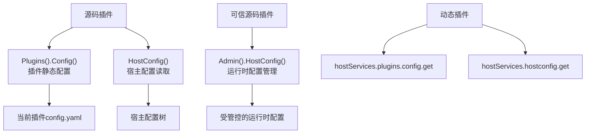

## 基本介绍

配置相关能力不要按方法名理解，而应按领域边界选择：

| 配置领域 | 源码插件入口 | 动态服务 | 说明 |
|----------|--------------|----------|------|
| <span style={{whiteSpace: 'nowrap'}}>插件静态配置</span> | `services.Plugins().Config()` | `plugins.config.get` | 读取当前插件自己的`config.yaml` |
| <span style={{whiteSpace: 'nowrap'}}>宿主配置读取</span> | `services.HostConfig()` | `hostconfig.get` | 读取宿主配置值；动态插件必须声明`resources.keys` |
| <span style={{whiteSpace: 'nowrap'}}>运行时配置管理</span> | `services.Admin().HostConfig()` | 无普通动态服务 | 可信源码插件写入受管控的运行时配置 |

其中`Plugins().Config()`属于插件治理能力的子能力；`HostConfig()`是普通能力目录中的宿主配置读取能力；`Admin().HostConfig()`属于可信源码插件管理命令。三者都叫配置，但来源、作用域、治理和使用者不同。

**能力阶段**：运行期

**类型支持**：源码插件、动态插件

## 能力设计

### 配置领域分层



### 插件静态配置

插件自己的静态配置由`Plugins().Config()`读取。它绑定当前插件`ID`，不会读取其他插件或宿主全局配置。

:::tip 配置优先级与覆盖机制
插件配置的四级读取优先级、独占式覆盖机制、`plugin.<plugin-id>`配置段的详细说明，请参见[插件业务配置](/docs/plugin-configuration)。
:::

### 宿主配置读取

源码插件通过`services.HostConfig()`读取宿主配置值。当前源码实现通过宿主启动期注入的配置读取器取值，不再对源码插件套用硬编码公开键清单。

### 运行时配置管理

运行时配置管理属于可信源码插件管理命令，不是普通读取能力。`SetRuntimeConfigJSON`需要调用方传入领域要求的`CapabilityContext`，宿主适配器继续负责配置键可见性、租户边界、审计原因和写入校验。

## 接口定义

### 插件静态配置接口

| 方法 | 说明 |
|------|------|
| `Get` | 返回原始配置值 |
| `Exists` | 判断配置键是否存在 |
| `Scan` | 将配置段扫描到目标结构体 |
| `String` | 读取字符串值，缺失或空白时返回默认值 |
| `Bool` | 读取布尔值，缺失时返回默认值 |
| `Int` | 读取整数值，缺失时返回默认值 |
| `Duration` | 读取时间间隔，缺失或空白时返回默认值 |

### 宿主配置接口

| 方法 | 说明 |
|------|------|
| `Get` | 读取宿主配置原始值 |
| `Exists` | 判断宿主配置键是否存在 |
| `String` | 读取字符串值 |
| `Bool` | 读取布尔值 |
| `Int` | 读取整数值 |
| `Duration` | 读取时间间隔 |

### 管理命令接口

| 入口 | 方法 | 说明 |
|------|------|------|
| `Admin().HostConfig()` | `SetRuntimeConfigJSON` | 写入一个受管控的运行时配置值 |

### 动态插件接口

| 动态服务 | 方法 | 说明 |
|----------|------|------|
| `plugins` | `config.get` | 读取当前插件作用域配置 |
| `hostconfig` | `get` | 读取宿主配置值，必须声明授权`resources.keys` |

## 能力使用

### 源码插件使用

源码插件根据配置领域选择正确的入口：

```go
// 读取插件自己的配置
value, err := services.Plugins().Config().String(ctx, "api.endpoint", "https://default.example.com")
enabled, err := services.Plugins().Config().Bool(ctx, "features.export", false)

// 读取宿主配置
basePath, err := services.HostConfig().String(ctx, "workspace.basePath", "")

// 写入运行时配置（可信源码插件）
err := services.Admin().HostConfig().SetRuntimeConfigJSON(ctx, capabilityCtx, "plugin.reports.maxExport", jsonValue)
```

### 动态插件使用

动态插件在`plugin.yaml`中分别声明`plugins`和`hostconfig`服务：

```yaml
hostServices:
  - service: plugins
    methods:
      - config.get
  - service: hostconfig
    methods:
      - get
    resources:
      keys:
        - workspace.basePath
        - i18n.default
```

`plugins`的`config.get`用于读取当前插件配置。`hostconfig`的授权边界由`resources.keys`控制；未声明键不应被宿主返回（白名单校验流程详见[插件业务配置](/docs/plugin-configuration)）。在动态插件侧使用：

```go
// 读取插件配置
endpoint, err := pluginbridge.Default().Plugins().Config().String(ctx, "api.endpoint", "https://default.example.com")

// 读取宿主配置
basePath, err := pluginbridge.Default().HostConfig().String(ctx, "workspace.basePath", "")
```

## 设计约束

- **插件业务参数放进插件配置。** 不要为了读取插件自己的参数而使用`HostConfig()`或宿主`g.Cfg()`。
- **宿主配置读取要谨慎。** 源码插件虽然可以通过`HostConfig()`读取宿主配置，但插件文档和代码应只依赖明确约定的键。
- **动态插件必须声明键。** `hostconfig`动态服务的授权来自`resources.keys`，不要声明根配置或模糊键作为常规做法。
- **运行时写入走管理命令。** 普通插件配置读取和宿主配置读取都是只读能力；写入配置只通过`Admin().HostConfig()`暴露给可信源码插件。
- **模板不等于运行配置。** `config.example.yaml`用于说明和生成示例，不参与运行时优先级。

## 相关服务

- [Plugins能力](/docs/domain-capability-plugins)
- [清单资源能力](/docs/domain-capability-manifest)
- [插件可用领域能力概览](/docs/domain-capabilities)
