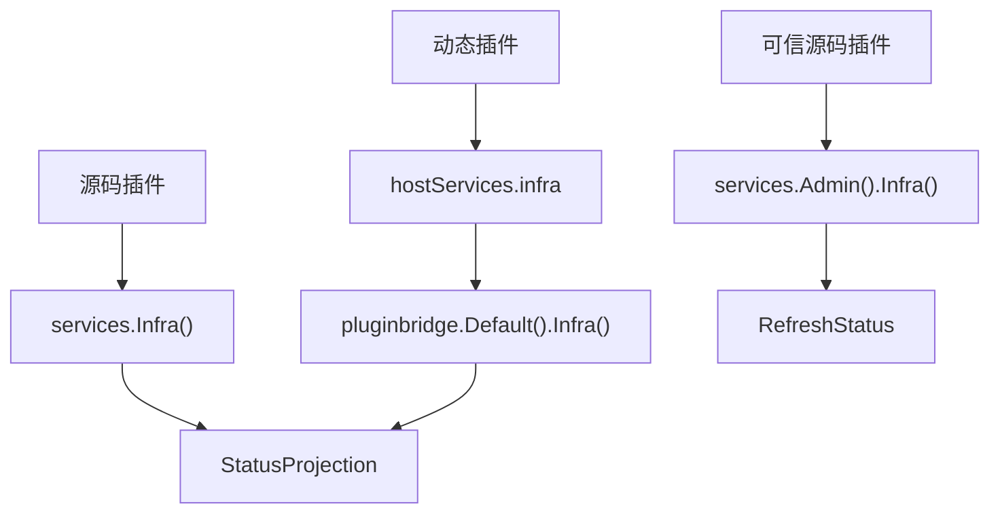

## 基本介绍

`Infra()`用于读取宿主基础设施组件的状态视图。它关注“某个组件当前是否可服务、处于什么状态、展示什么标签”，不暴露连接池、健康检查实现、监控客户端或具体运行后端。

基础设施状态能力有三个入口：

| 入口 | 使用者 | 说明 |
|------|--------|------|
| `services.Infra()` | 源码插件 | 读取可见组件状态视图 |
| `service: infra` | 动态插件 | 声明读取基础设施组件状态的动态宿主服务 |
| `services.Admin().Infra()` | 可信源码插件 | 刷新指定组件的状态缓存或状态快照 |

动态插件的`Runtime()`是另一类专属能力，用于日志、插件运行状态、宿主时间、`UUID`和节点身份读取，不属于`Infra()`领域能力。

**能力阶段**：运行期

**类型支持**：源码插件、动态插件

## 设计思路

### 状态视图而非实现入口

`Infra()`只提供基础设施组件状态视图。插件可以用它判断某个宿主组件是否可用，但不能通过它取得底层客户端、连接配置、健康检查任务或运行时缓存对象。



### 与`Runtime()`的边界

`Infra()`和`Runtime()`都可能涉及宿主运行状态，但它们表达的职责不同：

| 能力 | 所属边界 | 主要职责 |
|------|----------|----------|
| `Infra()` | 源码插件和动态插件共享的普通领域能力 | 读取基础设施组件状态视图 |
| `Runtime()` | 动态插件专属能力 | 写日志、读写插件运行状态、读取宿主时间、生成`UUID`和读取节点身份 |

因此，动态插件如果要读取组件状态，应声明`service: infra`；如果要写运行时日志或读写插件作用域状态，应声明`service: runtime`。

## 主要能力

### 普通读取能力

| 入口 | 方法 | 说明 |
|------|------|------|
| `Infra()` | `BatchGetStatus` | 批量读取可见基础设施组件状态 |

`StatusProjection`包含以下字段：

| 字段 | 说明 |
|------|------|
| `ID` | 组件标识 |
| `Available` | 组件当前是否可服务 |
| `Status` | 组件拥有的状态值 |
| `LabelKey` | 稳定的运行时翻译键 |
| `Label` | 可选的当前语言标签 |

### 管理命令

| 入口 | 方法 | 说明 |
|------|------|------|
| `Admin().Infra()` | `RefreshStatus` | 刷新指定组件的状态缓存或状态快照 |

`RefreshStatus`属于可信源码插件管理命令，不通过动态插件普通`hostServices`开放。

## 能力使用

### 源码插件读取状态

源码插件通过`services.Infra()`读取组件状态，并显式传入领域要求的`CapabilityContext`：

```go
result, err := services.Infra().BatchGetStatus(ctx, capabilityCtx, componentIDs)
if err != nil {
    return err
}

for _, status := range result.Items {
    if !status.Available {
        logger.Warningf(ctx, "infra component unavailable id=%s status=%s", status.ID, status.Status)
    }
}
```

可信源码插件刷新组件状态：

```go
err := services.Admin().Infra().RefreshStatus(ctx, capabilityCtx, componentID)
```

### 动态插件读取状态

动态插件在`plugin.yaml`中声明`infra`服务：

```yaml
hostServices:
  - service: infra
    methods:
      - status.batch_get
```

`infra`是`none`资源类型，不声明`paths`、`tables`、`keys`或`resources`。在动态插件侧通过`pluginbridge.Default().Infra()`读取状态：

```go
services := pluginbridge.Default()
result, err := services.Infra().BatchGetStatus(ctx, capabilityCtx, componentIDs)
```

## 设计约束

- **组件状态是只读视图。** `Infra()`不暴露具体运行后端、连接池、监控客户端、健康检查实现或宿主内部对象。
- **批量读取优先。** 插件应通过`BatchGetStatus`一次读取多个组件状态，避免逐项调用造成不必要开销。
- **刷新是管理命令。** `RefreshStatus`可能触发宿主状态重算，只对可信源码插件开放。
- **动态读取使用`service: infra`。** 动态插件读取基础设施组件状态时声明`infra`，不要误用`runtime`。
- **运行时原语使用`Runtime()`。** 日志、插件运行状态、时间、`UUID`和节点身份属于[动态`Runtime`能力](/docs/domain-capability-runtime)。

## 相关服务

- [动态`Runtime`能力](/docs/domain-capability-runtime)
- [缓存能力](/docs/domain-capability-cache)
- [任务与定时能力](/docs/domain-capability-jobs)
- [插件可用领域能力概览](/docs/domain-capabilities)
