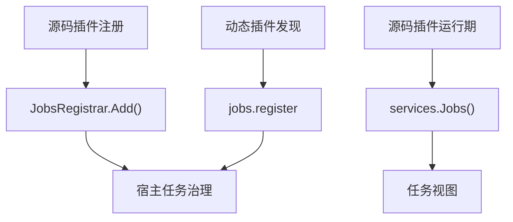

## 基本介绍

任务领域有三类入口：

| 入口 | 使用者 | 说明 |
|------|--------|------|
| `services.Jobs()` | 源码插件 | 读取可见定时任务视图 |
| `services.Admin().Jobs()` | 可信源码插件 | 触发任务或修改任务状态 |
| `JobsRegistrar`、`pluginbridge.NewDeclarations().Jobs()` | 源码插件注册阶段、动态插件发现阶段 | 声明插件自己的定时任务 |

`Jobs()`关注已经纳入宿主管理的任务视图；`JobsRegistrar`和`jobs.register`关注插件注册或发现时把任务声明交给宿主。两者不要混为同一个运行时调用面。

**能力阶段**：运行期

**类型支持**：源码插件、动态插件

## 能力设计

### 读取与注册分离

任务能力遵循读取与注册分离模式：`Jobs()`读取已纳入宿主管理的任务视图，`JobsRegistrar`在源码插件注册阶段声明任务，`pluginbridge.NewDeclarations().Jobs().Register`在动态插件发现阶段通过`jobs.register`宿主服务声明任务。



### 任务视图模型

`Jobs()`返回任务视图，用于读取已纳入宿主管理的任务状态：

| 字段 | 说明 |
|------|------|
| `ID` | 任务标识 |
| `Name` | 任务展示名称 |
| `Group` | 任务分组 |
| `Status` | 任务生命周期状态 |

### 注册时机

源码插件在编译期注册流程中通过`JobsRegistrar`声明定时任务。动态插件在发现阶段通过`jobs.register`提交`JobContract`。注册请求只在宿主发现和收集阶段生效，不是任意业务时间都可调用的任务执行接口。

## 接口定义

### 源码插件接口

| 入口 | 方法 | 说明 |
|------|------|------|
| `Jobs()` | `BatchGet` | 批量读取可见任务视图 |
| `Jobs()` | `Search` | 按关键词、分组和状态搜索可见任务候选 |
| `Jobs()` | `EnsureVisible` | 校验目标任务集合对当前调用上下文可见 |
| `Admin().Jobs()` | `Run` | 触发一个可见任务执行 |
| `Admin().Jobs()` | `SetStatus` | 改变一个可见任务状态 |

源码插件注册接口（通过`SourcePluginDefinition.GetJobRegistrars()`返回的`JobsRegistrar`访问）：

```go
// 在 JobHandlerRegistration.Handler 回调中使用 JobsRegistrar
func(ctx context.Context, registrar pluginhost.JobsRegistrar) error {
    return registrar.Add(ctx, "0 2 * * *", "daily-report", func(ctx context.Context) error {
        // 执行定时任务逻辑
        return nil
    })
}
```

### 动态插件接口

| 动态方法 | 说明 |
|----------|------|
| `jobs.batch_get` | 批量读取可见定时任务视图 |
| `jobs.search` | 按关键词、分组和状态搜索可见任务候选 |
| `jobs.visible.ensure` | 校验目标任务集合对当前调用上下文可见 |
| `jobs.register` | 在发现阶段提交定时任务声明 |

## 能力使用

### 源码插件使用

源码插件通过`services.Jobs()`读取任务视图：

```go
// 批量读取任务视图
result, err := services.Jobs().BatchGet(ctx, capabilityCtx, jobIDs)

// 搜索可见任务候选
page, err := services.Jobs().Search(ctx, capabilityCtx, jobcap.SearchInput{
    Keyword: "report",
    Group:   "daily",
    Status:  "active",
    Page:    pageRequest,
})

// 校验任务可见性
err := services.Jobs().EnsureVisible(ctx, capabilityCtx, jobIDs)
```

可信源码插件执行管理命令：

```go
// 触发任务执行
err := services.Admin().Jobs().Run(ctx, capabilityCtx, jobID)

// 修改任务状态
err := services.Admin().Jobs().SetStatus(ctx, capabilityCtx, jobID, "disabled")
```

源码插件在注册阶段通过`JobsRegistrar`声明定时任务：

```go
// 在 SourcePluginDefinition.GetJobRegistrars() 返回的回调中注册
func(ctx context.Context, registrar pluginhost.JobsRegistrar) error {
    return registrar.AddWithMetadata(ctx, "0 2 * * *", "daily-report", "每日报告", "每天凌晨 2 点生成报告",
        func(ctx context.Context) error {
            // 执行定时任务逻辑
            return nil
        },
    )
}
```

### 动态插件使用

动态插件在`plugin.yaml`中声明`jobs`服务：

```yaml
hostServices:
  - service: jobs
    methods:
      - jobs.batch_get
      - jobs.register
```

`jobs`是`none`资源类型，不声明资源字段。动态插件在发现阶段通过声明期入口提交任务声明：

```go
decl := pluginbridge.NewDeclarations()

// 在WASM guest的发现阶段通过 jobs.register 注册定时任务
err := decl.Jobs().Register(&protocol.JobContract{
    Name:           "cleanup-temp",
    DisplayName:    "临时文件清理",
    Description:    "每天凌晨 3 点清理过期临时文件",
    Pattern:        "0 3 * * *",
    Timezone:       "Asia/Shanghai",
    Scope:          protocol.JobScopeAllNode,
    Concurrency:    protocol.JobConcurrencySingleton,
    TimeoutSeconds: 300,
    RequestType:    "CleanupTempReq",
})
```

动态插件的注册请求只在宿主发现和收集阶段生效，不是任意业务时间都可调用的任务执行接口。

## 设计约束

- **读取和注册分离。** `Jobs()`读取任务视图，`JobsRegistrar`和`jobs.register`声明任务契约，不承担对方职责。
- **执行是管理命令。** `RunJob`和`SetJobStatus`必须经过`Admin().Jobs()`和领域治理。
- **动态`jobs.register`用于发现阶段。** 动态插件不应把它当作业务侧即时调度接口。
- **任务表不暴露给插件。** 插件不能通过任务能力读取宿主任务日志、调度器内部状态或数据库表结构。
- **任务状态由宿主定义。** 插件不应写入宿主状态机不接受的状态值。

## 相关服务

- [动态`Runtime`能力](/docs/domain-capability-runtime)
- [插件治理能力](/docs/domain-capability-plugins)
- [动态插件与WASM运行时](/docs/wasm-plugins)
