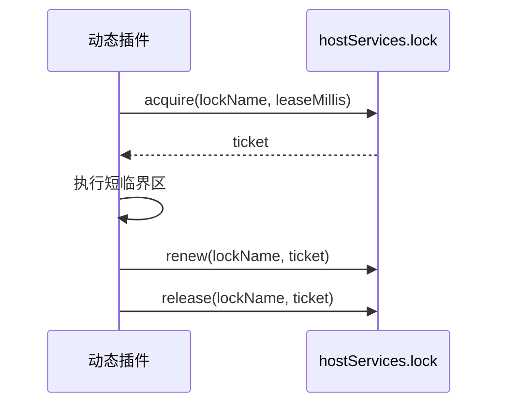

## 基本介绍

源码插件通过`services.Lock()`使用分布式锁能力。动态插件通过`plugin.yaml`声明`service: lock`后使用`pluginbridge.Default().Lock()`客户端。

锁能力适合保护插件的短临界区，例如避免同一个插件任务在多个节点同时处理同一资源。源码插件与宿主同进程运行，也可以选择在宿主领域服务或插件自己的后端逻辑中处理事务、唯一约束和并发控制。

**能力阶段**：运行期

**类型支持**：源码插件、动态插件

## 能力设计

### 票据机制

锁能力使用宿主签发的`ticket`完成续租和释放。`ticket`不能伪造，`renew`和`release`必须使用宿主返回的`ticket`。

### 锁生命周期



### 资源授权机制

`lock`是`resource`资源类型，必须声明`resources[].ref`。资源引用应使用稳定业务名，不要把用户输入、完整路径或敏感业务内容直接拼进资源名。

### 源码插件边界

源码插件通过`services.Lock()`直接使用分布式锁能力。源码插件也可以选择在宿主领域服务或插件自己的后端逻辑中处理事务、唯一约束和并发控制。

## 接口定义

### 源码插件接口

| 方法 | 说明 |
|------|------|
| `Acquire` | 尝试获取锁，成功时返回锁票据和租约信息 |
| `Renew` | 使用票据续租锁 |
| `Release` | 使用票据释放锁 |

### 动态插件接口

| 动态方法 | 动态`SDK`方法 | 说明 |
|----------|-------------|------|
| `acquire` | `Lock().Acquire` | 尝试获取锁，成功时返回锁票据和租约信息 |
| `renew` | `Lock().Renew` | 使用票据续租锁 |
| `release` | `Lock().Release` | 使用票据释放锁 |

## 能力使用

### 源码插件使用

源码插件通过`services.Lock()`操作分布式锁：

```go
// 获取锁
lockResult, err := services.Lock().Acquire(ctx, lockcap.AcquireInput{
    Name:  "report-export",
    Lease: 30 * time.Second,
})
if err != nil {
    // 获取锁失败，延后或跳过
    return
}

// 执行临界区操作
doWork()

// 续租锁（如果需要更长时间）
_, err = services.Lock().Renew(ctx, lockcap.RenewInput{
    Name:   "report-export",
    Ticket: lockResult.Ticket,
})

// 释放锁
err = services.Lock().Release(ctx, lockcap.ReleaseInput{
    Name:   "report-export",
    Ticket: lockResult.Ticket,
})
```

源码插件也可以选择使用宿主数据库事务处理并发：

### 动态插件使用

动态插件在`plugin.yaml`中声明`lock`服务和授权资源：

```yaml
hostServices:
  - service: lock
    methods:
      - acquire
      - renew
      - release
    resources:
      - ref: lock:report-export
```

在动态插件侧使用：

```go
// 获取锁
lockResult, err := pluginbridge.Default().Lock().Acquire(ctx, lockcap.AcquireInput{
    Name:  "report-export",
    Lease: 30 * time.Second,
})
if err != nil {
    // 获取锁失败，延后或跳过
    return
}

// 执行临界区操作
doWork()

// 续租锁（如果需要更长时间）
_, err = pluginbridge.Default().Lock().Renew(ctx, lockcap.RenewInput{
    Name:   "report-export",
    Ticket: lockResult.Ticket,
})

// 释放锁
err = pluginbridge.Default().Lock().Release(ctx, lockcap.ReleaseInput{
    Name:   "report-export",
    Ticket: lockResult.Ticket,
})
```

## 设计约束

- **锁不是权限边界。** 锁只协调并发，不替代授权、租户过滤或数据可见性校验。
- **租约必须有限。** 插件应设置合理`leaseMillis`，并在完成后主动释放。
- **票据不能伪造。** `renew`和`release`必须使用宿主返回的`ticket`，插件不应自行构造。
- **锁名需要稳定。** 锁名应由业务场景和资源标识组成，避免高基数、敏感信息和用户可控原文。
- **失败必须可重试或可降级。** 获取锁失败时，插件应延后、跳过或返回可解释错误，不应忙等。

## 相关服务

- [动态`Runtime`能力](/docs/domain-capability-runtime)
- [任务与定时能力](/docs/domain-capability-jobs)
- [数据记录能力](/docs/domain-capability-recordstore)
