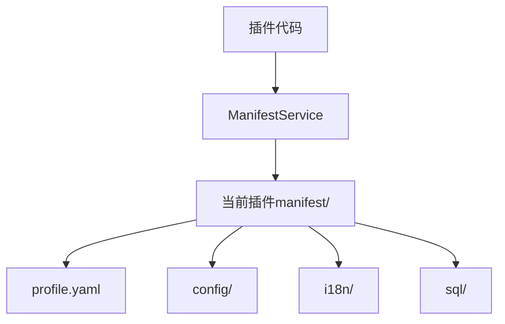

## 基本介绍

`services.Manifest()`返回当前插件作用域的`manifest`资源读取服务。路径始终相对`manifest/`目录，例如读取`manifest/profile.yaml`时传入`profile.yaml`。

动态插件使用同一语义，但必须在`plugin.yaml`中声明`manifest`服务和允许读取的`paths`。

**能力阶段**：运行期

**类型支持**：源码插件、动态插件

## 能力设计

### 资源绑定机制

资源绑定当前插件：源码插件来自嵌入文件系统，动态插件来自发布产物或宿主绑定的产物资源。路径必须规范，使用斜杠分隔，禁止通过相对路径逃逸当前插件`manifest/`根。

### 资源类型

| 路径示例 | 说明 |
|----------|------|
| `profile.yaml` | 插件简介或展示元数据 |
| `config/config.example.yaml` | 配置模板，不参与运行时默认读取 |
| `config/config.yaml` | 插件默认配置来源之一 |
| `i18n/zh-CN/plugin.json` | 中文语言资源 |
| `sql/install.sql` | 安装脚本原始资源 |



### 只读原始资源语义

读取资源不代表执行`SQL`、注册语言包或应用配置。配置读取有专用能力，运行时配置值使用`Plugins().Config()`或动态`config.get`，不要直接读取`config/config.yaml`来绕过优先级。

## 接口定义

### 源码插件接口

| 方法 | 说明 |
|------|------|
| `Get` | 读取指定路径的原始字节内容 |
| `GetMany` | 批量读取指定路径集合的原始资源内容 |
| `List` | 返回指定前缀下的资源元数据列表 |
| `Exists` | 判断指定路径资源是否存在 |
| `Scan` | 将`YAML`资源或其中的嵌套键扫描到目标结构体 |

### 动态插件接口

| 动态方法 | 动态`SDK`方法 | 说明 |
|----------|-------------|------|
| `get` | `Manifest().Get`、`Manifest().GetMany`、`Manifest().List`、`Manifest().Exists`、`Manifest().Scan` | 读取授权路径下的原始资源 |

## 能力使用

### 源码插件使用

源码插件通过`services.Manifest()`读取随插件发布的资源：

```go
// 读取插件简介
content, err := services.Manifest().Get(ctx, "profile.yaml")

// 批量读取多个资源
result, err := services.Manifest().GetMany(ctx, manifestcap.GetManyInput{
    Paths: []string{"profile.yaml", "config/config.yaml"},
})

// 列举资源元数据
listResult, err := services.Manifest().List(ctx, manifestcap.ListInput{
    Prefix: "i18n/",
    Limit:  50,
})

// 判断资源是否存在
exists, err := services.Manifest().Exists(ctx, "i18n/zh-CN/plugin.json")

// 扫描YAML资源到结构体
var config PluginConfig
err := services.Manifest().Scan(ctx, "config/config.yaml", "", &config)
```

### 动态插件使用

动态插件在`plugin.yaml`中声明`manifest`服务和授权路径：

```yaml
hostServices:
  - service: manifest
    methods:
      - get
    resources:
      paths:
        - profile.yaml
        - i18n/zh-CN/plugin.json
```

`manifest`省略`methods`时默认使用`get`。`resources.paths`必须是相对`manifest/`的路径，不要写成`manifest/profile.yaml`。在动态插件侧使用：

```go
// 读取插件简介
content, err := pluginbridge.Default().Manifest().Get(ctx, "profile.yaml")

// 判断资源是否存在
exists, err := pluginbridge.Default().Manifest().Exists(ctx, "i18n/zh-CN/plugin.json")
```

## 设计约束

- **只读原始资源。** 读取资源不代表执行`SQL`、注册语言包或应用配置。
- **配置读取有专用能力。** 运行时配置值使用`Plugins().Config()`或动态`config.get`，不要直接读取`config/config.yaml`来绕过优先级。
- **资源绑定当前插件。** 源码插件来自嵌入文件系统，动态插件来自发布产物或宿主绑定的产物资源。
- **路径必须规范。** 使用斜杠分隔，禁止通过相对路径逃逸当前插件`manifest/`根。

## 相关服务

- [配置管理能力](/docs/domain-capability-hostconfig)
- [国际化能力](/docs/domain-capability-i18n)
- [插件可用领域能力概览](/docs/domain-capabilities)
