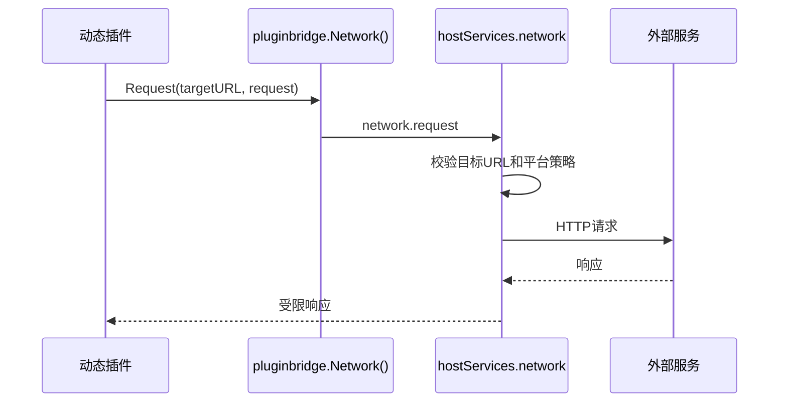

## 基本介绍

动态插件通过`service: network`声明出站网络访问，再使用`pluginbridge.Default().Network().Request`发起受管控的`HTTP`请求。源码插件与宿主同进程运行，当前没有普通`Services.Network()`入口；源码插件需要外部访问时，应通过自身领域适配器和宿主安全规范处理。

`network`不是通用代理服务。它只允许访问清单中授权的`HTTP/HTTPS URL`模式，宿主在执行请求时继续施加平台级网络和审计策略。

**能力阶段**：运行期

**类型支持**：动态插件

## 能力设计

### 资源授权机制

`network`是`resource`资源类型，必须声明`resources[].url`。资源值表达允许访问的域名和路径模式，例如`https://api.example.com/v1/*`。

### 请求治理流程



### 源码插件边界

源码插件不使用动态`network`。源码插件应通过自身后端代码和宿主安全规范接入外部系统。`secret`、`event`和`queue`当前是描述符中的预留治理条目，不是已发布的动态宿主服务。

## 接口定义

### 源码插件接口

源码插件当前没有普通`Services.Network()`入口。源码插件需要外部访问时，应通过自身领域适配器和宿主安全规范处理。

### 动态插件接口

| 动态方法 | `pluginbridge`方法 | 说明 |
|----------|-------------|------|
| `request` | `Network().Request` | 通过宿主发起一次受管控的出站`HTTP`请求 |

资源声明：

| 字段 | 说明 |
|------|------|
| `resources[].url` | 允许访问的`HTTP/HTTPS URL`模式，例如`https://api.example.com/v1/*` |

## 能力使用

### 源码插件使用

源码插件不使用动态`network`服务。需要外部访问时，应通过自身后端代码和宿主安全规范处理：

```go
// 源码插件直接使用宿主HTTP客户端
client := g.Client()
response, err := client.Get(ctx, "https://api.example.com/data")
```

### 动态插件使用

动态插件在`plugin.yaml`中声明`network`服务和授权资源：

```yaml
hostServices:
  - service: network
    methods:
      - request
    resources:
      - url: https://api.example.com/v1/*
```

在动态插件侧使用：

```go
response, err := pluginbridge.Default().Network().Request(
    "https://api.example.com/v1/users",
    &protocol.HostServiceNetworkRequest{
        Method: "GET",
        Headers: map[string]string{
            "Authorization": "Bearer " + token,
        },
    },
)
```

## 设计约束

- **必须显式授权资源。** 未声明的目标地址不应被宿主转发。
- **不要传递宿主密钥。** 插件不应要求宿主把平台级密钥直接暴露给动态代码；需要密钥时应由宿主适配器代理。
- **响应大小受限。** 网络能力适合业务接口调用，不适合下载大文件；大对象应走文件或存储能力。
- **源码插件不使用动态`network`。** 源码插件应通过自身后端代码和宿主安全规范接入外部系统。
- **预留服务不是可用网络能力。** `secret`、`event`和`queue`当前是描述符中的预留治理条目，不是已发布的动态宿主服务。

## 相关服务

- [文件与存储能力](/docs/domain-capability-storage)
- [AI能力](/docs/domain-capability-ai)
- [插件可用领域能力概览](/docs/domain-capabilities)
