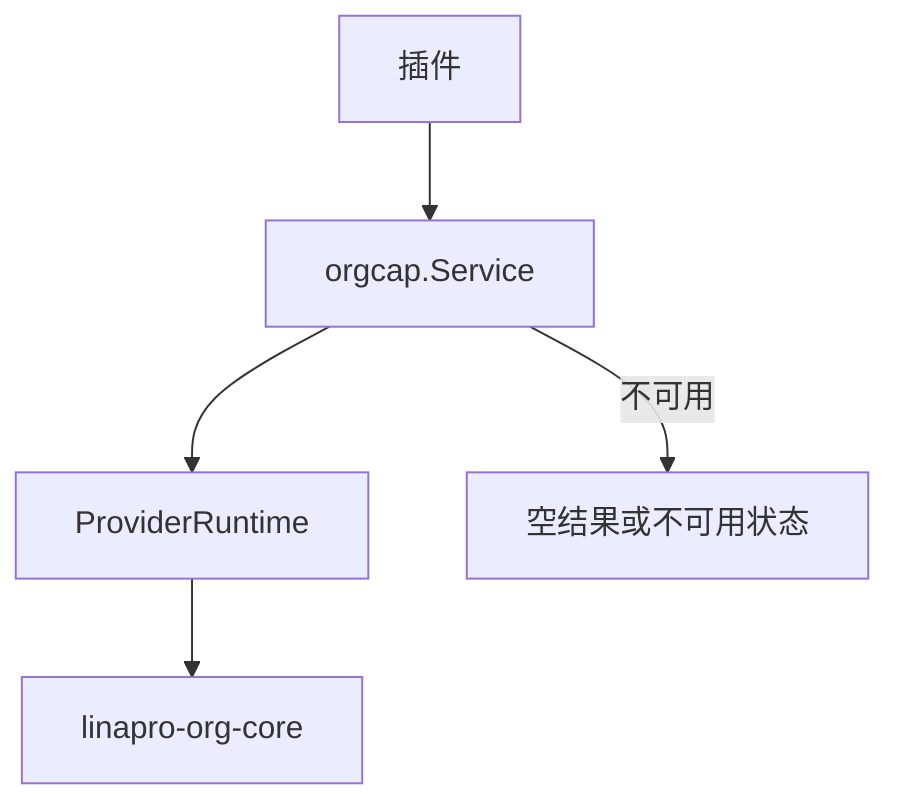
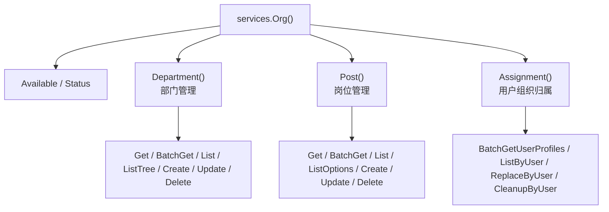

## 基本介绍

源码插件通过`services.Org()`消费组织能力。组织能力是可选框架能力，官方提供方插件标识为`linapro-org-core`。当提供方不可用时，服务返回安全降级结果，调用方应通过`Available()`或`Status()`判断是否展示组织相关功能。

`Org`能力采用子服务模式，聚合`Department()`（部门管理）、`Post()`（岗位管理）和`Assignment()`（用户组织归属管理）。

动态插件可声明`service: org`调用已发布的组织方法。

**能力阶段**：运行期

**类型支持**：源码插件、动态插件

## 能力设计

### SPI模式

`Org`能力采用`SPI`模式，具体组织逻辑由提供方插件实现。提供方通过`orgcap.Provide(pluginID, factory)`注册，宿主首次使用组织能力时才构造提供方，并传入`ProviderEnv`，其中包含插件`ID`、源码插件专属`TenantFilter`和用户视图能力。



### 子服务体系

`Org`能力采用子服务模式，分别处理部门、岗位和用户组织归属：



### 提供方边界

`orgcap.Provider`包含组织插件需要实现的完整能力，包括部门视图、岗位视图、部门范围过滤、用户组织归属写入和工作台视图。`Department()`和`Post()`提供完整生命周期管理；涉及`gdb.Model`的数据范围和工作台适配接口都留在宿主内部或提供方边界。

### 安全降级

能力可选，调用方必须处理组织能力不可用时的空结果或不可用状态。提供方是延迟构造的，宿主只在能力被使用时构造提供方，避免启动阶段强依赖可选插件。

## 接口定义

### 源码插件接口

**`Org()`根方法：**

| 方法 | 说明 |
|------|------|
| `Available` | 判断组织能力是否有可用提供方 |
| `Status` | 返回能力状态、活跃提供方和冲突原因 |
| `Department()` | 返回部门管理子服务 |
| `Post()` | 返回岗位管理子服务 |
| `Assignment()` | 返回用户组织归属管理子服务 |

**`Org().Department()`子服务：**

| 方法 | 说明 |
|------|------|
| `Get` | 读取单个可见部门信息 |
| `BatchGet` | 批量读取可见部门信息，返回`BatchResult` |
| `List` | 按关键词搜索可见部门候选 |
| `ListTree` | 返回有节点上限的部门树投影 |
| `ListOptions` | 返回分页部门选项 |
| `EnsureVisible` | 校验部门引用在当前租户和组织提供方边界内可见 |
| `Create` | 创建部门，经过父部门、名称唯一性和租户边界校验 |
| `Update` | 更新可见部门，经过目标可见性和租户边界校验 |
| `Delete` | 删除可见部门，经过目标可见性和租户边界校验 |

**`Org().Post()`子服务：**

| 方法 | 说明 |
|------|------|
| `Get` | 读取单个可见岗位信息 |
| `BatchGet` | 批量读取可见岗位信息，返回`BatchResult` |
| `List` | 按关键词搜索可见岗位候选 |
| `ListOptions` | 返回分页岗位选项 |
| `EnsureVisible` | 校验岗位引用在当前租户和组织提供方边界内可见 |
| `Create` | 创建岗位，经过所属部门、名称唯一性和租户边界校验 |
| `Update` | 更新可见岗位，经过目标可见性和租户边界校验 |
| `Delete` | 删除可见岗位，经过目标可见性和租户边界校验 |

**`Org().Assignment()`子服务：**

| 方法 | 说明 |
|------|------|
| `BatchGetUserProfiles` | 批量读取用户组织档案，包含部门和岗位信息 |
| `ListByUser` | 读取单个用户的组织档案 |
| `BatchListByUsers` | 批量读取用户部门归属信息 |
| `GetUserDeptInfo` | 读取单个用户部门标识和名称 |
| `GetUserDeptIDs` | 读取单个用户部门标识集合 |
| `GetUserPostIDs` | 读取单个用户岗位标识集合 |
| `ReplaceByUser` | 重写用户的部门和岗位关联，经过目标可见性和租户边界校验 |
| `CleanupByUser` | 删除用户的可选组织关联 |

### 动态插件接口

| 动态方法 | 说明 |
|----------|------|
| `capability.available` | 判断组织能力是否有可用提供方 |
| `capability.status` | 返回能力状态和活跃提供方 |
| `departments.get` | 读取单个可见部门信息 |
| `departments.batch_get` | 批量读取可见部门信息 |
| `departments.list` | 按关键词搜索可见部门候选 |
| `departments.tree.list` | 返回有节点上限的部门树投影 |
| `departments.options.list` | 返回分页部门选项 |
| `departments.visible.ensure` | 校验部门引用可见性 |
| `posts.get` | 读取单个可见岗位信息 |
| `posts.batch_get` | 批量读取可见岗位信息 |
| `posts.list` | 按关键词搜索可见岗位候选 |
| `posts.options.list` | 返回分页岗位候选投影 |
| `posts.visible.ensure` | 校验岗位引用可见性 |
| `users.dept_assignments.list` | 批量读取用户部门归属视图 |
| `users.org_profiles.batch_get` | 批量读取用户组织档案 |
| `users.dept_info.get` | 读取单个用户部门标识和名称 |
| `users.dept_ids.get` | 读取单个用户部门标识集合 |
| `users.post_ids.get` | 读取单个用户岗位标识集合 |

## 能力使用

### 源码插件使用

源码插件通过`services.Org()`读取组织视图：

```go
// 检查组织能力是否可用
if !services.Org().Available(ctx) {
    // 降级处理
    return
}

// 读取用户部门信息
deptInfo, err := services.Org().Assignment().GetUserDeptInfo(ctx, userID)

// 批量读取用户组织档案
profiles, err := services.Org().Assignment().BatchGetUserOrgProfiles(ctx, userIDs)

// 读取用户岗位
postIDs, err := services.Org().Assignment().GetUserPostIDs(ctx, userID)

// 获取部门树
tree, err := services.Org().Department().ListTree(ctx, orgcap.DeptTreeInput{MaxNodes: 100})

// 搜索部门候选
deptPage, err := services.Org().Department().List(ctx, orgcap.DeptListInput{
    Keyword: "研发",
    Page:    pageRequest,
})

// 搜索岗位候选
postPage, err := services.Org().Post().ListOptions(ctx, orgcap.PostOptionsInput{
    DeptID:  &deptID,
    Keyword: "工程师",
    Page:    pageRequest,
})

// 校验部门可见性
err := services.Org().Department().EnsureVisible(ctx, deptIDs)

// 校验岗位可见性
err := services.Org().Post().EnsureVisible(ctx, postIDs)

// 创建部门
deptID, err := services.Org().Department().Create(ctx, orgcap.DeptCreateInput{
    ParentID: parentDeptID,
    DeptName: "研发中心",
    DeptCode: "RD",
})

// 创建岗位
postID, err := services.Org().Post().Create(ctx, orgcap.PostCreateInput{
    DeptID:   deptID,
    PostCode: "SWE",
    PostName: "软件工程师",
})
```

### 动态插件使用

动态插件在`plugin.yaml`中声明`org`服务和授权方法：

```yaml
hostServices:
  - service: org
    methods:
      - capability.available
      - users.dept_name.get
      - users.post_ids.get
      - departments.tree.list
      - departments.search
      - posts.options.list
```

`org`是`none`资源类型，不声明`paths`、`tables`、`keys`或`resources`。在动态插件侧使用：

```go
orgSvc := pluginbridge.Default().Org()

// 检查组织能力是否可用
available := orgSvc.Available(ctx)

// 读取用户部门信息
deptID, deptName, err := orgSvc.Assignment().GetUserDeptInfo(ctx, userID)

// 获取部门树
tree, err := orgSvc.Department().ListTree(ctx, orgcap.DeptTreeInput{MaxNodes: 100})

// 搜索部门候选
deptPage, err := orgSvc.Department().List(ctx, orgcap.DeptListInput{
    Keyword: "研发",
    Page:    pageRequest,
})
```

## 设计约束

- **部门和岗位支持完整生命周期管理。** `Department()`和`Post()`提供`Create`、`Update`、`Delete`等写入方法，经过可见性、租户边界和审计校验后执行。
- **数据范围不对普通插件暴露。** 组织数据范围需要数据库查询构建器，属于宿主内部`ScopeService`。
- **能力可选。** 调用方必须处理组织能力不可用时的空结果或不可用状态。
- **提供方是延迟构造。** 宿主只在能力被使用时构造提供方，避免启动阶段强依赖可选插件。

## 相关服务

- [用户能力](/docs/domain-capability-users)
- [租户能力](/docs/domain-capability-tenant)
- [Plugins能力](/docs/domain-capability-plugins)
- [在线会话能力](/docs/domain-capability-sessions)
