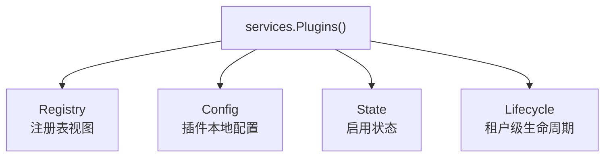
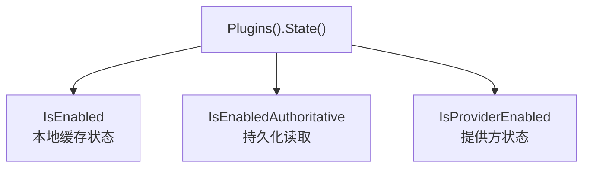
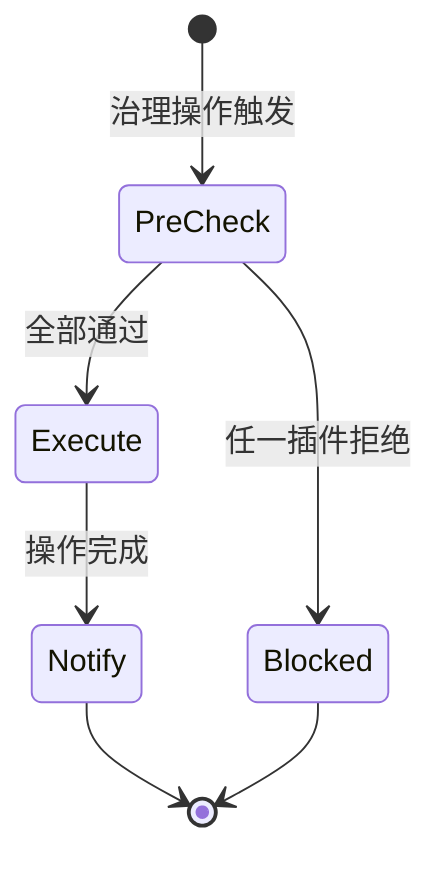

## 基本介绍

`services.Plugins()`返回插件治理领域能力命名空间。源码插件通过`services.Plugins()`访问，动态插件通过`plugin.yaml`声明`service: plugins`后使用`pluginbridge.Default().Plugins()`客户端访问。它不是单个方法集合，而是聚合多个插件治理子能力：

| 子能力 | 说明 |
|--------|------|
| `Registry()` | 读取插件治理视图，例如插件版本、安装状态、启用状态和租户可控插件列表 |
| `Config()` | 读取当前插件自己的静态配置 |
| `State()` | 查询插件启用状态、权威启用状态和能力提供方状态 |
| `Lifecycle()` | 编排租户级插件禁用和租户删除的前置检查、后置通知 |

`Plugins()`同时实现注册表读取方法，因此调用方可以直接使用`services.Plugins().BatchGetPlugins`和`services.Plugins().ListTenantPlugins`读取插件视图，也可以通过`Registry()`显式表达依赖意图。

**能力阶段**：运行期

**类型支持**：源码插件、动态插件

## 能力设计

### 子能力体系



### Registry子能力

注册表能力用于读取插件治理视图，不暴露宿主`sys_plugin`表或运行时内部缓存状态。插件视图通常包含插件`ID`、版本、安装状态、启用状态和生命周期状态。租户视图额外包含名称、类型、描述、安装模式、作用域性质和租户级启用状态。

### Config子能力

`Plugins().Config()`读取当前插件自己的静态配置。它和`HostConfig()`职责不同：

| 能力 | 读取范围 |
|------|----------|
| `Plugins().Config()` | 当前插件作用域下的`config.yaml` |
| `HostConfig()` | 宿主配置值；动态插件读取时必须声明授权`keys` |

插件配置读取优先级为：

| 优先级 | 来源 | 说明 |
|--------|------|------|
| 1 | 宿主`config.yaml`中的`plugin.<plugin-id>`段 | 部署层统一覆盖，独占式优先级 |
| 2 | 生产配置根下`plugins/<plugin-id>/config.yaml` | 运维覆盖，生产环境优先 |
| 3 | 开发期`manifest/config/config.yaml` | 源码插件开发默认配置 |
| 4 | 动态插件产物绑定的`manifest/config/config.yaml` | 发布产物默认配置 |

当宿主`config.yaml`中存在`plugin.<plugin-id>`段时，该段即为该插件配置的唯一来源，文件级配置不再参与解析。详见[插件业务配置](/docs/plugin-configuration)。

`manifest/config/config.example.yaml`只是配置模板，不参与运行时默认读取。

### State子能力

`Plugins().State()`提供三种查询语义，分别服务于不同的一致性和性能需求：

| 方法 | 数据来源和语义 | 适用场景 |
|------|----------------|----------|
| `IsEnabled` | 读取进程本地启用缓存状态，并保留租户、请求范围和运行时门禁 | 菜单过滤、路由可见性、权限过滤等高频判断 |
| `IsEnabledAuthoritative` | 绕过本地缓存状态，强制读取持久化插件治理状态 | 全局中间件、写保护、需要立即响应管理端状态变化的控制 |
| `IsProviderEnabled` | 判断插件是否平台启用且可承接框架能力提供方调用 | `AI`、组织、租户等能力提供方调用前检查 |



### Lifecycle子能力

`Plugins().Lifecycle()`面向租户管理、插件管理等治理模块，用于在治理操作前询问已注册插件是否允许继续，并在操作完成后通知插件执行清理或观测逻辑。

它不同于`pluginhost.SourcePlugin.Lifecycle()`：

| 入口 | 作用 |
|------|------|
| `pluginhost.SourcePlugin.Lifecycle()` | 单个源码插件注册自身安装、升级、禁用、卸载、租户禁用、租户删除和安装模式变更回调 |
| `services.Plugins().Lifecycle()` | 治理模块编排跨插件的租户级前置检查和后置通知 |



## 接口定义

### Registry子能力接口

| 方法 | 说明 |
|------|------|
| `BatchGetPlugins` | 批量读取可见插件视图，缺失结果不透露具体原因 |
| `ListTenantPlugins` | 读取当前租户可控插件列表，包含全局启用状态和租户启用状态 |
| `Registry` | 返回同一注册表读取接口，便于依赖注入时只暴露注册表能力 |

### Config子能力接口

| 方法 | 说明 |
|------|------|
| `Get` | 返回原始配置值 |
| `Exists` | 判断配置键是否存在 |
| `Scan` | 将配置段扫描到目标结构体 |
| `String` | 读取字符串值，缺失或空白时返回默认值 |
| `Bool` | 读取布尔值，缺失时返回默认值 |
| `Int` | 读取整数值，缺失时返回默认值 |
| `Duration` | 读取时间间隔，缺失或空白时返回默认值 |

### State子能力接口

| 方法 | 说明 |
|------|------|
| `IsEnabled` | 读取进程本地启用缓存状态，适合高频判断 |
| `IsEnabledAuthoritative` | 强制读取持久化状态，适合全局控制 |
| `IsProviderEnabled` | 判断能力提供方是否可用 |

### Lifecycle子能力接口

| 方法 | 说明 |
|------|------|
| `EnsureTenantPluginDisableAllowed` | 租户禁用某插件前执行前置检查，任一插件拒绝则阻断 |
| `NotifyTenantPluginDisabled` | 租户禁用插件后进行最佳努力通知 |
| `EnsureTenantDeleteAllowed` | 租户删除前执行前置检查 |
| `NotifyTenantDeleted` | 租户删除后进行最佳努力通知 |

### 管理命令接口

| 入口 | 方法 | 说明 |
|------|------|------|
| `Admin().Plugins()` | `SetPluginEnabled` | 修改插件启用状态，并经过租户、生命周期和状态机检查 |
| `Admin().Plugins()` | `ProvisionTenantDefaults` | 为指定租户补齐默认插件供给状态 |

### 动态插件接口

| 动态方法 | 说明 |
|----------|------|
| `plugins.batch_get` | 批量读取可见插件视图 |
| `plugins.tenant.list` | 读取当前租户可控插件列表 |
| `plugins.enabled.check` | 检查插件是否启用 |
| `plugins.provider_enabled.check` | 检查能力提供方是否可用 |
| `plugins.enabled_authoritative.check` | 强制读取持久化启用状态 |
| `config.get` | 读取当前插件作用域配置 |
| `lifecycle.tenant_plugin_disable.ensure` | 租户禁用插件前置检查 |
| `lifecycle.tenant_plugin_disabled.notify` | 租户禁用插件后置通知 |
| `lifecycle.tenant_delete.ensure` | 租户删除前置检查 |
| `lifecycle.tenant_deleted.notify` | 租户删除后置通知 |

动态插件生命周期通过桥接契约中的上述`lifecycle`方法编排。

## 能力使用

### 源码插件使用

源码插件通过`services.Plugins()`访问各子能力，并在读取插件视图时显式传入领域要求的`CapabilityContext`：

```go
// 读取插件视图
result, err := services.Plugins().BatchGetPlugins(ctx, capabilityCtx, pluginIDs)

// 读取当前租户可控插件列表
tenantPlugins, err := services.Plugins().ListTenantPlugins(ctx, capabilityCtx)

// 读取插件配置
endpoint, err := services.Plugins().Config().String(ctx, "api.endpoint", "")

// 高频判断插件是否启用
if !services.Plugins().State().IsEnabled(ctx, pluginID) {
    return errors.New("插件未启用")
}

// 全局控制使用权威读取
if !services.Plugins().State().IsEnabledAuthoritative(ctx, pluginID) {
    return errors.New("插件已禁用")
}

// 能力提供方检查
if services.Plugins().State().IsProviderEnabled(ctx, "linapro-ai-core") {
    // 使用AI能力
}
```

可信源码插件执行管理命令：

```go
err := services.Admin().Plugins().SetPluginEnabled(ctx, capabilityCtx, pluginID, true)
err := services.Admin().Plugins().ProvisionTenantDefaults(ctx, capabilityCtx, tenantID)
```

### 动态插件使用

动态插件通过`hostServices.plugins`声明插件治理能力：

```yaml
hostServices:
  - service: plugins
    methods:
      - config.get
      - plugins.batch_get
      - plugins.enabled.check
```

动态插件生命周期通过桥接契约管理，包括安装、升级、禁用和卸载阶段的回调注册。在动态插件侧使用：

```go
// 读取插件配置
value, err := pluginbridge.Default().Plugins().Config().String(ctx, "api.endpoint", "")
```

## 设计约束

- **高频判断优先使用`IsEnabled`。** 它为菜单、路由和权限过滤设计，避免频繁访问持久化状态。
- **全局控制使用`IsEnabledAuthoritative`。** 当旧缓存状态会导致安全或治理错误时，使用权威读取。
- **提供方状态独立于业务入口可见性。** 某些插件业务入口对当前租户不可见，但仍可能作为平台能力提供方可用。
- **`Ensure*`可以阻断。** 生命周期前置检查返回错误时，治理操作不应继续。
- **`Notify*`是最佳努力。** 后置通知不返回错误，插件回调失败只应记录，不应回滚已完成治理操作。
- **动态插件生命周期走桥接契约。** 动态插件产物的生命周期契约位于`pluginbridge/contract`，不通过动态`hostServices`暴露为普通可调用服务。

## 相关服务

- [插件可用领域能力概览](/docs/domain-capabilities)
- [配置管理能力](/docs/domain-capability-hostconfig)
- [AI能力](/docs/domain-capability-ai)
- [Tenant能力](/docs/domain-capability-tenant)
