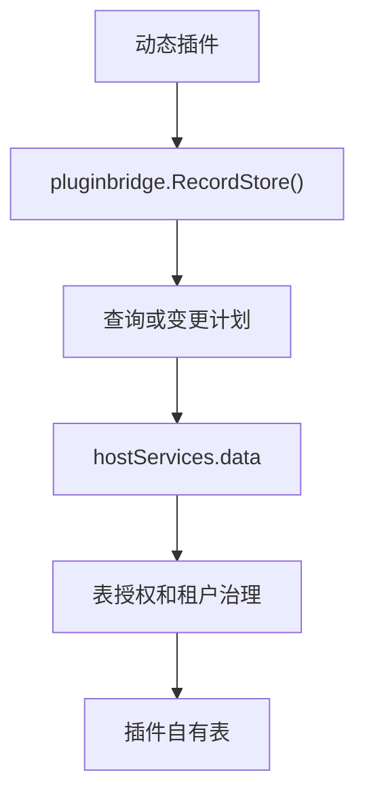

## 基本介绍

动态插件通过`plugin.yaml`声明`service: data`，再使用`pluginbridge.Default().RecordStore()`访问授权表。该能力面向插件自有表，不面向宿主核心表。

源码插件没有普通`Services.Data()`入口。源码插件与宿主同进程运行，通常在插件自己的领域服务中通过宿主`dao`包访问插件自有表；当插件自有表带有`tenant_id`时，应配合租户能力中的`TenantFilter()`。

**能力阶段**：运行期

**类型支持**：动态插件

## 能力设计

### 双模式架构

数据记录能力采用双模式架构：动态插件通过`hostServices.data`访问授权表，源码插件通过宿主`dao`包访问插件自有表。两者在租户隔离上使用不同机制：

| 插件类型 | 推荐做法 |
|----------|----------|
| 源码插件 | 通过宿主`dao`包访问插件自有表，需要租户隔离时调用`tenantFilter.Apply` |
| 动态插件 | 声明`data`服务和`resources.tables`，由宿主数据服务执行表名、方法和租户边界治理 |



### 表授权机制

`data`是`table`资源类型，必须声明`resources.tables`。生产校验会要求表名属于插件自有命名空间，动态插件不得声明`sys_*`等宿主核心表。

### 事务语义

`transaction`提交的是受管控的操作计划，不是任意`SQL`。插件代码不应把它理解为直连数据库连接。

## 接口定义

### 源码插件接口

源码插件没有普通`Services.Data()`入口。源码插件通过宿主`dao`包访问插件自有表：

```go
// 源码插件通过 dao 包访问插件自有表
model := s.tenantFilter.Apply(ctx, dao.Record.Ctx(ctx), "")
result, err := model.Where(dao.Record.Columns().Status, "active").All()
```

### 动态插件接口

| 动态方法 | 能力常量 | 说明 |
|----------|----------|------|
| `list` | `host:data:read` | 执行有界单表列表查询 |
| `get` | `host:data:read` | 按键读取一条授权表记录 |
| `create` | `host:data:mutate` | 创建一条授权表记录 |
| `update` | `host:data:mutate` | 更新一条授权表记录 |
| `delete` | `host:data:mutate` | 删除一条授权表记录 |
| `transaction` | `host:data:mutate` | 执行结构化多操作事务 |

## 能力使用

### 源码插件使用

源码插件通过宿主`dao`包访问插件自有表，配合`TenantFilter()`实现租户隔离：

```go
// 查询插件自有表，带租户过滤
model := s.tenantFilter.Apply(ctx, dao.Record.Ctx(ctx), "")

// 执行查询
result, err := model.Where(dao.Record.Columns().Status, "active").Page(1, 20).All()

// 创建记录
id, err := dao.Record.Ctx(ctx).Data(do.Record{
    Title:    title,
    Status:   "active",
    TenantId: tenantID,
}).InsertAndGetId()
```

`TenantFilter().Apply`的第三个参数是表名或别名限定符：

| `qualifier` | 结果 |
|-------------|------|
| 空字符串 | 使用`tenant_id` |
| `plugin_record` | 使用`plugin_record.tenant_id` |
| `r` | 使用`r.tenant_id` |

### 动态插件使用

动态插件在`plugin.yaml`中声明`data`服务和授权表：

```yaml
hostServices:
  - service: data
    methods:
      - list
      - get
      - create
      - update
      - delete
      - transaction
    resources:
      tables:
        - plugin_demo_reports
        - plugin_demo_report_items
```

`RecordStore()`提供类`ORM`封装层，但它仍然会转换成`data`宿主服务调用。在动态插件侧使用：

```go
store := pluginbridge.Default().RecordStore()

// 列表查询
records, total, err := store.Table("plugin_demo_reports").
    WhereEq("status", "active").
    OrderDesc("id").
    Page(1, 20).
    All()

// 创建记录
result, err := store.Table("plugin_demo_reports").Insert(data)

// 单表事务操作
err := store.Transaction(func(tx *recordstore.Tx) error {
    if _, err := tx.Table("plugin_demo_reports").Insert(reportData); err != nil {
        return err
    }
    if _, err := tx.Table("plugin_demo_reports").Insert(auditData); err != nil {
        return err
    }
    return nil
})
```

## 设计约束

- **只访问插件自有表。** `data`不是宿主后台数据`API`，不能读取或写入宿主核心表。
- **先声明再调用。** 未在`plugin.yaml`中声明的表和方法会被宿主拒绝。
- **查询必须有界。** 列表查询应带分页或限制，避免动态插件导出无限数据集。
- **事务是结构化计划。** `transaction`提交的是受管控的操作计划，不是任意`SQL`。
- **事务只支持单表。** `RecordStore().Transaction`当前只允许在一次事务中操作同一张表，不支持跨表事务。
- **租户边界由宿主统一处理。** 插件不要在动态调用里手写与宿主策略不一致的跨租户规则。

## 相关服务

- [Tenant能力](/docs/domain-capability-tenant)
- [文件与存储能力](/docs/domain-capability-storage)
- [插件可用领域能力概览](/docs/domain-capabilities)
