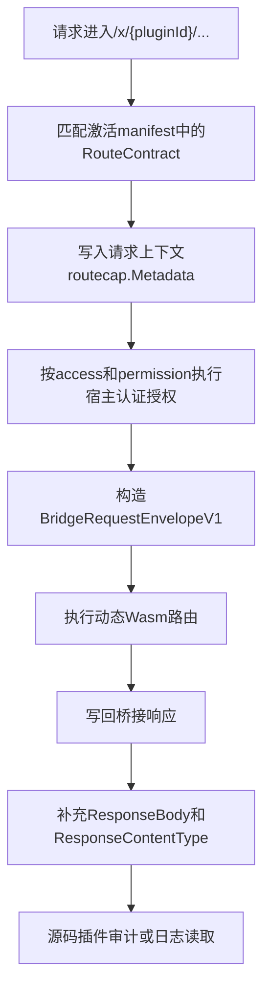

## 基本介绍

`services.Route()`用于读取动态路由请求上的只读元数据。
- 源码插件通过`services.Route().GetMetadata(ctx)`访问宿主在动态路由中间件中写入的`routecap.Metadata`。
- 动态插件通过`plugin.yaml`声明`service: route`和`metadata.get`后，使用`pluginbridge.Default().Route().GetMetadata(ctx)`读取当前`Wasm`执行上下文中的基础调用信息。

该服务主要服务宿主审计、操作记录和动态路由请求后的上下文补充。源码插件注册自己的`HTTP`路由时不需要使用`RouteService`；路由注册通过`pluginhost.Declarations.HTTP().RegisterRoutes`完成。

动态插件的业务路由处理器如果需要读取真实匹配路由、路径参数、查询参数或访问控制信息，应优先使用`BridgeRequestEnvelopeV1.Route`，而不是把`RouteService`当作路由分发表使用。

**能力阶段**：运行期

**类型支持**：源码插件、动态插件

## 能力设计

### 动态路由请求链路

动态路由统一进入宿主固定前缀`/x/{pluginId}/...`。宿主解析插件`ID`和插件内部路径，匹配动态插件激活版本中的`RouteContract`，再把匹配结果写入请求上下文和桥接请求信封：



已安装动态插件的业务请求使用激活版本`manifest`中的路由声明；未安装或非业务入口场景才可能回退到已发现的期望`manifest`。运行期还会检查插件已安装、已启用，并且当前运行状态允许暴露业务入口。

### 源码插件元数据模型

源码插件读取到的是`routecap.Metadata`。该结构来自宿主动态路由中间件写入的匹配信息，响应阶段还会补充桥接响应体和内容类型：

| 字段 | 说明 |
|------|------|
| `PluginID` | 拥有当前动态路由的插件`ID` |
| `Method` | 动态路由声明的`HTTP`方法 |
| `PublicPath` | 宿主对外暴露并匹配的路径 |
| `Tags` | 动态路由声明的标签 |
| `Summary` | 动态路由声明的摘要 |
| `Meta` | 插件自定义路由元数据 |
| `ResponseBody` | 分发器捕获的原始响应体 |
| `ResponseContentType` | 响应内容类型 |

非动态路由、缺少`ghttp.Request`上下文或动态路由尚未完成匹配时，`GetMetadata(ctx)`返回`nil`。返回对象是插件侧视图，不暴露宿主内部运行态对象。

### 动态插件路由信封

动态插件执行路由处理器时，宿主会把完整匹配快照放在`BridgeRequestEnvelopeV1.Route`中：

| 字段 | 说明 |
|------|------|
| `Method` | 当前请求的标准化`HTTP`方法 |
| `PublicPath` | 宿主对外暴露并匹配的完整路径 |
| `InternalPath` | 去掉`/x/{pluginId}`前缀后的插件内部路径 |
| `RoutePath` | 插件路由声明中的原始路径 |
| `Access` | 路由访问模式，支持`public`和`login` |
| `Permission` | 宿主在`login`路由上校验的权限标识 |
| `RequestType` | 生成或反射分发使用的请求绑定名 |
| `PathParams` | 宿主从路由模板中提取的路径参数 |
| `QueryValues` | 按键聚合的查询参数 |

动态插件侧的`Route().GetMetadata(ctx)`走`host:route`宿主服务。当前实现只从`hostCallContext`投影基础信息：`PluginID`、请求绑定的声明路由路径，以及`Meta["executionSource"]`、`Meta["requestId"]`。因此，动态插件处理路由本身时应以请求信封为准。

### 只读数据语义

调用方不能通过该服务修改动态路由、访问控制或响应内容。`ResponseBody`依赖运行时响应写回时的捕获结果，主要供审计和日志兜底使用，不应作为业务数据权威来源。

## 接口定义

### 源码插件接口

| 方法 | 说明 |
|------|------|
| `GetMetadata(ctx context.Context) *routecap.Metadata` | 从当前请求上下文读取动态路由元数据，非动态路由返回`nil` |

### 动态插件接口

动态插件通过`hostServices.route`声明授权的方法。该服务不需要资源声明：

| 动态方法 | 说明 |
|----------|------|
| `metadata.get` | 读取当前宿主调用上下文中的路由元数据投影 |

## 能力使用

### 源码插件使用

源码插件通过`services.Route().GetMetadata(ctx)`读取动态路由元数据，典型场景包括审计日志和操作记录：

```go
// 读取动态路由元数据
meta := services.Route().GetMetadata(ctx)
if meta != nil {
    // 记录审计日志
    log.Infof("动态插件 %s 的路由 %s %s 被访问", meta.PluginID, meta.Method, meta.PublicPath)
}
```

需要在响应完成后记录动态插件返回内容时，应在中间件调用后读取`ResponseBody`和`ResponseContentType`：

```go
r.Middleware.Next()

meta := services.Route().GetMetadata(r.GetCtx())
if meta != nil && meta.ResponseBody != "" {
    log.Infof("动态插件 %s 返回类型 %s", meta.PluginID, meta.ResponseContentType)
}
```

源码插件注册自己的`HTTP`路由时使用`pluginhost.Declarations.HTTP().RegisterRoutes`：

```go
plugin := pluginhost.NewDeclarations("my-author-my-domain-my-cap")
err := plugin.HTTP().RegisterRoutes(
    pluginhost.ExtensionPointHTTPRouteRegister,
    pluginhost.CallbackExecutionModeBlocking,
    registerRoutes,
)
```

### 动态插件使用

动态插件在`plugin.yaml`中声明`route`服务和`metadata.get`方法：

```yaml
hostServices:
  - service: route
    methods:
      - metadata.get
```

动态插件通过`pluginbridge.Default().Route()`客户端调用：

```go
routeSvc := pluginbridge.Default().Route()
meta := routeSvc.GetMetadata(ctx)
if meta != nil {
    requestID := meta.Meta["requestId"]
    log.Infof("当前动态插件调用来源：%s，requestId=%s", meta.Meta["executionSource"], requestID)
}
```

动态插件路由处理器读取匹配路由和参数时，应读取请求信封：

```go
request := pluginbridge.RequestEnvelopeFromContext(ctx)
if request != nil && request.Route != nil {
    routePath := request.Route.RoutePath
    pathID := request.Route.PathParams["id"]
    queryValues := request.Route.QueryValues["keyword"]
    log.Infof("匹配路由 %s，id=%s，keyword=%v", routePath, pathID, queryValues)
}
```

## 设计约束

- **只读能力。** 调用方不能通过`RouteService`注册、修改、启停或重新分发动态路由。
- **非动态路由返回`nil`。** 源码插件使用`GetMetadata(ctx)`前应判空，避免把普通源码插件路由误判为动态插件路由。
- **响应字段有时序要求。** `ResponseBody`和`ResponseContentType`在桥接响应写回时补充；请求前置中间件只能读取路由匹配字段。
- **动态插件以请求信封为准。** 动态插件内的完整路由匹配信息来自`BridgeRequestEnvelopeV1.Route`，`metadata.get`只提供宿主调用上下文投影。
- **授权声明只控制读取元数据。** 动态插件声明`service: route`只表示允许调用`metadata.get`，不会赋予额外路由访问权限。

## 相关服务

- [接口文档能力](/docs/domain-capability-apidoc)
- [插件可用领域能力概览](/docs/domain-capabilities)
- [业务上下文能力](/docs/domain-capability-bizctx)
