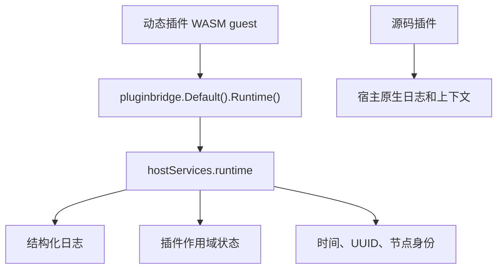

## 基本介绍

`Runtime()`是动态插件专属能力。动态插件运行在`WASM guest`边界内，不能直接使用宿主进程中的日志、时间、节点身份和本地状态实现，因此需要通过`service: runtime`调用宿主提供的运行时原语。

源码插件已经运行在宿主进程内，通常直接使用宿主原生日志、请求上下文和注入的领域服务，不需要`Runtime()`包装。

**能力阶段**：运行期

**类型支持**：动态插件

## 设计思路

### 动态插件专属入口

`Runtime()`位于`pluginbridge.Services`中，不属于`capability.Services`普通领域能力目录。它服务的是动态插件桥接运行环境，而不是业务领域数据读取。



### 与`Infra()`的边界

`Runtime()`读取的是动态插件运行时原语；`Infra()`读取的是基础设施组件状态。两者不能互相替代：

| 能力 | 所属边界 | 主要职责 |
|------|----------|----------|
| `Runtime()` | 动态插件专属能力 | 日志、插件状态、时间、`UUID`和节点身份 |
| `Infra()` | 源码插件和动态插件共享的普通领域能力 | 基础设施组件状态视图 |

如果动态插件需要判断某个基础设施组件是否可用，应声明`service: infra`，而不是把`runtime.info.*`当作组件状态能力。

## 主要能力

| 动态方法 | 动态`SDK`方法 | 说明 |
|----------|-------------|------|
| `log.write` | `Runtime().Log` | 写一条结构化运行时日志 |
| `state.get` | `Runtime().StateGet`、`Runtime().StateGetInt` | 读取插件作用域运行状态 |
| `state.set` | `Runtime().StateSet`、`Runtime().StateSetInt` | 写入插件作用域运行状态 |
| `state.delete` | `Runtime().StateDelete` | 删除插件作用域运行状态 |
| `info.now` | `Runtime().Now` | 读取宿主时间字符串 |
| `info.uuid` | `Runtime().UUID` | 生成宿主侧唯一标识 |
| `info.node` | `Runtime().Node` | 读取当前宿主节点身份 |

`runtime`是`none`资源类型，不声明`paths`、`tables`、`keys`或`resources`。授权边界由`service + method`控制。

## 能力使用

动态插件在`plugin.yaml`中声明`runtime`服务：

```yaml
hostServices:
  - service: runtime
    methods:
      - log.write
      - state.get
      - state.set
      - state.delete
      - info.now
      - info.uuid
      - info.node
```

在动态插件侧通过`pluginbridge.Default().Runtime()`调用：

```go
runtime := pluginbridge.Default().Runtime()

err := runtime.Log(protocol.LogLevelInfo, "export started", map[string]string{
    "taskID": taskID,
})
if err != nil {
    return err
}

now, err := runtime.Now()
if err != nil {
    return err
}

err = runtime.StateSet("last_export_time", now)
if err != nil {
    return err
}

lastExport, found, err := runtime.StateGet("last_export_time")
if err != nil {
    return err
}

id, err := runtime.UUID()
if err != nil {
    return err
}

node, err := runtime.Node()
```

## 设计约束

- **动态插件专属。** `Runtime()`只存在于`pluginbridge`动态`SDK`中，不进入源码插件的`capability.Services`目录。
- **运行状态不是缓存替代品。** `runtime.state.*`适合保存少量插件作用域状态；跨插件共享、计数器和过期策略应使用[缓存能力](/docs/domain-capability-cache)。
- **日志字段应短小稳定。** 动态插件写日志时不要把大正文、密钥、令牌或个人敏感信息放入字段。
- **信息读取不是健康检查。** `info.now`、`info.uuid`和`info.node`只提供运行时基础信息，不表达组件可用性。
- **基础设施状态走`Infra()`。** 组件状态读取应使用[基础设施能力](/docs/domain-capability-infra)和`service: infra`。

## 相关服务

- [基础设施能力](/docs/domain-capability-infra)
- [缓存能力](/docs/domain-capability-cache)
- [动态插件与WASM运行时](/docs/wasm-plugins)
- [插件可用领域能力概览](/docs/domain-capabilities)
