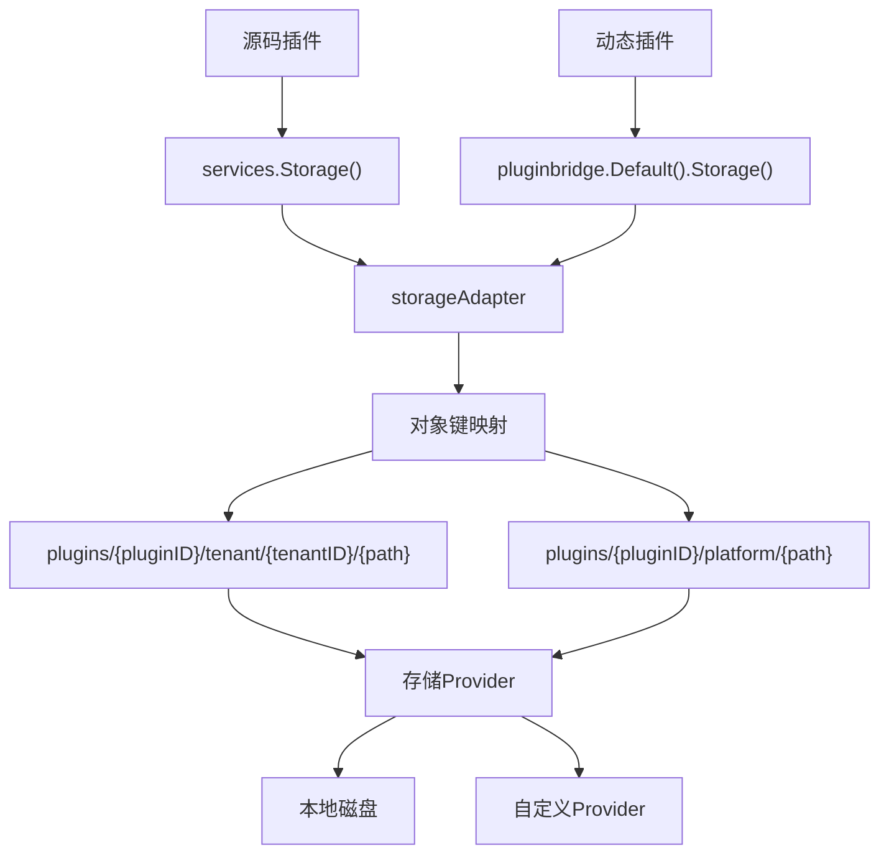
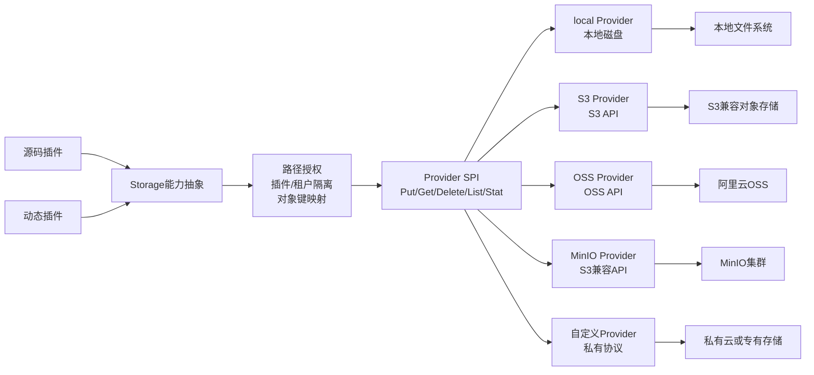

## 基本介绍

`Storage`能力为每个插件提供独立的对象存储沙箱。插件在声明的授权路径前缀下读写对象，宿主负责路径校验、插件隔离和存储后端管理。

- 源码插件通过`services.Storage()`使用对象存储能力。
- 动态插件通过`plugin.yaml`声明`service: storage`后使用`pluginbridge.Default().Storage()`客户端。

**能力阶段**：运行期

**类型支持**：源码插件、动态插件

## 能力设计

### 沙箱隔离模型

`Storage`采用插件+租户的双重隔离。每个插件的对象自动限定在`plugins/{pluginID}/`前缀下，租户数据进一步隔离在`tenant/{tenantID}/`子路径中。平台级数据使用`platform/`子路径：



### 对象键映射

插件使用的逻辑路径会由`storageAdapter`自动映射为物理存储对象键，映射规则如下：

| 范围 | 对象键格式 |
|------|-----------|
| 租户级 | `plugins/{pluginID}/tenant/{tenantID}/{logicalPath}` |
| 平台级 | `plugins/{pluginID}/platform/{logicalPath}` |

插件只需操作逻辑路径（如`exports/report.csv`），无需关心底层对象键结构。

### 对象元数据

插件可见的对象元数据不暴露物理存储路径、`Provider`密钥或宿主文件管理ID：

| 字段 | 说明 |
|------|------|
| `Path` | 逻辑路径 |
| `Size` | 对象大小 |
| `ContentType` | 内容类型 |
| `ETag` | 实实体标签，由`SHA-1(key + size + modtime)`计算生成 |
| `UpdatedAt` | 最后更新时间 |
| `Visibility` | 可见性标识，`private`或`public` |

对象可见性由宿主控制，`Visibility`字段标识对象是否可公开服务。插件不能假设写入后必然公网可见，具体访问策略由宿主的服务层决定。

### 内容类型检测

写入对象时，`storageAdapter`按以下优先级检测内容类型：

1. 请求中显式指定的`contentType`
2. 正文嗅探（读取前`512`字节进行检测）
3. 文件扩展名推断
4. 兜底为`application/octet-stream`

### 存储Provider架构

`Storage`支持可插拔的存储`Provider`架构：

从插件视角看，`Storage`是一层稳定的对象存储抽象。插件只依赖逻辑路径和统一的对象操作方法，不直接耦合`S3`、`OSS`、`MinIO`、本地磁盘或私有存储协议。不同协议的实现通过`Provider`接入，宿主在委托给后端前继续负责路径授权、插件/租户隔离和对象键映射。



| Provider | 说明 |
|--------|------|
| `local` | 内置本地磁盘`Provider`，存储在`.capability-storage/`目录下 |
| 自定义 | 通过`Provide()`注册的插件`Provider`，支持`OSS`、`S3`、`MinIO`等 |

`Provider`通过`plugin.storage.activeProviderPluginId`配置选择。未配置时使用本地`Provider`。集群模式下本地`Provider`默认拒绝服务，需显式设置`allowLocalProviderInCluster`。

#### Provider注册机制

`Provider`通过进程级全局注册表管理。源码插件调用`storagecap.Provide(pluginID, factory)`注册一个`ProviderFactory`函数，宿主在运行时通过`ResolveProvider`解析当前活跃的`Provider`：

- 未配置`activeProviderPluginId`时，使用内置本地`Provider`
- 配置了`activeProviderPluginId`时，必须匹配已注册且可用的插件`Provider`，不存在静默降级

### 与Files能力的区别

| 维度 | Files | Storage |
|:------:|-------|---------|
| **用途** | 宿主文件管理系统的只读视图 | 插件作用域的对象存储沙箱 |
| **数据库** | `sys_file`表，完整元数据 | 无数据库，纯对象存储 |
| **隔离** | 租户+数据范围 | 插件+租户路径隔离 |
| **操作** | 只读视图+受控删除 | 完整`CRUD` |
| **大小限制** | 由`upload.maxSize`配置 | 无限制 |
| **Provider** | 内置本地存储 | 可插拔`Provider`注册 |

## 接口定义

### 源码插件接口

| 方法 | 说明 |
|------|------|
| `Put` | 写入对象，支持`ContentType`和`Overwrite`控制 |
| `Get` | 读取对象内容和元数据 |
| `Delete` | 删除授权路径下的对象 |
| `DeleteMany` | 批量删除授权路径下的对象 |
| `List` | 按前缀列出对象 |
| `ListCursor` | 按前缀列出对象，支持游标分页 |
| `Stat` | 读取对象元数据，不返回内容 |
| `BatchStat` | 批量读取对象元数据 |
| `ProviderStatuses` | 查询所有注册的`Provider`状态（仅源码插件可用） |

`Put`的`Overwrite`参数控制覆盖行为：设为`false`时，若对象已存在则返回`PLUGIN_STORAGE_OBJECT_EXISTS`错误。

### 动态插件接口

| 动态方法 | 动态`SDK`方法 | 说明 |
|----------|-------------|------|
| `put` | `Storage().Put` | 写入对象，支持`ContentType`和`Overwrite`控制 |
| `put.init` | — | 初始化分块上传会话，返回上传ID |
| `put.chunk` | — | 按偏移量顺序写入分块数据 |
| `put.commit` | — | 提交分块上传，合并为最终对象 |
| `put.abort` | — | 取消分块上传，清理临时文件 |
| `get` | `Storage().Get` | 读取对象内容和元数据 |
| `delete` | `Storage().Delete` | 删除授权路径下的对象 |
| `delete_many` | `Storage().DeleteMany` | 批量删除授权路径下的对象 |
| `list` | `Storage().List` | 按前缀列出对象 |
| `list_cursor` | `Storage().ListCursor` | 按前缀列出对象，支持游标分页 |
| `stat` | `Storage().Stat` | 读取对象元数据，不返回内容 |
| `batch_stat` | `Storage().BatchStat` | 批量读取对象元数据 |

动态插件的`Guest SDK`在写入时自动选择模式：对象体不超过`1 MB`使用直接上传（单次调用），超过`1 MB`或大小未知时自动切换为分块上传（`1 MB`分块）。分块上传的宿主侧最大分块为`4 MB`，会话有效期`15`分钟。分块失败时自动尝试`abort`清理临时文件。

`ProviderStatuses`不可通过动态插件传输协议使用。

## 能力使用

### 源码插件使用

源码插件通过`services.Storage()`直接操作对象：

```go
// 写入对象
_, err := services.Storage().Put(ctx, storagecap.PutInput{
    Path:        "exports/report.csv",
    Body:        reader,
    ContentType: "text/csv",
    Overwrite:   true,
})

// 读取对象
output, err := services.Storage().Get(ctx, storagecap.GetInput{
    Path: "exports/report.csv",
})

// 删除对象
err := services.Storage().Delete(ctx, storagecap.DeleteInput{
    Path: "exports/report.csv",
})

// 批量删除对象
err := services.Storage().DeleteMany(ctx, storagecap.DeleteManyInput{
    Paths: []string{"exports/report1.csv", "exports/report2.csv"},
})

// 列出对象
list, err := services.Storage().List(ctx, storagecap.ListInput{
    Prefix: "exports/",
    Limit:  100,
})

// 游标分页列出对象
cursorList, err := services.Storage().ListCursor(ctx, storagecap.ListCursorInput{
    Prefix: "exports/",
    Cursor: lastCursor,
    Limit:  100,
})

// 查询对象元数据
stat, err := services.Storage().Stat(ctx, storagecap.StatInput{
    Path: "exports/report.csv",
})

// 批量查询对象元数据
batchStat, err := services.Storage().BatchStat(ctx, storagecap.BatchStatInput{
    Paths: []string{"exports/report1.csv", "exports/report2.csv"},
})

// 查询Provider状态
statuses, err := services.Storage().ProviderStatuses(ctx)
```

### 动态插件使用

动态插件在`plugin.yaml`中声明`storage`服务和授权路径：

```yaml
hostServices:
  - service: storage
    methods:
      - put
      - get
      - delete
      - delete_many
      - list
      - list_cursor
      - stat
      - batch_stat
    resources:
      paths:
        - exports/
        - temp/reports/
```

授权粒度是逻辑路径前缀。所有请求路径会在`WASM`宿主服务层进行归一化和授权校验，确保插件只能访问声明的路径范围。

在动态插件侧使用：

```go
storageSvc := pluginbridge.Default().Storage()

// 写入对象（小对象直接上传）
_, err := storageSvc.Put(ctx, storagecap.PutInput{
    Path:        "exports/report-2024.csv",
    Body:        data,
    ContentType: "text/csv",
})

// 读取对象
output, err := storageSvc.Get(ctx, storagecap.GetInput{
    Path: "exports/report-2024.csv",
})

// 删除对象
err := storageSvc.Delete(ctx, storagecap.DeleteInput{
    Path: "exports/report-2024.csv",
})

// 批量删除对象
err := storageSvc.DeleteMany(ctx, storagecap.DeleteManyInput{
    Paths: []string{"exports/report1.csv", "exports/report2.csv"},
})

// 列出对象
list, err := storageSvc.List(ctx, storagecap.ListInput{
    Prefix: "exports/",
})

// 游标分页列出对象
cursorList, err := storageSvc.ListCursor(ctx, storagecap.ListCursorInput{
    Prefix: "exports/",
    Cursor: lastCursor,
    Limit:  100,
})

// 查询对象元数据
stat, err := storageSvc.Stat(ctx, storagecap.StatInput{
    Path: "exports/report-2024.csv",
})

// 批量查询对象元数据
batchStat, err := storageSvc.BatchStat(ctx, storagecap.BatchStatInput{
    Paths: []string{"exports/report1.csv", "exports/report2.csv"},
})
```

## 系统约束

| 约束项 | 限制 |
|--------|------|
| 单对象大小 | 无限制 |
| 逻辑路径长度 | `512`字节 |
| 列举默认限制 | `100`条 |
| 列举最大限制 | `1000`条 |
| 直接上传阈值 | `1 MB`（Guest SDK自动切换分块） |
| 分块大小（Guest） | `1 MB` |
| 分块大小（宿主） | `4 MB` |
| 分块会话有效期 | `15`分钟 |

## 设计约束

- **路径不是物理路径。** `paths`是逻辑授权范围，插件不能通过相对路径逃逸授权前缀。`WASM`宿主服务层对每个请求路径进行归一化和授权校验。
- **对象可见性由宿主控制。** 对象是否可公开服务由宿主元数据和后续服务策略决定，插件不能假设写入后必然公网可见。
- **不暴露底层细节。** 对象元数据不包含物理路径、`Provider`密钥或宿主文件管理ID。
- **插件卸载自动清理。** 插件卸载时，宿主按授权路径前缀列举并批量删除所有对象。
- **Provider无静默降级。** 配置了自定义`Provider`后，若该`Provider`不可用，操作直接失败而非回退到本地`Provider`。

## 相关服务

- [Files能力](/docs/domain-capability-files)
- [清单资源能力](/docs/domain-capability-manifest)
- [数据记录能力](/docs/domain-capability-recordstore)
