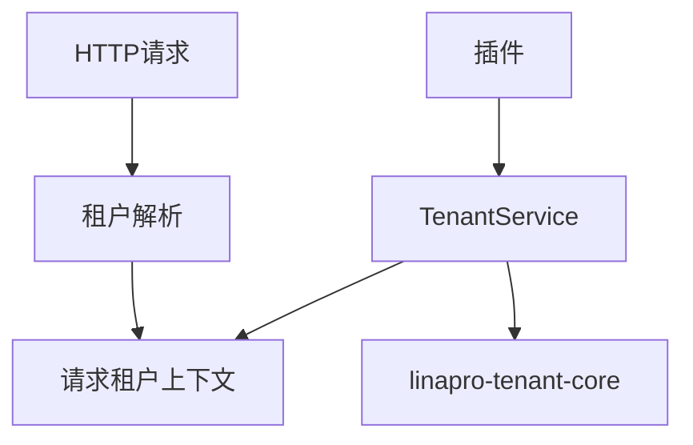
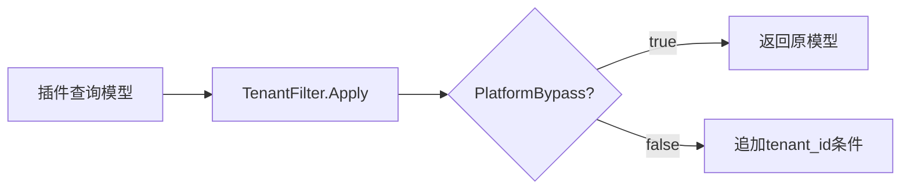

## 基本介绍

源码插件通过`services.Tenant()`消费普通租户能力。租户能力是可选框架能力，官方提供方插件标识为`linapro-tenant-core`。没有活跃提供方时，服务会降级到平台租户`0`的单租户语义。

动态插件可声明`service: tenant`调用已发布的租户能力方法。

**能力阶段**：运行期

**类型支持**：源码插件、动态插件

## 能力设计

### SPI模式

`Tenant`能力采用`SPI`模式，具体多租户策略由提供方插件实现。`tenantcap.Provider`负责租户解析、用户租户关系校验、用户可见租户列表和租户切换校验。`tenantcap.Resolver`负责从`HTTP`请求解析租户身份，可以按请求头、域名、路径、令牌或其他策略组成责任链。



### 安全降级

当没有租户提供方时，系统会降级为平台租户的单租户模式。普通`Tenant()`不会暴露`RequestResolver`、`ScopeService`、用户租户成员关系写入或启动一致性检查等接口，这些属于宿主内部的中间件、数据库过滤或治理流程。

### 源码插件专属：TenantFilter

源码插件如果需要查询插件自有表，可以通过`pluginhost.Services.TenantFilter()`获取`tenantcap.PluginTableFilterService`。它属于租户领域能力，但不属于普通`capability.Services.Tenant()`；原因是它直接接收并返回`*gdb.Model`查询构建器，只适合运行在宿主进程内的源码插件使用。

| 方法 | 说明 |
|------|------|
| `Context` | 返回当前请求的租户、用户、真实操作者、模拟状态和平台绕过信息 |
| `Apply` | 向查询模型追加`tenant_id`条件；当前请求允许平台绕过时返回原模型 |

`TenantFilterContext`包含`UserID`、`TenantID`、`ActingUserID`、`OnBehalfOfTenantID`、`ActingAsTenant`、`IsImpersonation`和`PlatformBypass`。其中`ActingUserID`适合写入审计记录，`PlatformBypass`由宿主策略判定，插件不应自行构造。



动态插件不使用`TenantFilter()`。动态插件访问插件自有表时应声明`service: data`和授权`resources.tables`，由宿主`data`服务执行租户、授权和表命名空间治理。

## 接口定义

### 源码插件接口

| 方法 | 说明 |
|------|------|
| `Available` | 判断租户能力是否有可用提供方 |
| `Status` | 返回能力状态、活跃提供方和冲突原因 |
| `Current` | 返回当前请求租户，缺失时返回平台租户 |
| `PlatformBypass` | 判断当前请求是否允许绕过租户过滤 |
| `EnsureTenantVisible` | 校验当前用户是否可访问指定租户 |
| `ValidateUserInTenant` | 校验指定用户是否属于指定租户 |
| `ListUserTenants` | 列出用户可见的活跃租户 |
| `SwitchTenant` | 校验租户切换目标是否合法 |

源码插件专属接口（通过`pluginhost.Services.TenantFilter()`访问）：

| 方法 | 说明 |
|------|------|
| `Context` | 返回当前请求的租户上下文信息 |
| `Apply` | 向查询模型追加`tenant_id`条件 |

### 动态插件接口

| 动态方法 | 说明 |
|----------|------|
| `capability.available` | 判断租户能力是否有可用提供方 |
| `capability.status` | 返回能力状态和活跃提供方 |
| `tenants.current` | 返回当前请求租户 |
| `tenants.platform_bypass` | 判断是否允许绕过租户过滤 |
| `tenants.visible.ensure` | 校验当前用户是否可访问指定租户 |
| `users.tenant_membership.validate` | 校验指定用户是否属于指定租户 |
| `users.tenants.list` | 列出用户可见的活跃租户 |
| `tenants.switch.validate` | 校验租户切换目标是否合法 |

## 能力使用

### 源码插件使用

源码插件通过`services.Tenant()`访问普通租户能力：

```go
// 检查租户能力是否可用
if !services.Tenant().Available(ctx) {
    // 降级处理
    return
}

// 获取当前租户
tenant := services.Tenant().Current(ctx)

// 校验租户可见性
err := services.Tenant().EnsureTenantVisible(ctx, targetTenantID)

// 列出用户可见租户
tenants, err := services.Tenant().ListUserTenants(ctx, userID)
```

源码插件使用`TenantFilter()`给插件自有表追加租户过滤：

```go
model := g.DB().Model("plugin_record")
model = services.TenantFilter().Apply(ctx, model, "")
result, err := model.Where("status", "active").All()
```

`Apply`的第三个参数是表名或别名限定符：

| `qualifier` | 结果 |
|-------------|------|
| 空字符串 | 使用`tenant_id` |
| `plugin_record` | 使用`plugin_record.tenant_id` |
| `r` | 使用`r.tenant_id` |

### 动态插件使用

动态插件在`plugin.yaml`中声明`tenant`服务和授权方法：

```yaml
hostServices:
  - service: tenant
    methods:
      - tenants.current
      - tenants.visible.ensure
      - users.tenants.list
```

`tenant`是`none`资源类型，不声明`paths`、`tables`、`keys`或`resources`。在动态插件侧使用：

```go
tenantSvc := pluginbridge.Default().Tenant()

// 获取当前租户
tenant := tenantSvc.Current(ctx)

// 校验租户可见性
err := tenantSvc.EnsureTenantVisible(ctx, targetTenantID)

// 列出用户可见租户
tenants, err := tenantSvc.ListUserTenants(ctx, userID)
```

动态插件访问插件自有表时，应声明`service: data`和授权`resources.tables`，由宿主数据服务执行租户边界治理。

## 设计约束

- **能力可选。** 没有租户提供方时，系统按平台租户单租户模式降级。
- **查询过滤不在普通服务中。** 需要数据库查询构建器的租户范围能力是宿主内部`ScopeService`或源码插件专属`TenantFilter()`。
- **`TenantFilter()`只用于插件自有表。** 不要用它操作宿主核心表，也不要在插件代码里手写不一致的租户条件。
- **联合查询要传限定符。** 当多个表都包含`tenant_id`时，应传入表名或别名，避免列名歧义。
- **租户切换只做校验。** `SwitchTenant`校验目标合法性，重新签发令牌仍由`Auth().Token().SwitchTenant`完成。
- **平台绕过由宿主判定。** 插件不应自行构造跨租户访问状态。

## 相关服务

- [Auth能力](/docs/domain-capability-auth)
- [Org能力](/docs/domain-capability-org)
- [数据记录能力](/docs/domain-capability-recordstore)
