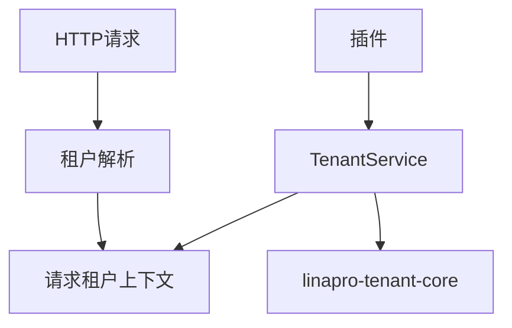
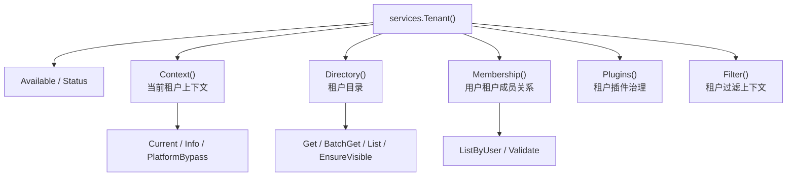

## 基本介绍

源码插件通过`services.Tenant()`消费租户能力。租户能力是可选框架能力，官方提供方插件标识为`linapro-tenant-core`。没有活跃提供方时，服务会降级到平台租户`0`的单租户语义。

`Tenant`能力采用子服务模式，聚合`Context()`（当前租户上下文）、`Directory()`（租户目录）、`Membership()`（用户租户成员关系）、`Plugins()`（租户插件治理）和`Filter()`（租户过滤上下文）。

动态插件可声明`service: tenant`调用已发布的租户能力方法。

**能力阶段**：运行期

**类型支持**：源码插件、动态插件

## 能力设计

### SPI模式

`Tenant`能力采用`SPI`模式，具体多租户策略由提供方插件实现。`tenantcap.Provider`负责租户解析、用户租户关系校验、用户可见租户列表和租户切换校验。`tenantcap.Resolver`负责从`HTTP`请求解析租户身份，可以按请求头、域名、路径、令牌或其他策略组成责任链。



### 子服务体系

`Tenant`能力采用子服务模式，分别处理不同租户领域操作：



### 安全降级

当没有租户提供方时，系统会降级为平台租户的单租户模式。`Tenant()`不会暴露`RequestResolver`、`ScopeService`、用户租户成员关系写入或启动一致性检查等接口，这些属于宿主内部的中间件、数据库过滤或治理流程。

## 接口定义

### 源码插件接口

**`Tenant()`根方法：**

| 方法 | 说明 |
|------|------|
| `Available` | 判断租户能力是否有可用提供方 |
| `Status` | 返回能力状态、活跃提供方和冲突原因 |
| `Context()` | 返回当前租户上下文子服务 |
| `Directory()` | 返回租户目录子服务 |
| `Membership()` | 返回用户租户成员关系子服务 |
| `Plugins()` | 返回租户插件治理子服务 |
| `Filter()` | 返回租户过滤上下文子服务 |

**`Tenant().Context()`子服务：**

| 方法 | 说明 |
|------|------|
| `Current` | 返回当前请求租户标识，缺失时返回平台租户 |
| `Info` | 返回当前请求租户信息，包含`ID`、`Code`、`Name`和`Status` |
| `PlatformBypass` | 判断当前请求是否允许绕过租户过滤 |

**`Tenant().Directory()`子服务：**

| 方法 | 说明 |
|------|------|
| `Get` | 读取单个可见租户信息 |
| `BatchGet` | 批量读取可见租户信息，返回`BatchResult` |
| `List` | 按关键词搜索可见租户候选 |
| `EnsureVisible` | 校验当前用户是否可访问指定租户集合 |

**`Tenant().Membership()`子服务：**

| 方法 | 说明 |
|------|------|
| `ListByUser` | 列出用户可见的活跃租户 |
| `Validate` | 校验指定用户是否属于指定租户 |

**`Tenant().Plugins()`子服务：**

| 方法 | 说明 |
|------|------|
| `SetTenantPluginEnabled` | 更新租户插件启用状态，经过调用方和租户策略校验 |
| `ProvisionTenantPluginDefaults` | 为租户创建缺失的默认插件行 |

**`Tenant().Filter()`子服务（源码插件专属）：**

| 方法 | 说明 |
|------|------|
| `Context` | 返回当前请求的租户、用户、真实操作者、模拟状态和平台绕过信息 |

源码插件专属接口（通过`pluginhost.Services.TenantFilter()`访问）：

| 方法 | 说明 |
|------|------|
| `Context` | 返回当前请求的租户上下文信息 |
| `Apply` | 向查询模型追加`tenant_id`条件 |

### 动态插件接口

| 动态方法 | 说明 |
|----------|------|
| `capability.available` | 判断租户能力是否有可用提供方 |
| `capability.status` | 返回能力状态和活跃提供方 |
| `tenants.current` | 返回当前请求租户标识 |
| `tenants.current_info` | 返回当前请求租户信息 |
| `tenants.platform_bypass` | 判断是否允许绕过租户过滤 |
| `tenants.visible.ensure` | 校验当前用户是否可访问指定租户 |
| `tenants.batch_get` | 批量读取可见租户信息 |
| `tenants.search` | 按关键词搜索可见租户候选 |
| `tenants.visible.batch_ensure` | 批量校验当前用户可访问指定租户 |
| `users.tenant_membership.validate` | 校验指定用户是否属于指定租户 |
| `users.tenants.list` | 列出用户可见的活跃租户 |
| `users.tenants.batch_list` | 批量读取用户可访问租户列表 |
| `tenants.switch.validate` | 校验租户切换目标是否合法 |

## 能力使用

### 源码插件使用

源码插件通过`services.Tenant()`访问普通租户能力：

```go
// 检查租户能力是否可用
if !services.Tenant().Available(ctx) {
    // 降级处理
    return
}

// 获取当前租户标识
tenantID := services.Tenant().Context().Current(ctx)

// 获取当前租户信息
tenantInfo, err := services.Tenant().Context().Info(ctx)

// 判断平台绕过
bypass := services.Tenant().Context().PlatformBypass(ctx)

// 校验租户可见性
err := services.Tenant().Directory().EnsureVisible(ctx, []tenantcap.TenantID{targetTenantID})

// 列出用户可见租户
tenants, err := services.Tenant().Membership().ListByUser(ctx, userID)

// 批量读取租户信息
batchResult, err := services.Tenant().Directory().BatchGet(ctx, tenantIDs)

// 搜索租户候选
page, err := services.Tenant().Directory().List(ctx, tenantcap.ListInput{
    Keyword: "科技",
    Page:    pageRequest,
})

// 校验用户租户成员关系
err := services.Tenant().Membership().Validate(ctx, userID, targetTenantID)
```

源码插件通过`Filter().Context()`获取租户过滤上下文，用于自行构建查询条件：

```go
filterCtx := services.Tenant().Filter().Context(ctx)
if filterCtx.TenantID > 0 {
    model = model.Where("tenant_id", filterCtx.TenantID)
}
if filterCtx.IsImpersonation {
    // 记录模拟登录审计
    log.Infof("模拟用户 %d 访问租户 %d", filterCtx.ActingUserID, filterCtx.TenantID)
}
```

### 动态插件使用

动态插件在`plugin.yaml`中声明`tenant`服务和授权方法：

```yaml
hostServices:
  - service: tenant
    methods:
      - tenants.current
      - tenants.current_info
      - tenants.visible.ensure
      - tenants.batch_get
      - tenants.search
      - users.tenants.list
      - users.tenants.batch_list
```

`tenant`是`none`资源类型，不声明`paths`、`tables`、`keys`或`resources`。在动态插件侧使用：

```go
tenantSvc := pluginbridge.Default().Tenant()

// 获取当前租户标识
tenantID := tenantSvc.Context().Current(ctx)

// 获取当前租户信息
tenantInfo, err := tenantSvc.Context().Info(ctx)

// 校验租户可见性
err := tenantSvc.Directory().EnsureVisible(ctx, []tenantcap.TenantID{targetTenantID})

// 列出用户可见租户
tenants, err := tenantSvc.Membership().ListByUser(ctx, userID)

// 批量读取租户信息
batchResult, err := tenantSvc.Directory().BatchGet(ctx, tenantIDs)

// 搜索租户候选
page, err := tenantSvc.Directory().List(ctx, tenantcap.ListInput{
    Keyword: "科技",
    Page:    pageRequest,
})
```

动态插件访问插件自有表时，应声明`service: data`和授权`resources.tables`，由宿主数据服务执行租户边界治理。

## 设计约束

- **能力可选。** 没有租户提供方时，系统按平台租户单租户模式降级。
- **查询过滤不在普通服务中。** 需要数据库查询构建器的租户范围能力是宿主内部`ScopeService`。
- **`Filter().Context()`返回只读上下文。** 插件根据返回的`TenantFilterContext`自行构建查询条件，不要用它操作宿主核心表。
- **租户切换只做校验。** `Membership().Validate`校验目标合法性，重新签发令牌仍由`Auth().Token().SwitchTenant`完成。
- **平台绕过由宿主判定。** 插件不应自行构造跨租户访问状态。

## 相关服务

- [Auth能力](/docs/domain-capability-auth)
- [Org能力](/docs/domain-capability-org)
- [数据记录能力](/docs/domain-capability-recordstore)
