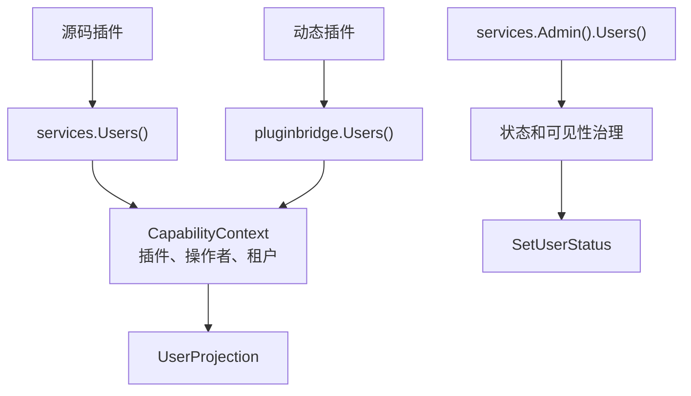

## 基本介绍

源码插件通过`services.Users()`读取用户领域视图，动态插件通过`plugin.yaml`声明`service: users`后使用`pluginbridge.Default().Users()`客户端访问。该能力只返回插件可见的展示字段，不会暴露`sys_user`表、用户实体、密码字段、角色关系或宿主`DAO`。

需要改变用户生命周期状态时，可信源码插件通过`services.Admin().Users().SetUserStatus`执行受管控的管理命令。普通`Users()`保持只读。

**能力阶段**：运行期

**类型支持**：源码插件、动态插件

## 能力设计

### 用户视图模型

用户视图用于展示、候选选择和审计上下文，不是宿主用户实体。缺失结果不会透露目标用户是不存在、不可见还是被拒绝：

| 字段 | 说明 |
|------|------|
| `ID` | 用户领域标识 |
| `Username` | 稳定登录名 |
| `Nickname` | 展示名称 |
| `Avatar` | 头像`URL`或受保护文件引用 |
| `Status` | 用户生命周期状态 |
| `TenantID` | 用户所属租户标识 |
| `LabelKey`、`Label` | 合成用户或特殊用户的可选本地化标签 |

### 读写分离设计

用户能力遵循读写分离模式：普通`Users()`提供只读视图能力，`Admin().Users()`提供受管控的写入命令。组织信息不在用户能力中维护，部门、岗位等可选组织视图来自`Org`能力。



## 接口定义

### 源码插件接口

| 入口 | 方法 | 说明 |
|------|------|------|
| `Users()` | `BatchGetUsers` | 批量读取可见用户视图，返回`BatchResult` |
| `Users()` | `SearchUsers` | 按关键词和分页条件搜索可见用户候选 |
| `Users()` | `EnsureUsersVisible` | 校验目标用户集合对当前调用上下文可见 |
| `Admin().Users()` | `SetUserStatus` | 改变一个可见用户的生命周期状态 |

### 动态插件接口

动态插件通过`hostServices.users`声明授权的只读方法：

| 动态方法 | 说明 |
|----------|------|
| `users.batch_get` | 批量读取可见用户视图 |
| `users.search` | 按关键词和分页条件搜索可见用户候选 |
| `users.visible.ensure` | 校验目标用户集合对当前调用上下文可见 |

## 能力使用

### 源码插件使用

源码插件通过`services.Users()`读取用户视图，并显式传入领域要求的`CapabilityContext`：

```go
// 批量读取用户视图
result, err := services.Users().BatchGetUsers(ctx, capabilityCtx, userIDs)

// 搜索可见用户候选
page, err := services.Users().SearchUsers(ctx, capabilityCtx, usercap.SearchInput{
    Keyword: keyword,
    Page:    pageRequest,
})

// 校验用户可见性
err := services.Users().EnsureUsersVisible(ctx, capabilityCtx, userIDs)
```

可信源码插件执行用户状态管理：

```go
err := services.Admin().Users().SetUserStatus(ctx, capabilityCtx, userID, newStatus)
```

### 动态插件使用

动态插件在`plugin.yaml`中声明所需的`users`只读方法：

```yaml
hostServices:
  - service: users
    methods:
      - users.batch_get
      - users.search
```

动态插件通过`pluginbridge.Default().Users()`客户端调用：

```go
usersSvc := pluginbridge.Default().Users()

// 批量读取用户视图
result, err := usersSvc.BatchGetUsers(ctx, capabilityCtx, userIDs)

// 搜索可见用户候选
page, err := usersSvc.SearchUsers(ctx, capabilityCtx, usercap.SearchInput{
    Keyword: keyword,
    Page:    pageRequest,
})
```

## 设计约束

- **不暴露宿主存储。** 插件无法通过用户能力访问密码、盐值、角色表、菜单表或原始`sys_user`记录。
- **搜索必须有界。** `SearchUsers`使用`PageRequest`限制结果规模，避免插件拉取完整用户表。
- **可见性失败不透露具体原因。** `EnsureUsersVisible`只表达当前调用不可继续，不会向普通插件暴露具体拒绝原因。
- **状态值由宿主领域定义。** 插件不应发明未被宿主状态机接受的用户状态。

## 相关服务

- [Auth能力](/docs/domain-capability-auth)
- [Org能力](/docs/domain-capability-org)
- [Tenant能力](/docs/domain-capability-tenant)
