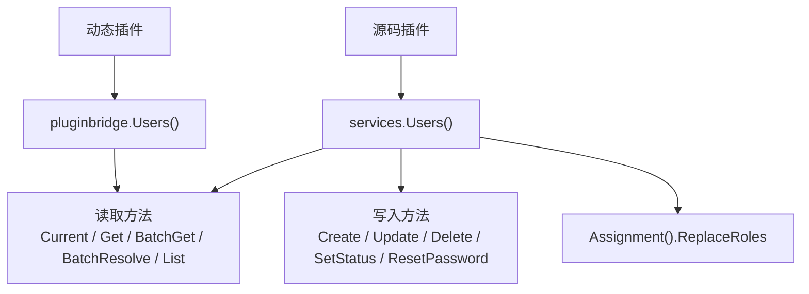

## 基本介绍

源码插件通过`services.Users()`访问用户领域能力，动态插件通过`plugin.yaml`声明`service: users`后使用`pluginbridge.Default().Users()`客户端访问。该能力只返回插件可见的展示字段，不会暴露`sys_user`表、用户实体、密码字段、角色关系或宿主`DAO`。

**能力阶段**：运行期

**类型支持**：源码插件、动态插件

## 能力设计

### 用户视图模型

用户视图用于展示、候选选择和审计上下文，不是宿主用户实体。缺失结果不会透露目标用户是不存在、不可见还是被拒绝：

| 字段 | 说明 |
|------|------|
| `ID` | 用户领域标识 |
| `Username` | 稳定登录名 |
| `Nickname` | 展示名称 |
| `Avatar` | 头像`URL`或受保护文件引用 |
| `Status` | 用户生命周期状态 |
| `TenantID` | 用户所属租户标识 |
| `LabelKey`、`Label` | 合成用户或特殊用户的可选本地化标签 |

### 读写能力设计

用户能力同时提供读取和写入方法：读取方法（`Current`、`Get`、`BatchGet`、`BatchResolve`、`List`）返回受保护视图；写入方法（`Create`、`Update`、`Delete`、`SetStatus`、`ResetPassword`、`Assignment().ReplaceRoles`）经过可见性、租户边界、状态机和审计校验后执行。组织信息不在用户能力中维护，部门、岗位等可选组织视图来自`Org`能力。



## 接口定义

### 源码插件接口

| 方法 | 说明 |
|------|------|
| `Current` | 返回当前操作者的可见用户视图 |
| `Get` | 读取单个可见用户视图 |
| `BatchGet` | 批量读取可见用户视图，返回`BatchResult` |
| `BatchResolve` | 按用户`ID`、用户名、邮箱或手机号批量解析可见用户 |
| `List` | 按关键词和分页条件搜索可见用户候选 |
| `EnsureVisible` | 校验目标用户集合对当前调用上下文可见 |
| `Create` | 创建用户，经过用户名唯一性、租户边界和角色校验 |
| `Update` | 更新可见用户信息，经过目标可见性和租户边界校验 |
| `Delete` | 删除可见用户，经过目标可见性和租户边界校验 |
| `SetStatus` | 改变一个可见用户的生命周期状态 |
| `ResetPassword` | 重置一个可见用户的密码 |
| `Assignment().ReplaceRoles` | 替换一个可见用户的角色关联 |

### 动态插件接口

动态插件通过`hostServices.users`声明授权的只读方法：

| 动态方法 | 说明 |
|----------|------|
| `users.current` | 返回当前操作者的可见用户视图 |
| `users.batch_get` | 批量读取可见用户视图 |
| `users.batch_resolve` | 按用户`ID`、用户名、邮箱或手机号批量解析可见用户 |
| `users.list` | 按关键词和分页条件搜索可见用户候选 |
| `users.visible.ensure` | 校验目标用户集合对当前调用上下文可见 |

## 能力使用

### 源码插件使用

源码插件通过`services.Users()`访问用户能力：

```go
// 获取当前操作者用户视图
current, err := services.Users().Current(ctx)

// 批量读取用户视图
result, err := services.Users().BatchGet(ctx, userIDs)

// 按多种维度批量解析用户
resolveResult, err := services.Users().BatchResolve(ctx, usercap.BatchResolveInput{
    IDs:       userIDs,
    Usernames: usernames,
    Contacts:  emails,
})

// 搜索可见用户候选
page, err := services.Users().List(ctx, usercap.ListInput{
    Keyword: keyword,
    Page:    pageRequest,
})

// 校验用户可见性
err := services.Users().EnsureVisible(ctx, userIDs)

// 创建用户
userID, err := services.Users().Create(ctx, usercap.CreateInput{
    Username: "newuser",
    Password: "hashed",
    Nickname: "新用户",
})

// 更新用户
err := services.Users().Update(ctx, usercap.UpdateInput{
    ID:       userID,
    Nickname: ptr("新昵称"),
})

// 改变用户状态
err := services.Users().SetStatus(ctx, userID, statusflag.EnabledTrue)

// 重置密码
err := services.Users().ResetPassword(ctx, userID, "newHashedPassword")

// 替换角色关联
err := services.Users().Assignment().ReplaceRoles(ctx, userID, roleIDs)
```

### 动态插件使用

动态插件在`plugin.yaml`中声明所需的`users`只读方法：

```yaml
hostServices:
  - service: users
    methods:
      - users.current
      - users.batch_get
      - users.batch_resolve
      - users.search
```

动态插件通过`pluginbridge.Default().Users()`客户端调用：

```go
usersSvc := pluginbridge.Default().Users()

// 获取当前操作者用户视图
current, err := usersSvc.Current(ctx)

// 批量读取用户视图
result, err := usersSvc.BatchGet(ctx, userIDs)

// 按多种维度批量解析用户
resolveResult, err := usersSvc.BatchResolve(ctx, usercap.BatchResolveInput{
    IDs:       userIDs,
    Usernames: usernames,
    Contacts:  emails,
})

// 搜索可见用户候选
page, err := usersSvc.List(ctx, usercap.ListInput{
    Keyword: keyword,
    Page:    pageRequest,
})
```

## 设计约束

- **不暴露宿主存储。** 插件无法通过用户能力访问密码、盐值、角色表、菜单表或原始`sys_user`记录。
- **搜索必须有界。** `SearchUsers`使用`PageRequest`限制结果规模，避免插件拉取完整用户表。
- **可见性失败不透露具体原因。** `EnsureUsersVisible`只表达当前调用不可继续，不会向普通插件暴露具体拒绝原因。
- **状态值由宿主领域定义。** 插件不应发明未被宿主状态机接受的用户状态。

## 相关服务

- [Auth能力](/docs/domain-capability-auth)
- [Org能力](/docs/domain-capability-org)
- [Tenant能力](/docs/domain-capability-tenant)
