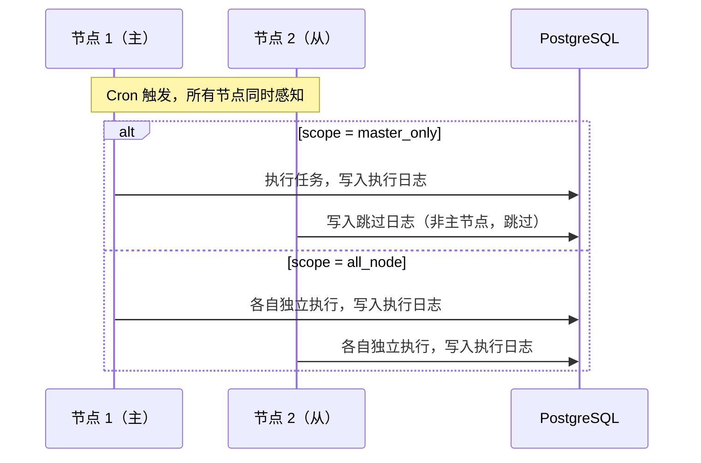

## 概述

`LinaPro`内置了完整的持久化定时调度子系统，任务配置存储在数据库中，支持通过管理工作台的图形界面创建和管理定时任务。定时任务在集群模式下自动防止重复执行。

## 任务类型

`LinaPro`定时任务支持两种执行类型：

| 类型 | 说明 | 适用场景 |
|------|------|---------|
| `Go`处理器 | 调用注册在宿主中的`Go`函数 | 需要访问宿主能力（数据库、`API`等）的任务 |
| `Shell`命令 | 执行系统`Shell`命令 | 脚本任务、文件处理、系统维护等 |

## 在管理工作台中创建任务

进入「任务调度 → 任务管理」，点击「新建任务」：

| 字段 | 说明 |
|------|------|
| 任务名称 | 任务的显示名称 |
| 任务分组 | 所属分组，便于分类管理 |
| 调用目标 | `Go`处理器的名称，或`Shell`命令内容 |
| `Cron`表达式 | 任务触发规则（支持在线预览下次执行时间） |
| 超时时间 | 任务最长执行时间，超时后强制终止 |
| 并发策略 | 上次执行未完成时，是否允许新一次触发 |
| 状态 | 正常（启用）或暂停 |

**`Cron`表达式示例：**

| 表达式 | 说明 |
|--------|------|
| `0 * * * *` | 每小时整点执行 |
| `0 2 * * *` | 每天凌晨 2 点执行 |
| `*/5 * * * *` | 每 5 分钟执行一次 |
| `0 9 * * 1-5` | 工作日每天上午 9 点执行 |
| `0 0 1 * *` | 每月 1 日零点执行 |

管理工作台提供`Cron`表达式预览功能，填写表达式后可以实时查看后续几次的触发时间。

## 手动触发

任务支持在管理工作台中手动立即触发，用于调试和测试：

1. 在任务列表中找到目标任务
2. 点击「立即执行」按钮
3. 在「执行日志」中查看本次执行结果

## 任务分组

定时任务支持按业务域分组管理，每个任务属于一个分组。分组便于：

- 按业务模块过滤查看任务
- 批量暂停或恢复某个模块的所有任务
- 权限控制（未来支持按分组授权）

进入「任务调度 → 分组管理」创建和管理分组。

## 执行日志

每次任务执行都会记录完整的执行日志：

| 字段 | 说明 |
|------|------|
| 任务名称 | 执行的任务 |
| 执行时间 | 任务开始执行的时间 |
| 执行耗时 | 从开始到结束的持续时间 |
| 执行结果 | 成功或失败 |
| 日志内容 | 任务输出（`Shell`命令的`stdout/stderr`） |
| 异常信息 | 如果失败，记录完整的错误信息 |

进入「任务调度 → 执行日志」查看历史执行记录，支持按任务名称和时间范围筛选。

## 插件注册自有定时任务处理器

源码插件可以通过`cron.register`扩展点注册自己的`Go`处理器，注册后可以在管理工作台中将该处理器作为任务的调用目标：

```go
// backend/plugin.go
import "github.com/linaproai/linapro/apps/lina-core/pkg/pluginhost"

func Register(p pluginhost.SourcePlugin) {
    // 注册定时任务处理器
    p.Cron().RegisterCron(
        pluginhost.ExtensionPointCronRegister,
        pluginhost.CallbackExecutionModeBlocking,
        func(registry CronRegistry) {
            // 注册处理器，名称为 "content-article:cleanup"
            registry.Register("content-article:cleanup", cleanupExpiredArticles)
        },
    )
}

// 定时任务处理器实现
func cleanupExpiredArticles(ctx context.Context) error {
    // 删除超过 90 天的草稿文章
    _, err := dao.ContentArticleRecord.Ctx(ctx).
        Where("status = ? AND created_at < ?", 0, time.Now().AddDate(0, 0, -90)).
        Delete()
    return err
}
```

注册成功后，在管理工作台创建任务时，调用目标可以选择`content-article:cleanup`。

## 集群模式下的分布式调度

在集群模式下，`LinaPro`通过任务的 **执行范围（`Scope`）** 字段控制任务在哪些节点上执行，而不是依赖分布式锁竞争。每个任务在创建时可以选择以下两种执行范围之一：

| 执行范围 | 说明 | 适用场景 |
|---------|------|---------|
| `master_only` | 仅在当前主节点执行，从节点感知到 `Cron` 触发后直接跳过并记录跳过日志 | 需要全局唯一执行的维护任务，如数据归档、统计汇总 |
| `all_node` | 每个节点独立执行，互不干扰 | 需要在每个节点本地执行的任务，如本地缓存刷新、节点健康自检 |



每次任务触发的执行结果都记录在共享数据库中，所有节点都可以在管理工作台查看执行历史。

## Shell 任务安全说明

`Shell`类型的定时任务会在宿主服务进程的上下文中执行系统命令，具有与服务进程相同的文件系统权限。使用时请注意：

- 只允许管理员权限的用户创建和修改`Shell`类型任务
- 避免在`Shell`任务中使用可能造成破坏性影响的命令（如`rm -rf`）
- 建议为长时间运行的`Shell`任务设置合理的超时时间
- `Shell`任务的`stdout/stderr`输出会被截断保存（默认最大`1MB`），避免日志过大

## 内置定时任务

宿主自带几个内置定时任务，在宿主启动时自动注册，无需手动创建，例如：

| 任务名称 | 执行频率 | 说明 |
|---------|---------|------|
| 会话清理 | 按`session.cleanupInterval`配置 | 清理过期的在线会话记录 |
| 任务日志清理 | 每天凌晨 | 清理超过保留期的历史执行日志 |
