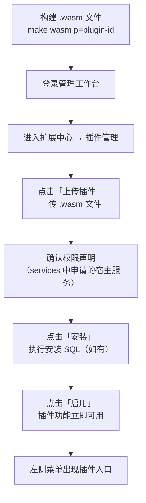

## 概述

`WASM`动态插件是`LinaPro`独有的运行时扩展能力，将插件编译为`WebAssembly`格式，支持在宿主运行时动态上传、安装、启用、禁用和卸载，全程无需停机重启。

动态插件在完整的`WASM`沙箱中运行，对宿主资源（文件系统、数据库、网络）的所有访问都必须通过宿主提供的受治理桥接接口。

## 目录结构

动态插件和源码插件的目录结构是一致的，唯一不同的是动态插件的`main.go`实现了`WASM`插件协议：

```text
apps/lina-plugins/<plugin-id>/
├── main.go                     # 插件 WASM 入口（func main）
├── plugin_embed.go             # 嵌入式资源注册
├── plugin.yaml                 # 插件清单（含宿主服务权限声明）
├── backend/
│   └── internal/
│       └── service/            # 业务逻辑（通过桥接接口访问宿主能力）
├── frontend/
│   └── pages/                  # 插件前端页面（独立静态资源）
└── manifest/
    └── sql/                    # 安装 SQL（可选，动态插件通常不创建数据表）
        └── uninstall/          # 卸载 SQL（可选）
```

## 插件清单（宿主服务声明）

动态插件必须在`plugin.yaml`中声明所需的宿主服务，宿主在安装和启用时验证权限：

```yaml
# 插件唯一标识（kebab-case），全局唯一
id: my-dynamic-plugin
# 插件显示名称
name: 动态插件示例
# 语义化版本号（semver 格式）
version: v0.1.0
# 插件类型：dynamic 表示 WASM 动态插件
type: dynamic
# 插件功能简介
description: 一个演示动态插件能力的示例插件

# 申请宿主服务权限
# 安装时需要管理员确认这些权限声明
services:
  - runtime   # 访问运行时信息（框架版本、节点 ID 等）
  - storage   # 文件存储访问（限制在插件命名空间内）
  - network   # 受限 HTTP 网络请求
  - data      # 数据库访问（限制在插件命名空间内）

# 插件菜单声明
menus:
  - key: plugin:my-dynamic-plugin:main   # 菜单唯一标识，格式：plugin:<插件ID>:<功能>
    name: 动态插件示例                     # 菜单显示名称
    path: my-dynamic-plugin-main          # 前端路由路径，全局唯一
    component: system/plugin/dynamic-page # 动态插件页面固定使用此组件
    type: M                               # 菜单类型：M=菜单项，C=目录，B=按钮
    sort: 1                               # 排序权重，数值越小越靠前
```

宿主服务权限说明：

| 服务 | 说明 | 典型用途 |
|------|------|---------|
| `runtime` | 获取运行时元数据 | 显示框架版本、节点信息 |
| `storage` | 读写插件命名空间内的文件 | 上传附件、生成报告文件 |
| `network` | 发起外部`HTTP`请求 | 调用第三方`API`、`Webhook` |
| `data` | 访问插件命名空间内的数据库数据 | 读写插件自有数据 |

## 构建动态插件

### 环境准备

构建`WASM`插件使用标准`Go`工具链（`Go 1.22+`），通过`GOOS=wasip1 GOARCH=wasm`编译目标，无需安装`TinyGo`等额外工具，宿主提供的`hack/tools/build-wasm`构建工具已封装好所有编译参数。

### 构建命令

```bash
# 在项目根目录执行，构建所有动态插件
make wasm

# 只构建指定插件
make wasm p=my-dynamic-plugin
```

构建产物输出到`temp/output/my-dynamic-plugin.wasm`。

### 构建工具代码（hack/tools/build-wasm）

宿主提供了统一的`WASM`构建工具，自动处理编译参数、资源嵌入和产物打包，无需手动配置`TinyGo`参数。

## 开发动态插件

### 插件入口

`WASM`插件的入口是`main.go`，实现`LinaPro`规定的插件协议：

```go
// main.go
package main

import (
    bridge "github.com/linaproai/linapro/apps/lina-core/pkg/pluginbridge"
)

func main() {
    // 注册插件路由处理器
    bridge.RegisterRoutes(func(router bridge.Router) {
        router.GET("/hello", handleHello)
    })
}

func handleHello(ctx bridge.Context) {
    // 通过桥接接口访问宿主能力
    info, _ := ctx.Runtime().GetFrameworkInfo()
    ctx.JSON(200, map[string]string{
        "message": "Hello from WASM plugin!",
        "version": info.Version,
    })
}
```

### 访问宿主服务

动态插件通过桥接接口访问宿主能力，所有访问都受沙箱约束：

**文件存储（storage）：**

```go
// 写入文件到插件命名空间
err := ctx.Storage().Write("reports/2024-01.csv", csvData)

// 读取插件命名空间内的文件
data, err := ctx.Storage().Read("reports/2024-01.csv")

// 列举插件目录下的文件
files, err := ctx.Storage().List("reports/")
```

**数据库访问（data）：**

```go
// 查询插件命名空间内的数据
// 插件只能访问以插件 ID 为前缀的数据表
rows, err := ctx.Data().Query("SELECT * FROM my_dynamic_plugin_records WHERE status = ?", 1)

// 执行写操作
affected, err := ctx.Data().Exec("INSERT INTO my_dynamic_plugin_records (title) VALUES (?)", "测试")
```

**HTTP 网络请求（network）：**

```go
// 发起外部 HTTP 请求（受域名白名单约束）
resp, err := ctx.Network().GET("https://api.example.com/data")
body, _ := io.ReadAll(resp.Body)
```

**运行时信息（runtime）：**

```go
// 获取框架运行时信息
info, err := ctx.Runtime().GetFrameworkInfo()
// info.Version, info.NodeID, info.StartedAt
```

## 前端页面

动态插件的前端页面是**独立的静态文件**，不依赖宿主的`Vue`框架，通过`iframe`或直接嵌入方式在管理工作台中展示：

```html
<!-- frontend/pages/main.html -->
<!DOCTYPE html>
<html>
<head>
    <meta charset="UTF-8" />
    <title>动态插件示例</title>
    <!-- 可以使用任意前端框架或原生 HTML -->
</head>
<body>
    <div id="app">
        <h1>动态插件示例</h1>
        <button onclick="fetchData()">加载数据</button>
        <div id="result"></div>
    </div>
    <script>
    async function fetchData() {
        const res = await fetch('/plugin/my-dynamic-plugin/hello')
        const data = await res.json()
        document.getElementById('result').textContent = JSON.stringify(data)
    }
    </script>
</body>
</html>
```

## 安装和使用

动态插件的完整使用流程：



## 版本升级

动态插件支持独立版本升级，无需重新部署宿主：

1. 构建新版本`.wasm`文件（更新`plugin.yaml`中的`version`字段）
2. 在插件管理页面上传新版本文件
3. 宿主自动识别版本变更，提供升级选项
4. 确认升级后，新版本立即生效

## 与源码插件的关键区别

| 特性 | 源码插件 | `WASM`动态插件 |
|------|---------|--------------|
| 启动时加载 | ✅ 已启用插件在启动时自动加载 | ✅ 已安装并启用的插件在启动时加载 |
| 热加载 | ❌ | ✅ 上传后立即可用 |
| 前端框架 | 共享宿主`Vue3`生态 | 独立静态页面，任意技术栈 |
| 数据库访问 | 直接使用`GoFrame ORM` | 通过桥接接口，限制在命名空间内 |
| 调试工具 | 标准`Go`调试工具 | 有限调试能力 |

参考源码实现：`apps/lina-plugins/plugin-demo-dynamic/`
