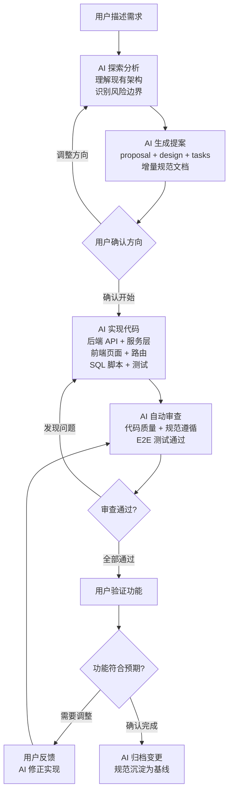

## 什么是 AI 原生

「`AI`原生」不是指在产品中加入一个`AI`助手按钮，也不是指用`AI`来辅助某个具体功能。`AI`原生的含义是：**将`AI`作为产品的主路径，而不是可选的附加功能**。

在`AI`原生设计下，`AI`不是工具——`AI`是团队的核心工程生产力。开发者的角色从代码编写者转变为**方向引导者和关键决策者**。

`LinaPro`在框架设计之初就充分考虑了`AI`驱动开发的需求，构建了规范驱动的`AI`原生研发工作流，使开发者能够将需求分析、系统设计、代码实现、测试验证等全部开发环节都交给`AI`来完成。

## AI 原生 vs. AI 辅助

| 维度 | AI 辅助 | AI 原生 |
|------|---------|---------|
| **`AI`的角色** | 辅助工具，可选使用 | 核心工程生产力，主路径 |
| **代码来源** | 人类编写，`AI`辅助 | `AI`编写，人类决策 |
| **文档维护** | 人类维护，易与代码脱节 | `AI`同步维护，与代码强绑定 |
| **架构一致性** | 依赖人工审查 | 规范锚定，`AI`自动遵循 |
| **测试覆盖** | 按需编写，可能缺失 | 强制`E2E`测试，变更前提 |
| **迭代速度** | 受人类编码速度限制 | 以`AI`处理速度为瓶颈 |

## AI 贯穿全开发流程

在`LinaPro`的`AI`原生工作流中，`AI`深度参与了所有开发环节：

- **需求分析阶段：** `AI`读取项目规范（`AGENTS.md`/`CLAUDE.md`）、现有`OpenSpec`文档和源码，深入理解当前架构，主动提出澄清问题，帮助你想清楚边界和影响。

- **系统设计阶段：** `AI`生成数据库表设计、`API`接口定义、前端页面结构，形成完整的设计文档（`design.md`）和增量规范（`specs/`），供你审阅和决策。

- **代码实现阶段：** `AI`按照任务清单（`tasks.md`）逐条完成实现——后端服务、`API`路由、数据库`DAO`层、前端页面组件、权限声明、国际化资源，一气呵成。

- **测试验证阶段：** `AI`编写`E2E`测试用例，运行测试，确保功能实现与设计规范一致。

- **文档归档阶段：** `AI`将变更中的设计决策、接口规范整理为基线规范，供后续迭代引用。

## 规范驱动开发

`LinaPro`的`AI`原生工作流建立在 **规范驱动开发（`Specification-Driven Development，SDD`）** 理念之上。

传统开发模式的问题在于：随着时间推移，文档落后于代码，代码偏离设计，测试覆盖出现空洞，最终形成无人敢动的「祖传代码」。

`SDD`通过以下机制解决这个问题：

### 每次变更都有对应的规范锚点

每次功能迭代都会在`openspec/changes/`目录下产生完整的文档记录，包括设计决策、接口规范和实现细节。这些文档是`AI`在下一次迭代中的上下文基础。

### 规范先行，代码跟随

在写任何一行代码之前，`AI`必须先确定规范（`proposal.md`和`design.md`通过审阅），然后才开始实现。这确保了代码和文档在同一个迭代周期内同步产生。

### 强制`E2E`测试作为变更前提

每次变更都必须有对应的`E2E`测试覆盖。测试通过是变更归档的必要条件，而不是可选步骤。这从根本上防止了「测试空洞」的积累。

### 归档即沉淀

变更归档时，增量规范会合并到`openspec/specs/`目录中，形成持续生长的基线规范库。`AI`在后续迭代中会以这些已验证的基线作为约束，保证架构一致性。

## 为什么不建议人类直接修改代码

这是很多开发者接触`LinaPro`时会有的疑问：我能不能直接改代码，不通过`AI`工作流？

**可以，但不建议。** 原因如下：

### 文档和代码会立即脱节

`LinaPro`中的`OpenSpec`规范文档（`design.md`、`specs/`）描述了系统的当前状态。如果直接修改代码而不更新规范，下一次`AI`迭代时，`AI`会基于过时的规范生成不符合实际情况的设计，导致越来越多的偏差。

### `AI`无法感知「潜规则」

人类在直接修改代码时往往会引入一些隐性约束（这里加了一个特殊判断，那里绕过了某个限制），这些约束存在于开发者脑子里，而不在规范文档里。当`AI`下次修改同一模块时，很可能会破坏这些隐性约束。

### `AI`可以保证实现与文档的一致性

当`AI`主导实现时，代码和文档是在同一轮对话中同时产生的，两者必然一致。这是人类工作方式很难达到的效率。

### 特殊情况

以下场景可以考虑直接修改代码：

- 紧急的线上问题修复（但事后需要补充`OpenSpec`记录）
- `AI`无法理解的高度特殊的业务约束
- 配置文件和环境变量的调整

即便在这些场景下，也建议事后通过`/lina-feedback`技能将修改记录到当前活跃的`OpenSpec`变更中。

## AI 原生框架的价值

`LinaPro`的`AI`原生设计带来的核心价值可以归纳为：

- **交付速度**：`AI`可以在几分钟内完成一个完整的`CRUD`模块，包括后端`API`、数据库层、前端页面和测试用例，这是人类工程师几个小时才能完成的工作量。

- **质量一致性**：每次迭代都遵循相同的规范和最佳实践，代码风格、命名规范、错误处理和测试覆盖保持高度一致，不受开发者个人习惯的影响。

- **可持续演进**：规范文档随代码同步更新，架构决策有据可查，新成员可以通过阅读`openspec/specs/`快速理解系统的设计意图。

- **风险可控**：每次变更都有`E2E`测试作为安全网，`AI`审查机制可以及时发现偏离规范的实现，将问题消灭在合并之前。
