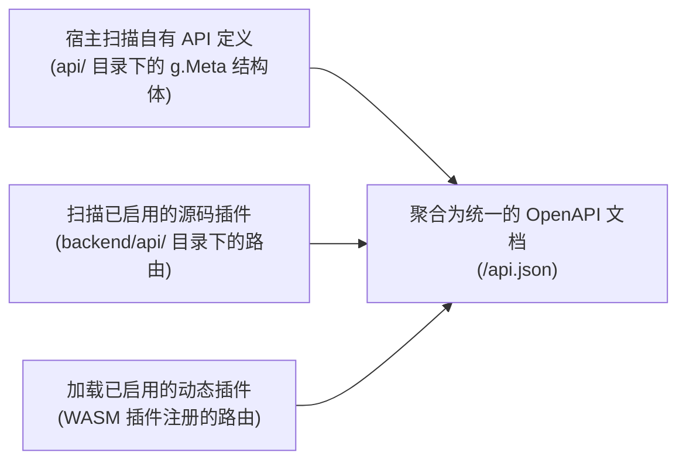

## 概述

`LinaPro`内置了完整的接口文档能力，在宿主服务启动时自动扫描所有`API`定义，将宿主接口和所有已启用插件的接口聚合到同一份`OpenAPI`格式的文档中，开发者无需手动维护任何文档文件。

## 访问接口文档

**`API JSON`端点：**

```
http://localhost:8080/api.json
```

这是标准的`OpenAPI 3.0`格式`JSON`文档，可以被`Swagger UI`、`Apifox`、`Postman`等工具直接导入使用。

**管理工作台内嵌文档：**

登录管理工作台后，进入「开发中心 → 接口文档」，可以在工作台内直接浏览所有接口并发起调试请求。

## 接口自动聚合

宿主在启动时，按以下顺序自动扫描并聚合接口：



当插件被启用或禁用时，接口文档会在下一次访问时自动更新，无需重启服务。

## API 定义方式

宿主和源码插件使用`GoFrame`的`g.Meta`结构体标签定义接口契约，所有接口元数据（路径、方法、权限、描述、参数）都集中在`Go`代码中声明：

```go
// 示例：文章列表接口定义
type ArticleListReq struct {
    g.Meta   `path:"/article" method:"get" tags:"文章管理" summary:"文章列表"`
    Page     int    `json:"page"     v:"min:1"          dc:"页码"`
    PageSize int    `json:"pageSize" v:"min:1,max:100"  dc:"每页数量"`
    Status   string `json:"status"   v:"in:draft,published" dc:"文章状态筛选"`
}

type ArticleListRes struct {
    g.Meta `mime:"application/json"`
    List   []*Article `json:"list"  dc:"文章列表"`
    Total  int        `json:"total" dc:"总数量"`
}
```

这种声明式的接口定义方式有以下好处：

- **单一数据源**：接口路径、参数、说明都在一处，不会出现文档与实现不一致
- **权限与接口绑定**：权限标识通过`g.Meta`标签声明，接口文档中直接可见
- **自动生成文档**：框架在运行时解析结构体标签，无需额外工具

## 接口权限集成

每个接口的权限标识通过`g.Meta`的`middleware`标签声明，与`RBAC`系统自动集成：

```go
type ArticleCreateReq struct {
    g.Meta `path:"/article" method:"post" tags:"文章管理" summary:"创建文章"
            middleware:"AuthMiddleware,PermMiddleware"
            perm:"content-article:article:create"`
    // 请求体字段...
}
```

`perm`标签声明的权限标识会在接口文档中展示，管理员可以在角色管理中根据这些标识分配权限。

## 接口多语言

接口文档支持多语言显示，翻译文件位于宿主和插件的`manifest/i18n/<locale>/apidoc/`目录下：

```text
manifest/i18n/
  zh-CN/
    apidoc/
      core-api-article.json   # 文章相关接口的中文翻译
  en-US/
    apidoc/
      core-api-article.json   # 文章相关接口的英文翻译（可留空）
```

翻译文件结构示例：

```json
{
  "core": {
    "article": {
      "list": {
        "summary": "文章列表",
        "description": "分页查询文章列表，支持按状态筛选"
      },
      "create": {
        "summary": "创建文章",
        "description": "创建新的文章记录"
      }
    }
  }
}
```

## 在线调试

管理工作台的接口文档页面内嵌了调试能力，支持：

- 查看接口的完整请求/响应结构
- 填写请求参数，直接发起`HTTP`请求
- 查看响应结果和`HTTP`状态码

:::tip
在线调试会使用当前登录用户的认证`Token`，如果调试写操作接口（`POST`、`PUT`、`DELETE`），会产生真实的数据变更，请在测试环境中使用。
:::

## 导入到第三方工具

将接口文档导入到外部工具的步骤：

**Apifox：**

1. 新建项目，选择「导入数据」
2. 选择`OpenAPI/Swagger`格式，输入文档`URL`：`http://localhost:8080/api.json`
3. 点击确认，接口自动导入

**Postman：**

1. 点击「Import」
2. 选择「Link」，输入`http://localhost:8080/api.json`
3. 确认导入，自动创建接口集合

**curl（直接下载）：**

```bash
curl -o api.json http://localhost:8080/api.json
```
