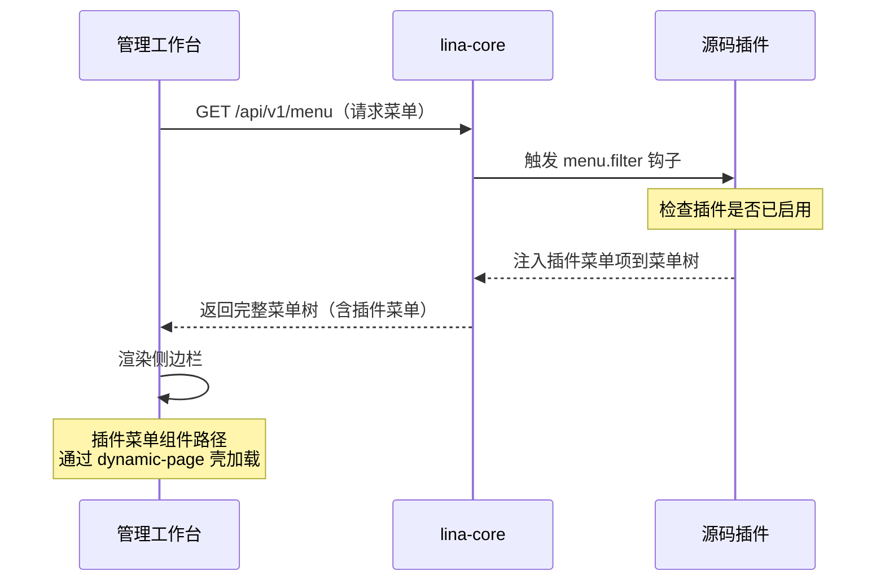

## 概述

`lina-vben`是`LinaPro`内置的默认管理工作台，基于`Vue 3 + Vben5 + Ant Design Vue + TypeScript`构建。它是`lina-core`宿主`API`和所有插件`API`的标准`UI`表达层。

开发者可以直接在工作台基础上构建业务应用，也可以通过插件机制按需扩展或替换任意模块，甚至可以完全替换为自定义的前端工作台。

## 技术栈

| 技术 | 版本 | 说明 |
|------|------|------|
| `Vue 3` | `3.x` | 前端框架 |
| `Vben5` | `5.x` | 企业级`Vue`管理框架 |
| `Ant Design Vue` | `4.x`| `UI`组件库 |
| `TypeScript` | `5.x` | 类型系统 |
| `pnpm` | `8.x` | 包管理工具（`Monorepo`） |

## 功能模块

### 权限管理

**用户管理**

| 功能 | 说明 |
|------|------|
| 用户列表 | 分页展示，支持按用户名、手机号、状态筛选 |
| 创建用户 | 设置用户名、密码、角色、手机号、邮箱等基础信息 |
| 编辑用户 | 修改用户信息、重置密码、调整角色分配 |
| 状态管理 | 启用/禁用用户账号，禁用后立即失效 |
| 批量导出 | 导出用户列表为`Excel`文件 |

**角色管理**

| 功能 | 说明 |
|------|------|
| 角色列表 | 展示所有角色，包含角色描述和用户数量 |
| 创建角色 | 定义角色名称和描述 |
| 权限分配 | 树形勾选菜单权限（目录/菜单/按钮三级） |
| 权限生效 | 权限拓扑变更后毫秒级生效，无需用户重新登录 |

**菜单管理**

| 功能 | 说明 |
|------|------|
| 菜单树 | 展示完整的菜单层级结构 |
| 菜单类型 | 支持目录（`D`）、菜单（`M`）、按钮（`B`）三种类型 |
| 动态配置 | 菜单路径、组件、图标、排序均可在管理界面调整 |
| 权限标识 | 按钮类型菜单绑定权限标识，用于`RBAC`鉴权 |

### 系统设置

**字典管理**

| 功能 | 说明 |
|------|------|
| 字典类型 | 管理系统内所有字典分类，如状态、类型、标志位等 |
| 字典数据 | 维护每个字典类型下的选项值和显示标签 |
| 导入导出 | 支持从`Excel`批量导入字典数据和导出备份 |

**参数设置**

| 功能 | 说明 |
|------|------|
| 参数列表 | 维护系统运行时的可配置参数项 |
| 参数编辑 | 修改参数值，修改后立即生效 |
| 导入导出 | 支持批量导入和导出参数配置 |

**文件管理**

| 功能 | 说明 |
|------|------|
| 文件上传 | 支持单文件和多文件上传 |
| 文件列表 | 查看已上传文件，包含文件名、大小、上传时间 |
| 文件下载 | 下载已存储的文件 |
| 存储隔离 | 宿主文件和插件文件按命名空间隔离存储 |

### 任务调度

**任务管理**

| 功能 | 说明 |
|------|------|
| 任务列表 | 查看所有定时任务，包含状态和下次执行时间 |
| 创建任务 | 配置`Cron`表达式、任务类型（`Go`处理器/`Shell`命令）、超时时间 |
| 立即执行 | 手动触发任务立即执行一次 |
| 暂停恢复 | 暂停运行中的任务或恢复已暂停的任务 |
| 执行历史 | 查看任务执行记录，包含耗时和结果 |

**分组管理**

将定时任务按业务域分组管理，便于按分组查找和权限控制。

**执行日志**

| 功能 | 说明 |
|------|------|
| 日志列表 | 查看历史执行日志，按任务、时间范围筛选 |
| 日志详情 | 查看每次执行的完整输出和异常信息 |

### 扩展中心

**插件管理**

插件管理是`LinaPro`扩展能力的控制台：

| 功能 | 说明 |
|------|------|
| 插件列表 | 展示所有已发现的插件，包含类型（源码/动态）、版本、状态 |
| 安装 | 将插件从「已发现」状态变为「已安装」，执行安装`SQL`和初始化流程 |
| 启用/禁用 | 切换插件的运行状态，禁用后菜单和路由立即隐藏 |
| 卸载 | 将插件彻底移除，提供「保留数据」和「清理数据」两种选项 |
| 上传动态插件 | 上传`WASM`格式的动态插件包（`.wasm`文件） |
| 版本管理 | 查看插件当前版本和可用升级版本 |

### 开发中心

**接口文档**

宿主在启动时自动扫描宿主和所有已启用插件的接口，生成统一的在线`API`文档：

- 支持在线浏览所有接口的请求参数和响应结构
- 支持直接在页面上发起`API`调试请求
- 文档内容实时反映当前已启用的插件能力

**系统信息**

| 信息项 | 说明 |
|--------|------|
| `CPU`使用率 | 当前服务器`CPU`负载 |
| 内存使用 | 已使用内存和总内存 |
| 磁盘信息 | 各磁盘分区使用情况 |
| 运行时信息 | `Go`运行时版本、`Goroutine`数量等 |

## 官方插件扩展模块

以下模块由官方插件提供，安装并启用插件后，对应菜单自动注入到管理工作台，无需修改工作台代码：

| 插件 | 挂载位置 | 菜单模块 | 主要功能 |
|------|---------|---------|---------|
| `org-center` | 组织管理 | 部门管理、岗位管理 | 树形组织架构维护，岗位定义 |
| `content-notice` | 内容管理 | 通知公告 | 公告`CRUD`，支持多种公告类型 |
| `monitor-online` | 系统监控 | 在线用户 | 实时查看在线会话，强制下线 |
| `monitor-server` | 系统监控 | 服务监控 | `CPU`、内存、磁盘信息采集展示 |
| `monitor-operlog` | 系统监控 | 操作日志 | 用户操作审计，含请求参数和耗时 |
| `monitor-loginlog` | 系统监控 | 登录日志 | 登录记录查询，含`IP`和设备指纹 |

## 插件菜单动态注入原理

插件菜单不是硬编码在工作台代码中的，而是通过以下机制动态注入：

当插件被禁用时，工作台调用菜单接口不会包含该插件的菜单项，用户界面上对应入口自动消失，无需重新部署或刷新配置。

## 默认账号

| 字段 | 值 |
|------|-----|
| 用户名 | `admin` |
| 密码 | `admin123` |
| 访问地址 | `http://localhost:5666` |
