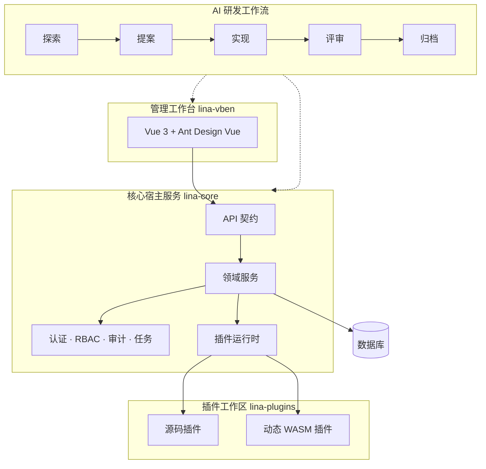

运行时架构需要让宿主保持通用，让工作台围绕契约开发，让插件拥有独立边界。

## 运行时契约

| 契约 | 所有者 |
| --- | --- |
| 后端路由和`DTO` | `apps/lina-core/api`以及插件本地`backend/api`。 |
| 管理页面 | `apps/lina-vben`以及插件本地`frontend/pages`。 |
| 权限和菜单 | 宿主治理数据与插件清单。 |
| 数据库资源 | 宿主`SQL`清单或插件本地`manifest/sql`。 |
| 变更意图 | 实现前位于`openspec/changes`，归档后位于`openspec/specs`。 |

## 设计原则

不要让宿主依赖插件内部实现。插件应通过清单、宿主公开包、生命周期`Hook`和已发布扩展点接入。
