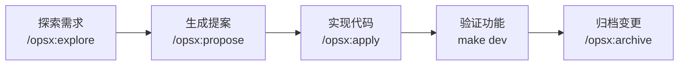

本文通过开发一个「文章管理」`CRUD`插件，带你体验`LinaPro`的`AI`原生开发全流程。整个过程由`AI`全程主导——需求分析、系统设计、代码实现、测试验证，你只需要在关键节点提供指导和决策。

## 开发目标

开发一个名为`content-article`的源码插件，实现文章的增删改查管理功能，包括：

- 文章列表展示与分页
- 文章创建、编辑、删除
- 文章状态管理（草稿、已发布）
- 后端`RBAC`权限集成

整个开发过程全程由`Claude Code`通过`OpenSpec`工作流驱动，预计用时 30 分钟左右。

## 前置准备

确认已完成安装并能正常启动服务，参见[框架安装](/quick/installation)。

在项目根目录下打开`Claude Code`：

```bash
claude
```

## 步骤一：探索需求

第一步是通过探索对话，让`AI`理解需求、分析现有架构，并帮助你思清楚要做什么。

在`Claude Code`中输入：

```
/opsx:explore 我想开发一个文章管理模块，支持文章的增删改查，包括标题、内容、状态（草稿/已发布）、作者信息。希望以源码插件的形式开发。
```

**AI 会做什么：**

- 读取`CLAUDE.md`和`openspec/`目录，了解项目架构和规范
- 浏览现有源码插件（如`plugin-demo-source`）作为参考
- 分析需求，识别需要创建的数据库表、`API`接口、前端页面和菜单
- 提出可能的问题和设计建议，例如文章分类是否需要、封面图片是否支持上传

**你需要做什么：**

回答`AI`提出的澄清问题，确定功能边界。例如：

```
不需要文章分类，暂时也不需要封面图片，先做最基础的 CRUD 即可。
插件 ID 使用 content-article，挂载在内容管理菜单下。
```

与`AI`来回几轮对话，直到双方对需求有共同理解，就可以进入下一步。

## 步骤二：生成提案

需求探索完成后，让`AI`将讨论结果固化为正式的`OpenSpec`变更提案。

在`Claude Code`中输入：

```
/opsx:propose content-article
```

**AI 会做什么：**

在`openspec/changes/content-article/`目录下自动生成以下文档：

| 文件 | 内容 |
|------|------|
| `proposal.md` | 变更背景、目标范围和影响分析 |
| `design.md` | 数据库表设计、`API`接口定义、前端页面结构 |
| `tasks.md` | 分解后的实现任务清单，每条任务都有明确的完成标准 |
| `specs/` | 增量能力规范，描述这个插件应当具备的行为 |

**你需要做什么：**

审阅`AI`生成的文档，重点检查：

- `design.md`中的数据库表字段是否符合预期
- `tasks.md`中的任务分解是否完整合理
- 如有遗漏或偏差，直接告诉`AI`修正

```
设计看起来没问题，可以开始实现了。
```

## 步骤三：实现代码

提案确认后，让`AI`按照任务清单逐条实现代码。

在`Claude Code`中输入：

```
/opsx:apply
```

**AI 会做什么：**

按照`tasks.md`中的任务清单，依次完成以下实现工作：

**后端实现（`backend/`）：**

```
1. 创建 plugin.yaml 声明插件元数据和菜单
2. 创建安装 SQL（manifest/sql/）：创建 content_article 表
3. 创建卸载 SQL（manifest/sql/uninstall/）：删除 content_article 表
4. 生成 DAO/DO/Entity 数据访问层（gf gen dao）
5. 定义 API DTO 和路由接口（backend/api/）
6. 实现控制器（backend/internal/controller/）
7. 实现业务服务层（backend/internal/service/）
8. 编写插件注册入口（backend/plugin.go）
9. 在宿主插件注册文件中接线新插件
```

**前端实现（`frontend/`）：**

```
10. 创建文章列表页（frontend/pages/article-list.vue）
    - 表格展示文章列表，含分页
    - 操作列：编辑、删除按钮
    - 工具栏：新增按钮、状态筛选
11. 创建文章表单弹窗
    - 标题、内容（富文本或多行文本）、状态字段
    - 表单验证
12. 接入后端 API
```

**测试（`hack/tests/`）：**

```
13. 编写 E2E 测试用例（TC{NNNN}-content-article.ts）
    - 测试文章创建流程
    - 测试文章编辑流程
    - 测试文章删除流程
14. 运行测试验证功能
```

**你需要做什么：**

在实现过程中，`AI`可能会遇到需要你决策的节点，例如：

- 状态字段使用数字枚举还是字符串？（推荐数字，与宿主字典管理集成）
- 内容字段使用简单文本输入还是富文本编辑器？

根据`AI`的提示做出决定，其余工作全部由`AI`完成。

**审查完成后：**

`AI`完成所有任务后，会自动触发`/lina-review`技能进行代码和规范审查。如果发现问题，`AI`会自动修正并重新审查，直到全部通过。

## 步骤四：启动服务，访问插件

代码实现完成后，需要重新初始化数据库以创建新的插件数据表，然后重启服务。

在`Claude Code`中输入：

```
帮我重新初始化数据库并重启服务
```

`AI`会执行：

```bash
make stop              # 停止当前服务
make init confirm=init # 重新初始化数据库（会创建新表）
make dev               # 重新启动服务
```

服务启动后，打开管理工作台：`http://localhost:5666`

**安装并启用插件：**

1. 登录管理工作台（`admin / admin123`）
2. 进入「扩展中心 → 插件管理」
3. 找到`content-article`插件，点击「安装」
4. 安装成功后点击「启用」

**访问文章管理页面：**

插件启用后，左侧菜单会自动出现「内容管理 → 文章管理」入口，点击进入即可使用完整的文章`CRUD`功能。

如果需要调整权限，进入「权限管理 → 角色管理」，给对应角色分配文章管理的按钮权限。

## 步骤五：归档变更

功能验证完成后，将本次迭代变更归档，让规范沉淀为项目基线。

在`Claude Code`中输入：

```
/opsx:archive
```

**AI 会做什么：**

- 再次执行全面的代码和规范审查
- 将`openspec/changes/content-article/`中的变更文档整理为英文
- 将增量规范同步到`openspec/specs/`作为基线
- 将变更目录移动到`openspec/changes/archive/`完成归档

归档后，这次迭代的所有设计决策、接口规范和实现细节都有完整的文档记录，`AI`在下一次迭代中可以基于这些已验证的规范继续推进。

## 小结

通过这个示例，你已经体验了`LinaPro`的完整`AI`原生开发闭环：



**关键特点：**

- **人类只负责方向和决策**，不手动编写任何代码
- **AI 保证实现与文档的一致性**，规范和代码始终同步更新
- **每次迭代都有完整记录**，架构不会随时间漂移
- **插件松耦合**，可以随时单独禁用或卸载，不影响其他模块

接下来，你可以参考[扩展开发](/docs/extension-dev)文档深入了解源码插件和`WASM`动态插件的完整开发规范，或者查看[开发手册](/docs/architecture)了解框架的详细架构设计。
