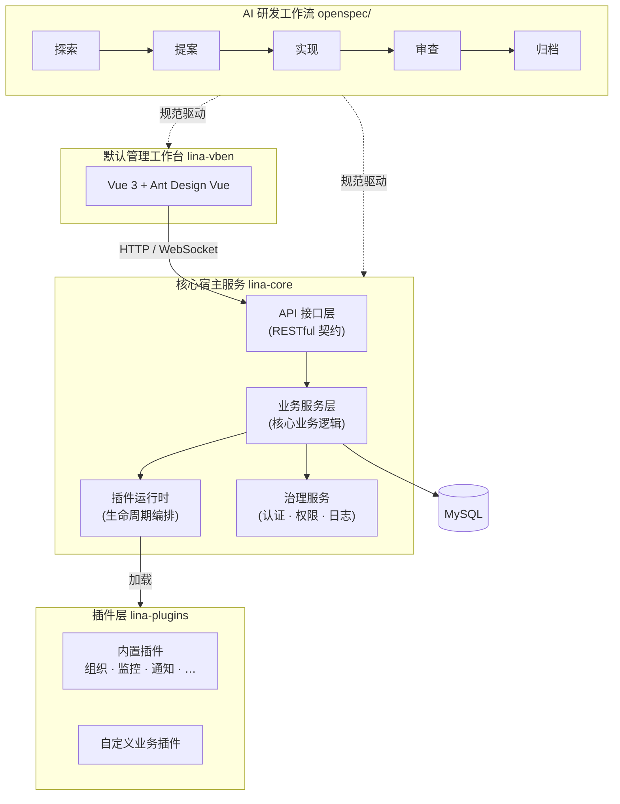
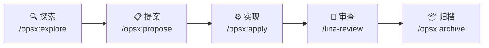

`LinaPro`是一款**面向可持续交付的 AI 原生全栈框架**，把`AI`作为核心生产力：`AI`主导分析、设计与实现，团队把握方向与关键决策。

## 什么是 LinaPro

很多开发者初次接触`LinaPro`时，会把它当作一款后台管理框架。这是一个常见误解。`LinaPro`是一款**全栈框架**，后台管理工作台只是框架内置的一项开箱即用能力——因为绝大多数业务系统都需要一套可以直接投入使用的管理界面，所以框架把它内置进来，免去重复搭建的工作。

`LinaPro`的真正价值在于：通过规范驱动的`AI`原生研发工作流、完整的插件扩展运行时以及前后端一体化的全栈设计，让团队从第一天起就能以`AI`作为主力工程师进行业务开发和持续交付。

## 四层架构

`LinaPro`由四个紧密协作但独立设计的层次构成：

| 层次 | 模块 | 描述 |
|------|------|------|
| 核心宿主服务 | `lina-core` | 基于`GoFrame`构建的通用后端运行时，提供`API`契约、认证鉴权、权限管理、插件生命周期等核心能力 |
| 默认管理工作台 | `lina-vben` | 基于`Vue 3 + Ant Design Vue`的开箱即用前端工作台，是所有内置能力的参考`UI`实现 |
| 可插拔插件系统 | `lina-plugins` | 支持源码插件与`WASM`动态插件两种模式，无需修改宿主即可扩展任意能力 |
| `AI`研发工作流 | `openspec/` | 规范驱动的结构化工作流，让`AI`、人类与代码库在每次迭代中保持对齐 |

## 核心优势

**`AI`原生研发工作流**

每次迭代遵循探索→提案→实现→审查→归档的闭环，变更锚定在增量规范文件和强制`E2E`测试上。`AI`始终基于已验证基础向前推进，从根本上防止架构漂移和测试空洞。

**前后端一体化全栈设计**

框架同时提供生产就绪的后端运行时（`lina-core`）与前端管理工作台（`lina-vben`），两者在接口契约、权限模型与设计规范上完全对齐，无需自行集成两套独立框架即可交付完整产品。

**开箱即用的内置能力**

内置覆盖完整业务场景的核心服务、多个生产就绪官方插件，以及丰富的管理功能模块，新项目无需从零搭建即可直接投入业务开发。

**模块级松耦合设计**

所有业务模块均遵循松耦合原则独立设计，模块间通过接口而非硬依赖协作，支持按需启用或禁用。组织管理中的部门管理、岗位管理等并非所有系统都需要，因此以插件形式提供——禁用或卸载插件后，相关页面和菜单会自动从系统中剔除，对宿主代码无任何侵入。

**无与伦比的可扩展性**

双模式可插拔插件运行时（编译期源码插件与运行时`WASM`动态插件），插件运行在隔离沙箱中，数据库与文件访问均通过命名空间隔离，任意能力均可通过插件扩展或替换。

**企业级治理开箱即用**

`JWT`认证配合声明式`RBAC`权限体系，权限通过`API`定义层的标签声明，天然可见可审计；权限拓扑毫秒级生效，操作日志自动脱敏，会话管理支持强制下线。

**原生分布式架构**

框架底层支持单机或分布式部署，天然具备水平扩展能力，选主、分布式锁、键值缓存等核心组件均支持集群感知，无需额外改造即可应对业务规模增长。

## 核心宿主服务

`lina-core`是整个框架的稳定地基，基于`GoFrame`构建，负责：

- 提供系统管理、插件治理和共享平台能力的`RESTful API`
- 拥有数据库迁移、初始化数据和运行时配置
- 加载源码插件和`WASM`动态插件，协调其完整生命周期
- 运行宿主级定时任务和持久化定时调度子系统

宿主对插件提供稳定的扩展接缝，包括认证事件、审计事件、组织能力访问和插件生命周期钩子，插件通过这些接缝扩展宿主能力，永远不直接修改宿主内部实现。

## 双模式插件系统

插件是`LinaPro`中最主要的扩展点。每个插件是一个自包含的模块包，可以独立声明`API`路由、服务逻辑、数据库表结构、前端页面和菜单项。

`LinaPro`支持两种插件模式：

**源码插件**

与宿主一起编译和部署，适合长期维护的业务功能模块。开发插件时只需在`apps/lina-plugins/<plugin-id>/`目录下实现对应逻辑，声明`plugin.yaml`清单，再在宿主插件注册入口显式接线即可。插件数据存储通过命名空间与宿主隔离。

**WASM 动态插件**

编译为`WebAssembly`产物，支持在运行时动态上传、安装、启用、禁用和卸载，全程无需重启宿主服务。动态插件运行在隔离的沙箱环境中，对宿主和其他插件零侵入，适合：

- 让`AI`临时开发功能并动态注入到运行中的系统
- 在生产环境中快速热修复问题
- 以二进制方式分发插件能力，不暴露源代码

## 默认管理工作台

`LinaPro`内置了功能完整的默认管理工作台（`lina-vben`），开发者可以直接在此基础上构建业务应用，也可以通过插件机制按需扩展或替换任意模块。

**权限管理**

| 模块 | 功能 |
|------|------|
| 用户管理 | 用户`CRUD`、角色分配、密码重置、状态管理、批量导出 |
| 角色管理 | 角色定义、菜单权限分配、按钮级权限授权 |
| 菜单管理 | 动态菜单树配置，支持目录、菜单、按钮三级结构 |

**系统设置**

| 模块 | 功能 |
|------|------|
| 字典管理 | 字典类型与字典数据的统一维护，支持导入导出 |
| 参数设置 | 运行时参数维护，支持配置导入导出 |
| 文件管理 | 文件上传、下载与存储管理 |

**任务调度**

| 模块 | 功能 |
|------|------|
| 任务管理 | `Cron`表达式配置、立即执行、暂停恢复、执行历史 |
| 分组管理 | 任务按业务域分组管理 |
| 执行日志 | 执行记录查询、异常日志查看 |

**扩展中心**

| 模块 | 功能 |
|------|------|
| 插件管理 | 插件安装、启用、禁用、卸载与版本管理 |

**开发中心**

| 模块 | 功能 |
|------|------|
| 接口文档 | 在线`API`文档浏览与调试，自动聚合宿主与所有插件的接口 |
| 系统信息 | 运行时环境信息查看 |

以下模块由官方插件提供，安装对应插件后自动注入菜单，无需额外配置：

| 插件 | 菜单模块 | 功能描述 |
|------|---------|---------|
| `org-center` | 部门管理、岗位管理 | 组织架构树形维护及岗位定义 |
| `content-notice` | 内容管理-通知公告 | 公告内容`CRUD`，支持多种公告类型 |
| `monitor-online` | 系统监控-在线用户 | 在线会话实时查看、强制下线 |
| `monitor-server` | 系统监控-服务监控 | 服务器`CPU`、内存、磁盘及运行时信息采集展示 |
| `monitor-operlog` | 系统监控-操作日志 | 用户操作记录审计，含请求参数、耗时与操作结果 |
| `monitor-loginlog` | 系统监控-登录日志 | 登录记录查询，含`IP`地址、设备信息与登录结果 |

:::info 演示环境
管理工作台在线演示地址即将开放，敬请期待。
:::

## OpenSpec AI 研发工作流

`OpenSpec`是`LinaPro`内置的规范驱动研发工作流，每次迭代经历五个阶段：

| 阶段 | 工具 | 职责 |
|------|------|------|
| 探索 | `/opsx:explore` | 分析需求、理解现有架构、识别风险 |
| 提案 | `/opsx:propose` | 生成`proposal.md`、`design.md`、`tasks.md`和增量规范 |
| 实现 | `/opsx:apply` | `AI`按任务清单逐条实现代码、测试和文档 |
| 审查 | `/lina-review` | 自动检查代码质量、规范遵循和测试覆盖 |
| 归档 | `/opsx:archive` | 将变更沉淀为基线规范，关闭本次迭代 |

`OpenSpec`的核心价值在于：每次变更都有对应的规范文档、设计决策和`E2E`测试作为锚点，`AI`在下一次迭代中可以基于这些已验证的基础继续推进，而不是凭空生成代码。这从根本上解决了`AI`生成代码与文档脱节、架构逐渐漂移的问题。

开发者在整个过程中扮演的角色是**方向引导者和关键决策者**，而不是代码编写者。所有的需求分析、系统设计、代码实现和测试验证，都由`AI`在规范的约束下完成。
