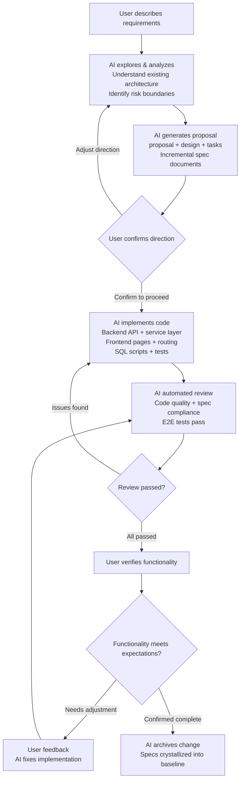

## What "AI-Native" Means

"AI-native" does not mean adding an AI assistant button to your product, nor does it mean using AI to help with one specific feature. AI-native means **making AI the primary path of the product, not an optional add-on**. In an AI-native design, AI is not a tool — AI is the team's core engineering productivity. The developer's role shifts from code writer to **direction-setter and key decision-maker**.

`LinaPro` was designed from the ground up with AI-driven development in mind:
- It provides a spec-driven AI-native development workflow, allowing developers to hand off requirements analysis, system design, code implementation, test verification, and other development work to `AI`.
- It also ships a built-in AI skill system covering the full development lifecycle, giving `AI` the domain-specific knowledge to make framework-compliant decisions in concrete work contexts such as backend development, frontend design, testing, and performance auditing.

These two dimensions complement each other and together form the foundation of `LinaPro`'s AI-native design.

## AI-Native vs. AI-Assisted

| Dimension | AI-Native | AI-Assisted |
|-----------|-----------|-------------|
| **AI's role** | Core engineering productivity, primary path | Optional support tool |
| **Where code comes from** | `AI` writes, humans decide | Humans write, `AI` assists |
| **Documentation** | `AI` maintains it in sync, tightly coupled to code | Humans maintain it, prone to drifting from code |
| **Architecture consistency** | Spec-anchored, `AI` automatically follows | Fully dependent on manual review |
| **Test coverage** | Mandatory `E2E` tests, a prerequisite for every change | Written as needed, gaps possible |
| **Iteration speed** | Bounded by `AI` processing speed | Bounded by human coding speed |

## AI-Native Development System Design

### AI Across the Entire Development Lifecycle

In `LinaPro`'s AI-native workflow, `AI` is deeply involved in every stage of development:

- **Requirements Analysis:** `AI` reads project specifications (`AGENTS.md`), existing `OpenSpec` documents, and source code to deeply understand the current architecture, proactively raises clarifying questions, and helps you think through boundaries and impacts.

- **System Design:** `AI` generates database table designs, `API` interface definitions, and frontend page structures, producing complete design documents (`design.md`) and incremental specs (`specs/`) for your review and decision-making.

- **Code Implementation:** `AI` works through the task list (`tasks.md`) item by item — backend services, `API` routes, database `DAO` layer, frontend page components, permission declarations, and i18n resources — all in one go.

- **Test Verification:** `AI` writes `E2E` test cases, runs tests, and ensures the implementation matches the design specification.

- **Documentation Archiving:** `AI` organizes design decisions and interface specifications from the change into baseline specifications for future iterations to reference.

### Built-in AI Skill System

AI-native means more than just a development workflow — it means the framework provides deeply customized skill (`Skill`) support for every stage of `AI`'s work. `LinaPro` ships dozens of built-in `AI` skills covering the full development lifecycle, enabling `AI` to work at peak efficiency in every specific scenario without having to repeatedly explain project conventions in each conversation. Here is the complete built-in skill system:

| Category | Skill | Core Capability |
|----------|-------|-----------------|
| **AI Workflow** | `openspec-*` | Spec-driven AI-native development workflow, covering exploration, proposal, implementation, and archiving |
| **Project Governance** | `lina-review` | Code and specification compliance review, quality gate before `OpenSpec` changes |
| **Project Governance** | `lina-feedback` | User feedback triage and execution loop, issue tracking, bug fixes, regression testing |
| **Project Governance** | `lina-e2e` | `Playwright E2E` test case naming, organization, and authoring conventions |
| **Project Governance** | `lina-perf-audit` | Full backend `API` performance audit, detecting `N+1` queries, missing indexes, and other performance risks |
| **Archive Management** | `lina-openspec-archive-changes` | Scans and archives all completed active `OpenSpec` changes |
| **Archive Management** | `lina-openspec-archive-consolidate` | Aggregates and summarizes archived changes by functional responsibility |
| **Frontend Development** | `frontend-design` | Production-grade frontend UI design, avoiding generic "one-size-fits-all" AI interface styles |
| **Frontend Development** | `frontend-patterns` | Frontend development patterns, state management, performance optimization, form handling best practices |
| **Frontend Development** | `vben` | `Vben Admin 5.0` frontend framework development guidance, covering routing, permissions, themes, etc. |
| **Community Automation** | `lina-community-*` | Automated handling of community tasks such as `GitHub Issues` and `PR` reviews |
| **Browser Automation** | `playwright-cli` | Browser automation for `E2E` test execution and debugging |
| **Version Management** | `git-commit-push` | Analyzes diffs and auto-generates repository-compliant commit messages, then pushes |
| **Version Management** | `git-worktree` | Creates isolated `Git` worktrees for parallel tasks to avoid interference |
| **Coding Standards** | `karpathy-guidelines` | Avoids common `LLM` coding pitfalls, ensuring precise implementation without over-engineering |

These skills are embedded in the framework's `AI` collaboration specifications (`.agents/skills/`) as domain knowledge. Built-in project skills load automatically with the source code, and `AI` tools automatically activate relevant skills when handling corresponding scenarios. External tools or skills such as `OpenSpec CLI`, `goframe-v2`, and `find-skills` are still recommended for installation on demand to get the complete spec-driven and backend development experience. The direct benefit of a rich skill ecosystem is: **`AI` can make decisions that comply with the `LinaPro` framework's constraints in every specific work scenario**, rather than relying on the model's general knowledge to generate code or documentation that doesn't conform to project conventions.

### Progressive Project Specification Management

`LinaPro` does not cram all rules into one massive prompt. Instead, it adopts a progressive project specification management strategy. The `AI Agent` first reads the project's top-level entry point, then continues reading detailed rule files based on which domains the current task touches.

| Specification Resource | Responsibility |
|------------------------|----------------|
| `AGENTS.md` | Top-level specification entry, declares project positioning, mandatory trigger scenarios, rule loading gates, and rule file index |
| `.agents/rules/*.md` | Domain-specific rules split by area: documentation, plugins, backend, frontend, database, testing, development tools, etc. |
| `.agents/skills/` | Built-in project skills, enabling `AI` to use specialized workflows and constraints in specific scenarios |
| `.agents/prompts/` | Project commands and prompt directory, e.g., `OpenSpec`-related command entries |
| `apps/lina-plugins/<plugin-id>/AGENTS.md` | Plugin-local specification entry, applies only to file changes within that plugin directory |

Plugin-local specifications are a critical part of this strategy. When developing a plugin, if the plugin directory contains an `AGENTS.md`, the `AI Agent` must prioritize reading it. When plugin-local specifications conflict with the project's top-level specification or `.agents/rules/*.md`, the plugin-local specification takes precedence within that plugin directory. Uncovered portions continue to follow the global conventions and matched rule files.

The value of this design is that the main project maintains a unified engineering quality baseline, while plugins can express their own domain constraints, directory conventions, business rules, and testing requirements. As the number of plugins grows, `AI` does not need to load all plugin rules at once — instead, it reads the corresponding local specification when entering a specific plugin's development context.

To accommodate different developers' preferred `AI Coding` tools, `LinaPro` provides `make agents` series commands that bridge the unified source to each tool's own convention paths. For example, tools that natively read `AGENTS.md` need no extra files; tools that only read `CLAUDE.md`, `GEMINI.md`, or `QWEN.md` can use the same root specification via symlinks. Skills and prompts are similarly bridged to `.claude/skills`, `.codex/prompts`, `.cursor/commands`, and other paths.

## Specification-Driven Development

`LinaPro`'s AI-native workflow is built on the **Specification-Driven Development (`SDD`)** philosophy.

The problem with traditional development is that over time, documentation falls behind code, code drifts from design, test coverage develops gaps, and eventually no one dares touch the "legacy code."

`SDD` solves this through the following mechanisms:

### Every Change Has a Corresponding Spec Anchor

Each feature iteration produces complete documentation in the `openspec/changes/` directory, including design decisions, interface specifications, and implementation details. These documents serve as the context foundation for `AI` in the next iteration.

### Specification First, Code Follows

Before writing a single line of code, `AI` must first establish the specification (`proposal.md` and `design.md` pass review), and only then begin implementation. This ensures code and documentation are produced in sync within the same iteration cycle.

### Mandatory `E2E` Tests as a Prerequisite for Change

Every change must have corresponding `E2E` test coverage. Tests passing is a hard prerequisite for archiving a change, not an optional step. This fundamentally prevents the accumulation of "test gaps."

### Archiving Is Crystallization

When a change is archived, incremental specifications are merged into the `openspec/specs/` directory, forming a continuously growing baseline specification library. `AI` uses these verified baselines as constraints in subsequent iterations, ensuring architectural consistency.

## Why Direct Code Modification Is Not Recommended

This is a question many developers have when they first encounter `LinaPro`: can I just modify code directly without going through the `AI` workflow?

**You can, but it's not recommended.** Here's why:

### Documentation and Code Will Immediately Drift Apart

`LinaPro` uses `SDD` specification documents (`design.md`, `specs/`) to describe the system's current state, managed through `OpenSpec`. If you modify code directly without updating the specifications, the next `AI` iteration will generate designs based on outdated specifications that don't match reality, leading to increasing divergence.

### `AI` Cannot Perceive "Unspoken Rules"

When humans modify code directly, they often introduce implicit constraints (a special condition added here, a limitation bypassed there) that exist in the developer's mind but not in the specification documents. When `AI` modifies the same module next time, it will likely break these implicit constraints.

### `AI` Can Guarantee Implementation-Documentation Consistency

When `AI` drives implementation, code and documentation are produced simultaneously in the same conversation, ensuring they are always consistent. This is an efficiency that human work patterns can rarely achieve.

### Special Cases

Direct code modification may be considered in these scenarios:
- Urgent production issue fixes (but `OpenSpec` records must be supplemented afterward)
- Highly specialized business constraints that `AI` cannot understand
- Configuration file and environment variable adjustments

Even in these scenarios, it is recommended to use the `/lina-feedback` skill afterward to record the changes in the current active `OpenSpec` change.

## The Value of an AI-Native Framework

The core value of `LinaPro`'s AI-native design can be summarized as:

- **Delivery Speed**: `AI` can complete a full `CRUD` module in minutes, including backend `API`, database layer, frontend pages, and test cases — work that would take a human engineer at least several hours.

- **Quality Consistency**: Every iteration follows the same conventions and best practices. Code style, naming conventions, error handling, and test coverage remain highly consistent, unaffected by individual developer habits.

- **Sustainable Evolution**: Specification documents stay in sync with code updates. Architectural decisions are documented and traceable. New members can quickly understand the system's design intent by reading `openspec/specs/`.

- **Risk Control**: Every change has `E2E` tests as a safety net. The `AI` review mechanism catches deviations from specifications in time, eliminating issues before they reach the main branch.

- **Scenario Awareness**: Over a dozen built-in `AI` skills cover the full development lifecycle. Whether it's backend `API` development, frontend UI design, `E2E` test authoring, performance auditing, version upgrades, or code commits, `AI` has domain-specific knowledge for every work scenario. Developers don't need to re-explain project conventions to `AI` each time, significantly reducing the cognitive friction of AI collaboration.
