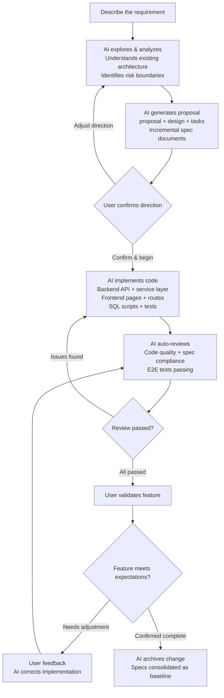
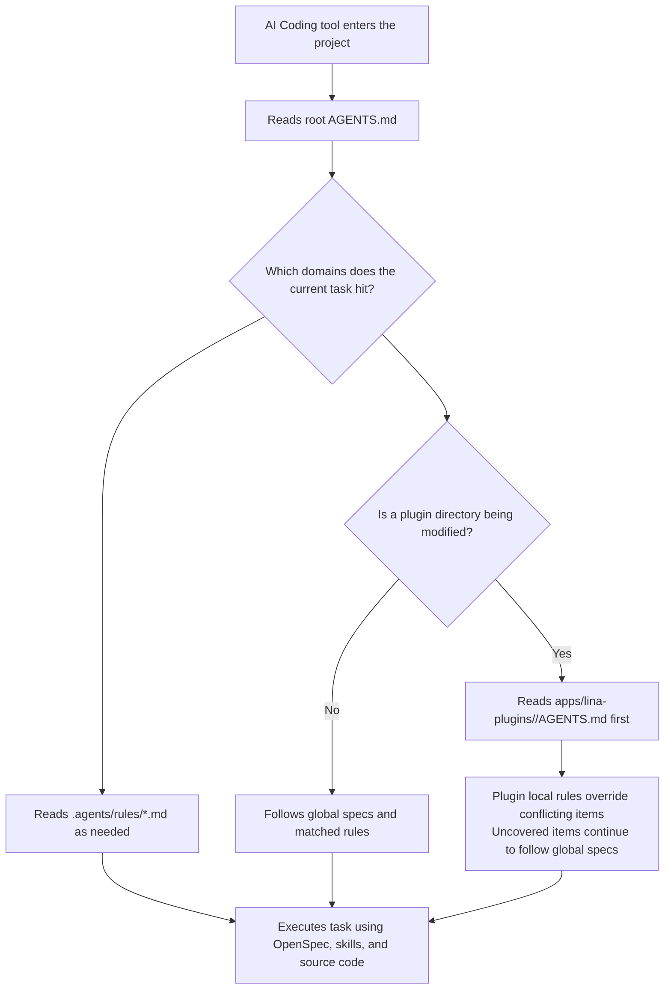

## What "AI-Native" Means

"AI-native" does not mean adding an AI assistant button to your product, nor does it mean using AI to help with one specific feature. AI-native means **making AI the primary path of the product, not an optional add-on**. In an AI-native design, AI is not a tool — AI is the team's core engineering productivity. The developer's role shifts from code writer to **direction-setter and key decision-maker**.

`LinaPro` was designed from the ground up with AI-driven development in mind:

- It provides a spec-driven AI-native development workflow, allowing developers to hand off requirements analysis, system design, code implementation, test verification, and other development work to `AI`.
- It also ships a built-in AI skill system covering the full development lifecycle, giving `AI` the domain-specific knowledge to make framework-compliant decisions in concrete work contexts such as backend development, frontend design, testing, and performance auditing.

These two dimensions complement each other and together form the foundation of `LinaPro`'s AI-native design.

## AI-Native vs. AI-Assisted

| Dimension | AI-Native | AI-Assisted |
|-----------|-----------|-------------|
| **AI's role** | Core engineering productivity, primary path | Optional support tool |
| **Where code comes from** | `AI` writes, humans decide | Humans write, `AI` assists |
| **Documentation** | `AI` maintains it in sync, tightly coupled to code | Humans maintain it, prone to drifting from code |
| **Architecture consistency** | Spec-anchored, `AI` automatically follows | Fully dependent on manual review |
| **Test coverage** | Mandatory `E2E` tests, a prerequisite for every change | Written as needed, gaps possible |
| **Iteration speed** | Bounded by `AI` processing speed | Bounded by human coding speed |

## AI-Native Development System Design

### AI Across the Full Development Lifecycle

In `LinaPro`'s AI-native workflow, AI is deeply involved at every stage of development:

- **Requirements analysis:** `AI` reads the project specs (`AGENTS.md`), existing `OpenSpec` documents, and source code to deeply understand the current architecture. It proactively asks clarifying questions to help you think through scope and impact.

- **System design:** `AI` produces database schema designs, API interface definitions, and frontend page structures, forming a complete design document (`design.md`) and incremental specs (`specs/`) for your review and approval.

- **Implementation:** `AI` works through the task list (`tasks.md`) item by item — backend services, API routes, database DAO layer, frontend page components, permission declarations, and i18n resources, all in one pass.

- **Testing:** `AI` writes E2E test cases, runs them, and ensures the implementation matches the design specification.

- **Documentation archival:** `AI` organizes the design decisions and API specs from the change into baseline documentation for future iterations to reference.

### Built-in AI Skill System

AI-native is not just about a development workflow — it also means the framework provides deep, purpose-built skills for every stage of AI work. `LinaPro` ships a built-in AI skill system covering the full development lifecycle, so AI can work at maximum effectiveness in every concrete scenario without requiring developers to re-explain project conventions at the start of every session. Here are some examples of the built-in skills:

| Category | Skill | Core capability |
|----------|-------|----------------|
| **Development workflow** | `openspec-*` | Requirements exploration, change proposals, design document generation |
| **Development workflow** | `lina-review` | Code and spec compliance review — the quality gate before archiving an `OpenSpec` change |
| **Development workflow** | `lina-feedback` | Issue tracking, bug fixes, and E2E test coverage closure |
| **Frontend** | `frontend-design` | Production-grade frontend design that avoids generic AI-generated interface patterns |
| **Frontend** | `frontend-patterns` | Frontend development patterns: state management, performance optimization, form handling |
| **Testing** | `lina-e2e` | `Playwright` E2E test case naming, organization, and writing conventions |
| **Testing** | `playwright-cli` | Browser automation for E2E test execution and debugging |
| **Quality** | `lina-perf-audit` | Backend API performance auditing — surfaces N+1 queries, missing indexes, and similar issues |
| **Quality baseline** | `karpathy-guidelines` | Guards against common LLM coding pitfalls to keep implementations precise and lean |
| **Version management** | `git-commit-push` | Analyzes the diff and generates commit messages that match the repository's conventions |
| **Version management** | `git-worktree` | Creates isolated `Git` worktrees for parallel tasks to avoid conflicts |

These skills are embedded in the framework's AI collaboration spec (`.agents/skills/`) as domain knowledge. Project built-in skills are loaded automatically with the source code, and AI tools activate the relevant skill automatically when handling the corresponding scenario. External tools or skills such as `OpenSpec CLI`, `goframe-v2`, and `find-skills` are still recommended for on-demand installation to get the full spec-driven and backend development experience. The direct benefit of this rich skill ecosystem is: **in every concrete work context, AI makes decisions that comply with `LinaPro`'s framework constraints** rather than falling back on general model knowledge to produce code or documentation that doesn't fit the project.

### Progressive Project Specification Management

`LinaPro` does not cram all rules into one oversized prompt. Instead, it uses a progressive project specification management strategy. The `AI Agent` first reads the top-level entry point, then continues to read detailed rule files based on the domains hit by the current task.

| Specification resource | Responsibility |
|------------------------|---------------|
| `AGENTS.md` | Top-level specification entry point — declares project positioning, mandatory trigger scenarios, rule-loading gates, and rule file index |
| `.agents/rules/*.md` | Domain-specific detailed rules, such as documentation, plugins, backend, frontend, database, testing, and development tools |
| `.agents/skills/` | Project built-in skills that give `AI` specialized workflows and constraints in concrete scenarios |
| `.agents/prompts/` | Project commands and prompt directory, such as `OpenSpec`-related command entry points |
| `apps/lina-plugins/<plugin-id>/AGENTS.md` | Plugin local specification entry point — applies only to file changes within that plugin directory |

Plugin local specifications are an important part of this strategy. When developing a plugin, if the plugin directory contains an `AGENTS.md`, the `AI Agent` should read it first. When the plugin local specification conflicts with the project top-level specification or `.agents/rules/*.md`, the plugin local specification takes precedence within that plugin directory. Uncovered items continue to follow the global specifications and matched rule files.

The value of this design is that the main project maintains a unified engineering quality baseline, while plugins can express their own domain constraints, directory conventions, business rules, and testing requirements. As the number of plugins grows, `AI` does not need to load all plugin rules at once — it reads the corresponding local specification only when entering a specific plugin development context.

To accommodate different developers' preferred `AI Coding` tools, `LinaPro` provides the `make agents` command family to bridge the unified source to each tool's own conventional paths. For example, tools that natively read `AGENTS.md` need no extra files; tools that only read `CLAUDE.md`, `GEMINI.md`, or `QWEN.md` can use the same root specification through symlinks. Skills and prompts are bridged to `.claude/skills`, `.codex/prompts`, `.cursor/commands`, and similar paths in the same way.

## Spec-Driven Development

`LinaPro`'s AI-native workflow is built on **Specification-Driven Development (SDD)**.

The problem with traditional development is that, over time, documentation falls behind code, code drifts from design, test coverage develops gaps, and the codebase becomes legacy that nobody dares touch.

SDD addresses this through the following mechanisms:

### Every change has a corresponding spec anchor

Each feature iteration produces a complete documentation record under `openspec/changes/`, including design decisions, API specs, and implementation details. These documents serve as AI's context for the next iteration.

### Specs first, code follows

Before a single line of code is written, AI must finalize the spec (`proposal.md` and `design.md` reviewed and approved), and only then begins implementation. This ensures code and documentation are produced in sync within the same iteration cycle.

### Mandatory E2E tests as a prerequisite for every change

Every change must have corresponding E2E test coverage. Passing tests is a required condition for archiving a change — not an optional step. This fundamentally prevents the accumulation of test gaps.

### Archiving is consolidation

When a change is archived, its incremental specs are merged into the `openspec/specs/` directory, building a continuously growing baseline spec library. In future iterations, AI uses these validated baselines as constraints to maintain architectural consistency.

## Why Direct Code Edits Are Discouraged

This is a common question from developers new to `LinaPro`: can I just edit the code directly without going through the AI workflow?

**You can — but it's not recommended.** Here's why:

### Documentation and code immediately diverge

`LinaPro` uses `SDD` spec documents (`design.md`, `specs/`) to describe the current state of the system, managed through `OpenSpec`. If you modify code without updating the specs, the next AI iteration will generate designs based on outdated specs, producing increasingly divergent results.

### AI cannot sense "implicit rules"

When humans modify code directly, they often introduce unstated constraints — a special case added here, a limitation bypassed there — that exist only in the developer's head, not in the spec documents. When AI next modifies the same module, it will likely break these implicit constraints.

### AI can guarantee implementation-documentation consistency

When AI leads the implementation, code and documentation are produced in the same conversation turn. They are necessarily consistent — a level of synchronization that is hard for humans to match.

### Exceptions

The following scenarios may warrant direct code changes:

- Urgent production hotfixes (but add an `OpenSpec` record afterward)
- Highly specialized business constraints that AI cannot adequately understand
- Configuration file and environment variable adjustments

Even in these cases, it is recommended to use the `/lina-feedback` skill afterward to record the change in the currently active `OpenSpec` change.

## The Value of an AI-Native Framework

`LinaPro`'s AI-native design delivers value along five dimensions:

- **Delivery speed**: AI can complete a full CRUD module — backend API, database layer, frontend pages, and test cases — in minutes, work that would take a human engineer several hours.

- **Consistent quality**: Every iteration follows the same standards and best practices. Code style, naming conventions, error handling, and test coverage remain highly consistent, independent of individual developer habits.

- **Sustainable evolution**: Spec documents are updated alongside code. Architectural decisions are documented. New team members can quickly understand the system's design intent by reading `openspec/specs/`.

- **Controlled risk**: Every change has E2E tests as a safety net. AI's review mechanism catches spec-divergent implementations before merge.

- **Context-aware execution**: More than ten built-in AI skills cover the full development lifecycle. Whether the task is backend API development, frontend interface design, E2E test writing, performance auditing, version upgrades, or code commits, AI has dedicated domain knowledge for every specific work context. Developers don't need to re-explain project conventions at the start of each session, which dramatically reduces the cognitive overhead of AI collaboration.
