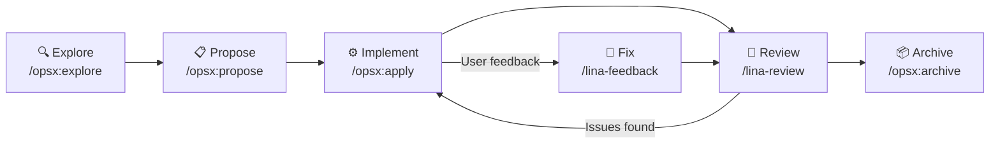

## What Spec-Driven Development Is

Specification-Driven Development (`SDD`) is an AI-native development workflow built on a single core principle: **specs exist before code, and code is driven by specs**.

In traditional development, requirements documents and technical designs quickly become stale after implementation and end up as unmaintained historical artifacts. SDD prevents this through several mechanisms:

- Every feature iteration starts and ends with spec documents
- Spec documents are what AI uses to understand context and make decisions
- Once implementation is complete, specs are updated and archived as baseline
- Future AI iterations use those archived baselines as constraints, ensuring consistency

## The OpenSpec Workflow

`OpenSpec` is `LinaPro`'s built-in spec-driven AI development workflow, organized around the `openspec/` directory. It consists of five stages that form a complete development loop:



### Stage 1: Explore (/opsx:explore)

**Purpose:** Fully understand the requirement and existing architecture before writing any code — identify risks and scope.

**How to invoke:**

```text
/opsx:explore <requirement description>
```

**What AI does:**

- Reads `CLAUDE.md` and the `openspec/` directory to understand the project conventions and current architecture
- Reviews relevant source code to understand existing implementations and reusable capabilities
- Proactively asks clarifying questions to nail down feature boundaries, data models, and blast radius
- Identifies potential risks: data migrations, permission changes, i18n impacts, etc.

**What you do:**

Answer AI's questions, provide additional context, and make decisions when multiple approaches are possible.

**Stage output:** A shared understanding of the requirement between you and AI, with implementation direction agreed upon.

### Stage 2: Propose (/opsx:propose)

**Purpose:** Crystallize the shared understanding from the exploration stage into structured change documents.

**How to invoke:**

```text
/opsx:propose <change-name>
```

The `change-name` uses `kebab-case` to describe the change, e.g., `content-article` or `user-export`.

**What AI does:**

AI generates the following documents under `openspec/changes/<change-name>/`:

| File | Content |
|------|---------|
| `proposal.md` | Change background, target scope, impact analysis, and success criteria |
| `design.md` | Database schema design, API interface definitions, frontend page structure, and key decisions |
| `tasks.md` | Decomposed into actionable tasks, each with a clear completion criterion |
| `specs/<capability>.md` | Incremental capability specs describing the behavior the new feature should exhibit |

**What you do:**

Review the documents — pay particular attention to the database design soundness and task decomposition completeness — then tell AI to proceed once you're satisfied.

**Stage output:** A complete change proposal document, ready to serve as input for implementation.

### Stage 3: Implement (/opsx:apply)

**Purpose:** AI works through the task list and completes the implementation.

**How to invoke:**

```text
/opsx:apply
```

**What AI does:**

- Executes each task in `tasks.md` in order
- Marks each completed task with `[x]`
- Automatically triggers `/lina-review` when implementation is done
- Automatically fixes review findings and repeats until everything passes

**Typical task list structure:**

```markdown
## 1. Database layer
- [x] 1.1 Create install SQL (content_article table)
- [x] 1.2 Create uninstall SQL
- [x] 1.3 Generate DAO/DO/Entity

## 2. Backend layer
- [x] 2.1 Define API DTOs and routes
- [x] 2.2 Implement controller
- [x] 2.3 Implement business service
- [x] 2.4 Register plugin entry point

## 3. Frontend layer
- [x] 3.1 Implement list page
- [x] 3.2 Implement form dialog
- [x] 3.3 Wire up backend API

## 4. i18n
- [x] 4.1 Update host/plugin language packs

## 5. Testing
- [x] 5.1 Write E2E test cases
- [x] 5.2 Run tests and confirm passing
```

**What you do:**

Mostly wait, occasionally answering decision questions AI encounters. Once implementation is complete, verify that the feature behaves as expected.

**Stage output:** Complete code implementation with all E2E tests passing.

### Stage 4: Review (/lina-review)

`/lina-review` is triggered automatically at the following points — no manual invocation needed:

- After `/opsx:apply` completes
- After feedback-driven fixes via `/lina-feedback`
- Before archiving with `/opsx:archive`

Review covers:

- **Code quality**: naming conventions, error handling, logging
- **Spec compliance**: whether implementation matches `design.md`
- **Security checks**: SQL injection, missing permission guards, sensitive data exposure
- **i18n completeness**: whether all new user-facing strings have corresponding translation keys
- **E2E test coverage**: whether test coverage is sufficient

### Stage 5: Archive (/opsx:archive)

**Purpose:** Persist the design decisions and specs from this iteration as durable baseline documentation.

**How to invoke:**

```text
/opsx:archive
```

**What AI does:**

1. Runs a comprehensive review one final time to confirm everything is ready
2. Rewrites `proposal.md`, `design.md`, and `tasks.md` in English (for international accessibility)
3. Merges the incremental specs from `specs/` into the `openspec/specs/` baseline directory
4. Moves the change directory from `openspec/changes/` to `openspec/changes/archive/`

**Stage output:** Change archived, `openspec/specs/` baseline updated, next iteration can build on the new baseline.

## Directory Structure

```text
openspec/
├── changes/                    Active and archived changes
│   ├── <change-name>/          A change in progress
│   │   ├── proposal.md         Change proposal
│   │   ├── design.md           Technical design
│   │   ├── tasks.md            Task list
│   │   └── specs/              Incremental specs
│   └── archive/                Completed and archived changes
├── specs/                      Current active baseline specs
│   └── <capability>.md         Spec document for a specific capability
└── config.yaml                 OpenSpec project-level configuration
```

## Handling User Feedback

When you discover issues or have improvement suggestions, handle them with the `/lina-feedback` skill:

```text
/lina-feedback <issue description>
```

AI appends the feedback to the current active change's `tasks.md`, fixes the implementation, and re-reviews — ensuring every piece of feedback has a complete audit trail.

:::tip Key rule
Unless you explicitly ask to start a new change, all feedback — regardless of whether it relates to the active iteration's primary feature — must be appended to the current active iteration. This keeps archiving clean and traceable.
:::

## What Counts as an Active Change

**Archival status is the sole criterion**: any change directory still located under `openspec/changes/` (not moved to `openspec/changes/archive/`) is considered active — even if all of its tasks are already marked complete. A change is not considered archived until the archive operation has actually run.
