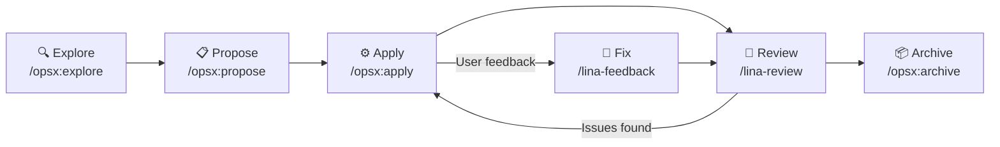

## What Is Specification-Driven Development

Specification-Driven Development (`SDD`) is an AI-native development workflow. Its core philosophy is: **specifications exist before code, and code is driven into existence by specifications**.

In traditional development processes, requirements documents and technical designs often become outdated shortly after code implementation, turning into unmaintained historical artifacts. `SDD` addresses this through the following mechanisms:

- Every feature iteration starts and ends with specification documents
- Specification documents are the basis for `AI` to understand context and make decisions
- After code implementation is complete, specifications are updated in sync and archived as baselines
- Subsequent iterations' `AI` uses archived baseline specifications as constraints, ensuring consistency

## OpenSpec Workflow

`OpenSpec` is the `AI` spec-driven workflow implementation tool that `LinaPro` strongly recommends. It is not a `LinaPro` runtime dependency — users can also use other `SDD` tools (such as `Spec-kit`, `Superpowers`, etc.) — but the framework provides solid application, testing, and support for `OpenSpec`. Teams are encouraged to use it in formal iterations to form a complete development loop:



### Stage 1: Explore (/opsx:explore)

**Purpose:** Before writing any code, fully understand the requirements and existing architecture, and identify risks and boundaries.

**How to invoke:**

```text
/opsx:explore <requirement description>
```

**AI's work:**

- Read `CLAUDE.md` and the `openspec/` directory to understand project conventions and current architecture state
- Browse related source code to understand existing implementations and reusable capabilities
- Proactively raise clarifying questions to help define feature boundaries, data models, and impact scope
- Identify potential risks such as data migration, permission changes, `i18n` impact, etc.

**Human's work:**

Answer `AI`'s questions, provide more background information, and make decisions between multiple approaches.

**Stage output:** Shared understanding of requirements; implementation direction confirmed.

### Stage 2: Propose (/opsx:propose)

**Purpose:** Crystallize the exploration stage's consensus into structured change documents.

**How to invoke:**

```text
/opsx:propose <change-name>
```

Where `change-name` uses `kebab-case` format to describe the change, such as `linapro-content-article` or `user-export`.

**AI's work:**

Generate the following documents in `openspec/changes/<change-name>/`:

| File | Content |
|------|---------|
| `proposal.md` | Change background, scope, impact analysis, success criteria |
| `design.md` | Database table design, `API` interface definitions, frontend page structure, key design decisions |
| `tasks.md` | Breakdown into executable task list, each with clear completion criteria |
| `specs/<capability>.md` | Incremental capability specification describing the expected behavior of the new feature |

**Human's work:**

Review documents, focusing on database design rationality and task breakdown completeness. Confirm the direction is correct, then tell `AI` to proceed with implementation.

**Stage output:** Complete change proposal documents, serving as input for the implementation stage.

### Stage 3: Apply (/opsx:apply)

**Purpose:** `AI` completes code implementation item by item according to the task list.

**How to invoke:**

```text
/opsx:apply
```

**AI's work:**

- Follow the task order in `tasks.md` and complete each implementation item
- Mark each completed task as done (`[x]`) in `tasks.md`
- Automatically trigger `/lina-review` for review after implementation is complete
- Automatically fix issues found during review, repeating until all pass

**Typical task list structure:**

```markdown
## 1. Database Layer
- [x] 1.1 Create install SQL (content_article table)
- [x] 1.2 Create uninstall SQL
- [x] 1.3 Generate DAO/DO/Entity

## 2. Backend Layer
- [x] 2.1 Define API DTOs and routes
- [x] 2.2 Implement controllers
- [x] 2.3 Implement business services
- [x] 2.4 Register plugin entry

## 3. Frontend Layer
- [x] 3.1 Implement list page
- [x] 3.2 Implement form dialog
- [x] 3.3 Connect to backend API

## 4. i18n
- [x] 4.1 Update main framework / plugin language packs

## 5. Testing
- [x] 5.1 Write E2E test cases
- [x] 5.2 Run tests and pass
```

**Human's work:**

Mostly waiting, occasionally answering decision questions from `AI`. After implementation is complete, verify that the functionality meets expectations.

**Stage output:** Complete code implementation, all `E2E` tests passing.

### Stage 4: Review (/lina-review)

The `/lina-review` skill is automatically triggered at the following points, with no manual invocation needed:

- After `/opsx:apply` implementation is complete
- After user feedback is fixed via `/lina-feedback`
- Before `/opsx:archive` archiving

Review scope includes:

- **Code quality**: Naming conventions, error handling, logging
- **Specification compliance**: Whether implementation matches `design.md`
- **Security checks**: `SQL` injection, permission gaps, sensitive information leaks
- **`i18n` completeness**: Whether all new text has corresponding translation keys
- **`E2E` tests**: Whether test coverage is sufficient

### Stage 5: Archive (/opsx:archive)

**Purpose:** Crystallize this iteration's design decisions and specifications into a persistent baseline.

**How to invoke:**

```text
/opsx:archive
```

**AI's work:**

1. Run a comprehensive review again to ensure everything is ready
2. Rewrite `proposal.md`, `design.md`, and `tasks.md` to English (for internationalization)
3. Merge incremental specifications from `specs/` into the `openspec/specs/` baseline directory
4. Move the change directory from `openspec/changes/` to `openspec/changes/archive/`

**Stage output:** Change archived, `openspec/specs/` baseline updated. The next iteration can proceed based on the new baseline.

## Directory Structure

```text
openspec/
├── changes/                    Active and archived changes
│   ├── <change-name>/          In-progress change
│   │   ├── proposal.md         Change proposal
│   │   ├── design.md           Technical design
│   │   ├── tasks.md            Task list
│   │   └── specs/              Incremental specs
│   └── archive/                Completed and archived changes
├── specs/                      Currently active baseline specs
│   └── <capability>.md         Spec document for a specific capability
└── config.yaml                 OpenSpec project-level configuration
```

## User Feedback

When users discover issues or suggest improvements, the `/lina-feedback` skill handles them (this skill is also triggered automatically even without explicit invocation):

```text
/lina-feedback <issue description>
```

`AI` appends user feedback to the current active change's `tasks.md`, fixes the implementation, then re-reviews, ensuring every piece of feedback has a complete record.

:::tip Key Rule
Unless the user explicitly requests a new change, regardless of whether the feedback relates to the current active iteration's main feature, it must be appended to the current active iteration for unified archive management.
:::
