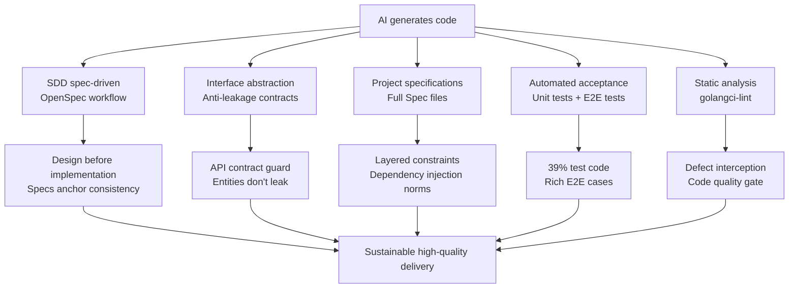
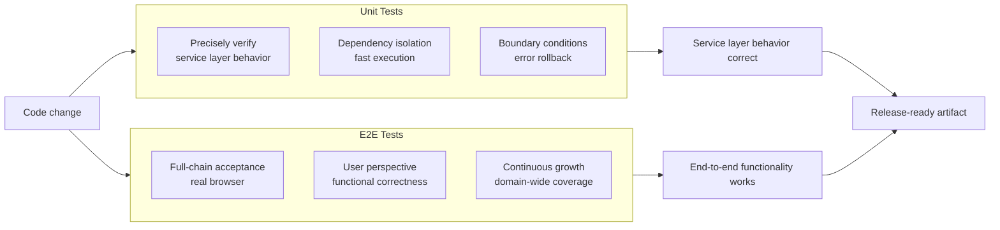
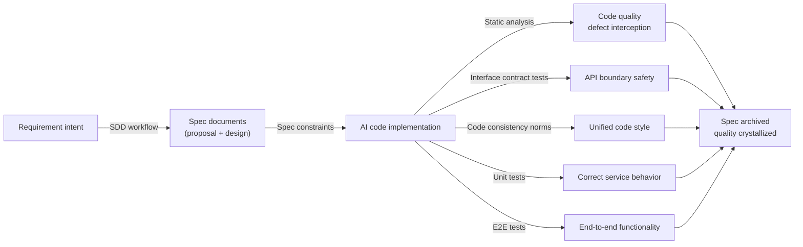

## AI Makes Code Faster — But Who Ensures Quality

AI-assisted programming is profoundly changing the speed equation of software development. A developer proficient with AI coding tools can produce several times — even ten times — more code per unit of time than with traditional methods. However, behind this speed boost lies a new engineering management dilemma: **there's more and more code, but who ensures it's correct, consistent, and maintainable?**

In practice, teams face not just the simple problem of "AI wrote it wrong," but a series of deeper engineering challenges: from everyday style inconsistencies and fuzzy interface boundaries, to long-term architectural drift and specification gaps, to nearly imperceptible security data leakage risks. These problems exist in traditional development too, but under AI's high-speed iteration, both the speed and scale of their exposure are dramatically amplified.

`LinaPro` established engineering quality assurance as a core pillar of its AI-native design from the very beginning of the project. This article starts from the industry's real challenges and systematically introduces how `LinaPro` builds a complete AI engineering quality assurance system through spec-driven workflows, interface abstraction, high-density testing, and static analysis.

## Current AI Engineering Quality Challenges

### Challenge 1: Rapid Code Consistency Breakdown

Before introducing AI coding, a team's codebase typically undergoes months or years of refinement, forming relatively consistent style and habits: variable naming patterns, error handling approaches, logging conventions, layered calling patterns... These habits are often unwritten but form the team's "code culture" — new members can quickly understand what constitutes "correct" practice in the project by reading the code.

AI coding tools break this accumulation mechanism. In each session, `AI` makes decisions based on its training data and current context. Different contexts, different prompts, and even different model versions can produce wildly different outputs. As features accumulate, the codebase starts to harbor multiple coexisting dependency injection styles, several sets of error handling patterns, and incompatible naming conventions. **The codebase's consistency wasn't intentionally destroyed — it quietly vanished in countless "good enough" moments.**

### Challenge 2: Architectural Drift and Design Intent Amnesia

Software architecture isn't a few diagrams in a file — it's the team's consensus on system boundaries, responsibility allocation, and evolution paths. In traditional development, this consensus is continuously transmitted through code reviews and team discussions. In AI-led coding teams, architectural consensus often exists only within a single conversation's context window.

Once the session ends, `AI` "forgets" the architectural decisions reached during that exchange. In the next conversation, `AI` might introduce cross-domain dependencies within a single domain to fulfill a local requirement, quietly breaking established module boundaries. Each such change looks reasonable in isolation, but accumulated enough, the system's architecture becomes unrecognizable — **everyone knows the problem exists, but nobody knows where to start fixing it.**

### Challenge 3: Vibe Coding and Missing Quality Gates

"Vibe Coding" is a practice style that has emerged in the AI coding community in recent years — intuition-driven, fast-iteration, not overthinking code structure, making "if it runs, it's fine" the guiding principle. This approach has value during prototyping, but as a formal engineering methodology, its problems are serious: **a codebase without quality gates accumulates technical debt far faster than AI's efficiency gains.**

Without clear pass/fail criteria, teams cannot tell whether an AI modification broke existing functionality. Without automated testing, a regression on a critical path might not be discovered until after release. Without interface contract constraints, an accidentally exposed internal field can become a security vulnerability entry point.

### Challenge 4: Test Gaps and Acceptance Vacuum

Even when teams recognize the importance of testing, test coverage in AI coding scenarios faces structural difficulties. When `AI` generates business logic, if it's not required to simultaneously produce test code, testing is often deferred to "when there's time" — and that time almost never comes.

A more insidious problem: even when `AI` does generate test code, those tests may only verify happy paths while missing boundary conditions, error rollbacks, permission isolation, and other critical scenarios. **The existence of a test file does not equal test coverage, and the existence of a coverage number does not equal quality assurance.**

### Challenge 5: Fuzzy Interface Boundaries and Data Leakage Risk

In AI-generated code, a common and dangerous pattern is **directly exposing database entities as `API` responses**. Database table fields often contain internal governance information (such as soft-delete flags, password hashes, internal paths, etc.). Directly exposing these fields violates `API` design principles and may introduce security risks. When `AI` sees both entity definitions and controller code in the same context, the most "natural" approach is often to return the entity directly — which is precisely the most dangerous approach.

## LinaPro's Quality Assurance System

`LinaPro`'s quality assurance system is built on five complementary dimensions: spec-first, interface constraints, code layering, automated acceptance, and static analysis. Together they form a multi-layered defense net, ensuring every piece of `AI`-generated code operates under structured constraints.

### Dimension 1: SDD Spec-Driven Workflow

`LinaPro`'s core development workflow is **Specification-Driven Development (`SDD`)**. Its core philosophy is: **specifications exist before code, and code is driven into existence by specifications**. Each feature iteration doesn't start with writing code — it starts with a set of structured documents:

- `proposal.md` — Defines requirement boundaries and implementation goals
- `design.md` — Describes database design, `API` interface definitions, and frontend page structure
- `tasks.md` — Breaks down into an implementation task list that can be completed item by item
- `specs/` — Incremental specification files after implementation, archived as persistent baselines

These documents are not post-delivery summaries — they are **inputs that drive implementation**. `AI` understands the specifications before writing code; `AI` updates and archives the specifications after completing implementation. Specifications stay in sync with code at all times, rather than becoming abandoned historical documents over time.

The quality value of spec-driven development manifests in the following areas:

| Quality Dimension | Traditional Approach | SDD Approach |
|-------------------|---------------------|--------------|
| **Architecture consistency** | Relies on developer memory and oral tradition | Spec documents serve as constraint baselines; `AI` starts from specs every time |
| **Change traceability** | Code commit history can't reflect design intent | Every change has a corresponding `proposal.md` and `design.md` |
| **Cross-session consistency** | `AI` starts from zero understanding every conversation | Spec documents provide stable cross-session context anchors |
| **Architectural drift detection** | Can only be found through code review | `E2E` tests serve as hard gates; drift equals failure |

`LinaPro` implements the SDD workflow through the `OpenSpec` tool, supporting the complete five-stage development loop. For details, see: [Spec-Driven Development](/docs/spec-driven-development).

### Dimension 2: Two-Layer Project Specification Constraint System

`LinaPro` covers all aspects of `AI` coding behavior through two complementary specification file types: one is the **persistent constraint file** loaded instantly at the start of every `AI` session, covering the entire project; the other is **capability-domain baseline specifications** that are continuously refined as features evolve, precise down to acceptance scenarios. The two have clear divisions of labor and work together to form a complete specification constraint system.

#### Persistent Constraint File: AGENTS.md

`AGENTS.md` (also serving as a symlink for `CLAUDE.md`) is the **project-level specification file** that `AI` coding agents in `LinaPro` projects must prioritize reading at the start of every session. Unlike the capability-domain specifications in `openspec/specs/`, `AGENTS.md` is a set of **persistent, cross-iteration global constraints** that remain effective regardless of what feature the current iteration involves.

The core constraint dimensions covered by `AGENTS.md` include:

- **Architecture design constraints**: Defines the project positioning and `lina-core` main framework boundaries, preventing the core domain from being tightly bound to workspace display structures, and maintaining the stability of core domain contracts.
- **Module design norms**: Business modules support on-demand disabling with corresponding frontend hiding; data permissions must be explicitly injected at the query layer — in-memory filtering as a substitute is not allowed; source plugin directory structure is strictly fixed.
- **Interface design constraints**: Mandates `RESTful` semantics, prohibits action-oriented path naming, and maintains consistent resource path style across the entire repository.
- **Code quality norms**: Runtime dependencies must be explicitly injected; errors must be wrapped through `bizerr`; logs must pass `ctx` along the call chain; caches must coordinate across instances in cluster mode.
- **`API` response contracts**: Timestamp fields must return `Unix` millisecond integers; `DTO` fields must include English documentation tags; development tools must be cross-platform executable.
- **Compilation and test gates**: `Go` production code changes must run `go test` smoke tests first; interface signature changes additionally require passing startup binding package tests — relying solely on static analysis to confirm compilability is not allowed.
- **Continuous governance requirements**: Feature changes must assess `i18n` impact; cache design must distinguish between single-node and cluster strategies; bug fixes must include automated tests.

These constraints are not soft suggestions — they are **behavioral norms** for `AI` agents. `AI` must use these rules as the baseline for every code generation decision, and any deviation will be explicitly flagged during code review. This means that even in a brand-new session, `AI` won't produce output that deviates from project style due to "not knowing the project conventions" — **the specification file itself is `AI`'s memory**.

These constraints are repository-level: both framework code and business plugin code fall under their coverage. Teams don't need to separately define layered constraints, interface design norms, or data permission rules for their own plugins — the framework's specification files already constitute `AI`'s global behavioral baseline. Teams only need to supplement on top of this based on business needs.

#### Capability-Domain Baseline Specifications: openspec/specs/

In `LinaPro`'s `openspec/specs/` directory, **baseline specification files** covering various capability domains of the system are deposited. These specifications are not conceptual-level vision descriptions — they are engineering constraints precise down to the scenario level: each specification has clear `SHALL`/`MUST NOT` semantics, with accompanying `Scenario` descriptions specifying concrete acceptance conditions.

Using the backend consistency specification as an example, it covers scenario-level engineering constraints such as dependency injection patterns, service component granularity, database operation norms, and error handling conventions. These specification files serve as context for `AI` during code generation and as a benchmark during code review. When `AI`-generated code doesn't conform to specifications, the issue can be precisely identified rather than relying on the reviewer's subjective judgment.

#### Division of Labor Between the Two Specification Layers

| Specification Layer | File | Scope | Update Timing |
|---------------------|------|-------|---------------|
| **Persistent constraints** | `AGENTS.md` | Entire project, all iterations, all `AI` sessions | Revised when architectural decisions change |
| **Capability-domain baselines** | `openspec/specs/<domain>/spec.md` | Acceptance scenarios for specific capability domains | Deposited after each feature iteration is archived |

The two specification layers cover `AI`'s coding behavior at different granularities: persistent constraints provide a global baseline, ensuring `AI` output in any session doesn't deviate from the project's fundamental design principles; capability-domain baselines provide local precision, ensuring each specific feature's implementation details meet that capability's acceptance expectations.

### Dimension 3: Interface Abstraction and API Anti-Leakage Contracts

Clear interface boundaries are the foundation of long-term system maintainability and the area where `AI`-generated code is most prone to problems. When `AI` sees both database entity definitions and `API` controller code in the same context, the most "natural" approach is often to return the entity directly to the caller. This shortcut looks fine in the short term, but it quietly couples the `API` contract to the internal data structure — every subsequent database change could inadvertently alter the external interface behavior.

`LinaPro`'s design philosophy is: **the `API` layer is a stable contract between the system and the outside world, not a transparent window into internal implementation**. Regardless of how the internal data model evolves, the `API` contract should remain independently controlled. Based on this philosophy, the framework has established two core principles for interface design:

**Principle 1: Interface responses are strictly isolated from database entities**

`API` responses must use independently defined data structures with explicit mapping of fields allowed for external exposure, rather than directly passing through database entities. The benefits are twofold: on one hand, database field additions, renames, or structural changes won't passively alter the external `API` contract — the two can evolve at their own pace. On the other hand, internal governance fields — such as soft-delete flags, password hashes, system paths, storage engines, etc. — will never appear in external responses due to oversight, eliminating an entire class of data leakage risk at the source.

**Principle 2: Interface boundaries are continuously guarded by automated contract tests**

Maintaining interface boundaries through design documents and code review alone is fragile — in AI's high-speed code generation scenario, specifications may be quietly bypassed during an iteration without anyone noticing. `LinaPro` addresses this with dedicated **`API` contract guard tests**: every build automatically scans all `API` packages, verifying that public response structures don't introduce database entity dependencies and that sensitive fields don't appear in `JSON` serialization. Any violation causes the build to fail immediately.

**Interface boundaries are not maintained through code review — they are guarded by automated tests.** This is `LinaPro`'s fundamental stance on interface quality. Specifications written in documents are ultimately just soft constraints. Only by turning boundary checks into executable tests can interface security be continuously guaranteed with every iteration, rather than relying on team members' memory and self-discipline.

It's worth emphasizing that triggering these contract tests **does not require manual developer intervention**. This capability is automatically executed through `LinaPro`'s project specifications and built-in `AI` skills — after `AI` completes interface-related code generation, it automatically triggers contract verification per project conventions, without developers needing to remember when to run which tests. For teams using `LinaPro`, interface quality guarding is a built-in default behavior of the framework, not a development habit that needs to be separately established. This significantly reduces the mental burden on developers and makes the framework easier to use correctly in AI coding scenarios.

### Dimension 4: High-Density Test Coverage

One of `LinaPro`'s most distinctive engineering quality characteristics is its extremely high **test code density**. Across the entire codebase, **test code accounts for 39% of total code volume** — a ratio far exceeding the industry average and the most direct embodiment of `LinaPro`'s engineering quality philosophy.

The testing system operates at two levels, each with its own responsibilities:

#### Unit Tests: Precisely Verifying Service Layer Behavior

Backend unit tests cover all critical service layer logic in the framework core and official plugins. Tests are built directly at the service layer, bypassing the `HTTP` layer, and replace external services (databases, caches, plugin runtimes, etc.) through dependency injection to precisely verify the correctness of individual behaviors.

Typical test scenarios include but are not limited to:

- **Plugin lifecycle**: Verifying the correctness of state transitions for install, enable, disable, and uninstall, as well as automatic dependency resolution and rollback behavior
- **Multi-tenant isolation**: Verifying transaction rollback when tenant creation fails, ensuring no half-created state is left behind
- **Startup consistency checks**: Verifying that illegal plugin governance configuration combinations are rejected at service startup, preventing unrecoverable states at runtime
- **Security boundaries**: Verifying that single-node mode doesn't produce multi-node state projections, and that platform-level operations maintain isolation from tenant-level plugins

This testing requirement is **automatically driven by project specifications and the framework's built-in `AI` skills, without requiring manual developer triggers**.

#### E2E Tests: Full-Chain Browser-Level Acceptance

End-to-end tests are based on `Playwright`, driving the complete frontend-backend chain through a real browser for acceptance. Every feature iteration requires corresponding `E2E` test cases to be added in sync. `LinaPro` already covers core capability domains including user authentication, permission management, dictionaries and configuration, file management, task scheduling, multi-tenancy, and plugin extensions, with test case counts continuously growing as the project iterates.

`E2E` tests are not an optional "bonus" — they are a **hard prerequisite** for feature changes. In `LinaPro`'s `SDD` workflow, each change must have corresponding `E2E` tests passing before it can be archived. If official plugin `E2E` cases are missing, the nightly build (`Nightly`) image release will be blocked.

The `E2E` test execution requirement is similarly **embedded in the `SDD` workflow itself, rather than relying on developer memory**. `LinaPro` bakes acceptance requirements into workflow nodes, transforming "writing tests" from a habit requiring self-discipline into an unskippable step in the `AI`-driven process. This significantly reduces dependence on developer discipline.

#### How the Two Levels Work Together

Unit tests and `E2E` tests provide quality assurance at different granularities. They complement rather than replace each other: unit tests ensure the precise correctness of service layer logic, while `E2E` tests ensure the entire system presents correct behavior to users.

### Dimension 5: Backend Code Quality Static Analysis

Beyond test coverage, `LinaPro` introduces **backend code quality static analysis** as the fifth quality assurance dimension. This analysis system is built on two industry-proven `Go` static analysis tools — `golangci-lint` and `staticcheck` — executed uniformly through `make lint` or `make lint.go`.

#### Analysis Toolchain

| Tool | Version Pinning | Primary Responsibility |
|------|-----------------|----------------------|
| `golangci-lint` | `.golangci-lint-version` (currently `v2.12.2`) | Comprehensive code quality checks, integrating dozens of linters |
| `staticcheck` | `.staticcheck-version` (currently `v0.7.0`) | Focused dead code detection (`U1000` rules) |

#### Scope and Rules

Static analysis covers all modules in the `Go` workspace, including the core framework `apps/lina-core`, the development tool `hack/tools/linactl`, and enabled official plugins. Analysis rules are centrally configured in `.golangci.yml`, spanning the following quality dimensions:

- **Defect detection**: `errcheck`, `govet`, `staticcheck` catch potential runtime errors
- **Resource management**: `bodyclose`, `sqlclosecheck`, `rowserrcheck` ensure proper resource cleanup
- **Error handling**: `errorlint`, `errname`, `errchkjson` standardize error wrapping and propagation
- **Security checks**: `bidichk`, `forcetypeassert` guard against common security pitfalls
- **Performance optimization**: `makezero`, `wastedassign`, `usestdlibvars` avoid inefficient code patterns
- **Maintainability**: `cyclop` (cyclomatic complexity), `misspell`, `whitespace` keep code clean

#### Integration with the AI Workflow

Static analysis is similarly **embedded in `LinaPro`'s development workflow**. `make dev` runs static checks automatically before starting the development server, and the `CI` pipeline treats `make lint` as a blocking gate — any code violating the analysis rules cannot pass the build. Developers can also run `make lint.go fix=true` to let `golangci-lint` auto-fix certain correctable issues.

The value of this mechanism lies in: **code quality standards are enforced by tooling, not by developer judgment**. Even under AI's high-speed code generation scenario, potential defects, resource leaks, and error handling omissions are automatically intercepted at the build stage and never flow into subsequent testing and release pipelines.

## The Overall Effect of Quality Assurance

Combining the safeguards from all five dimensions, `LinaPro` forms a complete quality chain from specification design to automated acceptance and static analysis:

The core value this system delivers is: **quality assurance is systematic, not dependent on individual developer discipline**. Specifications are machine-readable, gates are automated, tests are mandatory, and static analysis is blocking — this means that even under AI's high-speed iteration and massive code output scenarios, quality standards won't be quietly lowered because "we're in a rush today" or "we'll skip it this time."

For teams using `LinaPro`, this system means:

- Any code with potential defects or resource leaks is intercepted at the static analysis stage and never enters subsequent pipelines
- Any code violating `API` contracts fails automatically in `CI` and never enters the main branch
- Any change breaking functionality is caught by `E2E` tests and never enters the release pipeline
- Any implementation deviating from specifications has clear documentation for comparison — reviews have evidence to rely on
- Design decisions from every iteration are permanently preserved through spec archival, not lost when a session ends

In the AI era, speed is the starting point, not the destination.
