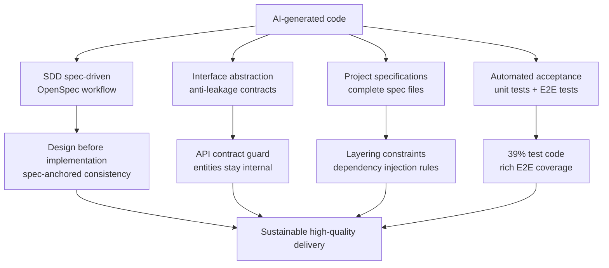
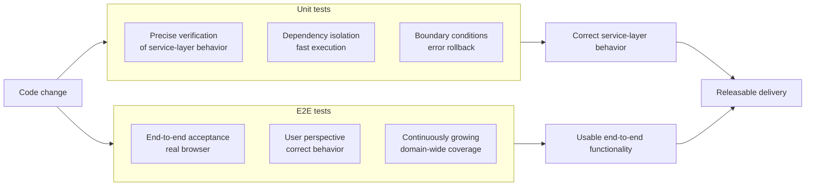
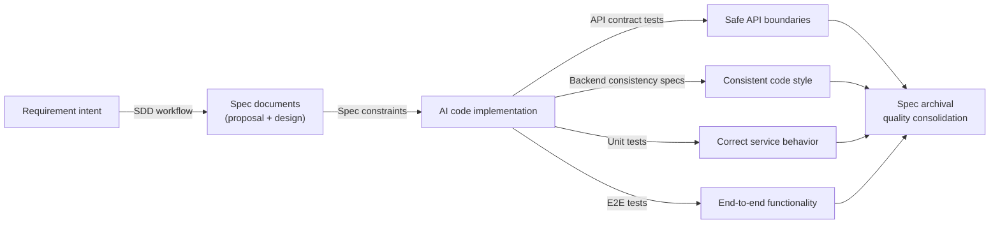

## AI Makes Code Faster. Who Keeps It Correct?

`AI`-assisted programming is changing the speed equation of software development. A developer who uses `AI` programming tools well can produce several times, sometimes even ten times, more code in the same amount of time than with traditional development. But behind that speed is a new engineering management problem: **as the amount of code grows, who ensures that the code is correct, consistent, and maintainable?**

In practice, teams face more than the simple problem of "`AI` wrote something wrong." They face deeper engineering challenges: inconsistent style, blurred interface boundaries, long-term architectural drift, hollow specifications, and security risks from data leakage that are easy to miss. These problems also exist in traditional development, but high-speed `AI` iteration greatly amplifies both how quickly they appear and how widely they spread.

From the beginning, `LinaPro` treats engineering quality assurance as a core part of its AI-native design. This page starts from the real challenges now facing the industry and explains how `LinaPro` builds a complete `AI` engineering quality system through spec-driven workflows, interface abstraction, high-density testing, and related practices.

## Quality Challenges in Current AI Engineering

### Challenge 1: Code Consistency Breaks Down Quickly

Before `AI` programming entered the picture, a team's codebase usually accumulated a relatively consistent style over months or years: variable naming patterns, error handling conventions, logging habits, layering rules, and so on. These habits were often unwritten, but they formed the team's "code culture." New members could understand what counted as the "right" way to work in the project by reading existing code.

`AI` programming tools disrupt that accumulation mechanism. In each session, `AI` makes decisions based on its training data and the current context. Different context, different prompts, or even different model versions can produce very different output styles. As the number of features grows, the codebase can start to contain multiple dependency injection styles, several error handling patterns, and incompatible naming conventions. **Codebase consistency is not usually destroyed on purpose. It quietly disappears through countless "good enough" edits.**

### Challenge 2: Architectural Drift and Lost Design Intent

Software architecture is not a few diagrams in a file. It is a team's shared understanding of system boundaries, responsibility allocation, and evolution paths. In traditional development, that shared understanding is passed forward through code review and team discussion. In teams where `AI` leads coding work, architectural agreement often exists only inside the context window of a single conversation.

Once that session ends, `AI` "forgets" the architectural decisions reached in the conversation. In the next session, `AI` may introduce a dependency from one domain into another to satisfy a local requirement, silently breaking existing module boundaries. Each individual change may look reasonable, but over time the system architecture can become unrecognizable. **Everyone knows there is a problem, but nobody knows where to start fixing it.**

### Challenge 3: Vibe Coding and Missing Quality Gates

"Vibe coding" has become a common practice style in the `AI` programming community: move by intuition, iterate quickly, avoid spending too much time on code structure, and treat "it runs" as the main rule. This can be useful during prototyping, but as a formal engineering method it has a serious downside: **in a codebase without quality gates, technical debt accumulates faster than the efficiency gains brought by `AI`.**

Without clear pass/fail criteria, a team cannot tell whether an `AI` change has broken existing behavior. Without automated tests, a regression on a critical path may only be found after release. Without interface contract constraints, an internal field accidentally exposed by an `API` can become an entry point for a security issue.

### Challenge 4: Hollow Tests and an Acceptance Vacuum

Even when teams understand the importance of testing, test coverage in `AI` programming still faces structural difficulties. When `AI` generates business logic, tests are often postponed until "there is time" unless the workflow explicitly requires test code to be generated at the same time. That time almost never arrives.

The more subtle issue is that even when `AI` does generate tests, those tests may only cover the happy path while missing boundary conditions, error rollback, permission isolation, and other critical cases. **The presence of test files does not equal test coverage, and a coverage number does not equal quality assurance.**

### Challenge 5: Blurred Interface Boundaries and Data Leakage Risk

One common and dangerous pattern in rapidly generated `AI` code is **returning database entities directly as `API` responses**. Database tables often contain internal governance fields, such as soft-delete flags, password hashes, and internal paths. Exposing these fields directly violates `API` design principles and can create security risks. When `AI` sees both entity definitions and controller code in the same context, the most "natural" path is often to return the entity directly. That is exactly the dangerous path.

## LinaPro's Quality Assurance System

`LinaPro`'s quality assurance system is built on four mutually reinforcing dimensions: spec-first development, interface constraints, code layering, and automated acceptance. Together, they form a layered safety net that keeps every piece of `AI`-generated code operating inside structured constraints.

### Dimension 1: The SDD Spec-Driven Workflow

`LinaPro`'s core development workflow is **Specification-Driven Development (`SDD`)**. Its central idea is simple: **specifications exist before code, and code is produced from specifications**. A feature iteration does not start with code. It starts with a structured set of documents:

- `proposal.md`: Defines the requirement boundary and implementation goals
- `design.md`: Describes database design, `API` definitions, and frontend page structure
- `tasks.md`: Breaks implementation into actionable checklist items
- `specs/`: Captures incremental capability specs that become persistent baselines after archival

These documents are not a summary produced after delivery. They are the **input that drives implementation**. Before writing code, `AI` reads the specs. After completing the implementation, `AI` updates and archives the specs. Specifications stay aligned with the code instead of degrading into abandoned historical documents.

Spec-driven development improves quality in several ways:

| Quality dimension | Traditional approach | SDD approach |
|-------------------|----------------------|--------------|
| **Architectural consistency** | Depends on developer memory and oral knowledge transfer | Spec documents act as the constraint baseline, and `AI` starts from them every time |
| **Change traceability** | Commit history rarely captures design intent clearly | Every change has corresponding `proposal` and `design` documents |
| **Cross-session consistency** | `AI` starts over in each conversation | Specs provide stable cross-session context anchors |
| **Architectural drift detection** | Usually found only through code review | `E2E` tests act as a hard gate; drift causes failure |

`LinaPro` implements the `SDD` workflow through `OpenSpec`. The tool provides four stage commands, `/opsx:explore`, `/opsx:propose`, `/opsx:apply`, and `/opsx:archive`, supporting a complete five-stage development loop. For details, see [AI Spec-Driven Development](/docs/spec-driven-development).

### Dimension 2: Two Layers of Project Specification Constraints

`LinaPro` uses two complementary kinds of specification files to cover the full constraint surface of `AI` coding behavior. One is a set of **resident constraint files** loaded at the start of every `AI` session and applied across the whole project. The other is a set of **capability-domain baseline specs** that evolve with features and define precise acceptance scenarios. They serve different roles and work together as a complete specification constraint system.

#### Resident Constraint Files: AGENTS.md / CLAUDE.md

`AGENTS.md`, which is also linked as `CLAUDE.md`, is the **project-level specification file** that `AI` coding agents in `LinaPro` must read first at the beginning of every session. Unlike capability-domain specs under `openspec/specs/`, `AGENTS.md`/`CLAUDE.md` is a set of **resident, cross-iteration global constraints**. No matter which feature the current iteration touches, these constraints remain in force.

`AGENTS.md`/`CLAUDE.md` covers the following core constraint dimensions:

- **Architecture constraints**: Defines the project positioning as an AI-native full-stack framework for sustainable delivery. It specifies the boundary of the `lina-core` host: the core host must not be tightly coupled to the admin workspace presentation structure, and workspace-layer changes must be handled in the adaptation layer rather than pushed down into core domain contracts.

- **Module design rules**: Requires every business module to support on-demand disabling. When disabled, related frontend `UI` elements must be hidden together. Data permission integration must be explicitly evaluated, and read APIs must inject filters at the database query layer instead of relying on in-memory filtering. Source plugin directory structure is fixed; business `service` code must not be placed in non-standard locations such as `backend/service/`.

- **Interface design constraints**: Enforces `RESTful` semantics. `GET`, `POST`, `PUT`, and `DELETE` must strictly match operation semantics. Action-style path names are prohibited, and resource-oriented path naming must remain consistent across the repository.

- **Compilation and testing gates**: Any task that adds or modifies production `Go` code must run a `go test` smoke test covering the changed package before it can be marked complete. Changes involving controller construction, route binding, or `API` signatures must also run startup and binding package tests. Backend changes cannot be considered compilable based only on static analysis or historical assumptions.

- **Continuous governance requirements**: Every functional change must evaluate its impact on `i18n` and explicitly decide whether translation keys need to be added, modified, or removed. Cache-related designs must distinguish single-node and clustered deployments; when `cluster.enabled=true`, they must not fall back to local-only cache behavior visible only on the current node. Bug fixes must add or update automated tests that prove the fix works, and behavior defects cannot be marked complete without tests.

These constraints are not suggestions. They are the **behavioral rules** for `AI` agents. Before generating code, `AI` must make decisions against these rules, and any deviation is called out during code review. This means that even in a brand-new session, `AI` does not produce output that drifts from project style simply because it "does not know the project conventions." **The specification file itself is `AI`'s memory.**

These constraints apply at the repository level, covering both framework code and business plugin code. Teams do not need to define their own layering constraints, interface design rules, or data permission rules for every plugin from scratch. The framework specification files already provide the global behavioral baseline for `AI`; teams only need to add business-specific constraints as needed.

#### Capability-Domain Baseline Specs: openspec/specs/

Under `LinaPro`'s `openspec/specs/` directory, baseline spec files cover the system's capability domains. These are not abstract vision documents. They are engineering constraints written down to scenario-level precision: each requirement uses explicit `SHALL`/`MUST NOT` semantics, and each `Scenario` describes concrete acceptance conditions.

For example, the backend consistency spec explicitly constrains behavior such as:

- Controller dependencies must be injected explicitly through constructors and must not be created implicitly inside request paths
- Service components must be split into separate files by responsibility, and large files must not accumulate multiple responsibilities
- Database operations must pass data through `DO` objects and must not manually maintain time fields managed by the framework
- Runtime errors must be returned as `error` values to callers, and business paths must not use `panic` as a substitute for error handling

These spec files provide context for `AI` code generation and comparison targets for code review. When a piece of `AI`-generated code does not comply with a spec, the issue can be identified explicitly instead of depending on the reviewer's subjective judgment.

#### How the Two Layers Divide Responsibilities

| Specification layer | Files | Scope | When updated |
|---------------------|-------|-------|--------------|
| **Resident constraints** | `AGENTS.md` / `CLAUDE.md` | Whole project, all iterations, every `AI` session | Revised when architectural decisions change |
| **Capability baselines** | `openspec/specs/<domain>/spec.md` | Acceptance scenarios for a specific capability domain | Consolidated after each feature iteration is archived |

The two layers constrain `AI` coding behavior at different levels of granularity. Resident constraints provide the global baseline, ensuring that `AI` output in any session does not violate the project's fundamental design principles. Capability baselines provide local precision, ensuring that the implementation details of each concrete feature satisfy that capability's acceptance expectations.

### Dimension 3: Interface Abstraction and API Anti-Leakage Contracts

Clear interface boundaries are essential for long-term maintainability, and they are also one of the areas where `AI`-generated code is most likely to go wrong. When `AI` sees database entity definitions and `API` controller code in the same context, the most "natural" implementation is often to return entities directly to callers. That shortcut may look harmless in the short term, but it silently couples the `API` contract to internal data structures. Every future database change can then unintentionally change external interface behavior.

`LinaPro`'s design principle is that **the `API` layer is the stable contract between the system and the outside world, not a transparent window into internal implementation**. Internal data models can evolve, but `API` contracts should remain independently controlled. Based on this principle, the framework follows two core interface design rules:

**Principle 1: Strictly separate API responses from database entities**

`API` responses must use independently defined data structures that explicitly map the fields allowed to be exposed externally, rather than passing database entities through directly. This has two benefits. First, database fields can be added, renamed, or restructured without passively changing the external `API` contract; the database model and the external contract can evolve at their own pace. Second, internal governance fields such as soft-delete flags, password hashes, system paths, and storage engines never leak into external responses by accident, eliminating an entire class of data leakage risks at the source.

**Principle 2: Continuously guard interface boundaries with automated contract tests**

Maintaining interface boundaries through design documents and code review alone is fragile. In high-speed `AI` code generation, a rule can be bypassed silently in one iteration and go unnoticed. `LinaPro` addresses this with dedicated **`API` contract guard tests**. During every build, these tests scan all `API` packages and verify that public response structures do not depend on database entities and that sensitive fields do not appear in `JSON` serialization. Any violation immediately fails the build.

**Interface boundaries are not maintained by code review alone. They are guarded by automated tests.** This is `LinaPro`'s basic stance on interface quality. Specifications written in documents are ultimately soft constraints. Only when boundary checks become executable tests can interface security be continuously guaranteed across every iteration, instead of depending on team members' memory and self-discipline.

It is also important that these contract tests **do not require developers to trigger them manually**. The capability is automatically executed through `LinaPro`'s project specifications and built-in `AI` skills. After generating interface-related code, `AI` runs contract verification according to the project rules; developers do not need to remember when to run which tests. For teams using `LinaPro`, interface quality protection is a built-in default behavior of the framework, not an extra habit to establish. This reduces cognitive load and makes the framework easier to use correctly in `AI` programming scenarios.

### Dimension 4: High-Density Test Coverage

One of `LinaPro`'s most visible engineering quality characteristics is its very high **test code density**. Across the codebase, **test code accounts for `39%` of total code**. This proportion is far above the industry average and is one of the clearest expressions of `LinaPro`'s engineering quality philosophy.

The test system has two layers, each with its own responsibility:

#### Unit Tests: Precise Verification of Service-Layer Behavior

Backend unit tests cover all critical service-layer logic in the framework core and official plugins. Tests are built directly around the service layer, bypassing the `HTTP` layer and replacing external services such as databases, caches, and plugin runtimes through dependency injection, allowing each behavior to be verified precisely.

Typical test scenarios include:

- **Plugin lifecycle**: Verifies installation, enablement, disablement, uninstallation, dependency resolution, and rollback behavior
- **Multi-tenant isolation**: Verifies transaction rollback when tenant creation fails, ensuring no partially created tenant state remains
- **Startup consistency checks**: Verifies that illegal plugin governance configuration combinations are rejected at service startup, preventing unrecoverable runtime states
- **Security boundaries**: Verifies that single-node mode does not create multi-node state projections and that platform-level operations remain isolated from tenant-level plugins

This test requirement is **driven automatically by project specifications and built-in framework `AI` skills, without requiring developers to trigger it manually**.

#### E2E Tests: Full Browser-Level Acceptance

End-to-end tests are built on `Playwright` and drive the complete frontend and backend chain through a real browser. Every feature iteration is expected to add corresponding `E2E` test cases. `LinaPro` already covers core capability domains including authentication, permission management, dictionaries and configuration, file management, task scheduling, multi-tenancy, and plugin extensions. The number of test cases continues to grow with each iteration.

`E2E` tests are not optional "nice-to-have" additions. They are a **hard prerequisite** for functional changes. In `LinaPro`'s `SDD` workflow, each change must have corresponding `E2E` tests passing before it can be archived. If official plugin `E2E` cases are missing, the nightly container image release is blocked.

`E2E` execution requirements are likewise **embedded in the `SDD` workflow itself rather than relying on developer memory**. `LinaPro` hardens acceptance requirements into workflow stages, turning "write tests" from a habit that depends on self-discipline into a non-skippable step in an `AI`-driven process. This greatly reduces dependence on developer discipline.

#### How the Two Layers Work Together

Unit tests and `E2E` tests provide quality assurance at different levels of granularity. They complement rather than replace each other: unit tests ensure precise correctness of service-layer logic, while `E2E` tests ensure the whole system presents correct behavior to users.

## Overall Effect of the Quality System

When these four dimensions work together, `LinaPro` forms a complete quality chain from specification design to automated acceptance:

The core value of this system is that **quality assurance is systematic, not dependent on the self-discipline of individual developers**. Specifications are machine-readable, gates are automated, and tests are mandatory. Even when `AI` iterates quickly and produces large amounts of code, quality standards do not quietly drop because "we are in a hurry today" or "we can skip it this time."

For teams using `LinaPro`, this means:

- Any code that violates the `API` contract fails automatically in `CI` and does not enter the main branch
- Any change that breaks functionality is caught by `E2E` tests before reaching the release process
- Any implementation that deviates from the specs has explicit documents to compare against, giving reviewers concrete evidence
- Every design decision produced during an iteration is preserved through spec archival instead of disappearing when the conversation ends

This is `LinaPro`'s systematic answer to the problem of "`AI` engineering quality": **not only "write faster," but "write correctly, write steadily, and pass acceptance."**
