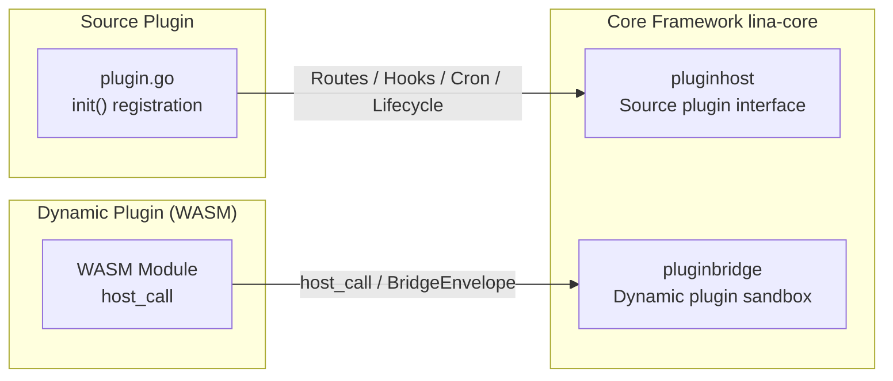
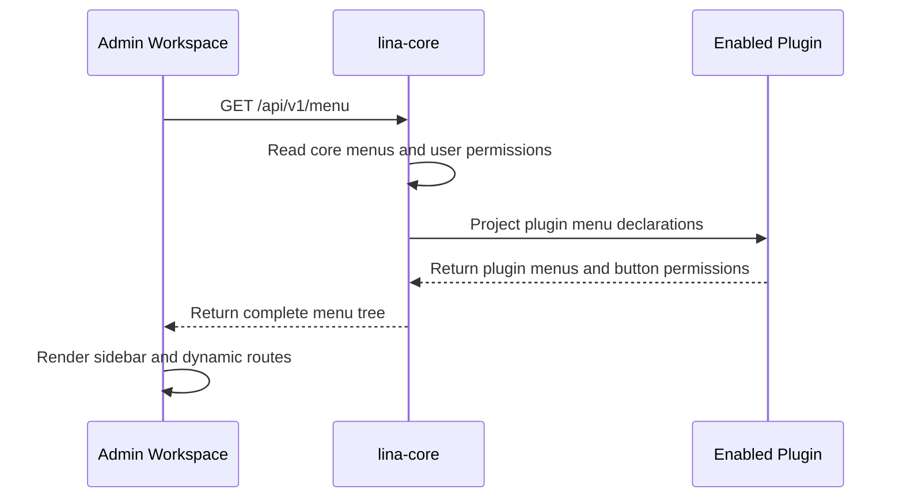

:::warning Notice
LinaPro is currently in its beta phase. The boundary design and implementation details described here may change; this document is for reference only.
:::

## Design Philosophy

From the very beginning, LinaPro adopted a clear principle: **the core framework is responsible only for lightweight domain capabilities and stable extension interfaces, while business capabilities should be implemented through plugins wherever possible**.

The reasoning behind this is straightforward. If the core framework carries too much business logic, it will need frequent changes as business requirements evolve, leading to higher upgrade costs and reduced stability. By pushing business capabilities down into plugins, the core framework can focus on maintaining a stable infrastructure layer -- authentication, authorization, multi-tenancy, routing, scheduled tasks, static assets, and plugin lifecycle management. Once this infrastructure stabilizes, it can sustain rapid iteration of upper-layer plugins over the long term.

However, the core framework and plugins are not completely isolated; collaboration itself requires boundaries and conventions. If plugins depend too heavily on the core framework -- for example, by directly importing its `internal` packages or calling private implementations through unpublished interfaces -- the plugins will break frequently as the framework's internal implementation changes. Conversely, if the core framework exposes specialized interfaces to accommodate a particular plugin, unnecessary coupling is created, harming overall maintainability.

LinaPro establishes clear collaboration boundaries between the core framework and plugins through the following mechanisms:

- **Source plugins connect via the `pluginhost` contract**: All interfaces defined in the `pluginhost` package represent the core framework's stable commitment to source plugins. Source plugins may only use these interfaces to access framework capabilities and must not directly import the core framework's `internal/` directory.
- **Dynamic plugins communicate through the `pluginbridge` sandbox**: Dynamic plugins run inside a `WASM` sandbox and invoke framework services via the `host_call` mechanism. The core framework validates all calls against the `hostServices` authorization snapshot confirmed at install time.
- **The core framework provides general-purpose domain capabilities, not interfaces tailored to specific business scenarios**: `pluginhost` exposes generic service adapters for authentication, tenancy, configuration, caching, notifications, and so on -- not specific business-domain interfaces. Plugins build their business logic on top of these general-purpose capabilities.

This design allows both the stability of the core framework and the flexibility of plugins to coexist. The two collaborate across clearly defined boundaries rather than intermingling.

## Core Framework Capabilities

The domain capabilities provided by the core framework (`lina-core`) fall into two categories: **infrastructure capabilities** and **plugin extension interfaces**.

### Infrastructure Capabilities

Infrastructure capabilities serve the entire runtime environment and are not tied to any specific business scenario or page design:

| Capability Domain | Description |
|--------|------|
| **Authentication & Authorization** | JWT issuance and validation, RBAC permission model, menu and button permissions, permission-check middleware |
| **Online Sessions** | Session storage, user online status queries, forced logout |
| **Multi-Tenancy** | Tenant resolution, tenant context injection, tenant-scoped filtering services |
| **Data Dictionary** | Dictionary label resolution, value listing, visibility enforcement |
| **File Management** | Batch file retrieval, search by business scene and keyword, visibility control |
| **AI Capabilities** | Unified access to text generation, image generation, vector embeddings, speech transcription, visual analysis, and other AI sub-capabilities |
| **Scheduled Tasks** | Task scheduling, distributed leader election, task execution logging |
| **Configuration Management** | Static configuration reading, runtime configuration entries |
| **Cache Control** | Per-plugin cache namespace |
| **Plugin Governance** | Plugin directory scanning, dependency checks, lifecycle orchestration, runtime upgrades |

The table above highlights key capability domains only. The core framework also provides domain capabilities for user management, organization structure, object storage, internationalization, distributed locking, infrastructure status monitoring, and API documentation. For the complete capability catalog and interface details, see [Domain Capabilities Overview](/docs/domain-capabilities).

These capabilities are encapsulated as stable service adapters and exposed to plugins. Source plugins call domain capability methods directly through `pluginhost.Services` (which embeds `capability.Services`); dynamic plugins declare `hostServices` in `plugin.yaml` and access them via `pluginbridge`'s `host_call` mechanism. The core framework never defines a dedicated interface for a specific business scenario. Instead, it provides composable general-purpose primitives, leaving it to each plugin to decide how to use them in its own logic.

### Plugin Extension Interfaces

The core framework defines two stable extension interfaces for plugins:



Source plugins register routes, hooks, scheduled tasks, lifecycle callbacks, and governance logic at compile time through `pluginhost`; dynamic plugins access framework capabilities at runtime through sandbox communication via `pluginbridge`. Although the two extension interfaces differ somewhat in scope, the core framework serves as an equally transparent governance authority for both.

## Admin Workspace Responsibility Boundaries

LinaPro ships with a built-in admin workspace based on Vue 3 + Vben5, accessible by default at the `/admin` route. The workspace provides visual management capabilities for the system's various modules and serves as the standard UI presentation layer for the core framework's API and plugin APIs.

`/admin` is the default entry boundary for the admin workspace, not the frontend boundary of the entire system. The workspace SPA's static asset serving and refresh fallback only cover `/admin` and its sub-paths; they do not occupy the root path `/` by default. As a result, the root path, portal pages, plugin-managed static assets, and other non-reserved public paths can be registered by source plugins through their own code. If no core framework or plugin route matches a request, it should return an unmatched result rather than falling back to the admin workspace's `index.html`.

### Workspace Entry Route Configuration

The admin workspace entry is controlled by the core framework's static configuration `workspace.basePath`, which defaults to `/admin`. This configuration takes effect at startup and determines which browser path the built-in workspace SPA assets and refresh fallback are bound to:

```yaml
workspace:
  basePath: "/admin"
```

In a standard single-domain deployment, it is recommended to keep `/admin` so that the root path and other public paths remain available for portal pages, source plugin-managed pages, or static assets. When using a dedicated admin domain, you can set `workspace.basePath` to `/` so that the entire domain serves only the admin workspace.

Regardless of which entry path is used, it must not occupy the core framework's reserved namespaces -- for example, the control-plane `/api`, the unified plugin API namespace `/x`, the plugin public asset namespace `/x-assets`, and other reserved paths. After changing this configuration, the core framework's public configuration, frontend route base, and deployment entry must remain consistent. For details, see [Default Admin Workspace](/docs/admin-workspace).

### Workspace-Plugin Integration

Plugins integrate their management pages into the workspace's navigation system by declaring a `menus` field in `plugin.yaml`:

```yaml
menus:
  - key: plugin:linapro-demo-source:example
    name: Example Management
    path: linapro-demo-source-example
    component: system/plugin/dynamic-page
    perms: linapro-demo-source:example:view
    type: M
```

When the core framework responds to frontend menu requests, it merges the menus declared by enabled plugins with built-in menus, filters them by the current user's permissions, and returns the combined result to the workspace. When a plugin is disabled, its corresponding menu entry automatically disappears from the navigation without requiring any code changes in the workspace.



This mechanism allows plugin management UIs to be fully declared and maintained by the plugins themselves. The core framework does not know the specific content of business pages; it is only responsible for aggregating menu data and filtering by permissions.

### Workspace and Core Framework Responsibilities

The workspace is a standard consumer of the core framework's APIs, not a definer of business logic. The core framework provides API contracts; the workspace uses these contracts to display data and provide action entry points. Plugins extend the core framework's APIs, and the workspace accommodates plugin pages through the same unified menu and dynamic page shell mechanism, without needing to modify frontend code for each plugin.

Developers can completely replace the built-in workspace with a custom frontend. As long as the new frontend follows the core framework's published RESTful API and permission model, it can use the same backend capabilities. For details, see [Default Admin Workspace](/docs/admin-workspace).

The core framework control-plane API, the unified plugin API, and the default admin workspace represent three independent boundaries:

| Boundary | Default Path | Description |
|------|----------|------|
| Core Control-Plane API | `/api/v1/...` | Built-in system governance, user, permission, configuration, and other control-plane interfaces |
| Unified Plugin API | `/x/{plugin-id}/...` | Plugin API namespace; subsequent path segments are organized by each plugin |
| Default Admin Workspace | `http://localhost:5666/admin` | Default local development workspace address; not a core framework API route |

## Plugin Functional Responsibility Boundaries

### Dynamic Routing

The two plugin types have clearly different design constraints for route registration, but their plugin APIs must both enter the same core framework reserved namespace:

```text
/x/{plugin-id}/...
```

Here, `/x` represents the unified plugin API namespace, `{plugin-id}` isolates different plugins, and subsequent path segments are defined by each plugin. Official plugins are encouraged to use `/api/v1` as a version grouping under this namespace, so common public paths typically appear as `/x/{plugin-id}/api/v1/...`. However, what the core framework enforces is the `/x/{plugin-id}` boundary, not a fixed `/api/v1` sub-path.

Additionally, **source plugins** have the freedom to register HTTP routes on non-reserved paths. Plugins declare route registration callbacks during the `init()` phase, which the core framework triggers at startup. Plugins can register routes on `/`, `/portal/...`, `/assets/...`, or other non-reserved public paths for pages, portals, static assets, custom fallbacks, or other HTTP response logic. This freedom gives source plugins great flexibility, but it also introduces a potential risk: **if multiple source plugins register the same route path, the route conflict will cause the server to fail to start**. For example, if multiple plugins register the same `GET /` root route, the HTTP server router will throw an error due to a duplicate route and the process will abort.

A source plugin's plugin API is not an arbitrary public path; it must use the unified plugin API namespace. The source plugin `RouteRegistrar` provides an `APIPrefix()` method that returns the current plugin's namespace within the core framework:

```text
/x/{plugin-id}
```

:::info Note
`x` stands for eXtension and is a conventional namespace prefix indicating that the path belongs to plugin extension APIs rather than the core framework's control-plane interfaces.
:::

Business APIs exposed by a source plugin should be mounted under this prefix. Plugins can register interfaces directly under this prefix or add internal version groupings as needed. For example:

```text
/x/linapro-demo-source/api/v1/demo-records
/x/linapro-demo-source/api/v1/demo-records/{id}
```

Source plugins must not register paths belonging to other plugins under `/x`. To maintain clear boundaries, public pages, portal entries, static assets, or health checks and other non-API routes should not be placed under `/x/{plugin-id}`. Public pages and plugin-managed static assets should continue to use `/`, `/portal/...`, `/assets/...`, or other non-reserved paths.

**Dynamic plugins** run in a WASM sandbox and cannot directly access the HTTP server's route registration mechanism. Dynamic plugins declare internal `path`, `method`, `access`, and `permission` through build-time `RegisterRoutes` and route contracts. The core framework runtime only owns the `/x/{plugin-id}` prefix; subsequent paths come from the dynamic plugin's own route contract. Typical public path examples:

```text
/x/linapro-demo-dynamic/api/v1/demo-records
/x/linapro-demo-dynamic/api/v1/demo-records/{id}
/x/linapro-demo-dynamic/api/v1/backend-summary
```

Source plugin requests are handled by the HTTP server handlers registered by the source plugin; dynamic plugin requests are bridged by the core framework to the corresponding runtime based on the route contract. The core framework control-plane API continues to use `/api/v1/...`; neither source plugins nor dynamic plugins should mount their business interfaces under the core framework's control-plane namespace.

| Plugin Type | Path Constraints | Conflict Risk |
|----------|----------|----------|
| Source Plugin API | Must use the `/x/{plugin-id}` namespace returned by `APIPrefix()`; subsequent paths are defined by the plugin; `/api/v1` version routing is recommended | Isolated by plugin ID; no conflict with other plugins' `/x` namespaces |
| Source Plugin Custom Routes | Can register non-reserved paths such as `/portal/...` or `/assets/...` | Startup failure if conflicting with the core framework or other plugins |
| Dynamic Plugin API | Core framework concatenates `/x/{plugin-id}` with the contract's internal paths; subsequent paths are defined by the plugin contract; `/api/v1` version routing is recommended | Isolated by the core framework based on plugin ID, active artifact, and contract |

### Static Assets

The core framework manages its own static assets through Go Embed and hosts plugin public assets through the declarative `public_assets` model. Both source plugins and dynamic plugins can declare public resource directories in the root fields of `plugin.yaml`, which the core framework maps uniformly to `/x-assets/{plugin-id}/{version}/...`. For example:

```text
/x-assets/linapro-demo-dynamic/v0.1.0/pages/standalone.html
/x-assets/linapro-demo-dynamic/v0.1.0/css/main.css
```

Each declaration uses `source` to point to a relative directory within the plugin or a dynamic artifact frontend asset prefix, an optional `mount` to specify its relative mounting location under `/x-assets/{plugin-id}/{version}/`, and an optional `index` to specify the default file returned when the mount directory itself is accessed. When `mount` is empty or `/`, files in the declared directory are mounted directly at the version root. When `index` is empty, `index.html` is used by default.

```yaml
public_assets:
  # source points to the resource directory within the plugin to make public.
  - source: frontend/public
    # mount is the mounting path under /x-assets/{plugin-id}/{version}/;
    # / means mount directly at the version root.
    mount: /
    # index is the default file served when the mount directory itself is accessed;
    # defaults to index.html when omitted.
    index: index.html
  # Another resource group can be mounted at a sub-path for organized
  # management of pages, styles, and other resources.
  - source: frontend/pages
    mount: pages
    index: standalone.html
```

When a source plugin registers an embedded filesystem through `plugin.Assets().UseEmbeddedFiles(...)`, the core framework only reads public resources from directories declared in `public_assets`. For example:

| source | mount | Plugin File Example | Mapped Public Path Example |
|----------|---------|-----------|-----------------|
| `frontend/public` | `/` | `frontend/public/logo.png` | `/x-assets/{plugin-id}/{version}/logo.png` |
| `frontend/pages` | `pages` | `frontend/pages/standalone.html` | `/x-assets/{plugin-id}/{version}/pages/standalone.html` |

Files in undeclared directories will not be made public simply because they exist in the embedded filesystem.

Dynamic plugin frontend assets must also be migrated to the same declarative model. The core framework no longer makes frontend assets public by default just because they exist in a dynamic artifact; only the asset set matching the `public_assets` declarations will be served through `/x-assets/{plugin-id}/{version}/...`.

`/x-assets` is an optional hosting entry point, not the mandatory sole entry for source plugin public frontend assets. Source plugins can still return pages, file streams, static assets, or SPA fallbacks through their own HTTP routes. These routes are maintained end-to-end by plugin code; the core framework does not reverse-engineer HTTP routes from `public_assets` declarations, nor does it infer resource directories from HTTP routes.

For dynamic plugins, the admin workspace menu can reference hosted resources in `/x-assets`, but the menu path does not directly become a workspace route. The current embedded-mount pattern typically uses `component: system/plugin/dynamic-page`, with the menu `path` pointing to a `.js` or `.mjs` entry and declaring `pluginAccessMode: embedded-mount` in `query`. The core framework passes this hosted resource address as `embeddedSrc` to the dynamic page shell.

```yaml
menus:
  - key: plugin:linapro-demo-dynamic:main-entry
    name: Dynamic Plugin Example
    path: /x-assets/linapro-demo-dynamic/v0.1.0/mount.js
    component: system/plugin/dynamic-page
    perms: linapro-demo-dynamic:view
    type: M
    query:
      pluginAccessMode: embedded-mount
```

Although plugins can also expose static asset access endpoints through dynamic routes, this approach is **not recommended**. The core framework's unified static asset entry provides the following governance capabilities, which would require duplicate logic if implemented independently:

| Core Framework Unified Governance | Issues When Self-Implemented |
|-----------------|-----------------|
| Plugin enable/disable state linkage (auto 404 when disabled) | Must implement enable state checks manually |
| Automatic MIME type derivation | Must maintain Content-Type mappings manually |
| In-memory caching and on-demand serving | Must implement caching mechanisms manually |
| Version path isolation (`/{version}/...`) | Must design version management strategies manually |
| Consistent with core framework asset route priority rules | May conflict with core framework route ordering |

`public_assets` represents the plugin author's explicit publishing authorization boundary. As long as a declaration points to a real directory within the plugin's own resource set or a dynamic artifact frontend asset prefix, the core framework treats it as ordinary public static content. Because of this, plugin authors must only declare files that are genuinely suitable for anonymous access. Governance metadata, installation scripts, private configuration, tenant-specific files, or user-specific files should never be placed in `public_assets`.

The core framework performs strict path validation on declarations. The following configurations will be rejected:

| Invalid Configuration | Reason |
|----------|------|
| Empty `source` | Cannot form a clear publishing boundary |
| Absolute paths or URLs | May escape the plugin resource set |
| Paths containing `../` traversal after normalization | May escape the declared directory or plugin root |
| Paths containing wildcards, query strings, or fragments | Cannot be stably mapped to static resource directories |
| Duplicate or overlapping `mount` values | Would cause the same access path to map to multiple sources |
| Non-existent `source` | The source plugin directory or dynamic artifact frontend asset prefix must actually exist |
| Symlinks escaping the plugin root | May read files outside the plugin |
| `index` not in filename form | Directory default files must be safe relative filenames |

Public asset URLs use `{plugin-id, version}` as the cache boundary. Public asset content under the same plugin version must remain stable. If resource content changes, the plugin needs to upgrade its `plugin.yaml` version or introduce an equivalent content versioning mechanism. When a plugin is not installed, not enabled, or unavailable for the current tenant, `/x-assets/{plugin-id}/{version}/...` returns 404 by default. Dynamic plugins can continue serving installed or currently activated versioned resources as long as the plugin remains enabled; source plugins resolve declared resources from the plugin resources compiled into the core framework or from the plugin directory. For details, see [Static Assets and Frontend Resources](/docs/static-assets).

### Domain Capabilities

The core framework exposes domain capabilities to plugins through stable service adapter interfaces. Plugins simply call these interfaces without needing to understand the core framework's internal implementation. Source plugins access framework capabilities through `pluginhost.Services`, which embeds `capability.Services` and additionally provides trusted admin commands via `Admin()` and tenant filtering via `TenantFilter()`. Dynamic plugins access framework capabilities through the `host_call` mechanism exposed by `pluginbridge`, with runtime calls validated against the `hostServices` authorization snapshot.

The core framework's domain capabilities span multiple service domains including authentication, caching, configuration, internationalization, notifications, tenancy, file storage, data records, and AI, with more being added as versions evolve. Plugins can selectively use these capabilities based on their actual needs, without needing to know the specific implementation of the core framework's internal services.

For detailed descriptions, interface lists, and usage instructions for each domain capability, see: [Domain Capabilities Overview](/docs/domain-capabilities).

### Portal Routes and Admin Routes

When implementing business capabilities, plugins typically need to provide two types of interfaces: **portal routes** (data plane) for end users, and **admin routes** (control plane) for the admin backend. These two differ significantly in their target audience, permission model, and interface semantics.

| Dimension | Portal Routes (Data Plane) | Admin Routes (Control Plane) |
|------|-------------------|-------------------|
| **Target Audience** | End users, anonymous visitors | Administrators, backend operators |
| **Authentication** | Public or login-on-demand | Typically requires login and permissions |
| **Interface Semantics** | Content viewing, business operations | Data management, configuration changes |
| **Menu Mounting** | Not necessarily mounted in workspace | Typically accessed via workspace menus |

The core framework does not know about the plugin's internal route grouping logic and is not responsible for distinguishing control-plane and data-plane routes within plugins. Plugins fully manage their own internal route grouping through route sub-groups. Note that `/x/{plugin-id}` only carries the plugin API namespace. Portal APIs and admin APIs can be placed directly under plugin-defined sub-paths such as `/x/{plugin-id}/portal/...` and `/x/{plugin-id}/admin/...`. If a plugin adds its own version grouping, it is simply part of the plugin's subsequent path, not a core framework enforced prefix. Source plugin public pages, portal entries, static assets, or custom fallbacks are not plugin APIs and should continue to use non-reserved paths like `/portal/*` and `/assets/*`. Here is an example of a source plugin simultaneously registering a public portal entry, portal API, and admin API:

```go
func registerRoutes(ctx context.Context, registrar pluginhost.HTTPRegistrar) error {
    var (
        routes      = registrar.Routes()
        middlewares = routes.Middlewares()
        apiPrefix   = routes.APIPrefix()
    )
    // Plugin API: both source and dynamic plugins must enter the /x/{plugin-id} namespace.
    // Here /api/v1 is used as the plugin's internal API version grouping.
    routes.Group(apiPrefix, func(group pluginhost.RouteGroup) {
        group.Group("/api/v1", func(group pluginhost.RouteGroup) {
        group.Middleware(
            middlewares.NeverDoneCtx(),
            middlewares.HandlerResponse(),
            middlewares.CORS(),
            middlewares.RequestBodyLimit(),
            middlewares.Ctx(),
        )

        // Portal API (data plane): for end users, some endpoints may be anonymous.
        // Full path example: /x/my-plugin/api/v1/portal/articles.
        group.Group("/portal", func(group pluginhost.RouteGroup) {
            // Public endpoints: no login required
            group.Bind(
                portalArticleCtrl,
            )
            // Authenticated endpoints: requires auth but not admin permissions
            group.Group("/", func(group pluginhost.RouteGroup) {
                group.Middleware(
                    middlewares.Auth(),
                )
                group.POST("/comments", commentCtrl.Create)
            })
        })

        // Admin API (control plane): for the admin backend, requires full auth and permissions.
        // Full path example: /x/my-plugin/api/v1/admin/articles.
        group.Group("/admin", func(group pluginhost.RouteGroup) {
            group.Middleware(
                middlewares.Auth(),
                middlewares.Tenancy(),
                middlewares.Permission(),
            )
            group.Bind(
                adminArticleCtrl,
                adminCommentCtrl,
            )
        })
    })

    // Public portal entry: plugin-managed pages, static assets, or SPA fallback.
    // These routes are not plugin APIs; they don't enter /x and won't be automatically
    // projected as menus, permissions, or OpenAPI.
    routes.Group("/portal", func(group pluginhost.RouteGroup) {
        group.Middleware(
            middlewares.NeverDoneCtx(),
            middlewares.CORS(),
            middlewares.RequestBodyLimit(),
        )
        group.Bind(
            portalPageCtrl,
            portalAssetCtrl,
        )
    })

    return nil
}
```

In this example, `/portal` is the plugin-managed public portal entry, `/x/my-plugin/api/v1/portal/articles` is the plugin portal API, and `/x/my-plugin/api/v1/admin/articles` is the plugin admin API. The admin workspace only knows about menu entries contributed by plugins through `plugin.yaml`'s `menus`; it does not automatically generate workspace routes, menus, or permission nodes just because a plugin registers HTTP routes. Admin API permission identifiers are declared through the `permission` field in `g.Meta`, and the corresponding menu entries and permission items are configured in `plugin.yaml`'s `menus`. These are ultimately displayed to administrators through the workspace's extension center. For details, see [Permission Management Strategy](/docs/permission):

```go
// Admin endpoint DTO example
type ArticleAdminListReq struct {
    g.Meta   `path:"/articles" method:"get" tags:"My Plugin Admin" summary:"List admin articles" permission:"my-plugin:article:view"`
    Page     int `json:"page"`
    PageSize int `json:"pageSize"`
}
```

## Broader Implications of Boundary Design

The capability boundary design between the core framework and its components affects not only the current functional division but also the long-term evolution of the entire ecosystem.

- **For the core framework**, stable extension interfaces mean that internal implementations can safely evolve. The core framework can refactor domain capability implementations, optimize plugin governance workflows, or extend new domain capabilities. As long as the public contracts of `pluginhost` and `pluginbridge` remain stable, all existing plugins will be unaffected.

- **For plugin developers**, clear boundaries mean they can confidently use the domain capabilities provided by the core framework without needing to understand its internal implementation, and without worrying that future framework upgrades will break plugin logic. As long as plugins collaborate with the core framework strictly through stable contracts, version compatibility is guaranteed by the framework's interface stability.

- **For the system as a whole**, this layered architecture allows different teams to independently maintain the core framework and their respective plugins, reducing collaboration friction and leaving ample room for introducing more plugin types or extending governance capabilities in the future.
