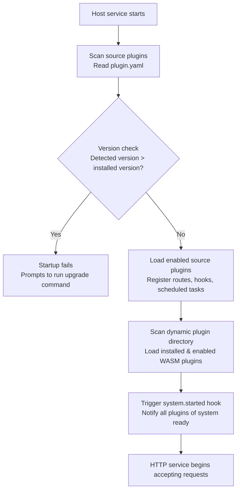

## Overview

`lina-core` is the core host service of the `LinaPro` framework, built in `Go`. It is the stable foundation of the entire system — providing all general platform capabilities and serving as the runtime environment and stable extension seam provider for plugins.

The host's core design principle is: **provide only general capabilities, contain no specific business logic**. All business functionality is added through the plugin mechanism; the host itself remains lean and stable.

## Directory Structure

```text
apps/lina-core/
├── api/                     # API DTOs and route contracts
│   ├── auth/                # Authentication interface definitions
│   ├── config/              # System parameter interface definitions
│   ├── i18n/                # i18n interface definitions
│   ├── job/                 # Scheduled task interface definitions
│   ├── menu/                # Menu management interface definitions
│   ├── plugin/              # Plugin governance interface definitions
│   ├── role/                # Role management interface definitions
│   ├── user/                # User management interface definitions
│   └── ...                  # Other interface definitions
├── internal/
│   ├── cmd/                 # Service startup and route registration
│   ├── controller/          # HTTP controllers
│   └── service/             # Business service layer
│       ├── apidoc/          # API documentation aggregation
│       ├── auth/            # Authentication service
│       ├── cron/            # Scheduled task startup entry
│       ├── i18n/            # i18n runtime
│       ├── middleware/      # HTTP middleware (auth, permissions, logging)
│       ├── plugin/          # Plugin lifecycle management
│       └── ...              # Other business services
├── manifest/
│   ├── config/              # Runtime configuration file templates
│   ├── sql/                 # DDL + seed data
│   └── i18n/                # Host runtime language packs
└── pkg/                     # Stable shared packages for host and plugins
    ├── pluginhost/          # Plugin extension seam definitions
    ├── pluginbridge/        # Dynamic plugin bridge layer
    └── ...                  # Other shared utility packages
```

## API Layer

The host `API` layer uses `g.Meta` struct tags to define route contracts and DTOs (Data Transfer Objects). Each interface's path, method, permission identifier, i18n key, and documentation are declared in `Go` structs under the `api/` directory.

This declarative interface definition approach provides several benefits:

- **Permissions are naturally visible and auditable**: permission identifiers are annotated directly on the interface definition — change it in one place, take effect globally
- **Automatic API documentation**: the host scans all interface definitions at startup and automatically generates `OpenAPI`-format documentation
- **Plugin interfaces automatically aggregated**: plugin-registered routes follow the same mechanism, and all interfaces appear together in the API documentation

## Governance Services

### Authentication (JWT)

The host provides stateless authentication based on `JWT`:

- A token is issued on successful login; its validity period is set via `jwt.expire`
- Each request carries the token; the host verifies validity and permissions
- Token refresh is supported to avoid frequent re-logins
- Session management works alongside `JWT` to support force-logging-out specific users

### Authorization (RBAC)

`LinaPro` uses a declarative `RBAC` permission system:

- Permission identifiers are declared via struct tags in the API definition layer (e.g., `perm:"user:list"`)
- The role management page assigns menu permissions and button permissions to roles
- The permission topology is cached in the KV store and takes effect quickly after changes — no user re-login required
- Operation logs are automatically recorded for all write operations, including request parameters (passwords and other sensitive fields are automatically masked) and the operation result

### Session Management

- Records the `IP` address, device information, and login time for each active session
- Supports administrators force-logging-out specific users (UI provided by the `monitor-online` plugin)
- Session inactivity timeout is configured via `session.timeout`
- Expired sessions are cleaned up periodically (configured via `session.cleanupInterval`)


## Plugin Runtime

At startup, the host completes the following plugin loading sequence:



**Plugin isolation mechanisms:**

- Each plugin's database tables use the plugin `ID` as a namespace prefix, preventing conflicts with host tables and other plugin tables
- Each plugin's file storage path uses the plugin `ID` as a namespace (e.g., `temp/upload/<plugin-id>/`)
- Dynamic plugins run inside a `WASM` sandbox; access to the host filesystem and network is bridged through governed host services

See: [Dual-Mode Plugin System](/docs/plugin-system).

## Scheduled Task Subsystem

The host includes a persistent scheduled task subsystem, supporting `Cron` task configuration and management through the management workspace:

- **Task management**: Task configurations are persisted in the database; supports `Cron` expressions, immediate triggering, and pause/resume
- **Execution logs**: Records the result, duration, and error information for every task execution
- **Shell execution**: Supports arbitrary scripts via the Shell command task type, with timeout control and output truncation
- **Plugin tasks**: Plugins can register their own scheduled task handlers through the `cron.register` extension point

See: [Scheduled Tasks](/docs/scheduled-tasks).

## i18n Runtime

The host provides a complete i18n runtime with per-request language switching:

- Host runtime language packs are located under `manifest/i18n/<locale>/`, organized into files by semantic domain
- Plugin language packs are located under each plugin's `manifest/i18n/<locale>/` directory and are automatically merged when the plugin is enabled
- API documentation multi-language translations are located under `manifest/i18n/<locale>/apidoc/`
- The `i18n.enabled` config flag controls whether multi-language support is active; when disabled, the frontend hides the language switcher

See: [I18N Internationalization](/docs/i18n).

## API Documentation Aggregation

The host provides built-in API documentation aggregation. At startup, it automatically scans the host's and all enabled plugins' interface definitions and generates a unified `OpenAPI` document:

- Endpoint: `http://localhost:8080/api.json`
- Management workspace entry: **Developer Center → API Docs**
- Supports in-browser debugging and parameter testing

See: [API Reference](/docs/api-reference).

## Health Probe

The host exposes a `/health` endpoint for liveness checks by load balancers and orchestration platforms (such as `Kubernetes`):

- Check: database connection availability
- Timeout configuration: `health.timeout`
- Response format: standard HTTP status codes (`200` healthy, `503` unhealthy)
