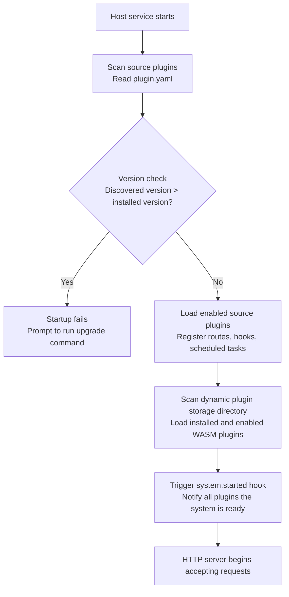

## Overview

`lina-core` is the core host service of the `LinaPro` framework, built with `Go`. It serves as the stable foundation of the entire system, providing all common platform capabilities while offering a runtime environment and stable extension seams for plugins.

The host's core design principle is: **provide only generic capabilities — never concrete business logic**. All business functionality is extended through the plugin mechanism, keeping the host itself lean and stable.

## Directory Structure

```text
apps/lina-core/
├── api/                     # API DTOs and route contracts
│   ├── auth/                # Authentication interface definitions
│   ├── config/              # System parameter interface definitions
│   ├── i18n/                # i18n interface definitions
│   ├── job/                 # Scheduled task interface definitions
│   ├── menu/                # Menu management interface definitions
│   ├── plugin/              # Plugin governance interface definitions
│   ├── role/                # Role management interface definitions
│   ├── user/                # User management interface definitions
│   └── ...                  # Other interface definitions
├── internal/
│   ├── cmd/                 # Service startup and route registration
│   ├── controller/          # HTTP controllers
│   └── service/             # Business service layer
│       ├── apidoc/          # API documentation aggregation
│       ├── auth/            # Authentication service
│       ├── coordination/    # Cluster coordination abstraction with Redis implementation
│       ├── cron/            # Scheduled task entry point
│       ├── i18n/            # i18n runtime
│       ├── middleware/      # HTTP middleware (auth, permissions, logging)
│       ├── plugin/          # Plugin lifecycle management
│       └── ...              # Other business services
├── manifest/
│   ├── config/              # Runtime configuration templates
│   ├── sql/                 # DDL + seed data
│   └── i18n/                # Host runtime language packs
└── pkg/                     # Stable public packages shared between host and plugins
    ├── pluginhost/          # Plugin extension seam definitions
    ├── pluginbridge/        # Dynamic plugin bridge layer
    ├── pluginservice/       # Stable host service contracts published to source plugins
    └── ...                  # Other public utilities
```

## API Layer

The host `API` layer uses `g.Meta` struct tags to define route contracts and DTOs (Data Transfer Objects). Each interface's path, method, permission identifier, i18n key, and documentation are declared in `Go` structs under the `api/` directory.

This declarative interface definition approach offers several benefits:

- **Permissions are inherently visible and auditable**: permission identifiers are annotated directly on interface definitions — a single change takes effect globally
- **API documentation auto-generated**: the host scans all interface definitions at startup and automatically generates `OpenAPI`-format documentation
- **Plugin interfaces auto-aggregated**: routes registered by plugins follow the same mechanism, so all interfaces appear in a unified documentation view

## Governance Services

### Authentication (JWT)

The host provides stateless JWT-based authentication:

- A `Token` is issued upon successful login, with validity controlled by `jwt.expire`
- Each request carries the `Token`; the host verifies its validity and permissions
- `Token` refresh is supported to avoid frequent re-login
- Session management works alongside `JWT`, supporting forced logout of specific users

### Authorization (RBAC)

`LinaPro` uses a declarative `RBAC` permission system:

- Permission identifiers are declared via struct tags in the `API` definition layer (e.g., `perm:"user:list"`)
- The role management page allows assigning menu and button permissions to roles
- Permission topology is cached in the `KV` store and takes effect quickly after changes — no re-login required
- Operation logs automatically record all write operations, including request parameters (sensitive fields like passwords are masked) and operation results

### Session Management

- Records the `IP` address, device info, and login time for each active session
- Supports admin-forced logout of specific users (UI provided by the `monitor-online` plugin)
- Session inactivity timeout is configured via `session.timeout`
- Expired sessions are cleaned up periodically (`session.cleanupInterval`)

### Multi-Tenant Context

The host ships with a built-in tenant context seam. Source plugins can read the current request identity through stable contracts in `pkg/pluginservice/contract`:

- `bizctx` provides a read-only snapshot of the current user, tenant, impersonation identity, and platform bypass flag
- `TenantFilterService` provides default `tenant_id` column filtering, helping tenant-aware plugins isolate their own table data
- When the `multi-tenant` plugin is not enabled, requests run in the default platform tenant context where `tenant_id = 0`
- When a platform admin impersonates a tenant, the audit trail records both the real operator and the impersonated tenant

See: [Multi-Tenant Capabilities](/docs/multi-tenant).

## Plugin Runtime

At startup, the host completes the following plugin loading sequence:



**Plugin isolation mechanisms:**

- Each plugin's database tables are namespaced with the plugin `ID` as a prefix, preventing conflicts with host tables and other plugins
- Each plugin's file storage path is namespaced by plugin `ID`, e.g., `temp/upload/<plugin-id>/`
- Dynamic plugins run inside a `WASM` sandbox; access to the host filesystem and network is bridged through governed host services

See: [Dual-Mode Plugin System](/docs/plugin-system).

## Scheduled Task Subsystem

The host includes a built-in persistent scheduled task subsystem that supports configuring and managing `Cron` tasks through the admin workspace:

- **Task management**: persists task configurations in the database, supports `Cron` expressions, immediate triggers, pause/resume
- **Execution logs**: records the result, duration, and exception details of each task execution
- **`Shell` execution**: supports running arbitrary scripts via `Shell` command type, with timeout control and output truncation
- **Plugin tasks**: plugins can register their own scheduled task handlers via the `cron.register` extension point

See: [Scheduled Tasks](/docs/scheduled-tasks).

## Internationalization Runtime

The host provides a complete `I18N` runtime with dynamic language switching:

- Host runtime language packs are located under `manifest/i18n/<locale>/`, organized by semantic domain
- Plugin language packs live in each plugin's `manifest/i18n/<locale>/` directory and are merged automatically when the plugin is enabled
- API documentation translations are in `manifest/i18n/<locale>/apidoc/`
- Multi-language support is toggled via `i18n.enabled`; when disabled, the frontend hides the language switcher
- Only `en-US` and `zh-CN` are bundled by default — other languages require the project team to translate and maintain them

See: [I18N Internationalization](/docs/i18n).

## Cluster Coordination

The host includes a unified `coordination` abstraction covering distributed locks, short-lived `KV`, cache revision, cross-node events, and health checks. In single-node mode, a lightweight local implementation is used; when cluster mode is enabled (`cluster.enabled: true`), the current version requires `cluster.coordination: redis`.

The `Redis` coordinator powers cross-node leader election, distributed locks, hot session state, and cluster-aware caching. `PostgreSQL` remains responsible for business and governance data persistence.

See: [Native Distributed Architecture](/docs/distributed-architecture).

## API Documentation Aggregation

The host provides built-in API documentation aggregation. At startup it automatically scans the host and all enabled plugins for interface definitions, generating a unified `OpenAPI`-format document:

- Access URL: `http://localhost:8080/api.json`
- Admin workspace entry: **Developer Center → API Documentation**
- Supports online debugging and parameter testing

See: [API Reference](/docs/api-reference).

## Health Probe

The host exposes a `/health` endpoint for liveness checks by load balancers and orchestration platforms (e.g., `Kubernetes`):

- Check items: database connection availability
- Timeout configuration: `health.timeout`
- Response format: standard `HTTP` status codes (`200` healthy, `503` unhealthy)
