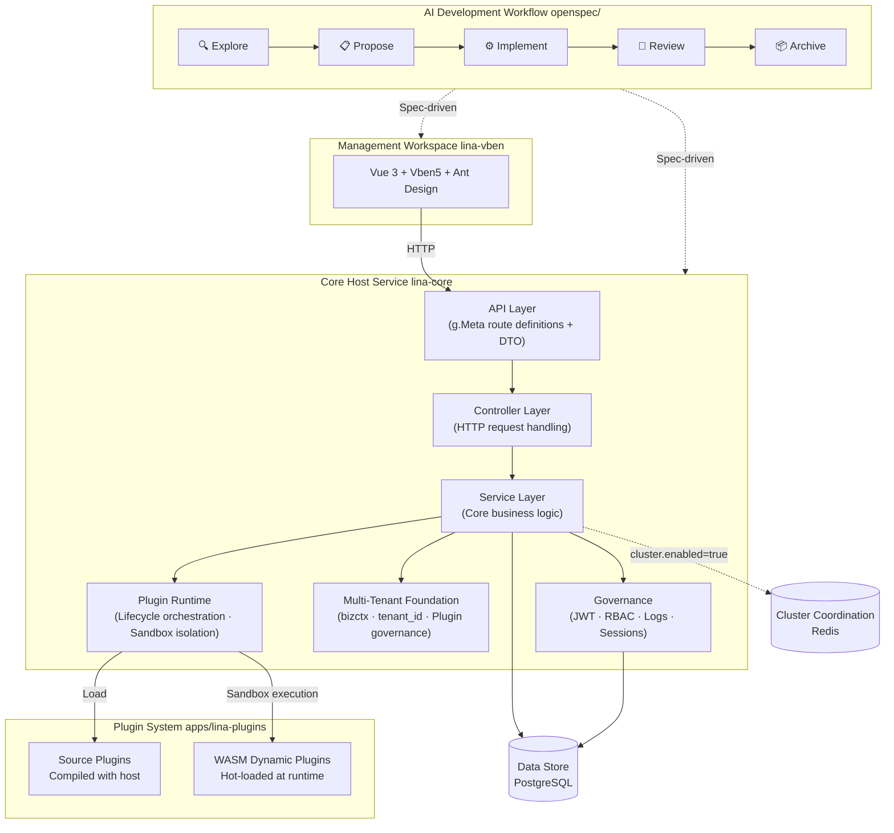
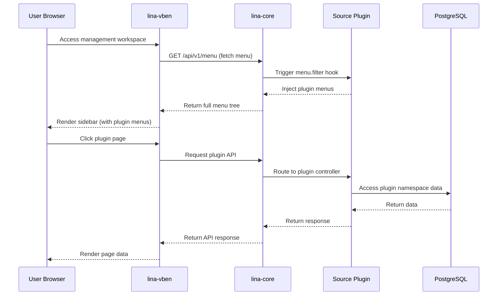
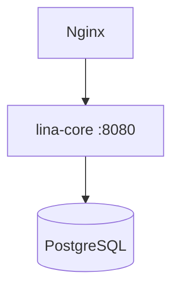
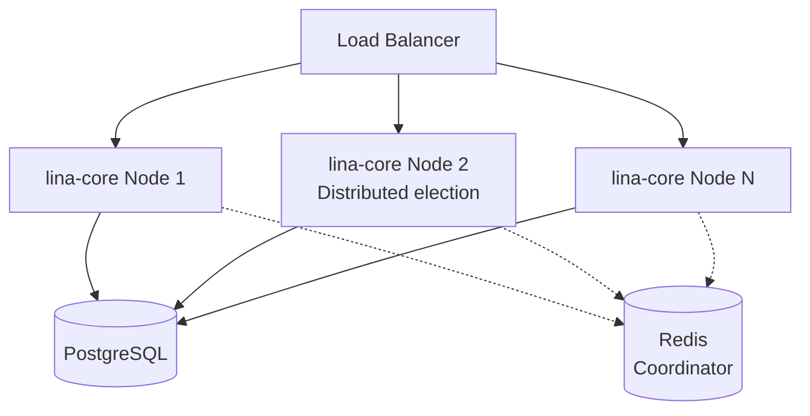

## Architecture Overview

`LinaPro` uses a layered, decoupled architecture model. Each layer is independently designed around loose-coupling principles, and layers interact through well-defined interfaces rather than depending directly on each other's internal implementations. The key components are:



## Directory Structure

```text
/
├── AGENTS.md                         # AI agent collaboration spec
├── hack/                             # Development utility scripts
├── apps/                             # Application workspace
│    ├── lina-core/                   # Core host service (Go)
│    ├── lina-vben/                   # Management workspace (Vue 3)
│    └── lina-plugins/                # Official plugin submodule (initialized on demand)
└── openspec/                         # AI development workflow
```

## Core Host Service (lina-core)

`lina-core` is the framework's stable foundation, built with `Go`. It handles all general platform capabilities. The host service has no knowledge of specific business domains — it provides only general infrastructure.

**Primary responsibilities:**

- Expose `RESTful API` covering system management, plugin governance, user authentication, and access control
- Own database migration scripts, seed data, and runtime configuration
- Load and manage the complete lifecycle of source plugins and `WASM` dynamic plugins
- Run host-level scheduled tasks and the persistent scheduled task subsystem
- Provide the i18n runtime, aggregating language resources from the host and all plugins
- Provide multi-tenant request context, tenant filtering, and the stable foundation for plugin tenant governance


## Management Workspace (lina-vben)

`lina-vben` is the standard consumer of `lina-core`, built on `Vue 3 + Vben5 + Ant Design Vue`. The workspace contains no business logic of its own — it is purely the UI expression layer for the host `API` and plugin `API`.

**Key characteristics:**

- Fully aligned with the host on interface contracts, the permission model, and design conventions
- Plugin menus are dynamically injected via the host's dynamic routing — no changes to workspace code required
- Developers can replace any module through the plugin mechanism, including replacing the entire workspace

## Official Plugin Submodule (apps/lina-plugins)

The plugin layer is the heart of `LinaPro`'s extensibility, supporting two fundamentally different plugin delivery modes. The host exposes stable extension seams through the `pluginhost` package; plugins interact with the host only through these seams and never reach into the host's internal implementation.

The official plugin directory `apps/lina-plugins/` is maintained independently as a `Git submodule` with the remote repository at `https://github.com/linaproai/official-plugins.git`. The main framework repository stays lean by default — users pull official plugin content on demand via `git submodule update --init --recursive`. When the submodule is not initialized, the host can still run in `host-only` mode. When a plugin manifest is present, development, build, and image commands automatically enter full plugin mode; you can also force host-only mode with `plugins=0`.

See: [Dual-Mode Plugin System](/docs/plugin-system).

## AI Development Workflow

The AI development workflow sits above all layers. It is the connective tissue that keeps specs, code, and tests in sync. The workflow does not belong to any runtime component — it acts as a governance mechanism that constrains the entire development process. `OpenSpec` is not a `LinaPro` runtime dependency — the project runs fine without it. However, the framework has built-in support for the `OpenSpec` directory structure, directives, and skills, and it is strongly recommended for team collaboration.

See: [AI Spec-Driven Development](/docs/spec-driven-development).

## AI Skill System (.agents/skills/)

`LinaPro` ships built-in AI skills covering the full development lifecycle. These skills are embedded in the framework's AI collaboration spec (`.agents/skills/`) as domain knowledge. They don't belong to any runtime component, but they are what AI tools draw on to make framework-compliant decisions in every specific work context.

The skills span frontend design, frontend engineering patterns, `Git` commit and worktree management, `OpenSpec` explore/propose/apply/archive, feedback loops, code review, `E2E` testing, performance auditing, auto-archiving, and browser automation. Project built-in skills are loaded automatically with the source code; external skills such as `OpenSpec CLI`, `goframe-v2`, and `find-skills` are installed on demand.

See: [AI-Native Design](/docs/ai-native).

## Layer Boundary Principles

Understanding the following boundary principles helps avoid common architectural mistakes:

### The host has no knowledge of business domains

`lina-core` contains no specific business logic (e.g., product management, order processing). In the ideal design, such capabilities are delivered through plugins, while the host provides only stable, general infrastructure. Multi-tenant context, permissions, sessions, plugin governance, and scheduling are host foundation capabilities — they do not mean the host directly handles specific business domains.

### Plugins do not modify the host's internals

Plugins interact with the host through the stable interfaces exposed by the `pluginhost` package — route registration, event hooks, menu filtering, permission filtering. Plugins never call the host's `internal/` packages directly and never access the host's database tables directly.

### The host owns top-level menu directories

The host owns stable top-level menu directory keys (`dashboard`, `iam`, `setting`, `scheduler`, `extension`, `developer`). Plugin menus can only be mounted under directories the host has published, or under the plugin's own menu tree.

### The workspace is a consumer, not a definer

`lina-vben` consumes the host `API` and plugin `API`, but does not define their behavior. Workspace UI changes should not affect backend behavior; backend API changes are communicated to the workspace through interface contract documents.

## Data Interactions



## Deployment Models

`LinaPro` supports two deployment modes, switchable at any time as the business grows. Regardless of single-node or cluster, the default data store is `PostgreSQL 14+`; `SQLite` is only suitable for local demos or smoke testing on a single node.

### Single-node mode (default)



Suitable for development environments and small-scale production deployments. Simple configuration, low resource usage.

### Cluster mode



Cluster mode is enabled by setting `cluster.enabled: true`. The current version also requires `cluster.coordination: redis` and a reachable `cluster.redis` endpoint. `PostgreSQL` handles persistence of business and governance data, while the `Redis` coordinator powers leader election, distributed locks, hot session state, and cluster-aware caching — no changes to business code required. See: [Native Distributed Architecture](/docs/distributed-architecture).

## Related Documents

import DocCardList from '@theme/DocCardList';

<DocCardList />
