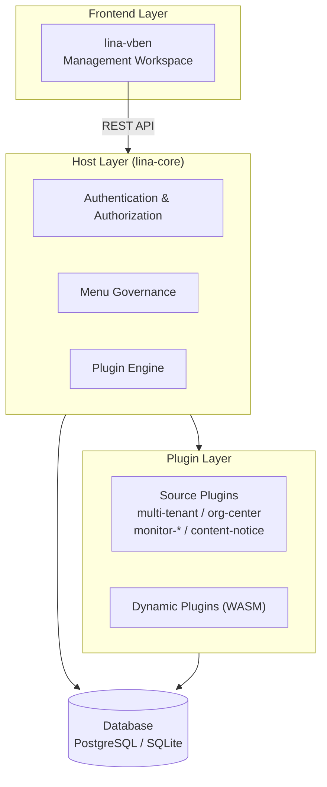
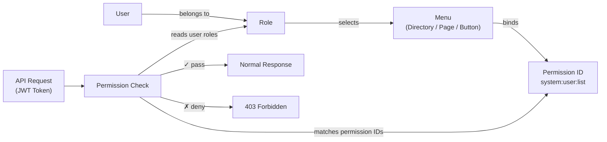
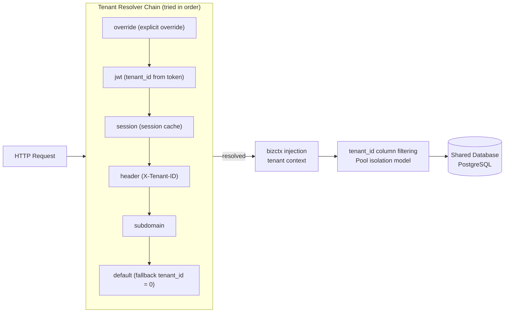
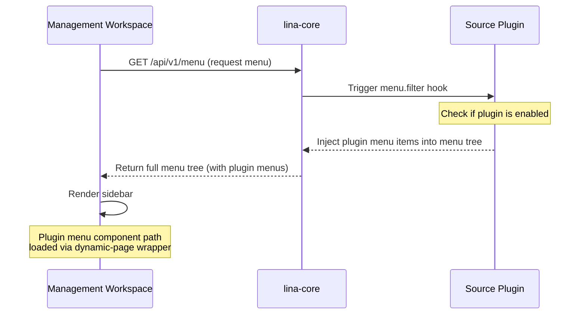

## Overview

`lina-vben` is `LinaPro`'s built-in default management workspace, built on `Vue 3 + Vben5 + Ant Design Vue + TypeScript`. It serves as the standard `UI` expression layer for the `lina-core` host `API` and all plugin `API`s.

Developers can build business applications directly on top of the workspace, extend or replace any module on demand through the plugin mechanism, or replace it entirely with a custom frontend workspace.

## Technology Stack

| Technology | Version | Description |
|------------|---------|-------------|
| `Vue 3` | `3.x` | Frontend framework |
| `Vben5` | `5.x` | Enterprise Vue admin framework |
| `Ant Design Vue` | `4.x` | UI component library |
| `TypeScript` | `5.x` | Type system |
| `pnpm` | `8.x` | Package manager (monorepo) |

## Functional Modules

All functional modules in `lina-vben` are listed below. Some modules are provided by official plugins — once installed and enabled, their menus are automatically injected into the workspace without modifying any workspace code.

### Access Control

**User Management**

| Feature | Description |
|---------|-------------|
| **User list** | Paginated list with filters for username, phone number, and status |
| **Create user** | Set username, password, roles, phone number, email, and other basic info |
| **Edit user** | Modify user info, reset password, adjust role assignments |
| **Status management** | Enable or disable user accounts; disabled accounts take effect immediately |
| **Bulk export** | Export the user list to an `Excel` file |

**Role Management**

| Feature | Description |
|---------|-------------|
| **Role list** | Display all roles with their description and user count |
| **Create role** | Define role name and description |
| **Permission assignment** | Tree-based selection of menu permissions (three levels: directory / menu / button) |
| **Permission propagation** | Changes to the permission topology take effect quickly (immediately on single-node, within 3 seconds on cluster) — no user re-login required |

**Menu Management**

| Feature | Description |
|---------|-------------|
| **Menu tree** | Display the complete menu hierarchy |
| **Menu types** | Supports directory (`D`), menu (`M`), and button (`B`) |
| **Dynamic configuration** | Menu paths, components, icons, and sort order are all adjustable from the management UI |
| **Permission identifiers** | Button-type menus bind permission identifiers used for `RBAC` authorization |

**RBAC Permission Model**

### System Settings

**Dictionary Management**

| Feature | Description |
|---------|-------------|
| **Dictionary types** | Manage all dictionary categories in the system, such as status codes, types, and flags |
| **Dictionary data** | Maintain the option values and display labels for each dictionary type |
| **Import/Export** | Bulk import dictionary data from `Excel` and export backups |

**Parameter Settings**

| Feature | Description |
|---------|-------------|
| **Parameter list** | Maintain configurable runtime parameters |
| **Parameter editing** | Modify parameter values; changes take effect immediately |
| **Import/Export** | Bulk import and export parameter configurations |

**File Management**

| Feature | Description |
|---------|-------------|
| **File upload** | Supports single and multi-file uploads |
| **File list** | View uploaded files including name, size, and upload time |
| **File download** | Download stored files |
| **Storage isolation** | Host and plugin files are stored in separate namespaces |

### Job Scheduling

**Task Management**

| Feature | Description |
|---------|-------------|
| **Task list** | View all scheduled tasks with their status and next execution time |
| **Create task** | Configure a `Cron` expression, task type (`Go` handler or `Shell` command), and timeout |
| **Trigger now** | Manually trigger a task for immediate execution |
| **Pause/Resume** | Pause a running task or resume a paused one |
| **Execution history** | View execution records including duration and result |

**Group Management**

Group scheduled tasks by business domain for easier navigation and permission control.

**Execution Logs**

| Feature | Description |
|---------|-------------|
| **Log list** | View historical execution logs with filtering by task and time range |
| **Log details** | View the full output and error information for each execution |

### Multi-Tenant Management

> Requires installing and enabling the official `multi-tenant` plugin. When not installed, the host falls back to single-tenant mode (`tenant_id = 0`) — out-of-the-box functionality is not affected.

The `LinaPro` framework natively builds multi-tenant infrastructure into the host layer, including tenant middleware, `bizctx` tenant identity, tenant-aware cache scoping, and plugin governance fields. The `multi-tenant` plugin builds on top of this to provide a complete tenant management console and lifecycle governance capabilities.

**Tenant Management**

| Feature | Description |
|---------|-------------|
| **Tenant list** | Paginated view of all tenants with filters for name and status |
| **Create tenant** | Create a tenant and complete the initial provisioning process |
| **Edit tenant** | Modify tenant basic info and configuration |
| **Lifecycle management** | Enable, disable, and delete tenants, executing corresponding lifecycle hooks |
| **Tenant impersonation** | Platform administrators can enter the workspace as a tenant for troubleshooting |

**Tenant Plugin Governance**

Each tenant can independently control the enabled state of `tenant_scoped` plugins, enabling per-tenant plugin activation:

| Feature | Description |
|---------|-------------|
| **Plugin list** | View available plugins and their enabled status for the current tenant |
| **Enable plugin** | Activate a specific plugin capability for the current tenant |
| **Disable plugin** | Deactivate a specific plugin capability for the current tenant |

**Multi-Tenant Policy**

| Configuration | Default | Description |
|---------------|---------|-------------|
| Isolation model | `pool` | Shared-database isolation based on the `tenant_id` column |
| User-tenant cardinality | `multi` | A single user can belong to multiple tenants simultaneously |
| Resolver chain | `override → jwt → session → header → subdomain → default` | Attempts to resolve the current request's tenant context in order |
| Ambiguity handling | `prompt` | When the tenant cannot be determined, returns a tenant selection prompt |

**Tenant Resolution Flow**

### Organization Management

> Requires installing and enabling the official `org-center` plugin.

| Feature | Description |
|---------|-------------|
| **Department management** | Tree-structured org chart with multi-level department hierarchy |
| **Position management** | Define position types for user assignment and permission layering |

### Content Management

> Requires installing and enabling the official `content-notice` plugin.

| Feature | Description |
|---------|-------------|
| **Notices & announcements** | Create, edit, publish, and delete announcements with multiple notice types |

### System Monitoring

System monitoring is composed of multiple independent official plugins that can be installed selectively:

**Online Users** (requires `monitor-online` plugin)

| Feature | Description |
|---------|-------------|
| **Online user list** | View all currently active sessions in real time |
| **Force logout** | Terminate a specific user's online session |

**Server Monitor** (requires `monitor-server` plugin)

| Feature | Description |
|---------|-------------|
| **Resource collection** | Periodically collect server resource metrics such as `CPU`, memory, and disk |
| **Monitoring display** | View resource usage trends and current status in the management UI |

**Operation Logs** (requires `monitor-operlog` plugin)

| Feature | Description |
|---------|-------------|
| **Log list** | Query user action audit records |
| **Log details** | Includes request parameters, response results, and operation duration |

**Login Logs** (requires `monitor-loginlog` plugin)

| Feature | Description |
|---------|-------------|
| **Log list** | Query user login history |
| **Log details** | Includes login `IP`, device fingerprint, and login time |

### Extension Center

**Plugin Management**

Plugin management is the control panel for `LinaPro`'s extensibility:

| Feature | Description |
|---------|-------------|
| **Plugin list** | Display all discovered plugins including their type (source/dynamic), version, and status |
| **Install** | Transition a plugin from "discovered" to "installed" — runs install SQL and initialization |
| **Enable/Disable** | Toggle a plugin's runtime state; menus and routes are hidden immediately on disable |
| **Uninstall** | Remove a plugin completely, with options to keep or clean up plugin data |
| **Upload dynamic plugin** | Upload a `WASM` dynamic plugin package (`.wasm` file) |
| **Version management** | View the plugin's current version and any available upgrades |

### Developer Center

**API Documentation**

At startup, the host automatically scans the host and all enabled plugins' interfaces to generate a unified online `API` documentation:

- Browse all interface request parameters and response structures in the browser
- Send `API` debug requests directly from the page
- Documentation content always reflects the currently enabled plugins

**System Information**

| Item | Description |
|------|-------------|
| `CPU` usage | Current server `CPU` load |
| Memory usage | Used memory and total memory |
| Disk information | Usage for each disk partition |
| Runtime information | `Go` runtime version, goroutine count, etc. |

## How Dynamic Menu Injection Works

Plugin menus are not hardcoded in the workspace — they are injected dynamically through the following mechanism:

When a plugin is disabled, the menu API response no longer includes that plugin's menu items, and the corresponding entry disappears from the UI automatically — no redeployment or config refresh needed.

## Default Account

| Field | Value |
|-------|-------|
| Username | `admin` |
| Password | `admin123` |
| Access URL | `http://localhost:5666` |
