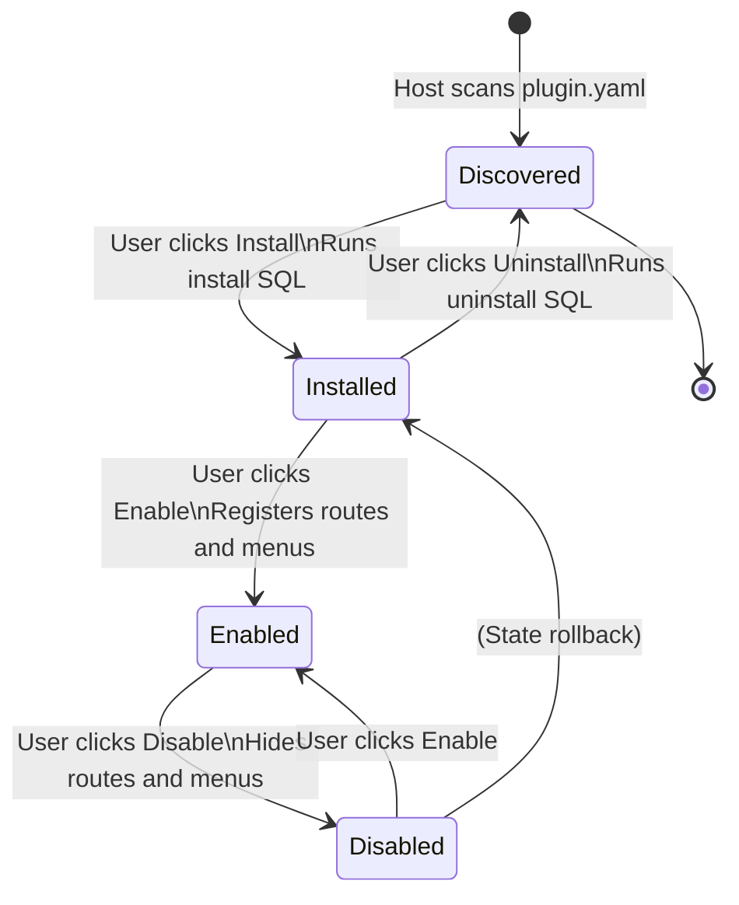

## Overview

The plugin system is one of `LinaPro`'s core capabilities — it enables extending any system capability in a loosely coupled way. Each plugin is a self-contained module package that can independently declare `API` routes, business services, database table schemas, frontend pages, and menu entries. The host loads and unloads plugins at runtime without any changes to host code.

`LinaPro` supports two plugin modes, suited to different delivery scenarios:

- **Source plugins**: compiled together with the host, ideal for business features requiring long-term maintenance
- **`WASM` dynamic plugins**: hot-loaded at runtime, ideal for temporary features, hotfixes, and distributing plugins without exposing source code

## Comparing the Two Modes

| Dimension | Source plugin | `WASM` dynamic plugin |
|-----------|---------------|----------------------|
| **Delivery** | Compiled and packaged with the host | Compiled to a standalone `.wasm` file, uploaded at runtime |
| **Hot-loading** | Not supported — requires host restart | Supported — no host restart needed |
| **Performance** | Native `Go` performance | Slightly lower due to sandbox call overhead |
| **Isolation level** | Namespace isolation | Full `WASM` sandbox isolation |
| **Host service access** | Direct calls to host package functions | Access through governed bridge interfaces |
| **Source code visibility** | Managed together with the host repository | Can distribute binary only, without exposing source |
| **Recommended use case** | Long-term business feature modules | Temporary features, hotfixes, commercial plugin distribution |
| **Development complexity** | Low — shares all host toolchain | Medium — requires understanding WASM build process |

**Source plugins are recommended in most cases** — better developer experience, better performance, and seamless integration with the host toolchain. Choose dynamic plugins when you need to:

- Deploy without restarting the host
- Apply production hotfixes with minimal blast radius
- Distribute commercially without exposing source code

## Plugin Manifest (plugin.yaml)

Every plugin requires a `plugin.yaml` manifest file declaring the plugin's metadata and menu configuration:

```yaml
# Unique plugin identifier (kebab-case)
id: content-article

# Display name
name: Article Management

# Semantic version (semver format)
version: v0.1.0

# Plugin type: source (source plugin) or dynamic (dynamic plugin)
type: source

# Description
description: Provides CRUD management for article content

# Author
author: linapro

# Plugin homepage
homepage: https://example.com/plugins/content-article

# License
license: Apache-2.0

# Menu declarations
menus:
  - key: plugin:content-article:list       # Menu key, recommended format: plugin:<plugin-id>:<feature>
    name: Article Management               # Display name (supports i18n keys)
    path: content-article-list             # Frontend route path, globally unique
    component: system/plugin/dynamic-page  # Plugin pages always use this component
    perms: content-article:article:view    # Required permission identifier
    icon: ant-design:file-text-outlined    # Menu icon (Ant Design icon name)
    type: M                                # Menu type: M=menu item, C=directory, B=button
    sort: 1                                # Sort order; lower numbers appear first
```

## Plugin Lifecycle

A plugin's complete lifecycle has five states:



| State | Description |
|-------|-------------|
| **Discovered** | Host has found `plugin.yaml` but the plugin is not yet installed |
| **Installed** | Install SQL has run, database tables created, but functionality is not yet active |
| **Enabled** | Routes, menus, and hooks are registered; plugin is fully operational |
| **Disabled** | Routes and menus are hidden; data is preserved; can be re-enabled at any time |

**Disable vs. Uninstall:**

- **Disable**: Only hides menus and routes. Plugin data and tables are fully preserved and can be restored by re-enabling.
- **Uninstall**: A dialog lets the user choose whether to clean up plugin data. Runs uninstall SQL after confirmation.

## Plugin Isolation Mechanisms

`LinaPro` provides multiple isolation layers to ensure plugins do not interfere with each other or with the host:

**Database namespace isolation**

Each plugin's database tables must be prefixed with the plugin `ID` (converting `kebab-case` to `snake_case`):

```text
Host tables:   sys_user, sys_role, sys_menu ...
Plugin tables: content_article_record, org_center_dept ...
               ^^^^^^^^^^^^^^^^        ^^^^^^^^^^^
               Plugin ID prefix        Plugin ID prefix
```

**File storage namespace isolation**

Each plugin's file storage path uses the plugin `ID` as a namespace:

```text
Host files:   temp/upload/
Plugin files: temp/upload/content-article/
                          ^^^^^^^^^^^^^^^^
                          Plugin ID namespace
```

**`WASM` sandbox isolation**

Dynamic plugins run inside a `WASM` sandbox, with strictly constrained access to host capabilities:

- **Filesystem access**: bridged through the host `storage` service, limited to the plugin's namespace
- **Database access**: bridged through the host `data` service, limited to the plugin's namespace
- **Network access**: bridged through the host `network` service, subject to declared permission grants
- **Runtime information**: obtained through the host `runtime` service bridge

Dynamic plugins must declare the required host services in `plugin.yaml` (the `services` field). The host validates service permissions at install and enable time.

## Host-Plugin Boundary Rules

Understanding and respecting the following boundary rules is the foundation of building high-quality plugins:

**The host owns top-level menu directories**

The host publishes stable top-level menu directory keys: `dashboard`, `iam`, `setting`, `scheduler`, `extension`, `developer`. Plugin menus may only be mounted under these directories (using the `parent_key` field), or under their own top-level directory.

Official plugin mount points:

| Plugin | Mount directory |
|--------|----------------|
| `org-center` | `org` |
| `content-notice` | `content` |
| All `monitor-*` plugins | `monitor` |

**Plugins do not access the host's internal packages**

Plugins may only interact with the host through the stable interfaces exposed by `pkg/pluginhost`. They must never `import` any package from the host's `internal/` directory.

**Plugin service logic belongs in `internal/service/`**

All plugin backend business logic must be implemented under `backend/internal/service/`. Do not create a top-level `service/` directory.

**Install SQL must be idempotent**

Install SQL must use idempotent statements such as `CREATE TABLE IF NOT EXISTS`, ensuring that reinstallation after "uninstall with data preserved" works correctly against the existing data.

## Extension Point Registration Example

A typical source plugin registering routes and hooks:

```go
// backend/plugin.go
package backend

import "github.com/linaproai/linapro/apps/lina-core/pkg/pluginhost"

func Register(p pluginhost.SourcePlugin) {
    // Bind embedded frontend assets
    p.Assets().UseEmbeddedFiles(embedFS)

    // Register HTTP routes
    p.HTTP().RegisterRoutes(
        pluginhost.ExtensionPointHTTPRouteRegister,
        pluginhost.CallbackExecutionModeBlocking,
        registerRoutes,
    )

    // Register a hook for successful login events
    p.Hooks().RegisterHook(
        pluginhost.ExtensionPointAuthLoginSucceeded,
        pluginhost.CallbackExecutionModeAsync,
        onLoginSucceeded,
    )

    // Register uninstall cleanup logic
    p.Lifecycle().RegisterUninstallHandler(onUninstall)
}
```

For the full plugin development guide, see [Plugin Development](/docs/plugin-development).
