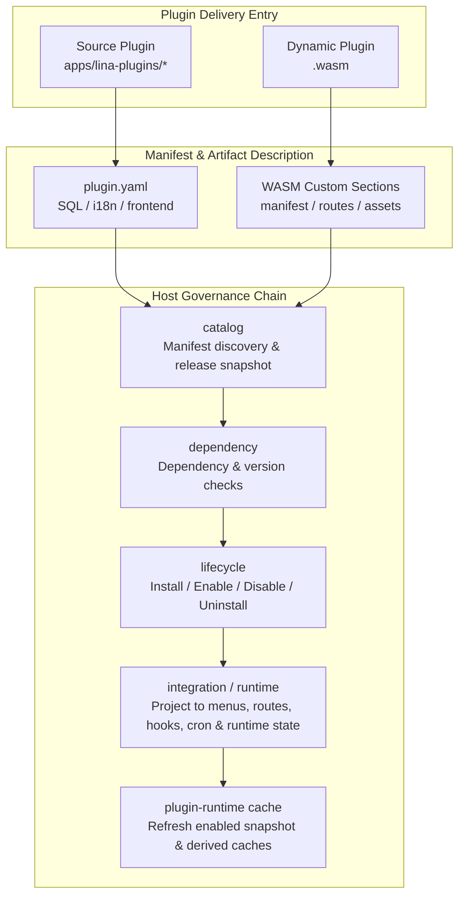
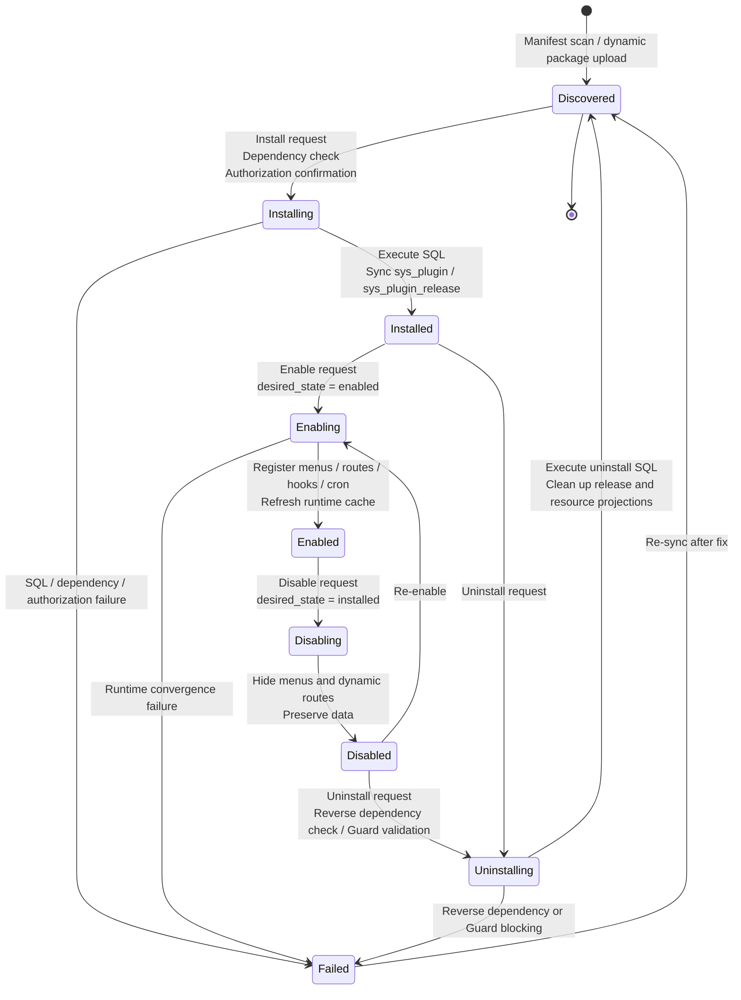
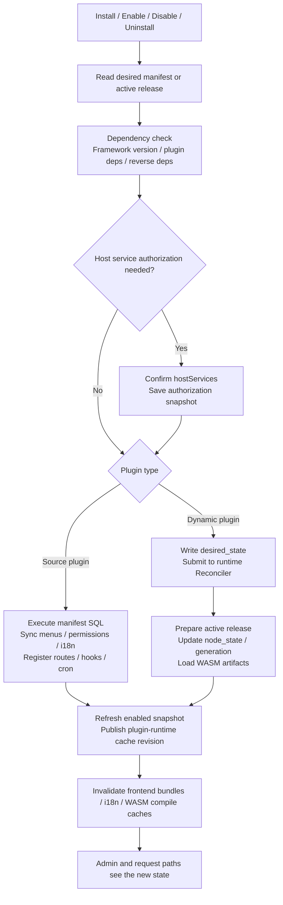
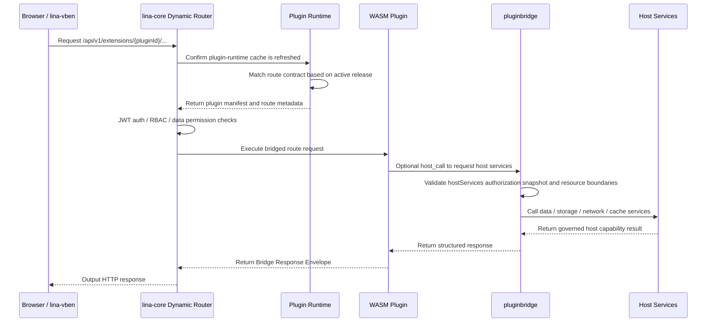

## Overview

The plugin system is `LinaPro`'s core mechanism for business extensibility. Each plugin is a **self-contained functional module** that can independently declare `API` routes, business services, database schemas, frontend pages, and menu entries — **without modifying any host code**. Source plugins are compiled alongside the host, while dynamic plugins are hot-loaded as `.wasm` files at runtime, requiring neither a host restart nor a recompilation of the main framework.

## Architecture Overview

The plugin system is more than just "scan a plugin directory and register routes." It forms a complete governance chain: from manifest discovery and dependency checking, through lifecycle orchestration and runtime convergence, to host service authorization. Whether a source plugin or a `WASM` dynamic plugin, everything flows through the same governance surface — they only differ in runtime form and how they access host capabilities.

The diagram below illustrates the full path a plugin takes from delivery entry point through the host's governance chain:



Responsibilities of the three key components in the chain:

| Component | Responsibility |
|-----------|---------------|
| `catalog` | Converts `plugin.yaml` or WASM custom sections into a host-reviewable manifest and release snapshot |
| `lifecycle` | Handles state transitions (install / enable / disable / uninstall) and `SQL` execution; for dynamic plugins, the runtime state is ultimately converged by the `runtime Reconciler` |
| `pluginbridge` | Serves only dynamic plugin sandbox calls; source plugins connect directly to host stable services via `pkg/pluginhost` and `pluginservice/contract` |

## Comparing the Two Modes

`LinaPro` offers two plugin delivery modes, each targeting different development and operational scenarios:

- **Source plugins**: compiled and packaged together with the host; the development experience is identical to the main framework — ideal for long-term core business features.
- **`WASM` dynamic plugins**: hot-loaded as standalone `.wasm` files at runtime without restarting the host — ideal for temporary features, hotfixes, or commercial distribution without exposing source code.

| Dimension | Source plugin | `WASM` dynamic plugin |
|-----------|---------------|----------------------|
| **Delivery** | Compiled and packaged with the host | Compiled to a standalone `.wasm` file, uploaded at runtime |
| **Hot-loading** | Not supported — requires host restart | Supported — no host restart needed |
| **Performance** | Native `Go` performance | Slightly lower due to sandbox call overhead |
| **Isolation level** | Namespace isolation | Full `WASM` sandbox isolation |
| **Host service access** | Via `pluginhost.HostServices` and `pluginservice/contract` stable contracts | Via `hostServices` authorization snapshot and `pluginbridge` unified protocol |
| **Source code visibility** | Managed together with the host repository | Can distribute binary only, without exposing source |
| **Recommended use case** | Long-term business feature modules | Temporary features, hotfixes, commercial plugin distribution |
| **Development complexity** | Low — shares all host toolchain | Medium — requires understanding WASM build process |

**Source plugins are recommended in most cases** — better developer experience, better performance, and seamless integration with the host toolchain. Choose dynamic plugins when you need:

- Hot-loading capability that plugs in without restarting the host
- Production hotfixes with minimal blast radius
- Commercial plugin distribution without exposing source code

## Plugin Manifest (plugin.yaml)

Every plugin needs a `plugin.yaml` manifest in its root directory. The host uses it to identify the plugin's identity, menu structure, multi-tenant strategy, and runtime dependencies. Below is a fully annotated example:

```yaml
# Unique plugin identifier (kebab-case)
id: content-article

# Plugin display name
name: Article Management

# Semantic version (semver format)
version: v0.1.0

# Plugin type: source (source plugin) or dynamic (dynamic plugin)
type: source

# Multi-tenant scope: platform_only or tenant_aware
scope_nature: tenant_aware

# Whether the plugin supports tenant-level installation and governance
supports_multi_tenant: true

# Default install mode: global or tenant_scoped
default_install_mode: tenant_scoped

# Plugin description
description: Provides CRUD management for article content

# Plugin author
author: linapro

# Plugin homepage
homepage: https://example.com/plugins/content-article

# Plugin license
license: Apache-2.0

# Plugin menu declarations
menus:
  - key: plugin:content-article:list       # Unique menu key; recommended format: plugin:<plugin-id>:<feature>
    name: Article Management               # Display name (supports i18n keys)
    path: content-article-list             # Frontend route path, globally unique
    component: system/plugin/dynamic-page  # Plugin pages always use this component; the host dynamically loads plugin frontend
    perms: content-article:article:view    # Required permission identifier
    icon: ant-design:file-text-outlined    # Menu icon, using an Iconify icon name
    type: M                                # Menu type: D=directory, M=menu item, B=button
    sort: 1                                # Sort weight; lower numbers appear first
```

**Declaring runtime dependencies (optional)**

If a plugin depends on a specific framework version or other plugins, add a `dependencies` field to the manifest. The host automatically checks the framework version range, whether plugin dependencies are satisfied, auto-install strategy, and whether circular dependencies exist before installing or upgrading:

```yaml
dependencies:
  framework:
    version: ">=0.1.0 <1.0.0"
  plugins:
    - id: plugin-demo-source
      version: ">=0.1.0"
      required: true
      install: auto
```

**Declaring host service permissions (dynamic plugins only)**

Dynamic plugins must also declare the host services, methods, and resource boundaries they intend to call via the `hostServices` field. This is a permission request list — what actually takes effect is the authorization result written into the release snapshot by the host after confirmation during install or enable. Any service or resource not requested will be inaccessible inside the sandbox:

```yaml
hostServices:
  - service: data
    methods:
      - list
      - get
    resources:
      tables:
        - content_article_record
  - service: storage
    methods:
      - put
      - get
    resources:
      paths:
        - content-article/
```

## Plugin Lifecycle

Plugin states are divided into two dimensions: **admin-visible states** and **host-internal convergence states**. The admin side focuses on five stages: discovered, installed, enabled, disabled, and uninstalled. Internally, the host further tracks fields such as `desired_state`, `current_state`, `generation`, and `release_id` for cross-node convergence and cache refresh of dynamic plugins.

The diagram below shows the complete state transitions, including intermediate states and failure fallback paths:



| State | Description |
|-------|-------------|
| **Discovered** | The host has found `plugin.yaml` but the plugin is not yet installed |
| **Installing / Enabling / Disabling / Uninstalling** | The host is executing dependency checks, authorization confirmation, `SQL` migration, release snapshot updates, or `Reconciler` convergence |
| **Installed** | Install `SQL` has been executed and governance data synced, but functionality is not yet active |
| **Enabled** | Menus, routes, hooks, scheduled tasks, frontend assets, and language resources have entered the runtime |
| **Disabled** | Routes and menus are hidden; data is preserved; can be re-enabled at any time |
| **Failed** | A lifecycle step was blocked by a dependency, `SQL`, authorization, runtime artifact, or `Guard Hook`; can be re-synced or re-executed after fix |

**Disable vs. Uninstall**

- **Disable**: Only hides menus and routes. Plugin data and tables are fully preserved and can be restored by re-enabling.
- **Uninstall**: The admin panel prompts whether to also clean up plugin-owned data. If cleanup is chosen, uninstall `SQL` runs and the data is unrecoverable; if preservation is chosen, only governance records are cleaned while data tables remain untouched.

The diagram below shows the internal execution steps for each lifecycle operation. The difference between source and dynamic plugins primarily lies in the runtime convergence path during the enable phase:



## Dynamic Plugin Request Flow

All `HTTP` requests for dynamic plugins are received by the host at the fixed prefix `/api/v1/extensions/{pluginId}/...`. The host handles authentication, `RBAC`, and data permission checks, then packages the request into the `pluginbridge` protocol and hands it to the `WASM` sandbox for execution — the plugin code can never bypass this validation layer to respond to requests directly.

The diagram below shows the complete processing chain for a dynamic plugin `API` request:



## Plugin Isolation Mechanisms

`LinaPro` ensures that plugins do not interfere with each other or with the host through three dimensions: database namespace isolation, file storage namespace isolation, and `WASM` sandbox isolation.

**Database namespace isolation**

Each plugin's database tables must be prefixed with the plugin `ID` (converting `kebab-case` to `snake_case`):

```text
Host tables:   sys_user, sys_role, sys_menu ...
Plugin tables: content_article_record, org_center_dept ...
               ^^^^^^^^^^^^^^^^        ^^^^^^^^^^^
               Plugin ID prefix        Plugin ID prefix
```

Tables that need multi-tenant support should use a `tenant_id` column as the tenant discriminator and apply tenant filtering through the host's `TenantFilterService`. When the `multi-tenant` plugin is not enabled, the default `tenant_id = 0` represents the platform tenant.

**File storage namespace isolation**

Each plugin's file storage path uses the plugin `ID` as a namespace:

```text
Host files:   temp/upload/
Plugin files: temp/upload/content-article/
                          ^^^^^^^^^^^^^^^^
                          Plugin ID namespace
```

**`WASM` sandbox isolation**

Dynamic plugins run inside a `WASM` sandbox, with strictly constrained access to host capabilities:

- **Filesystem access**: bridged through the host `storage` service, limited to the plugin's namespace
- **Database access**: bridged through the host `data` service, limited to the plugin's namespace
- **Network access**: bridged through the host `network` service, subject to declared permission grants
- **Runtime information**: obtained through the host `runtime` service bridge

Dynamic plugins must declare the required host services in `plugin.yaml` via the `hostServices` field in advance. The host validates permission declarations during install and enable, and writes the confirmed authorization snapshot into the current active release — any undeclared calls at runtime will be rejected outright by `pluginbridge`.

## Multi-Tenant Plugin Fields

The plugin manifest uses the following three fields to declare its boundary relationship with the multi-tenant system. The host and `multi-tenant` plugin perform unified governance based on these declarations:

| Field | Values | Description |
|-------|--------|-------------|
| `scope_nature` | `platform_only` / `tenant_aware` | Whether the plugin is governed only in platform context or can enter tenant context |
| `supports_multi_tenant` | `true` / `false` | Whether tenant-level installation, activation, and data isolation are supported |
| `default_install_mode` | `global` / `tenant_scoped` | Whether enabled globally by default or independently per tenant |

`platform_only` plugins are for platform-level governance, such as `multi-tenant` itself; `tenant_aware` plugins can choose global or tenant-level activation based on business needs. See: [Multi-Tenant Capabilities](/docs/multi-tenant).

## Host-Plugin Boundary Rules

Clear boundaries are the foundation of a stable plugin system over the long term. The following rules constrain what plugins can and cannot do — developers must strictly adhere to them when building plugins.

**The host owns top-level menu directories**

The host publishes a set of stable top-level menu directory keys: `dashboard`, `iam`, `setting`, `scheduler`, `extension`, `developer`. Plugin menus must be mounted under these directories (via the `parent_key` field), or use their own independent top-level directory.

Official plugin mount points:

| Plugin | Mount directory |
|--------|----------------|
| `org-center` | `org` |
| `content-notice` | `content` |
| All `monitor-*` plugins | `monitor` |

**Plugins do not access the host's internal packages**

Plugins may only interact with the host through the stable interfaces exposed by `pkg/pluginhost`. They must never `import` any package from the host's `internal/` directory. Host internal implementations may change at any time, and direct dependencies will cause the plugin to fail compilation after a host upgrade.

**Plugin service logic belongs in `internal/service/`**

All plugin backend business logic must be implemented under `backend/internal/service/`. Do not create a top-level `service/` package in the plugin root directory, to avoid naming conflicts with host packages.

**Install SQL must be idempotent**

Install SQL must use idempotent statements such as `CREATE TABLE IF NOT EXISTS`. This is because users may reinstall after choosing "preserve data on uninstall" — idempotent syntax ensures data can be reused normally without errors from duplicate table creation.

## Extension Point Registration Example

Source plugins register their capabilities with the host via the `pluginhost.SourcePlugin` interface. Below is a typical plugin entry file structure, covering frontend asset binding, route registration, event hooks, and uninstall cleanup:

```go
// backend/plugin.go
package backend

import "github.com/linaproai/linapro/apps/lina-core/pkg/pluginhost"

func Register(p pluginhost.SourcePlugin) {
    // Bind embedded frontend assets
    p.Assets().UseEmbeddedFiles(embedFS)

    // Register HTTP routes
    p.HTTP().RegisterRoutes(
        pluginhost.ExtensionPointHTTPRouteRegister,
        pluginhost.CallbackExecutionModeBlocking,
        registerRoutes,
    )

    // Register a hook for successful login events
    p.Hooks().RegisterHook(
        pluginhost.ExtensionPointAuthLoginSucceeded,
        pluginhost.CallbackExecutionModeAsync,
        onLoginSucceeded,
    )

    // Register uninstall cleanup logic
    p.Lifecycle().RegisterUninstallHandler(onUninstall)
}
```

For the full plugin development guide, see [Plugin Development](/docs/plugin-development).
