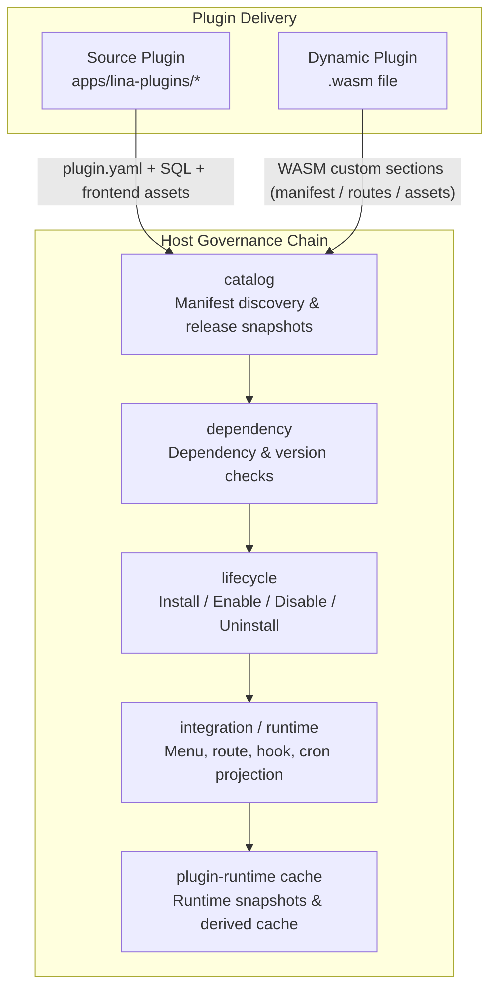
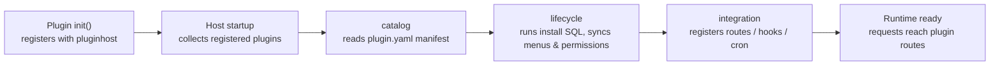
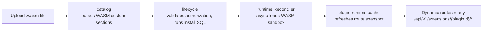
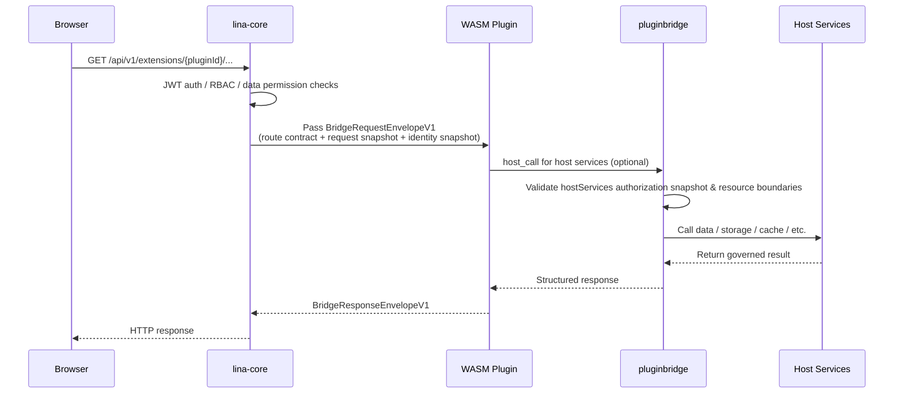
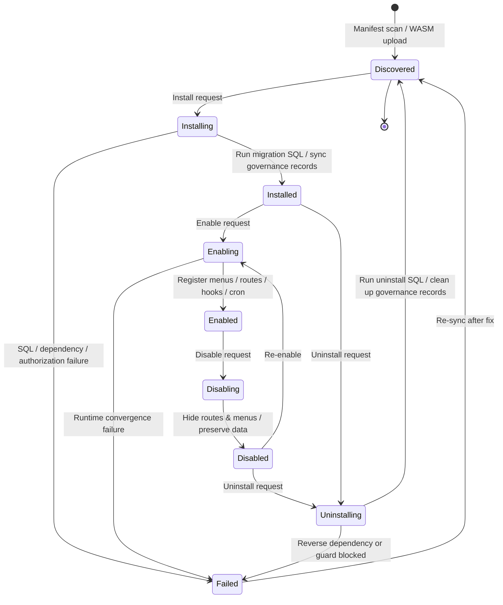

## Overview

The plugin system is `LinaPro`'s core mechanism for business extensibility. Each plugin is a **self-contained functional module** that can independently declare `API` routes, business services, database schemas, frontend pages, and menu entries — **without modifying any host code**.

`LinaPro` provides two plugin delivery modes: **source plugins** are compiled into the host binary and share the full toolchain and development experience of the main framework; **`WASM` dynamic plugins** are hot-loaded as standalone `.wasm` files at runtime, requiring neither a host restart nor a recompilation. Both modes share the same plugin governance surface — they differ only in runtime form and how they access host capabilities.

## Design Philosophy

### Why Dual-Mode?

No single plugin delivery model can simultaneously satisfy development efficiency, deployment flexibility, and security across all use cases:

- **Source plugins only**: Every feature change requires a full rebuild and restart, which increases the blast radius for production deployments. It also makes source-code-free commercial distribution impossible.
- **Dynamic plugins only**: The `WASM` sandbox introduces runtime overhead that is non-trivial in high-throughput scenarios. The cross-language `ABI` protocol also adds complexity that is unnecessary for most routine business features.

The dual-mode design lets developers choose the right delivery method for each situation: **choose source plugins for long-lived business features** — better developer experience, optimal performance, seamless toolchain integration; **choose dynamic plugins for hot fixes, temporary features, or protected commercial distribution** — zero-downtime deployment without exposing source code.

### Unified Governance Surface

Despite their different delivery forms, both modes share the same governance chain on the host side:

- A single `plugin.yaml` manifest specification, unified dependency checking, lifecycle state machine, and database governance records.
- The same isolation mechanisms: database namespace, file storage namespace, and tenant filter seams.
- The same multi-tenant policy fields: `scope_nature`, `supports_multi_tenant`, and `default_install_mode`.

Regardless of delivery mode, the management console behavior, API surface, and data isolation guarantees are identical.

## Overall Architecture

The plugin system is more than "scan a directory and register routes." It forms a complete governance chain: from manifest discovery and dependency checking, through lifecycle orchestration and runtime convergence, to host service authorization.

The diagram below shows how a plugin travels from its delivery entry point through the host's governance chain:



Key component responsibilities:

| Component | Responsibility |
|-----------|---------------|
| `catalog` | Converts `plugin.yaml` or `WASM` custom sections into auditable manifests and release snapshots, persisted in `sys_plugin_release` |
| `dependency` | Validates framework version ranges, inter-plugin dependency satisfaction, and circular dependency detection |
| `lifecycle` | Drives state transitions (install/enable/disable/uninstall) and executes migration SQL; dynamic plugin runtime state is converged by the `runtime Reconciler` |
| `integration` | Syncs enabled plugins' menus, permissions, routes, hooks, and cron jobs into the host runtime |
| `plugin-runtime cache` | Maintains enabled plugin snapshots for low-latency access on the request path |

### Mode Comparison

| Dimension | Source Plugin | `WASM` Dynamic Plugin |
|-----------|--------------|----------------------|
| **Delivery** | Compiled into host binary | Built as a standalone `.wasm`, uploaded at runtime |
| **Hot-loading** | Not supported — requires host restart | Supported — no restart needed |
| **Performance** | Native Go performance | Slightly lower — sandbox call overhead |
| **Isolation** | Namespace isolation | Full `WASM` sandbox isolation |
| **Host service access** | Direct calls via `pluginhost.HostServices` and `pluginservice/contract` stable contracts | Via `hostServices` authorization snapshots and the `pluginbridge` protocol |
| **Source visibility** | Managed alongside the host repo | Binary-only distribution available |
| **Best for** | Long-lived business feature modules | Hot fixes, temporary features, commercial distribution |
| **Dev complexity** | Low — shares all host tooling | Medium — requires understanding the `WASM` build pipeline |

**Source plugins are recommended for most use cases.** Consider dynamic plugins only when you need:

- Zero-downtime hot-loading without restarting the host
- Emergency production hot fixes with minimal blast radius
- Commercial plugin distribution without exposing source code

## How It Works

### Source Plugin Workflow

Source plugins are Go packages compiled alongside the host. A plugin creates its instance via `pluginhost.NewSourcePlugin()` inside `init()`, registers routes, event hooks, cron jobs, and lifecycle callbacks, then calls `pluginhost.RegisterSourcePlugin()` to finalize registration. The host collects all registered source plugins at startup and projects their capabilities into the runtime through the governance lifecycle.



Source plugins interact with the host exclusively through the `SourcePlugin` interface exposed by `pkg/pluginhost`, which provides access to all stable host services: `TenantFilterService` (tenant filtering), `I18n` (internationalization), `Auth` (auth context), and more.

### Dynamic Plugin Workflow

Dynamic plugins are compiled into a standard `WASM` module with the manifest and route table embedded in `WASM` custom sections. After upload, `catalog` parses the artifact and the `Reconciler` asynchronously converges the runtime state — loading the `WASM` module into the sandbox and registering its routes with the host's dynamic route dispatcher.



All `HTTP` requests to dynamic plugins are received by the host under the unified prefix `/api/v1/extensions/{pluginId}/...`. The host completes `JWT` authentication, `RBAC`, and data permission checks before wrapping the request in the `pluginbridge` protocol and passing it into the `WASM` sandbox — plugin code can never bypass this layer.

The sequence below shows a complete dynamic plugin `API` request:



## Key Components

### pluginhost

`pkg/pluginhost` is the stable public package the host exposes to source plugins. Plugins must interact with the host exclusively through this package — importing anything from the host's `internal/` directory is strictly prohibited.

The `SourcePlugin` interface provides six capability registration entry points:

| Interface | Description |
|-----------|-------------|
| `Assets()` | Binds embedded frontend static assets (`embed.FS`) |
| `HTTP()` | Registers `HTTP` routes and accesses host middleware (auth, permission, tenancy) |
| `Hooks()` | Subscribes to host-published event hooks (login succeeded, plugin installed, etc.) |
| `Cron()` | Registers scheduled jobs with automatic primary-node awareness |
| `Lifecycle()` | Registers callbacks for install/uninstall, tenant provisioning, and more |
| `Governance()` | Declares menu filter and permission filter logic |

The host exposes stable service contracts to plugins through `HostServices`, including `TenantFilterService`, `I18n`, `BizCtx`, `Config`, `Notify`, `Session`, and others.

### pluginbridge

`pkg/pluginbridge` is the sandbox communication layer for dynamic plugins, defining the `ABI` protocol between the host and `WASM` modules. The host packages authentication and authorization results into a `BridgeRequestEnvelopeV1` and passes it through linear memory into the `WASM` instance. Dynamic plugins use `pluginbridge`'s guest utilities to receive requests and return a `BridgeResponseEnvelopeV1`.

Dynamic plugins must export three `WASM` functions:

| Export | Description |
|--------|-------------|
| `lina_dynamic_route_alloc(size)` | Called by the host to allocate the request data buffer |
| `lina_dynamic_route_execute(size)` | Called by the host to trigger request handling and return a response pointer |
| `lina_host_call_alloc(size)` | Allocates a buffer to receive host callback responses |

When a plugin needs host capabilities, it issues a `host_call` through `pluginbridge`. The host's `pluginbridge` service validates the authorization snapshot before allowing the call.

### plugin-runtime cache

The `plugin-runtime cache` maintains snapshots of enabled plugins for low-latency access on the request path, avoiding per-request database queries. When plugin state changes (enable, disable, upgrade), `lifecycle` publishes a revision notification, and the cache refreshes its snapshot while invalidating frontend bundle, `i18n` resource, and `WASM` compilation caches.

### catalog & lifecycle

`catalog` converts `plugin.yaml` or `WASM` custom sections into auditable manifests and writes them to `sys_plugin_release` as release snapshots. `lifecycle` then drives state transitions against those snapshots:

- **Install**: Runs migration SQL, syncs menus and permissions into the governance database.
- **Enable**: Projects routes, hooks, and cron jobs into the host runtime.
- **Disable**: Hides routes and menus while preserving all data.
- **Uninstall**: Runs uninstall SQL and cleans up governance records.

For dynamic plugins, the `desired_state` field and `generation` counter drive the `Reconciler` to asynchronously converge the `WASM` sandbox state across all cluster nodes.

## Plugin Manifest (plugin.yaml)

Every plugin must place a `plugin.yaml` manifest at its root. The host uses it to discover the plugin's identity, menu structure, multi-tenant policy, and runtime dependencies.

```yaml
# Unique plugin identifier (kebab-case)
id: content-article

# Display name
name: Article Management

# Semantic version (semver format)
version: v0.1.0

# Plugin type: source or dynamic
type: source

# Multi-tenant scope: platform_only or tenant_aware
scope_nature: tenant_aware

# Whether tenant-level installation and isolation are supported
supports_multi_tenant: true

# Default installation mode: global or tenant_scoped
default_install_mode: tenant_scoped

description: CRUD management for article content
author: linapro
license: Apache-2.0

# Menu declarations
menus:
  - key: plugin:content-article:list
    name: Articles
    path: content-article-list
    component: system/plugin/dynamic-page
    perms: content-article:article:view
    icon: ant-design:file-text-outlined
    type: M     # D=directory, M=menu item, B=button
    sort: 1
```

**Declaring runtime dependencies (optional)**

```yaml
dependencies:
  framework:
    version: ">=0.1.0 <1.0.0"
  plugins:
    - id: plugin-demo-source
      version: ">=0.1.0"
      required: true
      install: auto    # auto-install if missing
```

**Declaring host service permissions (dynamic plugins only)**

Dynamic plugins must declare required host services and resource boundaries via `hostServices`. The host validates these at install/enable time and persists the confirmed authorization into the release snapshot. Any undeclared call at runtime is rejected by `pluginbridge`:

```yaml
hostServices:
  - service: data
    methods: [get, list, mutate, transaction]
    resources:
      tables:
        - content_article_record
  - service: storage
    methods: [get, put, delete, list]
    resources:
      paths:
        - content-article/
  - service: cache
    methods: [get, set, delete, incr, expire]
  - service: network
    methods: [request]
    resources:
      - url: "https://api.example.com"
```

Supported `hostServices` service identifiers:

| Service | Description |
|---------|-------------|
| `runtime` | Log writes, plugin-scoped state read/write, time/UUID/node info |
| `data` | Governed database read/write (with table namespace and tenant filtering) |
| `storage` | Namespace-scoped file storage operations |
| `cache` | Distributed cache read/write |
| `network` | Outbound `HTTP` requests (target `URL` must be declared) |
| `cron` | Dynamic cron job registration |
| `lock` | Distributed locking |
| `secret` | Sensitive configuration reads |
| `event` | Event publishing and subscription |
| `config` | Plugin configuration reads |
| `notify` | Message notification sending |

## Plugin Lifecycle

Plugin state spans two dimensions: **management-console visible states** and **host internal convergence state**. The host tracks `desired_state`, `current_state`, `generation`, and `release_id` internally to drive asynchronous convergence of dynamic plugin sandbox state across nodes.



| State | Description |
|-------|-------------|
| **Discovered** | Host found a `plugin.yaml` or received a `.wasm` upload, but installation has not started |
| **Installing** | Running dependency checks, authorization confirmation, and migration SQL |
| **Installed** | Migration SQL executed and governance data synced; functionality not yet active |
| **Enabling** | Projecting menus, routes, hooks into the runtime, or waiting for Reconciler convergence |
| **Enabled** | Plugin is fully active — requests are routed correctly |
| **Disabling** | Withdrawing routes and menus from the runtime |
| **Disabled** | Routes and menus are hidden; all data and tables are fully preserved |
| **Uninstalling** | Running uninstall SQL, cleaning up governance records |
| **Failed** | A lifecycle step was blocked by a dependency, SQL error, authorization issue, or guard hook |

**Disable vs. Uninstall**

- **Disable**: Routes and menus are hidden only. All data tables and data are fully preserved — the plugin can be re-enabled at any time.
- **Uninstall**: The management console asks whether to also purge plugin data. Choosing to purge runs the uninstall SQL and the data cannot be recovered. Choosing to preserve leaves the data tables untouched while removing only the governance records.

## Plugin Isolation

`LinaPro` guarantees that plugins cannot interfere with each other or with the host through three isolation layers.

**Database namespace isolation**

Every plugin's database tables must be prefixed with the plugin ID (converted from `kebab-case` to `snake_case`), preventing collisions with host or other plugin tables:

```text
Host tables:   sys_user, sys_role, sys_menu
Plugin tables: content_article_record  (plugin: content-article)
               org_center_dept         (plugin: org-center)
```

Plugin tables that support multi-tenancy must include a `tenant_id` column and use `TenantFilterService` to append tenant filter conditions. When the `multi-tenant` plugin is not enabled, `tenant_id = 0` represents the platform tenant by default.

**File storage namespace isolation**

Each plugin's file storage path is prefixed with its plugin ID:

```text
Example plugin storage path:  temp/upload/content-article/
```

**`WASM` sandbox isolation**

Dynamic plugins run inside a `WASM` sandbox with strictly constrained access to host capabilities:

- **Database access**: Bridged through the host `data` service — limited to tables declared in `hostServices.resources.tables`
- **File access**: Bridged through the host `storage` service — limited to paths declared in `hostServices.resources.paths`
- **Network access**: Bridged through the host `network` service — limited to URLs declared in `hostServices.resources`
- **Runtime info**: Obtained through the host `runtime` service

Any call at runtime that was not declared in the authorization snapshot is rejected immediately by `pluginbridge`. Plugin code has no mechanism to bypass this constraint.

## Multi-Tenant Support

The plugin manifest declares its relationship with the multi-tenant system through three fields:

| Field | Values | Description |
|-------|--------|-------------|
| `scope_nature` | `platform_only` / `tenant_aware` | Whether the plugin can enter tenant context |
| `supports_multi_tenant` | `true` / `false` | Whether tenant-level installation and data isolation are supported |
| `default_install_mode` | `global` / `tenant_scoped` | Enabled globally for all tenants, or independently per tenant |

`platform_only` plugins (such as `multi-tenant` itself) are governed at the platform level only. `tenant_aware` plugins can choose global installation (all tenants share one instance, e.g. `org-center`) or per-tenant installation (each tenant installs independently, e.g. `plugin-demo-source`). See [Multi-Tenant Support](/docs/multi-tenant) for details.

## Host–Plugin Boundary Rules

**The host owns top-level menu directories**

The host publishes a stable set of top-level menu directory keys: `dashboard`, `iam`, `setting`, `scheduler`, `extension`, `developer`. Plugin menus must mount under one of these directories via `parent_key`, or declare their own independent top-level directory key. Official plugin mount points:

| Plugin | Mount directory |
|--------|----------------|
| `org-center` | `org` |
| `content-notice` | `content` |
| All `monitor-*` plugins | `monitor` |

**Plugins must not access host internals**

Plugins may only interact with the host through the stable interfaces exposed by `pkg/pluginhost`. Importing anything from the host's `internal/` directory is strictly prohibited — host internals may change at any time and a direct dependency will break the plugin on the next host upgrade.

**Plugin service logic belongs in `backend/internal/service/`**

All backend business logic must be implemented under `backend/internal/service/`. Creating a top-level `service/` package at the plugin root is not allowed, as it risks naming collisions with host packages.

**Install SQL must be idempotent**

All install SQL must use idempotent statements such as `CREATE TABLE IF NOT EXISTS`. This is required because a user may uninstall while choosing to preserve data and then reinstall later — idempotent SQL ensures the existing data is reused without errors.

## Usage Guide

### Developing a Source Plugin

The core entry point for a source plugin is `backend/plugin.go`:

```go
package backend

import "github.com/linaproai/linapro/apps/lina-core/pkg/pluginhost"

func init() {
    plugin := pluginhost.NewSourcePlugin("my-plugin")

    // Bind embedded frontend assets
    plugin.Assets().UseEmbeddedFiles(embeddedFiles)

    // Register HTTP routes
    plugin.HTTP().RegisterRoutes(
        pluginhost.ExtensionPointHTTPRouteRegister,
        pluginhost.CallbackExecutionModeBlocking,
        registerRoutes,
    )

    // Register an event hook (async execution)
    plugin.Hooks().RegisterHook(
        pluginhost.ExtensionPointAuthLoginSucceeded,
        pluginhost.CallbackExecutionModeAsync,
        onLoginSucceeded,
    )

    // Register a cron job
    plugin.Cron().RegisterCron(
        pluginhost.ExtensionPointCronRegister,
        pluginhost.CallbackExecutionModeBlocking,
        registerCronJobs,
    )

    // Register lifecycle callbacks
    plugin.Lifecycle().RegisterBeforeInstallHandler(onBeforeInstall)
    plugin.Lifecycle().RegisterAfterInstallHandler(onAfterInstall)
    plugin.Lifecycle().RegisterUninstallHandler(onUninstall)

    pluginhost.RegisterSourcePlugin(plugin)
}
```

Route registration has direct access to host middleware and services:

```go
func registerRoutes(ctx context.Context, registrar pluginhost.HTTPRegistrar) error {
    hostServices := registrar.HostServices()
    svc := myservice.New(hostServices.TenantFilter(), hostServices.I18n())

    routes := registrar.Routes()
    middlewares := routes.Middlewares()
    routes.Group("/api/v1", func(group pluginhost.RouteGroup) {
        group.Middleware(
            middlewares.Auth(),
            middlewares.Tenancy(),
            middlewares.Permission(),
        )
        group.Bind(mycontroller.NewV1(svc))
    })
    return nil
}
```

### Developing a Dynamic Plugin

A dynamic plugin's entry point is `main.go`, which exports three `WASM` functions and delegates requests to `pluginbridge`:

```go
package main

import "github.com/linaproai/linapro/apps/lina-core/pkg/pluginbridge"

var guestRuntime = pluginbridge.NewGuestRuntime(backend.HandleRequest)

//go:wasmexport lina_dynamic_route_alloc
func linaDynamicRouteAlloc(size uint32) uint32 {
    return guestRuntime.Alloc(size)
}

//go:wasmexport lina_dynamic_route_execute
func linaDynamicRouteExecute(size uint32) uint64 {
    ptr, length, err := guestRuntime.Execute(size)
    if err != nil {
        fallback, _ := pluginbridge.EncodeResponseEnvelope(
            pluginbridge.NewInternalErrorResponse(err.Error()),
        )
        ptr, length, _ = guestRuntime.ExposeResponseBuffer(fallback)
    }
    return uint64(ptr)<<32 | uint64(length)
}

//go:wasmexport lina_host_call_alloc
func linaHostCallAlloc(size uint32) uint32 {
    return guestRuntime.HostCallAlloc(size)
}

func main() {}
```

Route dispatch is set up via `pluginbridge.MustNewGuestControllerRouteDispatcher`:

```go
// backend/plugin.go
var dispatcher = pluginbridge.MustNewGuestControllerRouteDispatcher(
    mycontroller.New(),
)

func HandleRequest(req *pluginbridge.BridgeRequestEnvelopeV1) (*pluginbridge.BridgeResponseEnvelopeV1, error) {
    return dispatcher.HandleRequest(req)
}
```

### Installing and Uninstalling Plugins

Plugin install, enable, disable, and uninstall operations are all performed through the management console's plugin governance interface. The host automatically handles dependency checks, migration SQL, and runtime projection. Dynamic plugins can additionally be installed by uploading a `.wasm` file via the API.

On uninstall, the management console asks whether to also purge plugin data: choosing to purge runs the uninstall SQL and deletes data; choosing to preserve removes only the governance records, leaving data tables and data intact for potential future reinstallation.

### Plugin Dependency Management

Plugins can declare dependencies on framework versions or other plugins in the `dependencies` field of `plugin.yaml`. The host validates these automatically before installation:

- `framework.version`: Verifies the current host version falls within the declared `semver` range.
- `plugins`: Verifies all `required: true` plugins are already installed and at a satisfying version.
- `install: auto`: For dependencies marked with automatic installation, the host installs them before the current plugin.

On uninstall, the host also checks reverse dependencies — if any currently enabled plugin depends on the plugin being uninstalled, the request is blocked by the guard. The dependent plugins must be uninstalled first.

For the complete plugin development guide, see [Extension Development](/docs/plugin-development).

