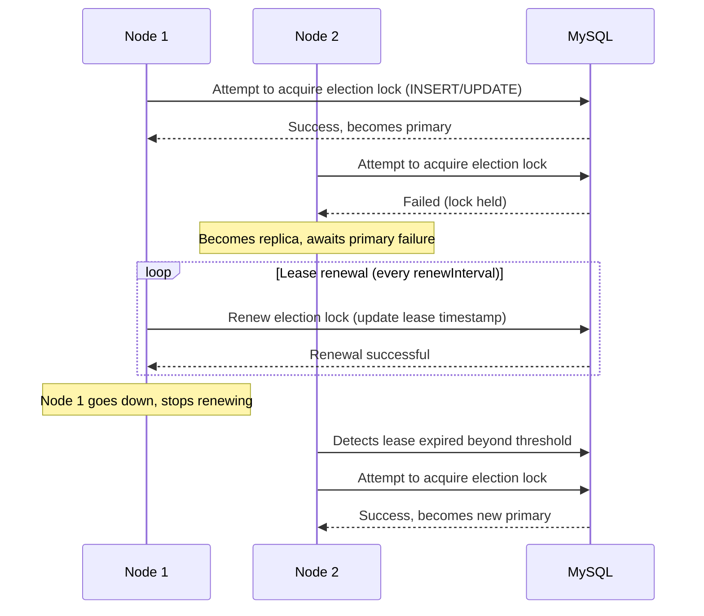
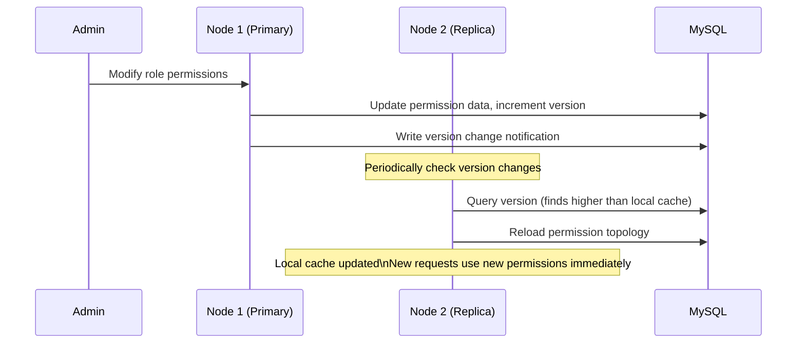

## Overview

`LinaPro` treats distributed capability as a native feature of the framework — not as a bolt-on extension added after the fact. The framework supports both single-node and distributed deployment modes at the infrastructure level. Switching between them requires only a configuration change; no changes to business code are needed.

## Deployment Modes

### Single-node mode (default)

By default, `LinaPro` runs in single-node mode, suitable for development environments and small-scale production deployments:

```yaml
cluster:
  enabled: false  # default — single-node mode
```

```text
          ┌──────────────────────────────────┐
          │             lina-core            │
          │    (single node, all-in-one)     │
          └─────────────────┬────────────────┘
                            │
                       ┌────▼────┐
                       │  MySQL  │
                       └─────────┘
```

### Cluster mode

Setting `cluster.enabled` to `true` activates the distributed coordination mechanism and enables horizontal scaling across multiple nodes:

```yaml
cluster:
  enabled: true
  election:
    lease: 30s           # Election lock lease duration
    renewInterval: 10s   # Lease renewal interval (recommended: 1/3 of lease)
```

```text
       ┌───────────────────────────────────┐
       │           Load Balancer           │
       └───────┬──────────────┬────────────┘
               │              │
         ┌─────▼─────┐  ┌─────▼─────┐
         │   Node 1  │  │   Node 2  │  ...
         │ (primary) │  │ (replica) │
         └─────┬─────┘  └─────┬─────┘
               │              │
               └──────┬───────┘
                      │
               ┌──────▼──────┐
               │    MySQL    │
               └─────────────┘
```

In cluster mode, all nodes share the same `MySQL` database. Nodes coordinate through the database — leader election lock, permission version synchronization — with no need to deploy `Redis`, `etcd`, or any additional middleware.

## Distributed Leader Election

`LinaPro` uses a database optimistic-lock based election mechanism — lightweight and reliable:



**Lease configuration recommendations:**

- `lease` (lease duration): 30s is recommended — after the primary goes down, re-election completes within at most 30 seconds
- `renewInterval` (renewal interval): 1/3 of `lease` is recommended (i.e., 10s) to ensure a comfortable renewal window

## Primary and Replica Responsibilities

`LinaPro` primary and replica nodes have distinct responsibilities:

**Primary-only responsibilities:**

- Execute host-level scheduled tasks (periodic maintenance tasks of the `make start` type)
- Permission topology version broadcast (notifying all nodes to refresh their cache)
- Dynamic plugin lifecycle coordination

**Shared responsibilities (all nodes):**

- Handle `HTTP` requests (business API, plugin API)
- Read the permission topology (from local cache or database)
- Execute tasks in the persistent scheduled task subsystem (competing for a lock before execution to prevent duplicate runs)

## Permission Topology Version Synchronization

Changes to the permission topology (user roles, role menus, menu permissions) must propagate to all nodes. `LinaPro` achieves this through a version number mechanism:



This mechanism ensures permission changes take effect across all nodes quickly — within at most 3 seconds — with no user re-login required.

## Distributed Task Scheduling

In cluster mode, the persistent scheduled task subsystem uses distributed locks to prevent duplicate task execution:

- Each time a task fires, nodes compete to acquire a distributed lock
- The node that acquires the lock executes the task; all other nodes skip
- After the task completes, the lock is released and the result is written to the database
- All nodes can view the task execution history

## Distributed Locks

The framework exposes a unified distributed lock interface (`pkg/locker`) for use by both the host and plugins:

```go
// Example: using a distributed lock to protect a critical section
err := locker.TryLock(ctx, "my-lock-key", 30*time.Second, func() error {
    // Critical section — only one node in the cluster will execute this
    return doSomething()
})
```

In single-node mode, distributed locks degrade to local mutexes with identical behavior.

## Key-Value Cache

The framework provides a cluster-aware key-value cache interface (`pkg/kvcache`) that supports cache invalidation broadcasts in cluster mode:

- Permission topology version cache
- Online session cache
- i18n resource cache

## Scaling Up

When business growth calls for more capacity, the steps are:

1. Update `config.yaml` — set `cluster.enabled` to `true`
2. Start a new host node instance pointing to the same `MySQL` database
3. Add the new node to the load balancer

No changes to business code are required. The framework automatically handles node discovery, leader election, and permission synchronization.
