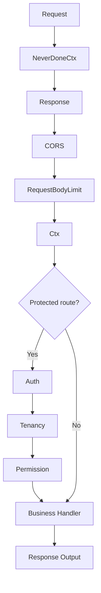
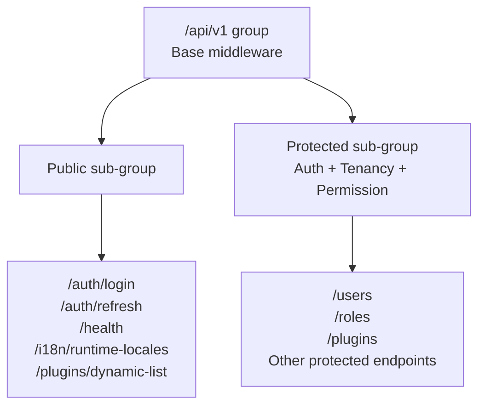
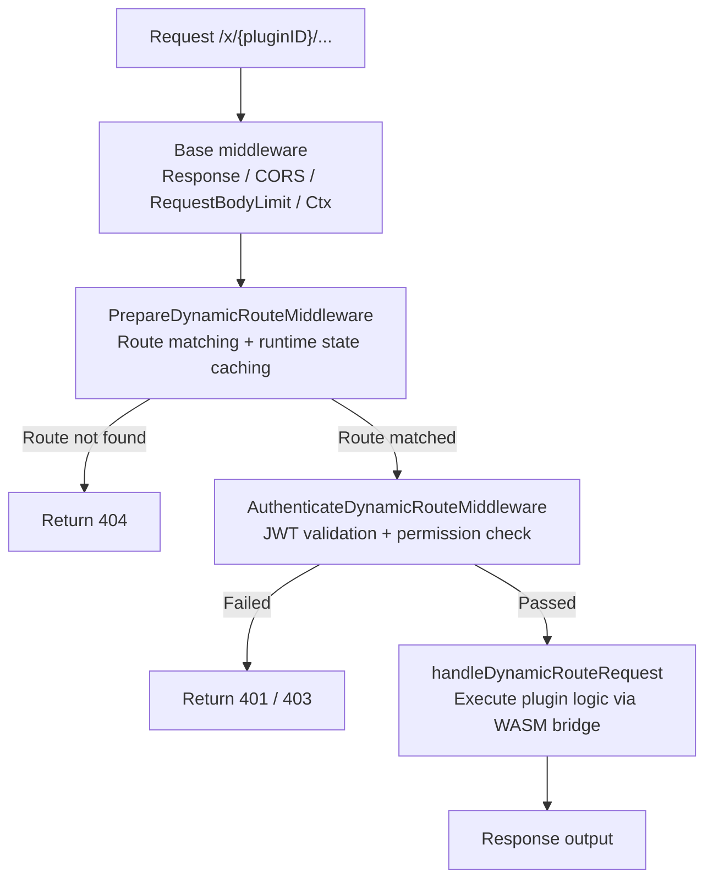

## Overview

The routing system of `lina-core` is built on top of GoFrame's `ghttp.Server`, organized around four dimensions: **version prefixes**, **middleware chains**, **permission declarations**, and **plugin extension interfaces**. The host manages its own API versions under the `/api/v1` prefix, enforces CORS, authentication, and permission governance through an ordered middleware chain, maintains all API attributes inline with code via `g.Meta` struct tags, and provides differentiated routing strategies for the two plugin types.

## API Version Management

All host control-plane APIs are mounted under the `/api/v1` router group. The version prefix is declared via `server.Group`. When a future `/api/v2` is needed, only a new group needs to be added — existing `v1` endpoints remain unaffected.

```go
server.Group("/api/v1", func(group *ghttp.RouterGroup) {
    bindHostAPIMiddlewares(group, middlewareSvc)
    bindPublicStaticAPIRoutes(group, ...)
    bindProtectedStaticAPIRoutes(group, middlewareSvc, ...)
})
```

| Path Prefix | Purpose |
|-------------|---------|
| `/api/v1` | Current stable host API version — authentication, users, roles, plugin management, and other control-plane endpoints |
| `/x` | Dedicated data-plane prefix for dynamic plugins, dispatched by the host runtime to the matching plugin |
| `/` | Root-level routes — static frontend assets, health probes, etc. |

The guiding principle for version management is: **a router group is a version boundary**. Different API versions coexist in the same process, each with its own middleware configuration and handler set — no `Content-Type` negotiation or special request headers are used for versioning.

## Middleware Pipeline

The host divides middleware into two categories: **request-chain middleware** mounted on router groups, and **global middleware** registered at the server level. Request-chain middleware executes in declaration order; if any middleware calls `r.ExitAll()`, the chain stops immediately.

### Common Base Middleware

The following middleware applies to both the `/api/v1` group and the dynamic plugin group `/x`, forming the base processing pipeline for every request:

| Middleware | Responsibility |
|------------|---------------|
| `ghttp.MiddlewareNeverDoneCtx` | Replaces the request `Context` with a non-cancellable copy, preventing client disconnection from prematurely terminating business logic |
| `middlewareSvc.Response` | Serializes a unified JSON response envelope, localizes business error messages, and transparently passes through `304`, `204`, and streaming responses |
| `middlewareSvc.CORS` | Calls `CORSDefault`, allowing cross-origin requests and handling `OPTIONS` preflight |
| `middlewareSvc.RequestBodyLimit` | Caps non-multipart bodies at 8 MB; for multipart uploads, the limit is computed dynamically from the `sys.upload.maxSize` configuration |
| `middlewareSvc.Ctx` | Injects the business context (user identity placeholder, tenant placeholder, request locale), and sets the `Content-Language` response header |

### Authentication and Permission Middleware

The following middleware is mounted only on protected route sub-groups. Public endpoints such as login and health probes do not pass through this layer:

| Middleware | Responsibility |
|------------|---------------|
| `middlewareSvc.Auth` | Parses the JWT from `Authorization: Bearer <token>`, validates the signature and session validity, and writes the user identity into the request context |
| `middlewareSvc.Tenancy` | Resolves the tenant identity from the request context and injects the tenant ID; defaults to the platform tenant when multi-tenancy is disabled |
| `middlewareSvc.Permission` | Reads the `permission` field from the DTO's `g.Meta` tag or a manual declaration, then checks whether the current user holds the required permission |

The middleware execution order is shown below:



### Middleware Available to Source Plugins

The host publishes the above middleware to source plugins through the `RouteMiddlewares` interface. Plugins compose the middleware they need without directly depending on internal host packages:

```go
routes.Group("/api/v1", func(group pluginhost.RouteGroup) {
    group.Middleware(
        middlewares.NeverDoneCtx(),
        middlewares.HandlerResponse(),
        middlewares.CORS(),
        middlewares.RequestBodyLimit(),
        middlewares.Ctx(),
    )
    // Public sub-group
    group.Group("/", func(group pluginhost.RouteGroup) {
        group.Bind(demoController.Ping)
    })
    // Protected sub-group
    group.Group("/", func(group pluginhost.RouteGroup) {
        group.Middleware(
            middlewares.Auth(),
            middlewares.Tenancy(),
            middlewares.Permission(),
        )
        group.Bind(demoController.ListRecords, ...)
    })
})
```

## Auth Route Design

The host separates routes into **public routes** and **protected routes** using middleware differences between router sub-groups, rather than relying on path conventions or special markers.

### Route Layering



### Permission Declaration

The permission identifier for a protected endpoint is declared inline in the DTO's `g.Meta` tag. The `Permission` middleware reads this identifier at runtime and checks it against the current user's role permissions:

```go
type UserListReq struct {
    g.Meta   `path:"/users" method:"get" tags:"User" summary:"List users" permission:"user:list"`
    Page     int `json:"page"`
    PageSize int `json:"pageSize"`
}
```

The `Auth` middleware authentication flow:

1. Reads the `Bearer Token` from the `Authorization` request header
2. Parses the JWT and validates the signature and expiry
3. Calls `SessionStore.TouchOrValidate` to refresh session activity and verify the session still exists (supports forced logout and timeout cleanup)
4. Writes the user identity (user ID, tenant ID, token ID, etc.) into the request context

The `Permission` middleware authorization flow:

1. Reads the `permission` field from `g.Meta` tags; supports multiple permissions separated by commas
2. Loads the current user's access context (permission list, data scope)
3. Matches the required permissions using OR semantics — any one satisfied grants access; the wildcard `*:*:*` bypasses the check for super administrators

For a detailed treatment of authentication (JWT issuance, session management, RBAC permission model), see the permission management chapter.

## Inline API Attribute Management

`lina-core` uses the `g.Meta` mechanism to declare all API attributes — path, method, grouping tags, summary, description, permission, MIME type, and more — inline in the request DTO's struct tags, achieving **code and documentation from a single source of truth**.

### Host Endpoint Tag Example

```go
type CreateRecordReq struct {
    g.Meta  `path:"/plugins/linapro-demo-source/records" method:"post" mime:"multipart/form-data" tags:"Source Plugin Demo" summary:"Create source plugin sample record" dc:"Create a sample record with an optional attachment." permission:"linapro-demo-source:example:create"`
    Title   string `json:"title" v:"required|length:1,128" dc:"Record title"`
    Content string `json:"content" dc:"Record content"`
}
```

### Dynamic Plugin Endpoint Tag Example

Dynamic plugins use `gmeta.Meta` instead of `g.Meta` because of component dependencies in the sandboxed environment, with additional `access` and `operLog` fields:

```go
type CreateDemoRecordReq struct {
    gmeta.Meta `path:"/demo-records" method:"post" tags:"Dynamic Plugin Demo" summary:"Create dynamic plugin sample record" access:"login" permission:"linapro-demo-dynamic:record:create" operLog:"create"`
    Title      string `json:"title" v:"required|length:1,128"`
    Content    string `json:"content"`
}
```

### Common Tag Fields

| Tag Field | Scope | Description |
|-----------|-------|-------------|
| `path` | Host / Source plugin / Dynamic plugin | Endpoint route path |
| `method` | Host / Source plugin / Dynamic plugin | HTTP method, e.g. `get`, `post` |
| `tags` | Host / Source plugin / Dynamic plugin | Grouping tags used for OpenAPI document categories |
| `summary` | Host / Source plugin / Dynamic plugin | Short endpoint description, shown in docs and plugin management UI |
| `dc` | Host / Source plugin | Detailed endpoint description (`description` shorthand) |
| `permission` | Host / Source plugin / Dynamic plugin | Permission identifier enforced by the `Permission` middleware |
| `mime` | Host / Source plugin | Request body MIME type, e.g. `multipart/form-data` |
| `access` | Dynamic plugin | Access control — `public` for anonymous, `login` for authenticated |
| `operLog` | Dynamic plugin | Operation log type — `create`, `update`, `delete`, `other` |

This approach consolidates endpoint definition, documentation metadata, and permission declarations in the same DTO file. The host automatically aggregates the OpenAPI document from these tags, eliminating the need to maintain separate annotation files or documentation, and fundamentally removing the risk of drift between code and docs.

## Source Plugin Routing

Source plugins are compiled and delivered with the host binary. They register routes via the `Routes()` method of `pluginhost.HTTPRegistrar` and have **full freedom to register any route path**.

### Registration

Source plugins declare a route-registration callback in their `init()` function. The host triggers all callbacks during the `registerSourcePluginHTTPRoutes` startup phase:

```go
plugin.HTTP().RegisterRoutes(
    pluginhost.ExtensionPointHTTPRouteRegister,
    pluginhost.CallbackExecutionModeBlocking,
    registerRoutes,
)
```

The `registerRoutes` callback receives an `HTTPRegistrar` and creates route groups via `Routes().Group()`, composing host-published middleware through `Middlewares()`:

```go
func registerRoutes(ctx context.Context, registrar pluginhost.HTTPRegistrar) error {
    routes      := registrar.Routes()
    middlewares := routes.Middlewares()

    routes.Group("/api/v1", func(group pluginhost.RouteGroup) {
        // Base middleware
        group.Middleware(
            middlewares.NeverDoneCtx(),
            middlewares.HandlerResponse(),
            middlewares.CORS(),
            middlewares.RequestBodyLimit(),
            middlewares.Ctx(),
        )
        // Public sub-group
        group.Group("/", func(group pluginhost.RouteGroup) {
            group.Bind(demoController.Ping)
        })
        // Protected sub-group (must follow Auth -> Tenancy -> Permission order)
        group.Group("/", func(group pluginhost.RouteGroup) {
            group.Middleware(
                middlewares.Auth(),
                middlewares.Tenancy(),
                middlewares.Permission(),
            )
            group.Bind(demoController.CreateRecord, demoController.ListRecords, ...)
        })
    })
    return nil
}
```

### Freedom and Conflict Risk

Source plugins are not subject to any enforced route-path restriction. They can register routes under `/`, `/portal`, `/api/v1`, `/api/v2`, or any custom prefix. This freedom comes with the following expectations:

- **Avoid conflicting with host routes**: The host already occupies all control-plane paths under `/api/v1`. Source plugins should use an unambiguous namespace such as `/api/v1/plugins/{plugin-id}/`
- **Avoid conflicts between plugins**: When multiple source plugins are installed, path collisions cause route registration to fail and stop program startup — developers must ensure path uniqueness
- **Protected routes must follow the correct middleware order**: Any sub-group that uses `Auth` must compose middleware as `Auth → Tenancy → Permission`; the host enforces this constraint through automated tests

### Route Capture

During the registration phase the host captures all `SourceRouteBinding` records from source plugins and aggregates documentable endpoints into the host OpenAPI document automatically — no additional developer action is required.

## Dynamic Plugin Routing

Dynamic plugins (WASM plugins) have their routes fully managed by the host. The plugin itself does not interact with GoFrame's route registration mechanism directly, and routing capabilities are explicitly constrained.

### Namespace Constraint

All dynamic plugin routes are forced under the `/x/{pluginID}/` prefix:

```text
/x/linapro-demo-dynamic/backend-summary
/x/linapro-demo-dynamic/demo-records
/x/linapro-demo-dynamic/demo-records/{id}
```

This constraint is enforced by a wildcard catch-all handler (`/*dynamicPath`) bound to the `/x` router group. A plugin cannot bind to `/api/v1` or any path outside `/x`, ensuring dynamic plugins can never disrupt the host routing structure.

### Route Declaration

Dynamic plugin routes are declared through `RouteContract` embedded in the WASM artifact — not registered at runtime. The host parses route contracts when loading the artifact; incoming requests are matched by the host-side `PrepareDynamicRouteMiddleware`:

```go
// Route contract embedded in the WASM artifact
type RouteContract struct {
    Path        string            // Plugin-internal path, e.g. /demo-records
    Method      string            // HTTP method
    Tags        []string          // Grouping tags
    Summary     string            // Short description
    Access      string            // "public" or "login"
    Permission  string            // Permission identifier
    Meta        map[string]string // Plugin-defined metadata
    RequestType string            // Request type name used for reflective dispatch
}
```

The `Path` field is the plugin-internal path. The host prepends `/x/{pluginID}` when exposing it externally.

### Dynamic Route Request Flow



### Dynamic Plugin Permission Declaration

Dynamic plugin route access is declared through the `access` and `permission` fields of `RouteContract`:

| Field | Value | Description |
|-------|-------|-------------|
| `access` | `public` | Anonymous access — no authentication required |
| `access` | `login` | Requires an authenticated session — the host validates the JWT |
| `permission` | e.g. `linapro-demo-dynamic:record:create` | Requires a specific permission — the host checks it against the user's permission set |

### Source Plugin vs. Dynamic Plugin Routing Comparison

| Dimension | Source Plugin | Dynamic Plugin |
|-----------|--------------|---------------|
| **Registration method** | Callback registered via `HTTPRegistrar` at startup | Route contracts parsed from WASM artifact at load time |
| **Path restriction** | None — any path can be registered | Forced under `/x/{pluginID}/` |
| **Middleware composition** | Plugin selects and combines from `RouteMiddlewares` | Managed entirely by the host; plugin influences auth behavior via `access` field |
| **Permission declaration** | Inline in DTO's `g.Meta` tag | `permission` field in `RouteContract` |
| **OpenAPI document** | Automatically aggregated into host docs | Host reads and aggregates from route contracts |
| **Route conflict risk** | Developer responsibility | Avoided by host namespace constraints |

## Global Middleware Extension

In addition to group-level middleware, source plugins can register server-level global middleware via `GlobalMiddlewares()`, applying to all requests matching a specified pattern:

```go
err := registrar.GlobalMiddlewares().Bind(
    pluginhost.MiddlewareScope("/*"),
    func(r *ghttp.Request) {
        // Plugin-specific global request interception logic
        // (only executes when the plugin is enabled)
        r.Middleware.Next()
    },
)
```

The host automatically injects a plugin-enabled state guard into global middleware. When the plugin is disabled, the middleware logic is skipped transparently — developers do not need to handle plugin state checks themselves.
