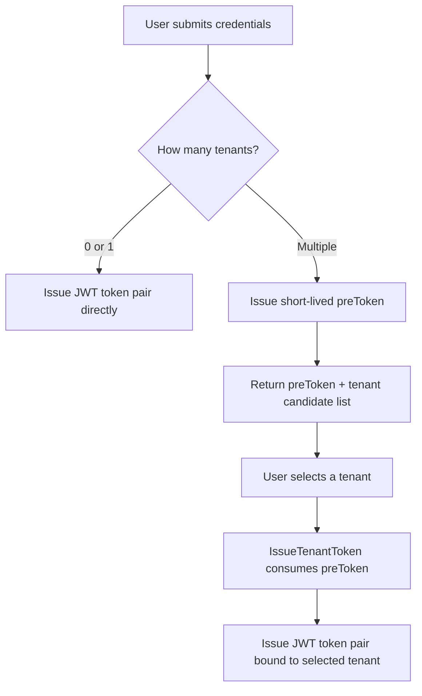
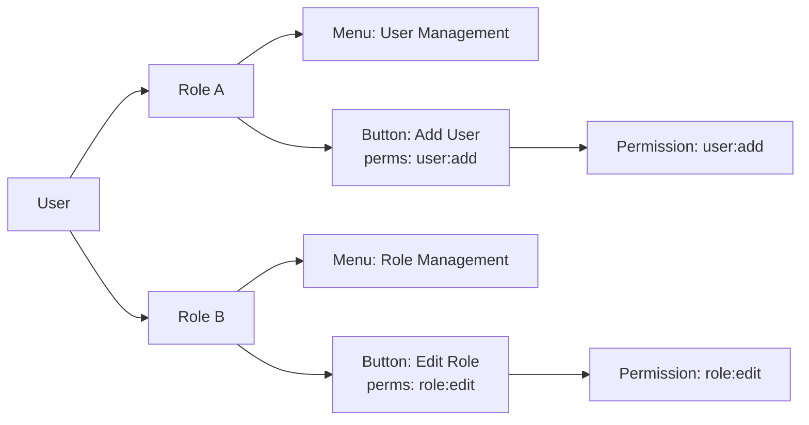
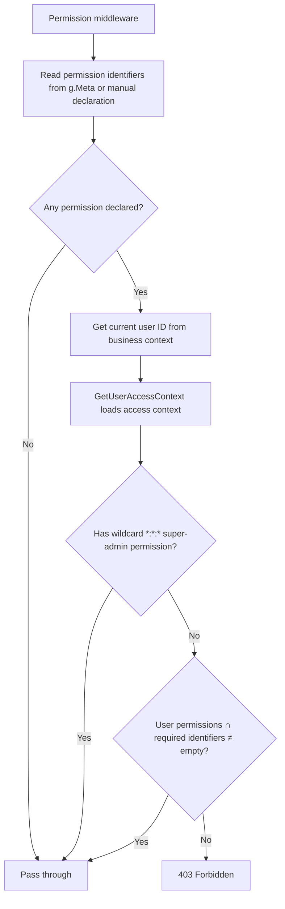
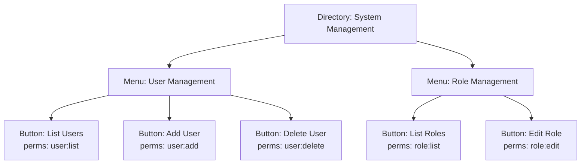

## Overview

The permission management system of `lina-core` is built around two core pillars: **JWT authentication** and the **RBAC permission model**. JWT handles the issuance, propagation, and verification of user identity. RBAC determines, after identity is confirmed, which API endpoints and menu resources that user can access. Both pillars work together through the middleware chain on every HTTP request: the `Auth` middleware handles identity verification, and the `Permission` middleware handles access control.

## JWT Authentication

### JWT Claims Structure

`lina-core` uses the `golang-jwt/jwt/v5` library to issue JWTs. The Claims struct is defined as `auth.Claims` and includes the following core fields:

| Field | Type | Description |
|-------|------|-------------|
| `tokenId` | string | Globally unique token identifier, used for session association and revocation tracking |
| `tokenType` | string | Token type: `access` for access tokens, `refresh` for refresh tokens |
| `userId` | int | Authenticated user ID |
| `username` | string | Authenticated username |
| `status` | int | User account status |
| `tenantId` | int | Tenant ID; `0` means the platform tenant |
| `isImpersonation` | bool | Whether the token represents an impersonation session |
| `actingUserId` | int | Real operator user ID during impersonation |
| `RegisteredClaims` | standard fields | Includes `ExpiresAt` (expiry) and `IssuedAt` (issuance time) |

All tokens are signed with `HS256` (HMAC-SHA256). The signing secret is retrieved at runtime via `GetJwtSecret` on each request rather than cached locally, enabling secret rotation without service restarts.

### Dual-Token Design

After a successful login, `generateTokenPair` signs two JWTs that share the same `tokenID` (a globally unique ID generated by `guid.S()`):

- **Access Token**: Short-lived, configured via `GetJwtExpire`. Used for authenticating every API request. Sent as the `Authorization: Bearer <token>` request header.
- **Refresh Token**: Long-lived, set to the maximum of `defaultRefreshTokenTTL` (7 days), the session timeout, and the Access Token TTL. Used exclusively to obtain a new Access Token after the Access Token expires. It cannot be used to access protected endpoints directly.

```go
// Both tokens share the same tokenID
tokenID := guid.S()
accessToken,  _ = s.signToken(ctx, user, tenantID, tokenID, tokenKindAccess,  ...)
refreshToken, _ = s.signToken(ctx, user, tenantID, tokenID, tokenKindRefresh, ...)
```

This design lets the Refresh Token precisely locate and correlate with an existing online session during token refresh, without requiring a server-side mapping between Refresh Tokens and Access Tokens.

### Token Parsing and Validation

The `Auth` middleware performs the following steps on every protected request:

1. Extracts the `Token` string from the `Authorization: Bearer <token>` header.
2. Calls `jwt.ParseWithClaims` to verify the signature and deserialize the `Claims`. The signing key is fetched via `GetJwtSecret` at parse time to support key rotation.
3. Checks whether the `Token` has been actively revoked (first checking the process-local in-memory revocation cache, then the shared KV cache).
4. Calls `SessionStore.TouchOrValidate` to refresh the session's last-active timestamp and verify that the session is still valid (supporting forced logout and timeout cleanup).
5. Writes the user identity (`userId`, `username`, `tenantId`, `tokenId`, etc.) into the business context of the current request for use by downstream middleware and handlers.

### Session Management

`lina-core` maintains an online session record in persistent storage (database) and, optionally, in a distributed hot-state store for each active login. Each session contains:

| Field | Description |
|-------|-------------|
| `TokenId` | Associated JWT token ID |
| `TenantId` | Owning tenant |
| `UserId` | Owning user |
| `Username` | Username |
| `LoginTime` | Login timestamp |
| `LastActiveTime` | Last active timestamp (throttled to at most one write per minute) |
| `Ip` / `Browser` / `Os` | Client information |

`TouchOrValidate` is the core validation method called on every protected request. It validates session liveness while throttling `LastActiveTime` updates to a minimum window of `1` minute, avoiding a database write on every request. Administrators can forcibly expire a session via the online users list, or the system will automatically clean up sessions that exceed the configured timeout.

### Token Revocation

Revocation uses a layered storage architecture: a process-local `memoryRevokeStore` is composed with a shared `kvRevokeStore` (KV cache) into a `layeredRevokeStore`.

- **Local layer**: Revocation on the current node takes effect immediately without waiting for KV cache propagation, ensuring instant response to logouts on the originating node.
- **Shared layer**: The KV cache records a `tokenID → expiresAt` mapping. Other cluster nodes read this and backfill their local cache, achieving cross-node convergence.

Revocation is triggered by: explicit logout, admin-forced session eviction, token refresh (the old token is revoked immediately when a new one is issued), and tenant switching.

### Multi-Tenant Pre-Login Token

When a user belongs to multiple tenants, successful password verification does not directly issue a JWT. Instead, a `preToken` (a random string with the `pre_` prefix) is issued with a lifetime of just one minute. The client receives the `preToken` and the list of tenant candidates, guides the user to select a tenant, and then calls `IssueTenantToken` to consume (single-use) the `preToken` and issue a proper JWT token pair bound to the selected tenant.



## RBAC Permission Model

### Design Philosophy

`lina-core` uses a three-tier `RBAC` model: **role → menu → permission identifier**.

- A **user** can be assigned one or more **roles**, which determine which menus and action buttons the user can access.
- A **role** can be associated with a set of **menus** (including directories, page menus, and action buttons).
- **Menus** (particularly button-type nodes) carry **permission identifiers** (`Perms` field), such as `user:list` or `role:edit`.
- A user's effective permissions are the union of all permission identifiers from menus associated with their roles.



### User Access Context

`GetUserAccessContext` loads and caches a complete permission snapshot for a user. The `UserAccessContext` struct contains:

| Field | Type | Description |
|-------|------|-------------|
| `RoleIds` | []int | All role IDs assigned to the user |
| `RoleNames` | []string | Display names of enabled roles |
| `MenuIds` | []int | All menu IDs accessible through the user's roles |
| `Permissions` | []string | Effective permission identifier list (after plugin filtering) |
| `DataScope` | Scope | The broadest data scope level across all enabled roles |
| `IsSuperAdmin` | bool | Whether the user is the built-in admin account (has all permissions) |

The built-in super admin (`isSuperAdmin = true`) directly loads all enabled menus and their permissions, bypassing the role association lookup. For regular users, the permission loading flow is:

```
User ID → Role ID set → Menu ID set → Permission identifier set
```

### Access Context Caching

Loading permissions requires multiple database queries. `lina-core` provides a token-scoped in-process cache backed by a **permission topology revision** mechanism (`accessRevision`) for invalidation:

- Each login token has a corresponding `cachedUserAccessContext` cache entry, which records the permission topology revision number at build time.
- Every 3 seconds, the latest revision number is synchronized from shared storage to the local process. When roles, menus, or permissions change, the revision number increments.
- On the next request, if the cached revision number is stale, the cache entry is discarded and reloaded.
- Events such as user logout or admin-forced session eviction immediately invalidate the associated token's cache (`InvalidateTokenAccessContext`).

This design significantly reduces database permission query pressure under high concurrency while guaranteeing eventual consistency.

### Data Scope Control

Data scope is an extension of the RBAC model that controls the **data visibility** of governed resources (such as user lists and operation logs), beyond just whether a user can access a given endpoint. `lina-core` defines the following data scope levels:

| Value | Description |
|-------|-------------|
| `ScopeNone (0)` | Denies access to governed resources |
| `ScopeAll (1)` | Visible across all tenants |
| `ScopeTenant (2)` | Visible within the current tenant |
| `ScopeDept (3)` | Visible within the current department scope (requires an organization capability plugin such as `linapro-org-core`) |
| `ScopeSelf (4)` | Only rows owned by the current user are visible |

A user's effective data scope is the **broadest** level across all their enabled roles. Data scope constraints are applied by `datascope.Service` as database query conditions at the business layer — they are not enforced at the middleware level.

## API Permission Management

### Declarative Permission Annotations

`API` permissions are declared inline in the `g.Meta` struct tag of the request DTO. The `permission` field supports multiple comma-separated permission identifiers, evaluated with **OR** semantics (any one match is sufficient):

```go
type UserListReq struct {
    g.Meta   `path:"/users" method:"get" tags:"User" summary:"List users" permission:"user:list"`
    Page     int `json:"page"`
    PageSize int `json:"pageSize"`
}

type BatchDeleteUsersReq struct {
    g.Meta `path:"/users/batch-delete" method:"delete" tags:"User" summary:"Batch delete users" permission:"user:delete"`
    Ids    []int `json:"ids" v:"required|min-length:1"`
}
```

Permission identifiers follow the `module:resource:action` three-segment naming convention, such as `user:list`, `role:edit`, and `plugin:manage:install`. This approach co-locates API definition, documentation metadata, and permission declaration in a single DTO file, eliminating drift between permission declarations and handler implementations.

For manually registered routes that do not use `g.Meta` tags, permissions can be declared explicitly via `RequirePermission`:

```go
group.Group("/", func(group *ghttp.RouterGroup) {
    group.Middleware(middlewareSvc.RequirePermission("custom:resource:action"))
    group.Bind(customController.Handle)
})
```

### Permission Middleware Enforcement Flow

The `Permission` middleware executes after the `Auth` middleware, with the user identity already injected into the context:



The permission identifier `*:*:*` is the super-admin wildcard. Users with this identifier pass through the `Permission` middleware without any further permission matching. The `*:*:*` identifier is appended to the super admin's permission list during the `loadAllEnabledMenuAccess` phase.

The `Permission` middleware also writes the user's data scope information (`DataScope`) into the business context for use by downstream data-layer queries:

```go
s.bizCtxSvc.SetUserAccess(
    r.Context(),
    int(accessContext.DataScope),
    accessContext.DataScopeUnsupported,
    accessContext.UnsupportedDataScope,
)
```

### Dynamic Plugin API Permissions

Dynamic plugins use `g.Meta`. Permission declarations follow the same pattern as the host, with two additional fields — `access` and `operLog`:

```go
type CreateDemoRecordReq struct {
    g.Meta `path:"/demo-records" method:"post" tags:"Dynamic Plugin Demo" summary:"Create demo record" access:"login" permission:"linapro-demo-dynamic:record:create" operLog:"create"`
    Title      string `json:"title" v:"required|length:1,128"`
    Content    string `json:"content"`
}
```

`access:"login"` means the endpoint requires a valid login (identity check only, no permission identifier matching). `access:"public"` means the endpoint is publicly accessible without authentication.

## Menu Permission Management

### Menu Types and Data Structure

`lina-core`'s menu system supports three node types, distinguished by the `type` field of the `SysMenu` table:

| Type | Description | `Perms` Field |
|------|-------------|---------------|
| `directory` | A navigation directory node that groups menus; does not correspond to a specific page | Typically empty |
| `menu` | A page menu that corresponds to a specific frontend route | Usually empty; may carry a read permission |
| `button` | An action button representing a specific operation within a page (create, edit, delete, etc.) | Required; used for backend permission enforcement |

Button-type menu nodes are the key unit of permission management. Their `Perms` field stores permission identifiers (e.g., `user:list`, `user:add`), which the `Permission` middleware reads at request time to match against the user's effective permissions.

### Role-Menu Association and Authorization

Roles are associated with menus through the `sys_role_menu` junction table, forming a many-to-many relationship. When an administrator updates the menus accessible to a role, the **permission topology revision** number is incremented, causing the access context cache on all nodes to be invalidated and rebuilt on the next request.

The permission tree (`PermissionTree`) is a tree-shaped projection designed for the role authorization form. It arranges nodes in the order: directories → menus → buttons, and normalizes dynamic plugin button nodes into a synthetic dynamic permissions directory.



### Frontend Menu Permissions

After login, the frontend retrieves the current user's accessible menu ID set (determined by `UserAccessContext.MenuIds`) via the `/api/v1/users/menus` endpoint. The frontend framework uses this set to dynamically build the accessible route table — menu nodes not in the set are excluded from the navigation bar and their routes are not registered.

Button-level permissions on the frontend are controlled via directives or conditional rendering. The frontend obtains the `Permissions` list (the set of permission identifiers) from the user info endpoint, and checks whether the user holds the corresponding identifier before rendering action buttons, hiding those for which the user lacks permission.

:::tip
Frontend menu and button visibility is a **UX-layer concealment** measure. The true security boundary is enforced by the backend `Permission` middleware. Even if a client bypasses frontend controls and calls the `API` directly, the backend will reject unauthorized requests through permission validation.
:::
