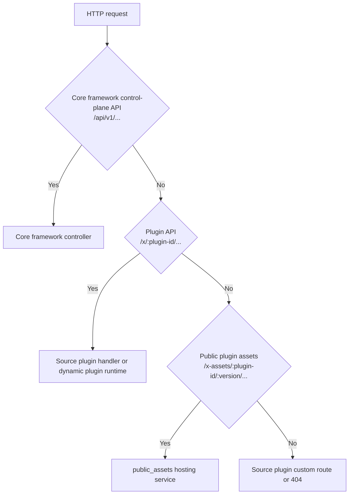

## Introduction

`LinaPro` manages static assets through `Go Embed` and a declarative plugin asset model. The core framework packages runtime resources and admin workspace build output, while plugins must explicitly declare public resources through `public_assets` in `plugin.yaml`. The core framework then serves those resources from a versioned path:

```text
/x-assets/{plugin-id}/{version}/...
```

This path is the unified public entry for plugin static assets, shared by source plugins and dynamic plugins. Files are not exposed merely because they exist in `embed.FS`, a plugin directory, or a dynamic plugin artifact; they must be covered by a `public_assets` declaration.

## How Go Embed Works

`Go Embed` is a compiler feature introduced in `Go 1.16`. By placing a `//go:embed` directive above a variable declaration, files or directories can be embedded into the executable's read-only data segment at compile time.

```go
import "embed"

//go:embed all:public all:manifest
var Files embed.FS
```

This declaration recursively embeds all files under `public/` and `manifest/` into the `Files` variable. `embed.FS` implements the standard library `fs.FS` interface, supports path lookup and file reads, and does not support writes.

| Directive | Meaning |
|-----------|---------|
| `//go:embed file.txt` | Embed one file |
| `//go:embed dir/` | Embed a directory, skipping files whose names start with `.` or `_` |
| `//go:embed all:dir/` | Embed a directory, including files whose names start with `.` or `_` |
| `//go:embed dir1 dir2` | Embed multiple directories or files at the same time |

After assets are compiled into the binary, runtime code accesses them through `embed.FS` methods such as `Open` and `ReadFile`, using the same interface as ordinary disk files.

## Core Framework and Workspace Assets

`lina-core` manages embedded resources under `internal/packed/`:

```text
internal/packed/
├── packed.go
├── public/             # Workspace build output and public frontend assets
│   ├── index.html
│   ├── css/
│   └── js/
└── manifest/           # Runtime configuration, SQL, and i18n resources
    ├── config/
    ├── i18n/
    └── sql/
```

The `public/` directory is populated by frontend build output. The `manifest/` directory contains core framework initialization and runtime resources. During local development, the default admin workspace is served by the frontend dev server at `http://localhost:5666/admin`, while the core framework API listens at `http://localhost:9120`.

`workspace.basePath` defines the frontend router base path for the workspace. The default is `/admin`:

```yaml
workspace:
  basePath: "/admin"
```

By default, `lina-vben` uses `/admin` as the `Vue Router` base. This path is not the core framework control-plane `API`; do not treat the core framework API address plus `/admin` as the default workspace address. For a dedicated admin-domain deployment, `workspace.basePath` can be set to `/`. It must not use reserved namespaces such as `/api`, `/x`, or `/x-assets`.

## Backend Route Boundaries

Core framework backend routes follow clear boundaries:



The key point is that `/api` is the core framework control plane, `/x` is the plugin `API` namespace, `/x-assets` is the public plugin asset namespace, and `/admin` is the frontend router base for the default workspace. These paths do not replace each other.

## Public Plugin Asset Model

Plugins declare public assets through the root-level `public_assets` field in `plugin.yaml`:

```yaml
public_assets:
  - source: frontend/public
    mount: /
    index: index.html
  - source: frontend/pages
    mount: pages
    index: standalone.html
```

| Field | Description |
|-------|-------------|
| `source` | Plugin-relative directory, or a frontend asset prefix inside a dynamic plugin artifact |
| `mount` | Relative mount path under `/x-assets/{plugin-id}/{version}/`; empty or `/` means the version root |
| `index` | Default file returned when the mount directory itself is requested; defaults to `index.html` |

Example mappings:

| source | mount | File inside plugin | Public path |
|--------|-------|--------------------|-------------|
| `frontend/public` | `/` | `frontend/public/logo.png` | `/x-assets/{plugin-id}/{version}/logo.png` |
| `frontend/pages` | `pages` | `frontend/pages/standalone.html` | `/x-assets/{plugin-id}/{version}/pages/standalone.html` |

`public_assets` is an explicit publication boundary. Plugin authors should declare only files that are safe for anonymous access. Do not place governance metadata, installation scripts, configuration files, tenant-specific files, or user-private files in public asset directories. Files that require authentication, tenant filtering, or personalized access control should be served by the plugin's own `HTTP API`.

## Source Plugin Assets

Source plugins embed plugin resources into the core framework build artifact through `plugin_embed.go`:

```go
package plugindemosource

import "embed"

//go:embed plugin.yaml frontend manifest
var EmbeddedFiles embed.FS
```

During plugin registration, the embedded file system is handed to the core framework:

```go
plugin := pluginhost.NewSourcePlugin(pluginID)
plugin.Assets().UseEmbeddedFiles(plugindemosource.EmbeddedFiles)
```

The core framework reads `plugin.yaml`, installation `SQL`, language packs, plugin configuration, and manifest resources from the embedded resources. Only resources matched by `public_assets` are exposed through `/x-assets`.

Source plugin frontend pages usually live under `frontend/pages/` and are compiled into the built-in workspace frontend during the workspace build. After changing source plugin `.vue` pages, rebuild both frontend and backend for the change to take effect. This differs from runtime-uploaded frontend assets in dynamic plugins.

Source plugins can also register custom public routes such as `/portal/...`, `/assets/...`, or `/`. Those routes are fully maintained by plugin code. They are not generated automatically from `public_assets`, and the core framework does not treat them as workspace menus or `OpenAPI` interfaces.

## Dynamic Plugin Assets

When a dynamic plugin is built as a `.wasm` artifact, the build tool carries the resources needed at runtime:

| Resource | Source |
|----------|--------|
| Plugin manifest | `plugin.yaml` |
| Frontend assets | `frontend/` |
| Install and uninstall scripts | `manifest/sql/`, `manifest/sql/uninstall/` |
| Demo data | `manifest/sql/mock-data/` |
| I18N and API documentation translations | `manifest/i18n/` |
| Default configuration | `manifest/config/config.yaml` |
| Configuration template | `manifest/config/config.example.yaml` |
| Declarative resources | General manifest files such as `manifest/metadata.yaml` |

The presence of frontend files in a dynamic plugin artifact does not make them public automatically. The core framework serves only assets matched by `public_assets`, mapping them to `/x-assets/{plugin-id}/{version}/...`. If the plugin is not installed, disabled, unavailable to the current tenant, or the requested version does not match, public assets return `404` by default.

Resource caches are bound to the checksum and generation of the current active release. Installation, enablement, disablement, uninstallation, upgrade, or same-version refresh invalidates the related runtime resource and frontend asset caches.

## Frontend Loading Modes

Dynamic plugin menus are usually loaded through the `system/plugin/dynamic-page` shell. The common mode is `embedded-mount`:

```yaml
public_assets:
  - source: frontend/pages
    mount: /
    index: index.html

menus:
  - key: plugin:linapro-demo-dynamic:main-entry
    name: Dynamic Plugin Demo
    path: /x-assets/linapro-demo-dynamic/v0.1.0/mount.js
    component: system/plugin/dynamic-page
    perms: linapro-demo-dynamic:view
    type: M
    query:
      pluginAccessMode: embedded-mount
```

In this mode, the menu `path` is the entry asset URL loaded by the dynamic page shell. It is not converted into an ordinary workspace route. The entry file usually exports a `mount(context)` function:

```js
export async function mount(context) {
  const { container, accessToken, locale, messages, t, query } = context;
  container.textContent = t('plugin.demo.title');
  return {
    unmount(nextContext) {
      nextContext.container.replaceChildren();
    },
    update(nextContext) {
      void nextContext;
    }
  };
}
```

`standalone` mode usually loads an independent `HTML` asset through an `iframe`:

```yaml
menus:
  - key: plugin:linapro-demo-dynamic:standalone-page
    path: /x-assets/linapro-demo-dynamic/v0.1.0/standalone.html
    component: system/plugin/dynamic-page
    is_frame: 1
    type: M
```

Embedded mount is suitable when the plugin should share the workspace context, language packs, and authentication state. Standalone pages are suitable when the plugin needs full `DOM` control or isolation for third-party scripts.

## Path Validation

The core framework strictly validates `public_assets` declarations. The following configurations are rejected:

| Invalid configuration | Reason |
|-----------------------|--------|
| Empty `source` | No clear publication boundary can be formed |
| Absolute path or `URL` | May escape the plugin resource set |
| `../` or `.` traversal segments | May read files outside the plugin root |
| Wildcards, query strings, or fragments | Cannot be mapped to a stable static directory |
| Duplicate or overlapping `mount` values | One access path would map to multiple sources |
| Missing `source` | Source plugin directories or dynamic artifact frontend prefixes must exist |
| Symlink escaping the plugin root | May read files outside the plugin |
| `index` not shaped like a file name | Directory defaults must be safe relative file names |

These rules make static asset publication an explicit contract that can be reviewed, cached, and upgraded.

## Caching and Versioning

`/x-assets` paths include `{plugin-id, version}`, so public asset content under the same plugin version should remain stable. If asset content changes, upgrade the version in `plugin.yaml` or introduce an equivalent content-versioning mechanism. Publishing different content under the same version path can make browser caches, proxy caches, and cluster-node caches inconsistent.

Dynamic plugins can continue serving public assets for the current active version while the plugin remains enabled. Source plugins resolve declared resources from the plugin resources compiled into the core framework or from the plugin directory.

## Layer Comparison

| Dimension | Default workspace assets | Source plugin assets | Dynamic plugin assets |
|-----------|--------------------------|----------------------|-----------------------|
| Embedding method | `//go:embed all:public all:manifest` | `//go:embed plugin.yaml frontend manifest` | Built into `.wasm` artifact resources |
| Access entry | Local default `http://localhost:5666/admin`; `workspace.basePath` defaults to `/admin` | Workspace build output, plugin custom routes, or `/x-assets` | `/x-assets/{id}/{version}/...` |
| Public authorization | Built-in core framework resources | Only resources matched by `public_assets` | Only resources matched by `public_assets` |
| Change activation | Rebuild the core framework | Rebuild the core framework or upgrade the plugin version | Upload a new `.wasm` and run explicit runtime upgrade |
| Runtime hot loading | Not supported | Not supported | Supported through upload and explicit upgrade |
| Private file access | Controlled by core framework interfaces | Controlled by the plugin's own `HTTP API` | Controlled by plugin `API` or `hostServices` |
