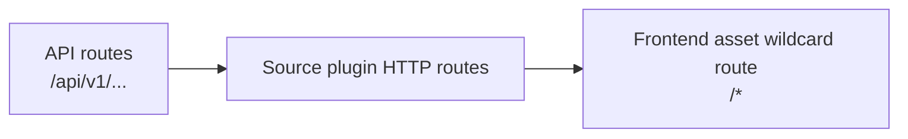
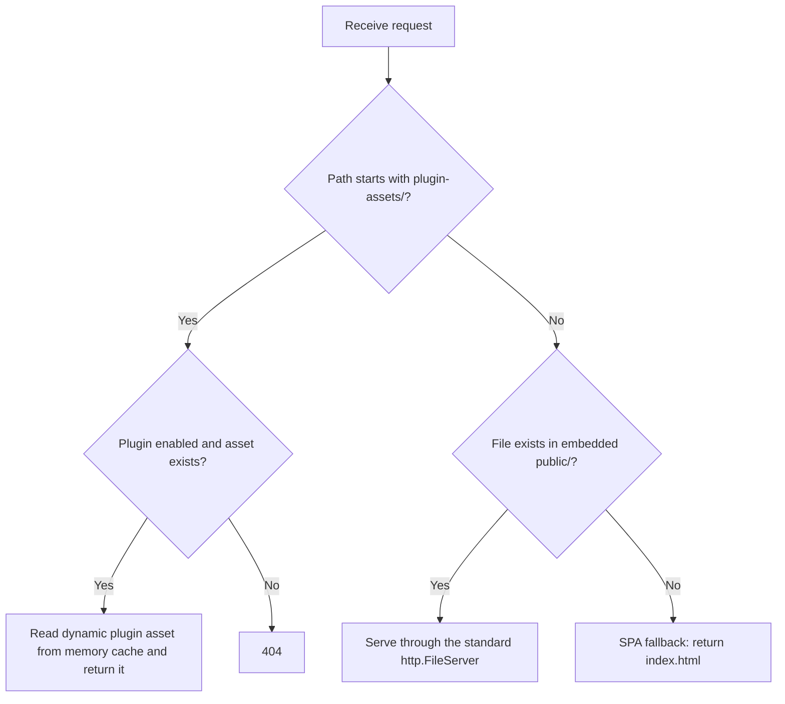
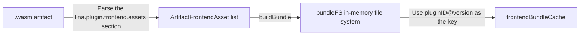

## Introduction

`LinaPro` uses `Go Embed` to package all static assets into the executable at compile time, so a single-binary deployment can run without an external static file directory. Host frontend assets, manifest templates, source plugin pages, and dynamic plugin frontend bundles all follow this principle. They only differ in how assets are embedded and served at each layer.

## How Go Embed Works

`Go Embed` is a compiler feature introduced in `Go 1.16`. By placing a `//go:embed` directive above a variable declaration, files or directories can be embedded into the executable's read-only data segment at compile time.

```go
import "embed"

//go:embed all:public all:manifest
var Files embed.FS
```

This declaration recursively embeds all files under `public/` and `manifest/` into the `Files` variable at compile time, including hidden files whose names start with `.` because the `all:` prefix is used. `embed.FS` implements the standard library `fs.FS` interface. It supports path lookup and file reads, but not writes.

| Directive | Meaning |
|-----------|---------|
| `//go:embed file.txt` | Embeds one file |
| `//go:embed dir/` | Embeds a directory, skipping files whose names start with `.` or `_` |
| `//go:embed all:dir/` | Embeds a directory, including files whose names start with `.` or `_` |
| `//go:embed dir1 dir2` | Embeds multiple directories or files at the same time |

After assets are compiled into the binary, runtime code accesses them through `embed.FS` methods such as `Open` and `ReadFile`. The interface is the same as reading ordinary disk files, with no extraction step or temporary directory.

## Host Static Assets

### Asset Directories and Embed Declaration

The `lina-core` host service manages static assets under `internal/packed/`:

```text
internal/packed/
├── packed.go           # embed.FS declaration
├── public/             # Frontend build output from lina-vben
│   ├── index.html
│   ├── css/
│   ├── js/
│   └── ...
└── manifest/           # Runtime configuration manifests and initialization assets
    ├── config/
    ├── i18n/
    └── sql/
```

`packed.go` embeds both directories into the `Files` variable:

```go
package packed

import "embed"

// Files stores embedded frontend static assets and prepared manifest assets.
//
//go:embed all:public all:manifest
var Files embed.FS
```

The `public/` directory is populated during the build phase by the compiled output of the `lina-vben` frontend project. The `manifest/` directory contains database initialization `SQL`, configuration templates, and internationalization resource bundles used to bootstrap the host on first startup.

### Static Asset Routing Priority

The host `HTTP` routing follows the rule that explicit routes take precedence over wildcard routes. During server startup, routes are registered in this order:



The frontend asset wildcard route `/*` is always registered last and acts as the fallback handler for all unmatched routes. When a request reaches this handler, the host tries to match it in three steps:



1. **Dynamic plugin assets first**: If the request path matches `plugin-assets/{pluginID}/{version}/{assetPath}`, the host first checks whether the corresponding plugin is enabled, then reads the requested asset from the memory cache. If the plugin is not enabled or the asset does not exist, the host returns `404`.
2. **Embedded frontend assets second**: If the requested file exists in the embedded `public/` directory, the host serves it with the standard `http.FileServer`.
3. **`SPA` fallback last**: All remaining unmatched paths return `public/index.html`, allowing the `Vue` client router to take over.

## Source Plugin Static Assets

### Embed Declaration

A source plugin declares embedded content in `plugin_embed.go` at the plugin root:

```go
package plugindemosource

import "embed"

// EmbeddedFiles contains the plugin manifest, convention-based SQL assets, and
// frontend source resources.
//
//go:embed plugin.yaml frontend manifest
var EmbeddedFiles embed.FS
```

This declaration embeds the `plugin.yaml` manifest, the `frontend/` page directory, and the `manifest/` asset directory, including `SQL` files and internationalization bundles, into the `EmbeddedFiles` variable. These assets are compiled together with the host binary.

### Asset Registration and Usage

The plugin registers its embedded file system with the host in `init()`:

```go
plugin := pluginhost.NewSourcePlugin(pluginID)
plugin.Assets().UseEmbeddedFiles(plugindemosource.EmbeddedFiles)
```

When the host scans source plugin manifests, it reads `plugin.yaml` from the embedded `embed.FS` and parses plugin identity, menus, permissions, and other metadata. No disk lookup is required.

### Frontend Page Assets

Source plugins place frontend page `.vue` files under `frontend/pages/`:

```text
frontend/
├── pages/
│   ├── sidebar-entry.vue      # Page component referenced by a menu
│   └── components/
│       └── ...
└── slots/                     # Slot pages, optional
```

The host scans these paths through `ListFrontendPagePaths` and `ListFrontendSlotPaths`, but source plugin `.vue` files are **not served dynamically at runtime**. Instead, they are referenced and compiled during the `lina-vben` frontend build phase, then become part of the final `public/` bundle served by the host's embedded frontend asset route.

:::info
Source plugin `Vue` page files are compile-time dependencies. After modifying them, you must rebuild both the host frontend and backend for the change to take effect. This differs from the runtime hot-loading model used by dynamic plugin frontend assets.
:::

## Dynamic Plugin Static Assets

### WASM Custom Sections and Asset Storage

Dynamic plugins package frontend assets into custom sections inside the `.wasm` file. When the host parses a `WASM` artifact, it reads each resource type from a fixed section name:

| Custom Section Name | Content |
|---|---|
| `lina.plugin.manifest` | Plugin identity manifest in `JSON` format |
| `lina.plugin.dynamic` | Host runtime metadata, such as the `ABI` version and asset count |
| `lina.plugin.frontend.assets` | Frontend static asset list, including paths, content, and `MIME` types |
| `lina.plugin.i18n.assets` | Internationalization language bundles |
| `lina.plugin.install.sql` | `SQL` executed during installation |
| `lina.plugin.uninstall.sql` | `SQL` executed during uninstallation |

`ArtifactFrontendAsset` is the data structure for each frontend asset:

```go
type ArtifactFrontendAsset struct {
    Path          string // 资产相对路径，如 "pages/standalone.html"
    ContentBase64 string // 资产内容的 base64 编码
    ContentType   string // MIME 类型，如 "text/html"
    Content       []byte // 解码后的原始字节（运行时使用，不序列化）
}
```

Dynamic plugins also use `//go:embed` to embed the frontend file directory into `EmbeddedFiles`. During the build, the `LinaPro` plugin build tool reads these files from `embed.FS`, serializes them, and writes them into the `WASM` custom section:

```go
// plugin_embed.go（动态插件）
//go:embed plugin.yaml frontend manifest
var EmbeddedFiles embed.FS
```

### In-Memory Cache

After the host reads a dynamic plugin `.wasm` artifact, it parses frontend assets into an **in-memory virtual file system** (`bundleFS`) and caches it in process memory with `{pluginID}@{version}` as the key:



`bundleFS` implements the `fs.FS` interface. After path normalization, it reads bytes directly from the memory map without extracting files to disk. The cache lifetime is tied to the running host process. When a plugin is disabled or upgraded, the host actively calls `InvalidateBundle` to invalidate the corresponding cache entry.

During startup, the host calls `PrewarmRuntimeFrontendBundles` for all enabled dynamic plugins, so the first request does not have to build the bundle on demand:

```text
Host startup
  -> Scan .wasm artifacts
  -> Call EnsureBundle for each enabled dynamic plugin
  -> Write parsed results into frontendBundleCache
  -> Ready to accept requests
```

A prewarm failure for one plugin does not prevent the host from starting. The host aggregates the failure details and writes them to the log.

### Public Access Paths

Dynamic plugin frontend assets are exposed through this path format:

```text
/plugin-assets/{pluginID}/{version}/{assetPath}
```

For example, the `pages/standalone.html` file from version `v0.1.0` of the `linapro-demo-dynamic` plugin is available at:

```text
/plugin-assets/linapro-demo-dynamic/v0.1.0/pages/standalone.html
```

`BuildRuntimeFrontendPublicBaseURL` generates the plugin-level base path. The plugin uses that path in `plugin.yaml` menu declarations to reference its own assets:

```yaml
menus:
  - key: plugin:linapro-demo-dynamic:standalone-page
    path: /plugin-assets/linapro-demo-dynamic/v0.1.0/pages/standalone.html
    component: system/plugin/dynamic-page
```

When the host receives a `/plugin-assets/...` request, it performs these checks in order:

1. Parse `pluginID` and `version` from the path.
2. Verify that the plugin is installed and enabled.
3. Confirm that the requested version matches the currently active version.
4. Read the requested file content from the in-memory cache (`bundleFS`).
5. Set the correct `Content-Type` response header and return the content.

Any failed check returns `404`, preventing assets from disabled or uninstalled plugins from being accessed.

### Frontend Page Loading Modes

Dynamic plugins support two frontend page loading modes.

#### `embedded-mount` (Embedded Mount)

Embedded mount mode loads the plugin's `JavaScript` module, either a `.js` or `.mjs` file, into the host page container through a dynamic `ESM` import. In this mode, the plugin's `JS` entry file must export a `mount(context)` function:

```js
// 动态插件 mount.js 示例
export async function mount(context) {
    const { container, accessToken, locale, messages, t, query } = context;
    // 在 container 中渲染插件 UI
    return {
        unmount(context) {
            context.container.replaceChildren();
        },
        update(context) {
            // 处理路由更新
        }
    };
}
```

The `context` object passed to `mount(context)` contains these fields:

| Field | Type | Description |
|-------|------|-------------|
| `container` | `HTMLElement` | Mount container provided by the host |
| `accessToken` | `string` | Current user's `JWT` token |
| `assetURL` | `string` | Full `URL` of the current entry asset |
| `baseURL` | `string` | `URL` prefix of the asset directory |
| `locale` | `string` | Current user interface language |
| `messages` | `object` | Runtime internationalization message snapshot |
| `t` | `function` | Internationalization message lookup function |
| `query` | `object` | Current route query parameters |
| `route` | `object` | Current `Vue Router` route object |
| `title` | `string` | Current menu title |

Enable embedded mount mode in the menu declaration through the `query_param` field:

```yaml
menus:
  - key: plugin:linapro-demo-dynamic:embedded-page
    path: /plugin-assets/linapro-demo-dynamic/v0.1.0/pages/mount.js
    component: system/plugin/dynamic-page
    query_param: '{"pluginAccessMode":"embedded-mount"}'
```

#### `standalone` (Standalone Page)

Standalone mode loads an `HTML` file from plugin assets through an `iframe`. The plugin page gets an independent browser context, making this mode suitable for scenarios that need full `DOM` control or external scripts. In the menu declaration, point `path` directly to the `HTML` asset path. No extra `query_param` is required:

```yaml
menus:
  - key: plugin:linapro-demo-dynamic:standalone-page
    path: /plugin-assets/linapro-demo-dynamic/v0.1.0/pages/standalone.html
    component: system/plugin/dynamic-page
    is_frame: 1
```

### Asset Validation on Enablement

When a dynamic plugin is enabled, the host calls `ValidateRuntimeFrontendMenuBindings` to validate all asset references in menu declarations:

1. Scan all menu records owned by the plugin.
2. For each menu whose path points to the `/plugin-assets/` prefix, extract the asset relative path.
3. Confirm that the version number in the path matches the currently active version.
4. Check the in-memory cache to ensure that the referenced asset file exists.
5. For `embedded-mount` mode, additionally verify that the entry file extension is `.js` or `.mjs`.

Any failed validation blocks the plugin enablement flow and returns a clear error message, preventing plugins with invalid menu bindings from entering service.

## Static Asset Comparison Across Layers

| Dimension | Host Static Assets | Source Plugin Static Assets | Dynamic Plugin Static Assets |
|-----------|--------------------|-----------------------------|------------------------------|
| **Embedding method** | `//go:embed all:public all:manifest` | `//go:embed plugin.yaml frontend manifest` | `//go:embed plugin.yaml frontend manifest` |
| **How changes take effect** | Rebuild the host | Rebuild the host frontend and backend | Upload a new `.wasm` version and perform an explicit upgrade |
| **Access path** | Any path, with `SPA` fallback | Resolved through the host frontend router | `/plugin-assets/{id}/{version}/...` |
| **Runtime cache** | Embedded in the binary and read directly | Embedded in the binary and read directly | Process memory (`bundleFS`) |
| **Hot loading** | Not supported | Not supported | Supported by uploading and upgrading to a new `WASM` version |
| **Asset validation** | Guaranteed at build time | Guaranteed at build time | Validated at enablement time |
