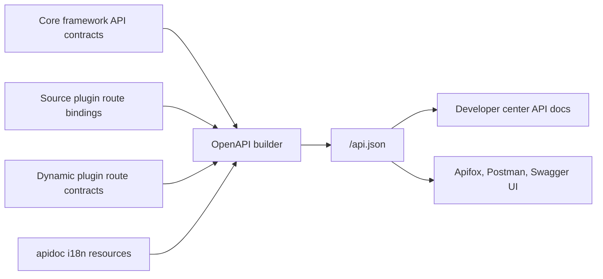

## Overview

The API documentation is the unified view through which `lina-core` exposes its `API` contracts. Rather than asking developers to maintain documentation files separately, the core framework generates `OpenAPI 3.0` documentation at runtime based on core framework routes, source plugin routes, and dynamic plugin routes.

The default access path is controlled by `server.extensions.apiDocPath` in `config.yaml`:

```text
http://localhost:8080/api.json
```

The admin workspace consumes the same document under **Developer Center → API Documentation**, providing a browsing and debugging entry point.

## Aggregation Scope

The API documentation aggregates three types of sources:

| Source | Integration method | Documentation content |
|--------|---------|----------------------|
| Core framework | `g.Meta` contracts and bound routes in the core framework's `api/` directory | Platform base interfaces: authentication, permissions, configuration, tasks, plugin governance, etc. |
| Source plugins | Source plugin route bindings recorded by `pluginhost` | Plugin-specific `API`, request/response structures, and permission identifiers |
| Dynamic plugins | Route contracts and runtime projections from dynamic plugin artifacts | Routes, methods, and descriptions exposed by dynamic plugins |



After a plugin is enabled, disabled, or upgraded, the documentation updates as the runtime projection changes. The API documentation reflects the set of interfaces currently accessible from the core framework — not every interface that might exist in the source repository.

## API Contract Declaration

The core framework and source plugins use `GoFrame`'s `g.Meta` struct tags to declare interface contracts. Path, method, tag, summary, description, and permission identifier are all written on the request struct:

```go
type ArticleListReq struct {
    g.Meta  `path:"/plugins/content-article/articles" method:"get" tags:"Content Article" summary:"List articles" dc:"Query article records by page." permission:"content-article:article:view"`
    Page    int    `json:"page" v:"min:1" dc:"Page number"`
    Size    int    `json:"size" v:"min:1,max:100" dc:"Page size"`
    Keyword string `json:"keyword" dc:"Title keyword"`
}

type ArticleListRes struct {
    g.Meta `mime:"application/json"`
    List   []*ArticleItem `json:"list" dc:"Article list"`
    Total  int            `json:"total" dc:"Total records"`
}
```

The `permission:"content-article:article:view"` here flows into the API documentation and also forms a consistent audit scope with the `RBAC` permission system. Do not use legacy or non-current permission tags to describe new interfaces.

## Permission and Documentation Alignment

Interface permissions are not supplementary notes in the documentation — they are part of the `API` contract itself. This design provides three benefits:

| Design point | Value |
|--------------|-------|
| Permission identifier lives near the route declaration | Easier to spot omissions or spelling inconsistencies during development |
| Documentation directly displays the permission identifier | Frontend integration and role configuration can quickly identify authorization requirements |
| Menu button permissions and interface permissions share a namespace | Platform administrators can audit page entry points against actual write operations |

Button permissions in the workspace come from menu governance data; interface permissions come from `g.Meta` contracts. Both should use the same business semantics, but do not assume that "seeing a button" guarantees the interface permission check can be bypassed.

## Source Plugin Interfaces

Source plugins define `DTO`s in their own `backend/api/` directory and register routes through `pluginhost` in `backend/plugin.go`. The core framework records these route bindings and projects interfaces that match the `GoFrame` handler shape into the unified `OpenAPI` document.

Source plugin interfaces should follow these conventions:

- Paths use the plugin namespace, e.g. `/plugins/content-article/articles`.
- `tags` uses a stable business module name — avoid changing the grouping on every version bump.
- `summary` should be a short phrase; `dc` is for a more complete description.
- `permission` must be consistent with the permission resources declared in the plugin's `plugin.yaml`.
- Request and response fields should use `dc` to describe business meaning — avoid relying on field names alone.

## Dynamic Plugin Interfaces

`WASM` dynamic plugin interfaces are carried by the plugin artifact as route contracts. The core framework reads and projects them into the API documentation upon installation, enablement, and upgrade. Dynamic plugins run on top of `pluginbridge`; interface requests still pass through the core framework's authentication, permission, and tenant context processing before entering the `WASM` sandbox.

Dynamic plugins cannot directly modify the core framework route table. Which routes they expose, which core framework services they can access, and which database tables or external addresses they can reach are all jointly determined by the plugin manifest, artifact metadata, and the `hostServices` authorization snapshot.

## API Documentation Internationalization

The i18n resources for API documentation are located under:

```text
manifest/i18n/<locale>/apidoc/
```

Runtime UI language packs and API documentation language packs use different loading modes: `JSON` files directly under `manifest/i18n/<locale>/` are for runtime UI copy, while the `apidoc/` subdirectory is for API documentation translations and is loaded recursively by subdirectory.

Example:

```text
apps/lina-core/manifest/i18n/zh-CN/apidoc/
├── common.json
└── core-api-auth.json

apps/lina-plugins/content-notice/manifest/i18n/zh-CN/apidoc/
└── plugin-api-notice.json
```

Plugin API translations should only maintain the plugin's own namespace — do not write plugin copy into the core framework API documentation resources. The `en-US` API documentation resources can remain as empty placeholders, with English metadata in the source code serving as the default copy.

## In-Browser Debugging

The **Developer Center → API Documentation** page in the admin workspace supports viewing request parameters, response structures, permission identifiers, and interface descriptions, and can directly send debug requests.

In-browser debugging uses the current logged-in user's authentication state. Debugging write operations such as `POST`, `PUT`, `PATCH`, and `DELETE` will produce real data changes — use a test environment or a clearly rollback-safe data scope.

## Importing into Third-Party Tools

`/api.json` is a standard `OpenAPI 3.0` document that can be imported into common API tools:

| Tool | Usage |
|------|-------|
| `Apifox` | Create a new project, select **Import OpenAPI/Swagger**, and enter `http://localhost:8080/api.json` |
| `Postman` | Use **Import** with the **Link** method to import `/api.json` |
| `Swagger UI` | Point to the core framework-exposed `/api.json` URL |
| `curl` | Download with `curl -o api.json http://localhost:8080/api.json` |

## Troubleshooting

| Symptom | Investigation direction |
|---------|------------------------|
| Plugin interfaces missing from documentation | Confirm the plugin is installed and enabled; verify source plugin routes are registered through `pluginhost` |
| Permission identifier is empty | Check whether `g.Meta` declares a `permission` tag |
| Documentation language not changing | Check whether `manifest/i18n/<locale>/apidoc/` exists and whether the runtime cache has been refreshed |
| Dynamic plugin interfaces missing | Check whether the `.wasm` artifact contains route contracts and whether the plugin is in a valid enabled version |
