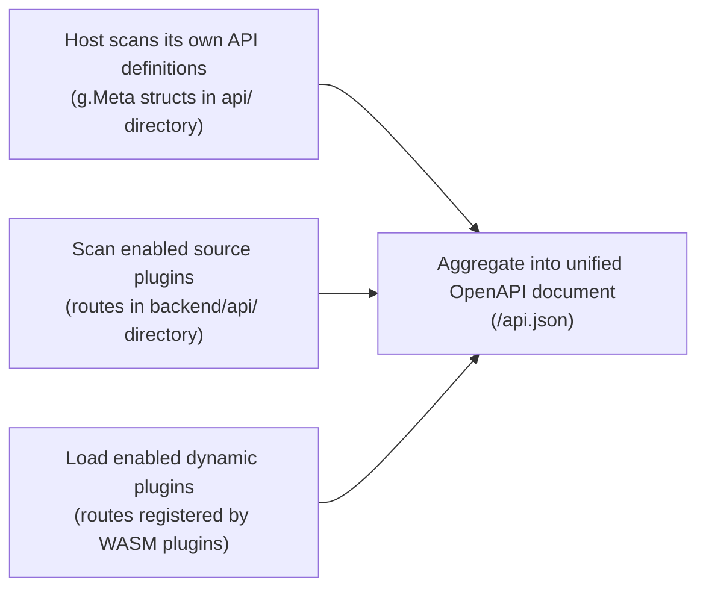

## Overview

`LinaPro` includes built-in API documentation. At host service startup, it automatically scans all `API` definitions and aggregates the host interfaces and all enabled plugin interfaces into a single `OpenAPI`-format document. No manual documentation maintenance is required.

## Accessing the Documentation

**API JSON endpoint:**

```text
http://localhost:8080/api.json
```

This is a standard `OpenAPI 3.0` JSON document, directly importable into `Swagger UI`, `Apifox`, `Postman`, and other compatible tools.

**Embedded in the management workspace:**

After signing in to the management workspace, navigate to **Developer Center → API Docs** to browse all interfaces and send debug requests directly from the workspace.

## Automatic API Aggregation

At startup, the host scans and aggregates interfaces in the following order:



When a plugin is enabled or disabled, the API documentation updates automatically on the next request — no service restart needed.

## Interface Definition Model

The host and source plugins use `g.Meta` struct tags to declare interface contracts. All interface metadata — path, method, permissions, documentation, parameters — is centralized in `Go` code:

```go
// Example: article list interface definition
type ArticleListReq struct {
    g.Meta   `path:"/article" method:"get" tags:"Article Management" summary:"Article list"`
    Page     int    `json:"page"     v:"min:1"          dc:"Page number"`
    PageSize int    `json:"pageSize" v:"min:1,max:100"  dc:"Page size"`
    Status   string `json:"status"   v:"in:draft,published" dc:"Filter by article status"`
}

type ArticleListRes struct {
    g.Meta `mime:"application/json"`
    List   []*Article `json:"list"  dc:"Article list"`
    Total  int        `json:"total" dc:"Total count"`
}
```

This declarative approach provides several advantages:

- **Single source of truth**: path, parameters, and documentation are all in one place — implementation and documentation can never diverge
- **Permissions bound to interfaces**: permission identifiers are declared in the `g.Meta` tag and visible directly in the API documentation
- **Automatic generation**: the framework parses struct tags at runtime — no additional tooling needed

## Permission Integration

Each interface's permission identifier is declared via the `g.Meta` `middleware` tag and automatically integrates with the `RBAC` system:

```go
type ArticleCreateReq struct {
    g.Meta `path:"/article" method:"post" tags:"Article Management" summary:"Create article" middleware:"AuthMiddleware,PermMiddleware" perm:"content-article:article:create"`
    // Request body fields...
}
```

The permission identifier declared in the `perm` tag is visible in the API documentation, making it easy for administrators to assign the corresponding permission to roles.

## Multi-Language API Documentation

API documentation descriptions support multi-language display. Translation files are located in the `manifest/i18n/<locale>/apidoc/` directory of the host and plugins:

```text
manifest/i18n/
  zh-CN/
    apidoc/
      core-api-article.json   # Chinese translations for article-related interfaces
  en-US/
    apidoc/
      core-api-article.json   # English translations (can be left empty)
```

Translation file structure:

```json
{
  "core": {
    "article": {
      "list": {
        "summary": "Article list",
        "description": "Paginated article list with optional status filter"
      },
      "create": {
        "summary": "Create article",
        "description": "Create a new article record"
      }
    }
  }
}
```

## In-Browser Debugging

The API documentation page in the management workspace supports:

- Viewing the complete request and response structure for each interface
- Filling in request parameters and sending live `HTTP` requests
- Viewing the response body and `HTTP` status code

:::tip
In-browser debugging uses the current logged-in user's auth token. Write operations (`POST`, `PUT`, `DELETE`) will produce real data changes — use a test environment for these.
:::

## Importing into Third-Party Tools

### Apifox

1. Create a new project, select **Import data**
2. Choose `OpenAPI/Swagger` format, enter the document URL: `http://localhost:8080/api.json`
3. Confirm — interfaces are imported automatically

### Postman

1. Click **Import**
2. Select **Link**, enter `http://localhost:8080/api.json`
3. Confirm — a collection is created automatically

### curl (direct download)

```bash
curl -o api.json http://localhost:8080/api.json
```
