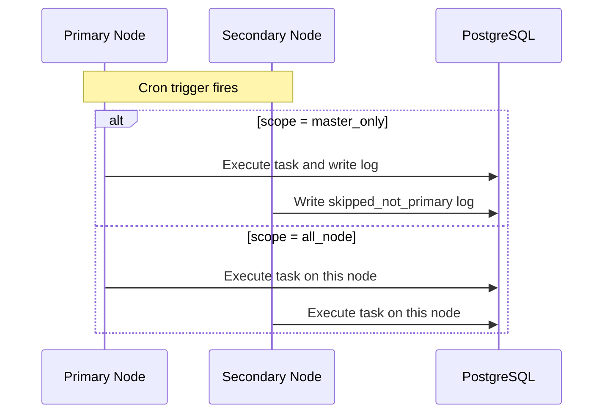

## Introduction

Scheduled tasks are a persistent scheduling capability provided by `lina-core`. Task definitions, runtime state, and execution logs are stored in the database. After the host starts, it brings built-in host tasks, plugin-declared tasks, and administrator-created tasks into a unified scheduler.

The admin workspace provides task listing, group management, manual triggering, pause/resume, and execution log viewing. Source plugins and `WASM` dynamic plugins can also project their task capabilities into the same governance model.

## Task Model

The task system includes these core fields:

| Field | Description |
|-------|-------------|
| **Task name** | Display name for administrators |
| **Task group** | Organizes tasks by business domain |
| **Task type** | `handler` or `shell` |
| **Invocation target** | Handler reference or `Shell` command |
| **Cron expression** | Periodic trigger rule |
| **Timezone** | Task-specific timezone; falls back to `scheduler.defaultTimezone` |
| **Timeout** | Maximum runtime for a single execution |
| **Execution scope** | `master_only` or `all_node` |
| **Concurrency strategy** | `singleton` or `parallel` |
| **Max executions** | Stops scheduling after reaching this count |
| **Status** | Enabled, disabled, or paused due to plugin unavailability |

The `scheduler.defaultTimezone` setting in `config.yaml` provides the default timezone:

```yaml
scheduler:
  defaultTimezone: "UTC"
```

## Task Types

| Type | Value | Description | Use Case |
|------|-------|-------------|----------|
| **Handler task** | `handler` | Calls a `Go` handler registered by the host or a plugin | Data cleanup, statistics, synchronization, plugin business tasks |
| **Shell task** | `shell` | Executes a system command within the host process context | Script tasks, file processing, operational maintenance |

Handler tasks are better suited for business logic because they can reuse host services, database connections, permission context, and plugin governance information. `Shell` tasks run with host process privileges — production environments should strictly limit creation permissions and set reasonable timeouts.

## Cron Expressions

Common expression examples:

| Expression | Description |
|------------|-------------|
| `0 * * * *` | Every hour on the hour |
| `0 2 * * *` | Daily at 2:00 AM |
| `*/5 * * * *` | Every 5 minutes |
| `0 9 * * 1-5` | Weekdays at 9:00 AM |
| `0 0 1 * *` | First day of each month at midnight |

Built-in host tasks may also use internal expressions with second-level semantics, such as `# 17 3 * * *` to stagger maintenance tasks to a fixed second offset. When creating tasks in the workspace, rely on the expression format and preview shown in the UI.

## Task Groups and Logs

Task groups organize tasks by business domain — for example, platform maintenance, plugin tasks, data synchronization, and local node maintenance. Execution logs record each trigger result, including start time, end time, duration, trigger method, execution status, error message, and handler return value.

Common log statuses:

| Status | Description |
|--------|-------------|
| `success` | Execution succeeded |
| `failed` | Execution failed |
| `timeout` | Exceeded the task timeout |
| `cancelled` | Manually cancelled |
| `skipped_not_primary` | `master_only` task skipped on a non-primary node |
| `skipped_singleton` | `singleton` strategy prevented overlapping execution |
| `skipped_max_concurrency` | `parallel` strategy hit the maximum concurrency limit |

## Built-in Tasks

The host projects built-in maintenance tasks as persistent tasks for unified observability and governance:

| Handler | Default Scope | Description |
|---------|--------------|-------------|
| `host:cleanup-job-logs` | `master_only` | Cleans up task execution logs exceeding the retention policy |
| `host:session-cleanup` | `master_only` | Cleans up expired online sessions per `session.cleanupInterval` |
| `host:kvcache-cleanup-expired` | `master_only` | Cleans up expired key-value cache when the cache backend requires scheduled cleanup |
| `host:access-topology-sync` | `all_node` | Synchronizes permission topology revision snapshots in cluster mode |
| `host:runtime-param-sync` | `all_node` | Synchronizes protected runtime parameter snapshots in cluster mode |

`host:kvcache-cleanup-expired` is only registered when the current cache backend requires expiry cleanup. `host:access-topology-sync` and `host:runtime-param-sync` are only registered when cluster mode is enabled.

## Plugin Tasks

Source plugins can register task handlers through `pluginhost`. Administrators can then create tasks in the workspace and select that handler as the invocation target:

```go
plugin.Cron().RegisterCron(
    pluginhost.ExtensionPointCronRegister,
    pluginhost.CallbackExecutionModeBlocking,
    func(registry pluginhost.CronRegistry) error {
        registry.Register("content-article:cleanup", cleanupExpiredArticles)
        return nil
    },
)
```

Dynamic plugins declare their task capabilities through the plugin manifest and `hostServices` authorization. The host converts plugin tasks into unified handler references and pauses related tasks when the plugin is unavailable, disabled, or has upgrade anomalies — preventing scheduling to non-executable targets.

## Execution Scope

In cluster mode, execution scope controls which nodes run the task:

| Scope | Behavior | Use Case |
|-------|----------|----------|
| `master_only` | Only the current primary node executes; other nodes record a skip | Globally unique maintenance tasks, statistics aggregation, data archival |
| `all_node` | Every node executes | Local cache refresh, node self-check, node-level synchronization |

`master_only` depends on the cluster leader election result — it does not have all nodes compete for a single task lock. Non-primary nodes skip the trigger and write a skip log.



## Concurrency Strategy

The concurrency strategy controls whether overlapping executions are allowed within the same node:

| Strategy | Behavior |
|----------|----------|
| `singleton` | New triggers are skipped when the previous execution has not finished |
| `parallel` | Overlapping execution is allowed, but bounded by `maxConcurrency` |

The concurrency strategy solves "overlapping execution within the same node" while the execution scope solves "which nodes are allowed to execute." The two must be designed together.

## Manual Triggering

Administrators can manually trigger tasks from the admin workspace. Manual triggers still write execution logs and respect the timeout, handler availability, and concurrency strategy.

When debugging tasks, test in a staging environment first — especially for tasks that write to databases, call external systems, or execute `Shell` commands.

## Shell Task Security

`Shell` tasks run system commands with the host service process's privileges. Follow these principles in production:

- Only allow trusted administrators to create and modify `Shell` tasks.
- Set reasonable timeouts to avoid long-running resource occupation.
- Do not write sensitive information to stdout or stderr in tasks.
- Avoid executing irreversible destructive commands.
- Prefer handler tasks for business logic rather than complex scripts.

## Design Recommendations

| Scenario | Recommendation |
|----------|----------------|
| Globally unique tasks | Use `master_only` and `singleton` |
| Maintenance actions every node needs | Use `all_node` and `singleton` |
| Parallelizable data processing | Use `parallel` with a clear `maxConcurrency` |
| Plugin-bundled tasks | Register handlers in the plugin; let the host project and govern them |
| Long-running business processes | Prefer handler tasks for testable, auditable code structure |
