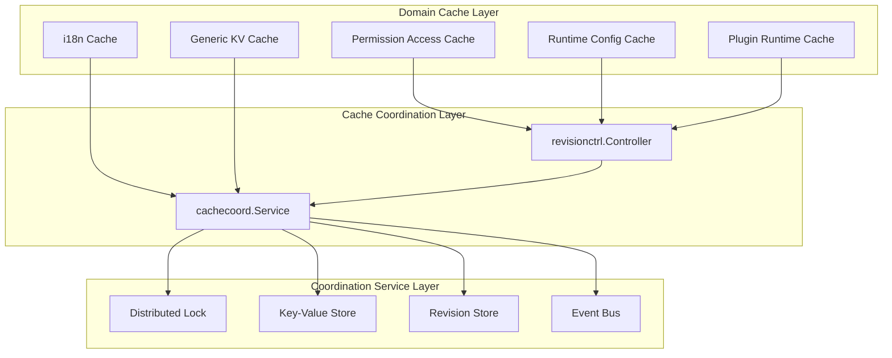
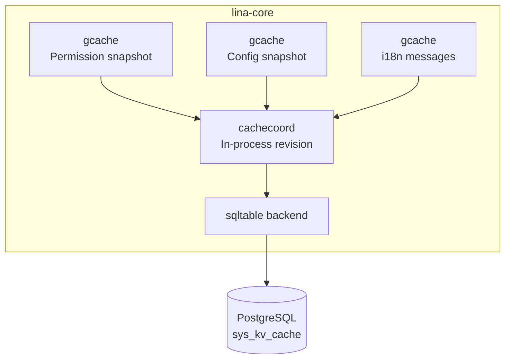
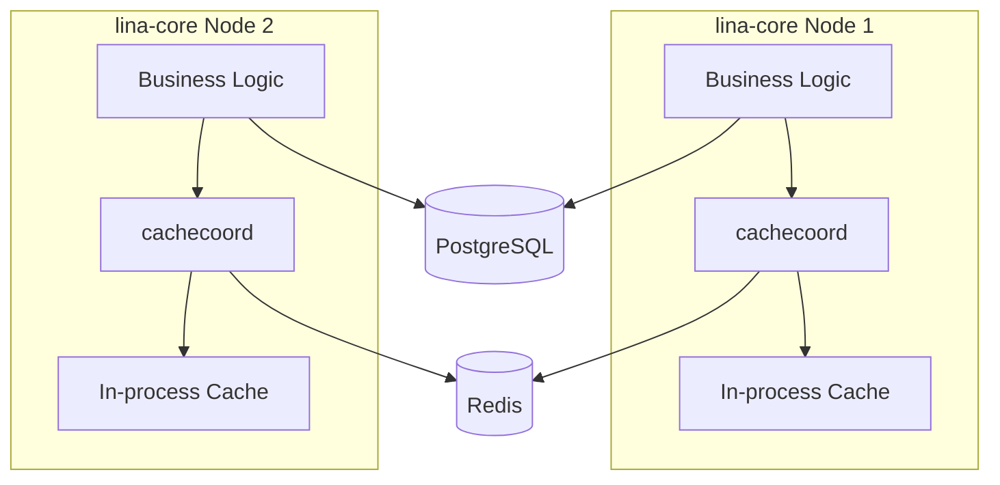
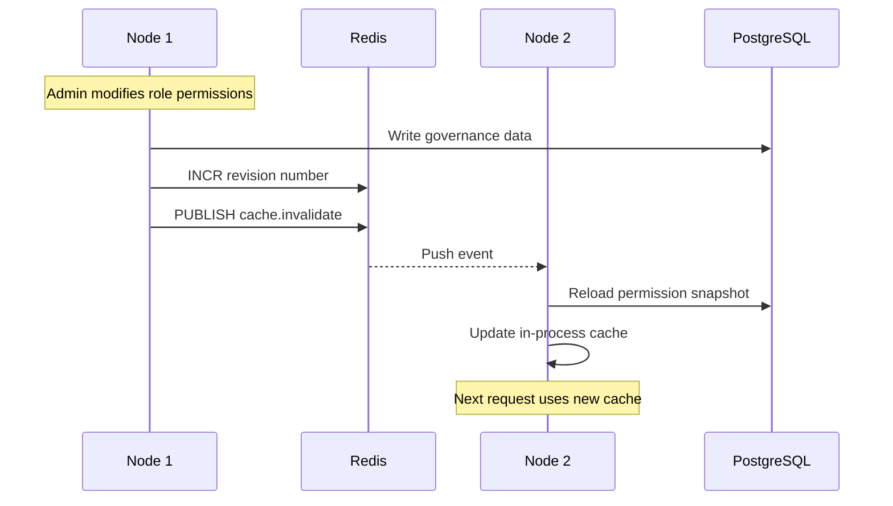
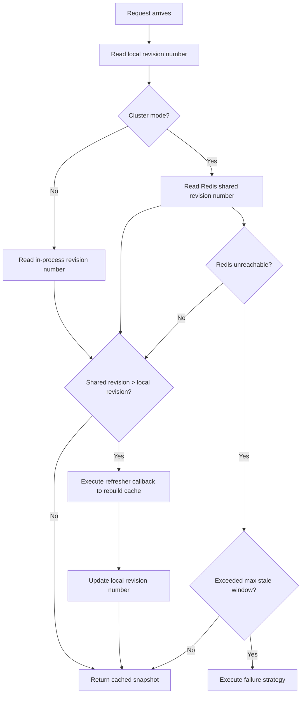
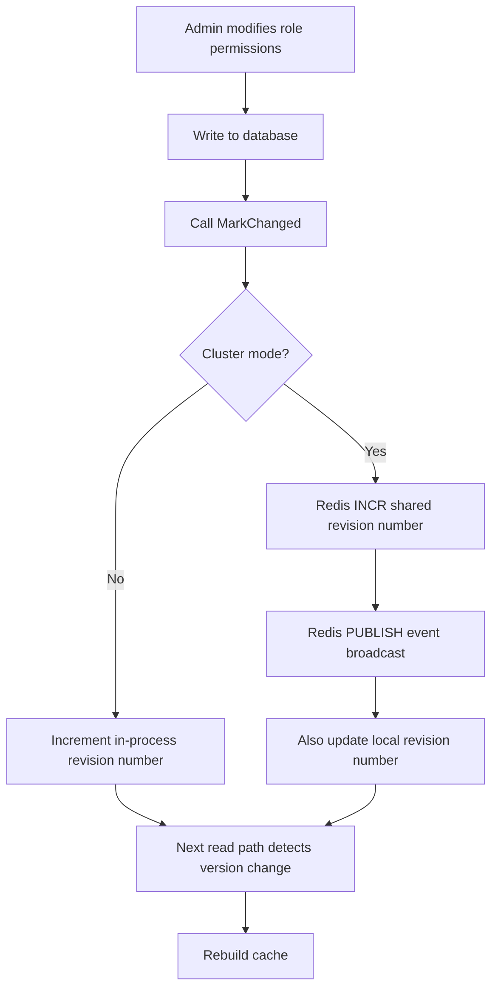

## Introduction

`LinaPro` uses a multi-layer, topology-aware cache architecture. In standalone mode, all cache state is stored in process memory and `PostgreSQL`, with no external dependencies. In cluster mode, `Redis` handles cross-node coordination, and in-process caches maintain eventual consistency through shared revision numbers and event broadcasting.

The core design philosophy of this architecture is: **the read path checks version numbers, the write path increments version numbers**. Each cache domain has its own monotonically increasing revision number. In-process caches record the revision number at construction time, and each subsequent read compares the shared revision number against the local revision number — if the shared revision number is newer, the local cache is rebuilt. This mechanism avoids database round-trips on every request while ensuring changes converge across nodes.

## Cache Architecture Overview

The cache system consists of three subsystems, from top to bottom: domain caches, cache coordination layer, and coordination service layer.



**Domain Cache Layer** directly faces business read paths, including permission access snapshots, runtime config snapshots, i18n message packs, and plugin runtime state. Each domain cache independently manages its own invalidation logic.

**Cache Coordination Layer** (`cachecoord.Service`) provides a unified version management interface, abstracting the standalone vs. cluster difference from upper layers. `revisionctrl.Controller` is a higher-level wrapper targeting specific cache domains, binding domain identifier, scope, and tenant range together to simplify caller usage.

**Coordination Service Layer** (`coordination.Service`) provides the most fundamental distributed primitives: distributed locks, key-value stores, revision stores, and event buses. In standalone mode, these primitives degrade to in-process implementations; in cluster mode, `Redis` provides the backend support.

## Standalone Cache Design

Standalone mode (`cluster.enabled: false`) is the default deployment mode and does not require `Redis`. All cache state is stored in process memory and `PostgreSQL`.

### In-Process Caches

Domain caches use `GoFrame`'s `gcache` component to manage in-process data. `gcache` provides the `GetOrSetFuncLock` method to prevent cache stampede — when multiple requests simultaneously discover a cache miss, only one request executes the loading logic while others wait and share the result.

| Cache Domain | Storage Method | Expiration Strategy | Description |
|--------------|---------------|---------------------|-------------|
| Permission access snapshot | `gcache` instance | Min of `JWT` expiration and session timeout | Per-`Token` independent cache, records current revision at construction |
| Runtime config snapshot | `gcache` instance | 1-hour hard expiration | Immutable snapshot, entirely replaced on modification |
| Static config | `sync.Once` | Process lifetime | Fixed sections in `config.yaml`, parsed once and resident in memory |
| i18n message pack | `gcache` instance | Invalidation by revision number | Bucketed by language and source (host, source plugin, dynamic plugin) |

In-process cache snapshots are deep-copied to prevent request-scoped modifications from polluting shared state.

### KV Cache Backend

Generic KV cache stores short-term state, revision numbers, and runtime snapshots. In standalone mode, the `sqltable` backend stores cache entries in `PostgreSQL`'s `sys_kv_cache` table.



The `sqltable` backend filters expired rows on read and uses a background scheduled task to batch-clean expired entries (500 per batch), preventing table bloat.

### Standalone Revision Numbers

In standalone mode, revision numbers are stored in process memory (`processLocalRevisions`). Incrementing and reading are local operations with no network overhead. `cachecoord.NewStaticTopology(false)` marks the node as a standalone master, and all coordination logic degrades to in-process operations.

## Cluster Cache Design

Cluster mode (`cluster.enabled: true`) introduces `Redis` as the cross-node coordination backend. `PostgreSQL` continues to handle business and governance data persistence; `Redis` handles leader election, distributed locks, cache revision storage, and cross-node event broadcasting.

### Coordination Service

`coordination.Service` in cluster mode is implemented by `Redis`, providing five sub-stores:

| Sub-Store | Responsibility | Redis Implementation |
|-----------|---------------|---------------------|
| `LockStore` | Distributed locks with renewal and isolation tokens | `SET` + `EXPIRE` + Lua scripts |
| `KVStore` | Short-term key-value state, native TTL, atomic increment, `SetNX` | Redis native commands |
| `RevisionStore` | Monotonically increasing revision numbers, isolated by domain and scope | `INCR` + `GET` |
| `EventBus` | Cross-node event broadcasting | `Pub/Sub` |
| `HealthChecker` | Backend health monitoring | `PING` |



### KV Cache Backend

In cluster mode, KV cache uses the `coordination-kv` backend, delegating cache entries to the coordination service's `KVStore` (i.e., Redis). Redis natively supports TTL expiration, requiring no additional cleanup tasks.

### Cross-Node Events

When a node increments a shared revision number, it publishes a `cache.invalidate` event through `Redis Pub/Sub`. The event payload contains domain, scope, tenant identifier, cascade flag, revision number, change reason, and source node. Other nodes receive the event and immediately trigger local cache refresh, without waiting for the next read to discover a stale version.

Event broadcasting is a low-latency notification mechanism; revision number reads are the fallback guarantee — even if events are lost, the read path's version comparison can detect staleness.



## Revision-Based Cache Mechanism

The revision-based (version number) cache mechanism is the core of `LinaPro`'s cache system. Each cache domain has a monotonically increasing revision number representing the current version of that domain's authoritative data source. In-process caches record the revision number at construction time, and subsequent reads compare version numbers to determine whether the cache is still valid.

### Core Interfaces

`cachecoord.Service` defines the core interfaces for version management:

| Method | Description |
|--------|-------------|
| `ConfigureDomain(DomainSpec)` | Declares the cache domain's consistency contract |
| `MarkChanged(ctx, domain, scope, reason)` | Publishes a revision number increment |
| `MarkTenantChanged(ctx, domain, scope, tenantScope, reason)` | Revision number increment with tenant scope |
| `EnsureFresh(ctx, domain, scope, refresher)` | Read-path check; executes refresh callback if stale |
| `CurrentRevision(ctx, domain, scope)` | Returns the currently visible latest revision number |
| `Snapshot(ctx)` | Diagnostic observation, returns cache state for all domains |

`revisionctrl.Controller` is a higher-level wrapper for specific domains, pre-binding domain identifier, scope, and tenant range. Callers only need to call `EnsureFresh(ctx)` or `MarkChanged(ctx)`.

### Read Path Flow

Using permission checking as an example, the read path's version comparison flow is:



Key steps explained:

1. Read the locally recorded revision number, representing the data version when the current cache was built.
2. In cluster mode, read the shared revision number from `Redis`; in standalone mode, read the in-process counter.
3. If the shared revision number is greater than the local one, data has changed — execute the `refresher` callback to reload the snapshot from the database.
4. If `Redis` is unreachable and the max stale window (`MaxStale`) hasn't been exceeded, return the last known cache snapshot for soft degradation.
5. If the max stale window is exceeded, handle according to the domain's configured failure strategy.

### Write Path Flow

Using role permission changes as an example, the write path's revision increment flow is:



After the write path completes, the current node immediately perceives the change; other nodes perceive it through event broadcast or the next read path's version comparison.

### Domain Consistency Contract

Each cache domain declares its consistency contract (`DomainSpec`) at registration time. The framework determines the stale window and failure behavior based on the contract:

| Domain | Identifier | Max Stale Window | Failure Strategy | Description |
|--------|-----------|------------------|------------------|-------------|
| Permission access | `permission-access` | 3 seconds | `FailClosed` | Permission-related; denies access when unavailable |
| Runtime config | `runtime-config` | 10 seconds | `ReturnVisibleError` | Config-related; returns visible error when unavailable |
| Plugin runtime | `plugin-runtime` | 5 seconds | `ConservativeHide` | Plugin-related; conservatively hides when unavailable |

The three failure strategy values:

| Strategy | Behavior | Use Case |
|----------|----------|----------|
| `FailClosed` | Deny access, return insufficient permissions | Security-sensitive permission checks |
| `ReturnVisibleError` | Return explicit error to caller | Config reads, needs to let caller know state is abnormal |
| `ConservativeHide` | Hide related functionality, degrade gracefully | Plugin state, unavailable doesn't affect core functionality |

### Tenant Isolation

The revision storage key includes the tenant identifier, ensuring tenant cache invalidations don't affect each other. When a platform admin modifies platform-level default config, the event carries `cascadeToTenants=true`, invalidating all tenants' cache views. Tenant-level modifications only affect that tenant's revision scope.

```text
Revision key structure: {tenant_id}:{domain}:{scope}

Examples:
  platform:permission-access:topology    → Platform-level permission topology
  tenant-001:permission-access:topology   → Tenant tenant-001's permission topology
  tenant-002:plugin-runtime:frontend      → Tenant tenant-002's plugin frontend package
```

## Cache Invalidation Strategies

The framework uses five cache invalidation mechanisms, with each domain combining them as appropriate.

### Revision-Driven Invalidation

The primary mechanism. Perceives data changes through monotonically increasing revision numbers; the read path compares version numbers to trigger cache rebuilds. Suitable for domains requiring cross-node consistency like permission topology, runtime config, and plugin runtime.

### Direct Local Eviction

Targets `Token`-level permission snapshots. When a user logs out or an admin force-kicks, the corresponding `Token`'s cache entry is directly removed from `gcache`. Topology-level changes (like role permission adjustments) clear all `Token` snapshots, forcing the next request to reload.

### Scoped i18n Invalidation

The i18n cache supports fine-grained invalidation by language, source (host, source plugin, dynamic plugin), and individual plugin identifier. The `InvalidateScope` struct allows precise specification of which language and plugin entries to invalidate without affecting unrelated data.

### Plugin Derived Cache Invalidation

When plugin state changes, the unified entry `publishPluginChange` invalidates all derived caches at once: frontend packages, i18n plugin sectors, `WASM` module cache, admin list cache, and `OpenAPI` projection cache. This single-entry design ensures all derived state invalidates synchronously, preventing partial-update state inconsistency.

### TTL Expiration

Both `sys_kv_cache` table and Redis KV support TTL-based expiration. The SQL backend needs background scheduled tasks to clean expired rows; Redis handles expiration natively without additional cleanup.

## Domain Cache Design

### Permission Access Cache

Permission loading involves multiple database queries (user → role → menu → permission identifier). `lina-core` designed a `Token`-level in-process cache for this. Each login `Token` corresponds to a `UserAccessContext` snapshot containing role set, menu `ID` set, permission identifier list, data scope, and super admin flag.

The cache records the current permission topology revision number at construction time. The system syncs the latest version from shared storage every `3` seconds. When roles, menus, permissions, or other data changes, the revision number increments. The next request hitting the cache detects the stale version and discards the cache to reload.

### Runtime Config Cache

Protected runtime config values (like `JWT` keys, session timeouts, etc.) are parsed into immutable snapshots stored in `gcache` with a 1-hour hard expiration. Config modifications trigger snapshot rebuilds through the revision mechanism. Static config sections use `sync.Once` for one-time parsing and resident memory.

### i18n Cache

i18n message packs are bucketed by language and source. Each bucket maintains an independent monotonic version number and content fingerprint, supporting `ETag` negotiation. When plugins are installed, uninstalled, or updated, only the corresponding plugin sector's language pack is invalidated, not affecting the host or other plugins.

### Plugin Runtime Cache

Plugin runtime state (enable snapshots, frontend package paths, `WASM` modules, admin lists, `OpenAPI` projections) is uniformly managed by the `plugin-runtime` domain's revision number. Plugin governance operations invalidate all derived caches at once through the `publishPluginChange` entry.

## Cache Configuration

### Domain Specification

| Config Item | Description |
|-------------|-------------|
| `Domain` | Domain identifier, e.g., `permission-access` |
| `AuthoritySource` | Authoritative data source description |
| `ConsistencyModel` | Consistency model: `local-only` or `shared-revision` |
| `MaxStale` | Max stale window |
| `SyncMechanism` | Sync mechanism description |
| `FailureStrategy` | Failure strategy when stale window is exceeded |

### KV Cache Backend Selection

The backend is automatically determined by the cluster switch — business code doesn't need to be aware:

| Mode | Backend | Storage Location | Expiration Handling |
|------|---------|------------------|---------------------|
| Standalone | `sqltable` | `PostgreSQL` `sys_kv_cache` table | Filter on read + background batch cleanup |
| Cluster | `coordination-kv` | Redis | Redis native TTL |

### Size Limits

Cache entries have hardcoded size limits to prevent anomalous data from overwhelming storage:

| Field | Max Size |
|-------|----------|
| Owner type | 16 bytes |
| Owner key | 64 bytes |
| Namespace | 64 bytes |
| Cache key | 128 bytes |
| Cache value | 4096 bytes |

## Design Boundaries

- Cache coordination currently only supports `Redis` as the cluster backend.
- Critical revision numbers are not stored in the generic KV cache (`sys_kv_cache` or Redis KV) but use a dedicated `RevisionStore`, avoiding version information loss due to cache eviction.
- Background sync tasks poll shared revision numbers at fixed intervals (permissions 3 seconds, runtime config 10 seconds), keeping local caches relatively fresh even when no requests arrive.
- In-process caches use `GetOrSetFuncLock` to prevent cache stampede, and returned snapshots are deep-copied to prevent request-scoped pollution.
- High availability requires external load balancing, database reliability, and `Redis` reliability to work together — the cache mechanism itself does not replace these infrastructure responsibilities.
